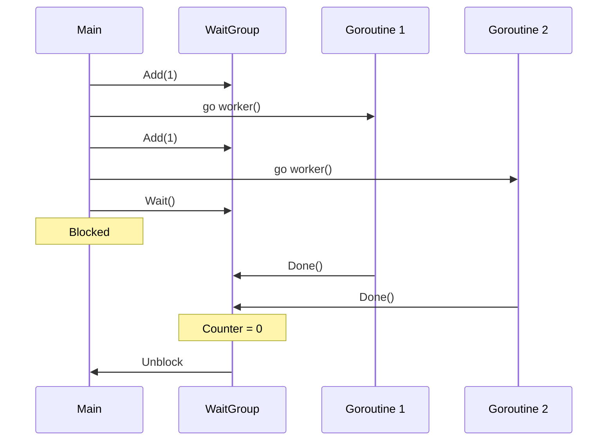

# How to Use WaitGroup for Goroutine Synchronization in Go

Author: [nawazdhandala](https://www.github.com/nawazdhandala)

Tags: Go, Golang, WaitGroup, Concurrency, Goroutines, Synchronization

Description: Master sync.WaitGroup to coordinate multiple goroutines, avoid common pitfalls, and build robust concurrent Go programs that wait for all workers to complete.

---

`sync.WaitGroup` is the standard way to wait for a collection of goroutines to finish. It's simple but has subtle gotchas that can cause bugs. This guide covers proper usage and common mistakes.

---

## Basic Usage

```go
package main

import (
    "fmt"
    "sync"
    "time"
)

func main() {
    var wg sync.WaitGroup
    
    for i := 1; i <= 3; i++ {
        wg.Add(1)  // Increment counter before goroutine
        
        go func(id int) {
            defer wg.Done()  // Decrement when done
            
            fmt.Printf("Worker %d starting\n", id)
            time.Sleep(time.Second)
            fmt.Printf("Worker %d done\n", id)
        }(i)
    }
    
    wg.Wait()  // Block until counter is zero
    fmt.Println("All workers completed")
}
```

---

## How WaitGroup Works



---

## Common Mistakes

### Mistake 1: Add() Inside Goroutine

```go
// WRONG: Add inside goroutine - race condition
for i := 0; i < 3; i++ {
    go func() {
        wg.Add(1)  // Might execute AFTER Wait()!
        defer wg.Done()
        // work
    }()
}
wg.Wait()  // Might not wait for all goroutines
```

```go
// CORRECT: Add before launching goroutine
for i := 0; i < 3; i++ {
    wg.Add(1)
    go func() {
        defer wg.Done()
        // work
    }()
}
wg.Wait()
```

### Mistake 2: Forgetting Done()

```go
// WRONG: Missing Done - Wait blocks forever
wg.Add(1)
go func() {
    // No wg.Done() - deadlock!
    // work
}()
wg.Wait()  // Hangs forever
```

```go
// CORRECT: Use defer for guaranteed Done
wg.Add(1)
go func() {
    defer wg.Done()  // Always called, even on panic
    // work
}()
wg.Wait()
```

### Mistake 3: Wrong Add Count

```go
// WRONG: Add(1) but launching 3 goroutines
wg.Add(1)  // Should be Add(3)
for i := 0; i < 3; i++ {
    go func() {
        defer wg.Done()  // Done called 3 times, but Add was 1
        // work
    }()
}
wg.Wait()  // Panic: negative WaitGroup counter
```

```go
// CORRECT: Match Add count to goroutine count
wg.Add(3)  // Or Add(1) in loop
for i := 0; i < 3; i++ {
    go func() {
        defer wg.Done()
        // work
    }()
}
wg.Wait()
```

### Mistake 4: Passing WaitGroup by Value

```go
// WRONG: Copying WaitGroup
func worker(wg sync.WaitGroup) {  // Copied by value!
    defer wg.Done()  // Modifies the copy
    // work
}

func main() {
    var wg sync.WaitGroup
    wg.Add(1)
    go worker(wg)  // Passes a copy
    wg.Wait()      // Original is never Done - deadlock!
}
```

```go
// CORRECT: Pass pointer
func worker(wg *sync.WaitGroup) {
    defer wg.Done()
    // work
}

func main() {
    var wg sync.WaitGroup
    wg.Add(1)
    go worker(&wg)
    wg.Wait()
}
```

---

## Practical Patterns

### Pattern 1: Worker Pool

```go
package main

import (
    "fmt"
    "sync"
)

func main() {
    jobs := make(chan int, 100)
    var wg sync.WaitGroup
    
    // Start 3 workers
    for w := 1; w <= 3; w++ {
        wg.Add(1)
        go func(id int) {
            defer wg.Done()
            for job := range jobs {
                fmt.Printf("Worker %d processing job %d\n", id, job)
            }
        }(w)
    }
    
    // Send jobs
    for j := 1; j <= 9; j++ {
        jobs <- j
    }
    close(jobs)  // Signal no more jobs
    
    wg.Wait()
    fmt.Println("All jobs completed")
}
```

### Pattern 2: Parallel Processing with Results

```go
package main

import (
    "fmt"
    "sync"
)

type Result struct {
    ID    int
    Value int
}

func main() {
    var wg sync.WaitGroup
    results := make(chan Result, 10)
    
    // Launch workers
    for i := 1; i <= 5; i++ {
        wg.Add(1)
        go func(id int) {
            defer wg.Done()
            // Simulate work
            results <- Result{ID: id, Value: id * 10}
        }(i)
    }
    
    // Close results when all workers done
    go func() {
        wg.Wait()
        close(results)
    }()
    
    // Collect results
    for result := range results {
        fmt.Printf("Result from %d: %d\n", result.ID, result.Value)
    }
}
```

### Pattern 3: Batch Processing

```go
package main

import (
    "fmt"
    "sync"
)

func processBatch(items []int, batchSize int) []int {
    var wg sync.WaitGroup
    var mu sync.Mutex
    results := make([]int, 0, len(items))
    
    for i := 0; i < len(items); i += batchSize {
        end := i + batchSize
        if end > len(items) {
            end = len(items)
        }
        batch := items[i:end]
        
        wg.Add(1)
        go func(batch []int) {
            defer wg.Done()
            
            for _, item := range batch {
                result := item * 2  // Process item
                
                mu.Lock()
                results = append(results, result)
                mu.Unlock()
            }
        }(batch)
    }
    
    wg.Wait()
    return results
}

func main() {
    items := []int{1, 2, 3, 4, 5, 6, 7, 8, 9, 10}
    results := processBatch(items, 3)
    fmt.Println(results)
}
```

### Pattern 4: With Error Handling

```go
package main

import (
    "errors"
    "fmt"
    "sync"
)

func main() {
    var wg sync.WaitGroup
    errChan := make(chan error, 3)
    
    tasks := []func() error{
        func() error { return nil },
        func() error { return errors.New("task 2 failed") },
        func() error { return nil },
    }
    
    for i, task := range tasks {
        wg.Add(1)
        go func(id int, t func() error) {
            defer wg.Done()
            if err := t(); err != nil {
                errChan <- fmt.Errorf("task %d: %w", id, err)
            }
        }(i, task)
    }
    
    // Wait and close error channel
    go func() {
        wg.Wait()
        close(errChan)
    }()
    
    // Collect errors
    var errs []error
    for err := range errChan {
        errs = append(errs, err)
    }
    
    if len(errs) > 0 {
        fmt.Println("Errors occurred:")
        for _, err := range errs {
            fmt.Println(" -", err)
        }
    }
}
```

---

## Using errgroup Instead

For better error handling, use `golang.org/x/sync/errgroup`:

```go
package main

import (
    "context"
    "fmt"
    
    "golang.org/x/sync/errgroup"
)

func main() {
    g, ctx := errgroup.WithContext(context.Background())
    
    urls := []string{
        "https://example.com/1",
        "https://example.com/2",
        "https://example.com/3",
    }
    
    for _, url := range urls {
        url := url  // Capture variable
        g.Go(func() error {
            // Check context for cancellation
            select {
            case <-ctx.Done():
                return ctx.Err()
            default:
            }
            
            // Simulate fetching URL
            fmt.Println("Fetching", url)
            return nil
        })
    }
    
    // Wait returns first error (if any)
    if err := g.Wait(); err != nil {
        fmt.Println("Error:", err)
    }
}
```

---

## Best Practices

### 1. Always Use defer wg.Done()

```go
wg.Add(1)
go func() {
    defer wg.Done()  // Guaranteed to run, even on panic
    
    // work that might panic
}()
```

### 2. Add Before Go

```go
// Always Add before the go statement
wg.Add(1)
go worker(&wg)
```

### 3. Pass Pointer, Not Value

```go
// Pass *sync.WaitGroup, not sync.WaitGroup
go func(wg *sync.WaitGroup) {
    defer wg.Done()
}(&wg)
```

### 4. Close Channels in Separate Goroutine

```go
go func() {
    wg.Wait()
    close(results)  // Safe to close after all workers done
}()
```

### 5. Consider errgroup for Error Handling

```go
import "golang.org/x/sync/errgroup"

g, _ := errgroup.WithContext(context.Background())
g.Go(func() error {
    // work
    return err
})
return g.Wait()
```

---

## Summary

WaitGroup essentials:

| Method | When to Call | Notes |
|--------|--------------|-------|
| `Add(n)` | Before `go` statement | Always before launching goroutine |
| `Done()` | In goroutine | Use `defer` for safety |
| `Wait()` | After all `Add`s | Blocks until counter is 0 |

**Common Mistakes:**

1. Calling Add() inside goroutine
2. Forgetting Done()
3. Wrong Add() count
4. Passing WaitGroup by value

**Recommendations:**

- Use `defer wg.Done()` always
- Consider `errgroup` for error handling
- Pass `*sync.WaitGroup` to functions

---

*Running concurrent Go services? [OneUptime](https://oneuptime.com) provides comprehensive monitoring and tracing to help you debug goroutine issues in production.*
