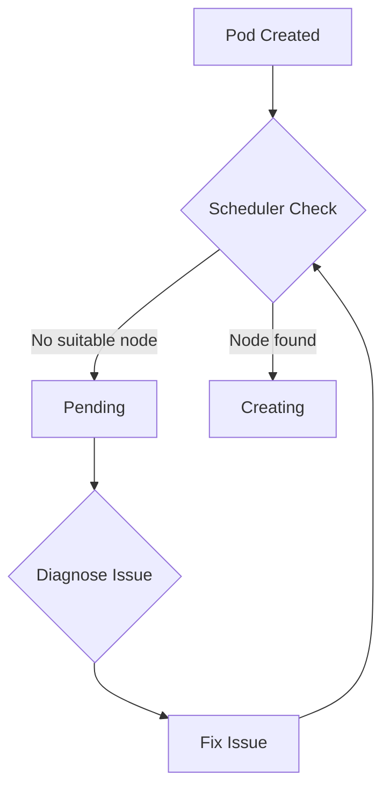

# How to Debug Pending Pod Status Issues

Author: [nawazdhandala](https://www.github.com/nawazdhandala)

Tags: Kubernetes, Troubleshooting, Scheduling, Pods, DevOps

Description: A systematic guide to diagnosing and resolving Kubernetes pods stuck in Pending status, covering resource constraints, node selectors, affinity rules, and scheduling failures.

---

A pod in "Pending" status means Kubernetes accepted it but cannot schedule it to a node. This is one of the most common issues in Kubernetes clusters. This guide walks through the systematic diagnosis and resolution of pending pods.

## Understanding Pending Status



When a pod is pending, check these in order:
1. Resource constraints (CPU, memory)
2. Node selectors and tolerations
3. Affinity and anti-affinity rules
4. PersistentVolumeClaims
5. Node conditions and taints

## Quick Diagnosis

```bash
# Get pod status
kubectl get pod pending-pod

# Get detailed information
kubectl describe pod pending-pod

# Look for Events section at the bottom:
# Events:
#   Warning  FailedScheduling  0/3 nodes are available:
#     1 node(s) had taint {node.kubernetes.io/disk-pressure: }, that the pod didn't tolerate,
#     2 Insufficient memory
```

## Common Causes and Solutions

### Cause 1: Insufficient Resources

```bash
# Check pod resource requests
kubectl get pod pending-pod -o jsonpath='{.spec.containers[*].resources.requests}'

# Check node available resources
kubectl describe nodes | grep -A 5 "Allocated resources"

# Check cluster-wide capacity
kubectl top nodes
```

**Solutions:**

Option 1: Reduce pod resource requests
```yaml
resources:
  requests:
    memory: "256Mi"    # Reduced from 512Mi
    cpu: "100m"        # Reduced from 250m
```

Option 2: Add more nodes or larger nodes

Option 3: Remove unused pods to free resources
```bash
kubectl delete pods --field-selector=status.phase=Succeeded
```

### Cause 2: Node Selector Mismatch

```bash
# Check pod nodeSelector
kubectl get pod pending-pod -o jsonpath='{.spec.nodeSelector}'

# Output: {"disktype":"ssd"}

# Check which nodes have this label
kubectl get nodes -l disktype=ssd

# If no nodes match, add label to a node
kubectl label node node-1 disktype=ssd
```

**Solutions:**

Option 1: Label a node
```bash
kubectl label node node-1 disktype=ssd
```

Option 2: Remove or update nodeSelector
```yaml
spec:
  nodeSelector:
    disktype: hdd    # Changed to match existing labels
```

### Cause 3: Taints and Tolerations

```bash
# Check node taints
kubectl describe node node-1 | grep Taints

# Output:
# Taints: node.kubernetes.io/disk-pressure:NoSchedule

# Check pod tolerations
kubectl get pod pending-pod -o jsonpath='{.spec.tolerations}'
```

**Solutions:**

Option 1: Add toleration to pod
```yaml
spec:
  tolerations:
    - key: "node.kubernetes.io/disk-pressure"
      operator: "Exists"
      effect: "NoSchedule"
```

Option 2: Remove taint from node
```bash
kubectl taint nodes node-1 node.kubernetes.io/disk-pressure:NoSchedule-
```

### Cause 4: Affinity Rules Cannot Be Satisfied

```bash
# Check pod affinity rules
kubectl get pod pending-pod -o yaml | grep -A 20 affinity

# Common issues:
# - Anti-affinity requires different nodes, but only 2 nodes and 3 replicas
# - Node affinity requires labels that don't exist
```

**Solutions:**

Option 1: Change from required to preferred
```yaml
affinity:
  podAntiAffinity:
    preferredDuringSchedulingIgnoredDuringExecution:    # Changed from required
      - weight: 100
        podAffinityTerm:
          labelSelector:
            matchLabels:
              app: web
          topologyKey: kubernetes.io/hostname
```

Option 2: Add more nodes to satisfy anti-affinity

Option 3: Reduce replica count

### Cause 5: PersistentVolumeClaim Pending

```bash
# Check if pod is waiting for PVC
kubectl describe pod pending-pod | grep -A 5 "PersistentVolumeClaim"

# Check PVC status
kubectl get pvc

# Output:
# NAME       STATUS    VOLUME   CAPACITY   ACCESS MODES
# data-pvc   Pending

# Check why PVC is pending
kubectl describe pvc data-pvc
```

**Solutions:**

Option 1: Create matching PersistentVolume
```yaml
apiVersion: v1
kind: PersistentVolume
metadata:
  name: data-pv
spec:
  capacity:
    storage: 10Gi
  accessModes:
    - ReadWriteOnce
  hostPath:
    path: /data
```

Option 2: Use dynamic provisioning with StorageClass
```yaml
apiVersion: v1
kind: PersistentVolumeClaim
metadata:
  name: data-pvc
spec:
  storageClassName: standard    # Use existing StorageClass
  accessModes:
    - ReadWriteOnce
  resources:
    requests:
      storage: 10Gi
```

Option 3: Check StorageClass provisioner is running
```bash
kubectl get pods -n kube-system | grep provisioner
```

### Cause 6: Node Not Ready

```bash
# Check node status
kubectl get nodes

# Output:
# NAME     STATUS     ROLES    AGE   VERSION
# node-1   Ready      <none>   10d   v1.28.0
# node-2   NotReady   <none>   10d   v1.28.0

# Check why node is not ready
kubectl describe node node-2 | grep -A 10 Conditions
```

**Solutions:**

Option 1: Fix the unhealthy node
```bash
# Check kubelet on the node
ssh node-2
systemctl status kubelet
journalctl -u kubelet | tail -50
```

Option 2: Cordon and drain unhealthy node
```bash
kubectl cordon node-2
kubectl drain node-2 --ignore-daemonsets --delete-emptydir-data
```

### Cause 7: ResourceQuota Exceeded

```bash
# Check ResourceQuota in namespace
kubectl get resourcequota -n my-namespace

# Check quota usage
kubectl describe resourcequota -n my-namespace

# Output:
# Name:          compute-quota
# Resource       Used    Hard
# --------       ----    ----
# limits.cpu     8       8
# limits.memory  16Gi    16Gi
```

**Solutions:**

Option 1: Delete unused pods to free quota

Option 2: Request quota increase
```yaml
apiVersion: v1
kind: ResourceQuota
metadata:
  name: compute-quota
spec:
  hard:
    limits.cpu: "16"        # Increased from 8
    limits.memory: "32Gi"   # Increased from 16Gi
```

### Cause 8: Pod Priority and Preemption

```bash
# Check if pod has low priority
kubectl get pod pending-pod -o jsonpath='{.spec.priorityClassName}'

# Check pod priority value
kubectl get pod pending-pod -o jsonpath='{.spec.priority}'
```

Low-priority pods wait for high-priority pods first.

**Solution:**
```yaml
spec:
  priorityClassName: high-priority
```

## Debugging Workflow

### Step 1: Get Events

```bash
kubectl describe pod pending-pod | tail -20

# Look for FailedScheduling events
```

### Step 2: Check Scheduler Logs

```bash
kubectl logs -n kube-system -l component=kube-scheduler
```

### Step 3: Simulate Scheduling

```bash
# Dry-run to see where pod would schedule
kubectl get pod pending-pod -o yaml | kubectl apply --dry-run=server -f -
```

### Step 4: Check Node Capacity

```bash
# For each node
for node in $(kubectl get nodes -o name); do
  echo "=== $node ==="
  kubectl describe $node | grep -A 10 "Allocated resources"
done
```

### Step 5: Verify Scheduler is Running

```bash
kubectl get pods -n kube-system -l component=kube-scheduler
```

## Common Error Messages

| Message | Meaning | Solution |
|---------|---------|----------|
| `Insufficient cpu` | Not enough CPU | Reduce requests or add nodes |
| `Insufficient memory` | Not enough memory | Reduce requests or add nodes |
| `node(s) had taint` | Pod lacks toleration | Add toleration or remove taint |
| `node(s) didn't match selector` | NodeSelector mismatch | Fix labels or selector |
| `persistentvolumeclaim not found` | Missing PVC | Create PVC |
| `no persistent volumes available` | No matching PV | Create PV or fix PVC |
| `pod affinity/anti-affinity` | Affinity rules cannot be met | Add nodes or relax rules |

## Prevention Strategies

### 1. Use Resource Requests Appropriately

```yaml
# Profile actual usage and set requests slightly higher
resources:
  requests:
    memory: "300Mi"    # Actual usage is ~250Mi
    cpu: "150m"        # Actual usage is ~100m
```

### 2. Prefer Soft Affinity Rules

```yaml
affinity:
  podAntiAffinity:
    preferredDuringSchedulingIgnoredDuringExecution:    # Not required
      - weight: 100
        podAffinityTerm:
          labelSelector:
            matchLabels:
              app: web
          topologyKey: kubernetes.io/hostname
```

### 3. Set Up Cluster Autoscaler

```yaml
apiVersion: autoscaling.k8s.io/v1
kind: ClusterAutoscaler
metadata:
  name: cluster-autoscaler
spec:
  scaleDown:
    enabled: true
    delayAfterAdd: 10m
```

### 4. Monitor Available Resources

```yaml
# Prometheus alert for low resources
- alert: LowNodeResources
  expr: |
    (1 - (node_memory_MemAvailable_bytes / node_memory_MemTotal_bytes)) > 0.9
  for: 5m
  labels:
    severity: warning
  annotations:
    summary: "Node {{ $labels.node }} memory above 90%"
```

### 5. Use Pod Disruption Budgets

Prevents too many pods from being evicted at once.

## Quick Reference

```bash
# Check pending pods
kubectl get pods --field-selector=status.phase=Pending

# Get scheduling events
kubectl get events --field-selector reason=FailedScheduling

# Check node allocatable resources
kubectl get nodes -o custom-columns=NAME:.metadata.name,CPU:.status.allocatable.cpu,MEMORY:.status.allocatable.memory

# Force reschedule by deleting and recreating
kubectl delete pod pending-pod
kubectl apply -f pod.yaml
```

---

Pending pods are almost always due to resource constraints, scheduling rules, or storage issues. Start with `kubectl describe pod` to identify the specific cause, then work through the solutions systematically. Prevention through proper capacity planning and monitoring is more effective than reactive troubleshooting.
