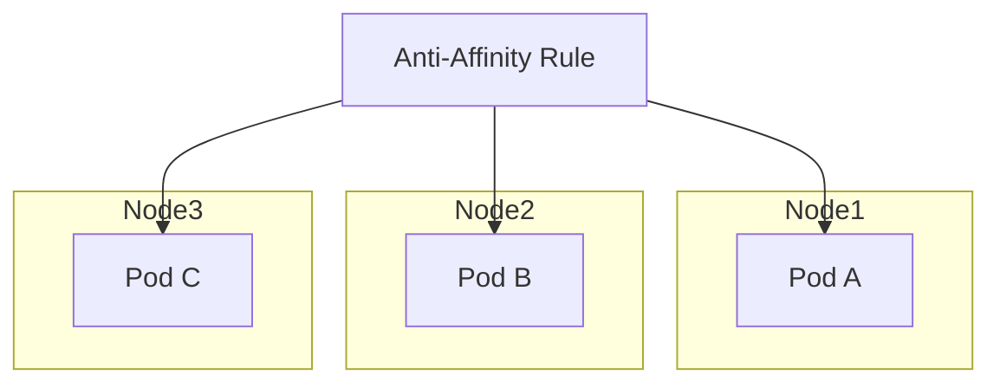

# How to Set Up Pod Anti-Affinity Rules for Distribution

Author: [nawazdhandala](https://www.github.com/nawazdhandala)

Tags: Kubernetes, Pod Anti-Affinity, High Availability, Scheduling, DevOps

Description: Learn how to use Kubernetes pod anti-affinity rules to distribute workloads across nodes, availability zones, and failure domains for improved reliability and fault tolerance.

---

Pod anti-affinity rules tell Kubernetes to avoid placing certain pods on the same node or failure domain. This distribution protects against single points of failure and ensures your application stays available even when nodes fail.

## Understanding Anti-Affinity

Anti-affinity prevents pods from being scheduled together. The scheduler considers these rules when placing new pods.



## Required vs Preferred

### requiredDuringSchedulingIgnoredDuringExecution

Hard requirement. Pod will not schedule if rule cannot be satisfied.

```yaml
affinity:
  podAntiAffinity:
    requiredDuringSchedulingIgnoredDuringExecution:
      - labelSelector:
          matchLabels:
            app: web
        topologyKey: kubernetes.io/hostname
```

### preferredDuringSchedulingIgnoredDuringExecution

Soft preference. Scheduler tries to satisfy but will schedule anyway if cannot.

```yaml
affinity:
  podAntiAffinity:
    preferredDuringSchedulingIgnoredDuringExecution:
      - weight: 100
        podAffinityTerm:
          labelSelector:
            matchLabels:
              app: web
          topologyKey: kubernetes.io/hostname
```

## Topology Keys

Topology keys define the failure domain for anti-affinity:

| Key | Meaning |
|-----|---------|
| kubernetes.io/hostname | Spread across nodes |
| topology.kubernetes.io/zone | Spread across availability zones |
| topology.kubernetes.io/region | Spread across regions |
| Custom key | Any node label |

## Common Patterns

### Pattern 1: One Pod Per Node

Ensure each node has at most one pod of the application:

```yaml
apiVersion: apps/v1
kind: Deployment
metadata:
  name: web-app
spec:
  replicas: 3
  selector:
    matchLabels:
      app: web
  template:
    metadata:
      labels:
        app: web
    spec:
      affinity:
        podAntiAffinity:
          requiredDuringSchedulingIgnoredDuringExecution:
            - labelSelector:
                matchLabels:
                  app: web
              topologyKey: kubernetes.io/hostname
      containers:
        - name: app
          image: myapp:v1
```

### Pattern 2: Spread Across Availability Zones

Distribute pods across zones for zone failure tolerance:

```yaml
apiVersion: apps/v1
kind: Deployment
metadata:
  name: api-server
spec:
  replicas: 3
  selector:
    matchLabels:
      app: api
  template:
    metadata:
      labels:
        app: api
    spec:
      affinity:
        podAntiAffinity:
          requiredDuringSchedulingIgnoredDuringExecution:
            - labelSelector:
                matchLabels:
                  app: api
              topologyKey: topology.kubernetes.io/zone
      containers:
        - name: api
          image: api:v1
```

### Pattern 3: Soft Spread with Fallback

Prefer spreading but allow co-location if necessary:

```yaml
apiVersion: apps/v1
kind: Deployment
metadata:
  name: web-app
spec:
  replicas: 5
  selector:
    matchLabels:
      app: web
  template:
    metadata:
      labels:
        app: web
    spec:
      affinity:
        podAntiAffinity:
          preferredDuringSchedulingIgnoredDuringExecution:
            # Strongly prefer different nodes
            - weight: 100
              podAffinityTerm:
                labelSelector:
                  matchLabels:
                    app: web
                topologyKey: kubernetes.io/hostname
            # Also prefer different zones
            - weight: 50
              podAffinityTerm:
                labelSelector:
                  matchLabels:
                    app: web
                topologyKey: topology.kubernetes.io/zone
      containers:
        - name: app
          image: myapp:v1
```

### Pattern 4: Combined Node and Zone Anti-Affinity

Require zone spread, prefer node spread:

```yaml
apiVersion: apps/v1
kind: Deployment
metadata:
  name: critical-app
spec:
  replicas: 6
  selector:
    matchLabels:
      app: critical
  template:
    metadata:
      labels:
        app: critical
    spec:
      affinity:
        podAntiAffinity:
          # Must be in different zones
          requiredDuringSchedulingIgnoredDuringExecution:
            - labelSelector:
                matchLabels:
                  app: critical
              topologyKey: topology.kubernetes.io/zone
          # Prefer different nodes within zone
          preferredDuringSchedulingIgnoredDuringExecution:
            - weight: 100
              podAffinityTerm:
                labelSelector:
                  matchLabels:
                    app: critical
                topologyKey: kubernetes.io/hostname
      containers:
        - name: app
          image: myapp:v1
```

### Pattern 5: Cross-Service Anti-Affinity

Avoid placing related services on the same node:

```yaml
apiVersion: apps/v1
kind: Deployment
metadata:
  name: backend-api
spec:
  replicas: 3
  selector:
    matchLabels:
      app: backend-api
      tier: backend
  template:
    metadata:
      labels:
        app: backend-api
        tier: backend
    spec:
      affinity:
        podAntiAffinity:
          # Avoid same backend-api pods
          requiredDuringSchedulingIgnoredDuringExecution:
            - labelSelector:
                matchLabels:
                  app: backend-api
              topologyKey: kubernetes.io/hostname
          # Also avoid cache pods
          preferredDuringSchedulingIgnoredDuringExecution:
            - weight: 50
              podAffinityTerm:
                labelSelector:
                  matchLabels:
                    tier: cache
                topologyKey: kubernetes.io/hostname
      containers:
        - name: api
          image: api:v1
```

## Pod Topology Spread Constraints

For more flexible spreading, use topology spread constraints (Kubernetes 1.19+):

```yaml
apiVersion: apps/v1
kind: Deployment
metadata:
  name: web-app
spec:
  replicas: 6
  selector:
    matchLabels:
      app: web
  template:
    metadata:
      labels:
        app: web
    spec:
      topologySpreadConstraints:
        # Spread evenly across zones
        - maxSkew: 1
          topologyKey: topology.kubernetes.io/zone
          whenUnsatisfiable: DoNotSchedule
          labelSelector:
            matchLabels:
              app: web
        # Spread evenly across nodes
        - maxSkew: 1
          topologyKey: kubernetes.io/hostname
          whenUnsatisfiable: ScheduleAnyway
          labelSelector:
            matchLabels:
              app: web
      containers:
        - name: app
          image: myapp:v1
```

Parameters:
- **maxSkew**: Maximum difference in pod count between topology domains
- **whenUnsatisfiable**: DoNotSchedule (hard) or ScheduleAnyway (soft)

## Verifying Pod Distribution

### Check Pod Placement

```bash
# See which nodes pods are on
kubectl get pods -l app=web -o wide

# Output:
# NAME        READY   STATUS    NODE
# web-abc     1/1     Running   node-1
# web-def     1/1     Running   node-2
# web-ghi     1/1     Running   node-3

# Check zone distribution
kubectl get pods -l app=web -o custom-columns=NAME:.metadata.name,NODE:.spec.nodeName,ZONE:.metadata.labels.topology\.kubernetes\.io/zone
```

### Verify Node Labels

```bash
# Check node labels for topology keys
kubectl get nodes --show-labels | grep topology

# Or specific key
kubectl get nodes -o custom-columns=NAME:.metadata.name,ZONE:.metadata.labels.topology\.kubernetes\.io/zone
```

## Troubleshooting

### Pod Stuck in Pending

```bash
# Check scheduler events
kubectl describe pod web-xyz

# Look for:
# Warning  FailedScheduling  0/3 nodes are available:
#   3 node(s) didn't match pod anti-affinity rules

# Solutions:
# 1. Add more nodes
# 2. Change from required to preferred
# 3. Reduce replica count
```

### Uneven Distribution

```bash
# Check pod distribution
kubectl get pods -l app=web -o wide

# If uneven despite anti-affinity:
# - Check if topology labels are set on all nodes
# - Verify labelSelector matches pod labels
# - Use topology spread constraints for better balance
```

### Anti-Affinity Not Working

```bash
# Verify labels match
kubectl get pods -l app=web --show-labels

# Check affinity configuration
kubectl get deployment web-app -o yaml | grep -A 20 affinity

# Ensure labelSelector in anti-affinity matches pod labels
```

## Best Practices

### 1. Use Soft Rules for Non-Critical Workloads

```yaml
# Prefer spreading but don't block scheduling
preferredDuringSchedulingIgnoredDuringExecution:
  - weight: 100
    podAffinityTerm:
      labelSelector:
        matchLabels:
          app: web
      topologyKey: kubernetes.io/hostname
```

### 2. Combine with Pod Disruption Budgets

```yaml
apiVersion: policy/v1
kind: PodDisruptionBudget
metadata:
  name: web-pdb
spec:
  minAvailable: 2
  selector:
    matchLabels:
      app: web
```

### 3. Consider Cluster Capacity

```yaml
# Don't use required anti-affinity if nodes < replicas
# Example: 3 nodes, 5 replicas
# Use preferred instead of required
```

### 4. Test Failure Scenarios

```bash
# Simulate node failure
kubectl cordon node-1
kubectl drain node-1 --ignore-daemonsets

# Verify pods reschedule properly
kubectl get pods -l app=web -o wide

# Uncordon after testing
kubectl uncordon node-1
```

### 5. Document Distribution Requirements

```yaml
# Clear comments help future maintainers
spec:
  affinity:
    podAntiAffinity:
      # Business requirement: survive single-node failure
      # Need at least 2 pods on different nodes
      requiredDuringSchedulingIgnoredDuringExecution:
        - labelSelector:
            matchLabels:
              app: web
          topologyKey: kubernetes.io/hostname
```

## Complete Example: High-Availability Deployment

```yaml
apiVersion: apps/v1
kind: Deployment
metadata:
  name: ha-web-app
  namespace: production
spec:
  replicas: 4
  selector:
    matchLabels:
      app: ha-web
  template:
    metadata:
      labels:
        app: ha-web
    spec:
      # Topology spread constraints
      topologySpreadConstraints:
        - maxSkew: 1
          topologyKey: topology.kubernetes.io/zone
          whenUnsatisfiable: DoNotSchedule
          labelSelector:
            matchLabels:
              app: ha-web
        - maxSkew: 1
          topologyKey: kubernetes.io/hostname
          whenUnsatisfiable: ScheduleAnyway
          labelSelector:
            matchLabels:
              app: ha-web

      # Additional anti-affinity
      affinity:
        podAntiAffinity:
          preferredDuringSchedulingIgnoredDuringExecution:
            - weight: 100
              podAffinityTerm:
                labelSelector:
                  matchLabels:
                    app: ha-web
                topologyKey: kubernetes.io/hostname

      containers:
        - name: app
          image: myapp:v1
          ports:
            - containerPort: 8080
          resources:
            requests:
              memory: "256Mi"
              cpu: "100m"
            limits:
              memory: "512Mi"
              cpu: "500m"
          readinessProbe:
            httpGet:
              path: /health
              port: 8080
            periodSeconds: 5
---
apiVersion: policy/v1
kind: PodDisruptionBudget
metadata:
  name: ha-web-pdb
  namespace: production
spec:
  minAvailable: 2
  selector:
    matchLabels:
      app: ha-web
```

---

Pod anti-affinity rules are essential for building fault-tolerant applications in Kubernetes. Use required rules when you must guarantee distribution, and preferred rules when you want spreading without blocking scheduling. Combine anti-affinity with topology spread constraints and pod disruption budgets for comprehensive high availability.
