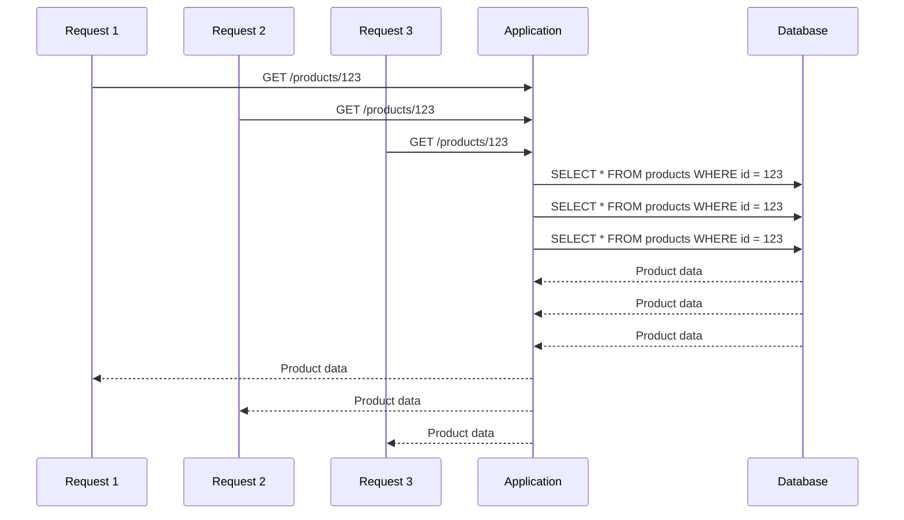
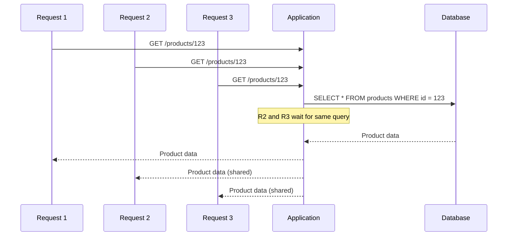

# How to Reduce Database Load with Request Coalescing in Node.js

Author: [nawazdhandala](https://www.github.com/nawazdhandala)

Tags: Node.js, TypeScript, Performance, Database, Caching, Optimization, Backend

Description: Learn how to implement request coalescing in Node.js to reduce database load by combining duplicate concurrent requests. This guide covers basic implementation, cache integration, batch coalescing, and practical patterns for high-traffic applications.

---

When your application receives many concurrent requests for the same resource, each request typically triggers a separate database query. This creates unnecessary load on your database and increases latency. Request coalescing solves this by combining duplicate concurrent requests into a single database call, sharing the result among all waiting callers.

## The Problem with Concurrent Duplicate Requests

Consider a popular product page that receives 100 concurrent requests for the same product ID. Without coalescing, your database handles 100 identical queries:



With coalescing, only one query executes:



## Basic Request Coalescing Implementation

The core idea is simple: track in-flight requests by key and have subsequent requests wait for the first one to complete.

```typescript
// request-coalescer.ts
type PendingRequest<T> = {
  promise: Promise<T>;
  resolver: (value: T) => void;
  rejecter: (error: Error) => void;
};

export class RequestCoalescer {
  private pending = new Map<string, PendingRequest<any>>();

  async coalesce<T>(key: string, fetcher: () => Promise<T>): Promise<T> {
    // Check if there is already a pending request for this key
    const existing = this.pending.get(key);
    if (existing) {
      // Wait for the existing request to complete
      return existing.promise;
    }

    // Create a new pending request
    let resolver: (value: T) => void;
    let rejecter: (error: Error) => void;

    const promise = new Promise<T>((resolve, reject) => {
      resolver = resolve;
      rejecter = reject;
    });

    this.pending.set(key, { promise, resolver: resolver!, rejecter: rejecter! });

    try {
      // Execute the actual fetch
      const result = await fetcher();
      resolver!(result);
      return result;
    } catch (error) {
      rejecter!(error as Error);
      throw error;
    } finally {
      // Clean up after completion
      this.pending.delete(key);
    }
  }
}

// Usage example
const coalescer = new RequestCoalescer();

async function getProduct(id: string): Promise<Product> {
  return coalescer.coalesce(`product:${id}`, async () => {
    console.log(`Fetching product ${id} from database`);
    return db.products.findById(id);
  });
}

// Even with 100 concurrent calls, only one database query executes
const promises = Array.from({ length: 100 }, () => getProduct('123'));
const results = await Promise.all(promises);
// Console shows: "Fetching product 123 from database" (only once)
```

## Enhanced Coalescer with TTL and Stats

Add time-to-live for cached results and tracking for monitoring:

```typescript
// enhanced-coalescer.ts
interface CacheEntry<T> {
  value: T;
  expiresAt: number;
}

interface CoalescerStats {
  hits: number;
  misses: number;
  coalesced: number;
  errors: number;
}

interface CoalescerOptions {
  cacheTTL?: number; // milliseconds
  maxPendingTime?: number; // prevent hanging requests
}

export class EnhancedCoalescer {
  private pending = new Map<string, Promise<any>>();
  private cache = new Map<string, CacheEntry<any>>();
  private stats: CoalescerStats = { hits: 0, misses: 0, coalesced: 0, errors: 0 };
  private options: Required<CoalescerOptions>;

  constructor(options: CoalescerOptions = {}) {
    this.options = {
      cacheTTL: options.cacheTTL ?? 0, // Default: no caching
      maxPendingTime: options.maxPendingTime ?? 30000, // Default: 30 seconds
    };
  }

  async coalesce<T>(key: string, fetcher: () => Promise<T>): Promise<T> {
    // Check cache first
    const cached = this.cache.get(key);
    if (cached && cached.expiresAt > Date.now()) {
      this.stats.hits++;
      return cached.value;
    }

    // Check for pending request
    const pendingRequest = this.pending.get(key);
    if (pendingRequest) {
      this.stats.coalesced++;
      return pendingRequest;
    }

    this.stats.misses++;

    // Create new request with timeout
    const requestPromise = this.executeWithTimeout(key, fetcher);
    this.pending.set(key, requestPromise);

    try {
      const result = await requestPromise;

      // Cache result if TTL is configured
      if (this.options.cacheTTL > 0) {
        this.cache.set(key, {
          value: result,
          expiresAt: Date.now() + this.options.cacheTTL,
        });
      }

      return result;
    } catch (error) {
      this.stats.errors++;
      throw error;
    } finally {
      this.pending.delete(key);
    }
  }

  private async executeWithTimeout<T>(key: string, fetcher: () => Promise<T>): Promise<T> {
    return Promise.race([
      fetcher(),
      new Promise<never>((_, reject) => {
        setTimeout(() => {
          reject(new Error(`Request timeout for key: ${key}`));
        }, this.options.maxPendingTime);
      }),
    ]);
  }

  // Invalidate cached entry
  invalidate(key: string): void {
    this.cache.delete(key);
  }

  // Invalidate all entries matching a pattern
  invalidatePattern(pattern: RegExp): number {
    let count = 0;
    this.cache.forEach((_, key) => {
      if (pattern.test(key)) {
        this.cache.delete(key);
        count++;
      }
    });
    return count;
  }

  // Get statistics
  getStats(): CoalescerStats & { pendingCount: number; cacheSize: number } {
    return {
      ...this.stats,
      pendingCount: this.pending.size,
      cacheSize: this.cache.size,
    };
  }

  // Clear all state
  clear(): void {
    this.cache.clear();
    this.stats = { hits: 0, misses: 0, coalesced: 0, errors: 0 };
  }
}
```

## Batch Request Coalescing

Sometimes you want to coalesce multiple keys into a single batch query:

```typescript
// batch-coalescer.ts
interface BatchRequest<K, V> {
  key: K;
  resolve: (value: V | undefined) => void;
  reject: (error: Error) => void;
}

export class BatchCoalescer<K, V> {
  private pendingBatch: BatchRequest<K, V>[] = [];
  private batchTimer: NodeJS.Timeout | null = null;
  private batchFetcher: (keys: K[]) => Promise<Map<K, V>>;
  private maxBatchSize: number;
  private maxWaitTime: number;

  constructor(options: {
    batchFetcher: (keys: K[]) => Promise<Map<K, V>>;
    maxBatchSize?: number;
    maxWaitTime?: number;
  }) {
    this.batchFetcher = options.batchFetcher;
    this.maxBatchSize = options.maxBatchSize ?? 100;
    this.maxWaitTime = options.maxWaitTime ?? 10; // milliseconds
  }

  async get(key: K): Promise<V | undefined> {
    return new Promise((resolve, reject) => {
      this.pendingBatch.push({ key, resolve, reject });

      // Execute immediately if batch is full
      if (this.pendingBatch.length >= this.maxBatchSize) {
        this.executeBatch();
      } else if (!this.batchTimer) {
        // Schedule batch execution
        this.batchTimer = setTimeout(() => this.executeBatch(), this.maxWaitTime);
      }
    });
  }

  private async executeBatch(): Promise<void> {
    // Clear timer
    if (this.batchTimer) {
      clearTimeout(this.batchTimer);
      this.batchTimer = null;
    }

    // Get current batch and reset
    const batch = this.pendingBatch;
    this.pendingBatch = [];

    if (batch.length === 0) return;

    // Extract unique keys
    const uniqueKeys = [...new Set(batch.map((req) => req.key))];

    try {
      // Fetch all keys in one query
      console.log(`Batch fetching ${uniqueKeys.length} keys`);
      const results = await this.batchFetcher(uniqueKeys);

      // Resolve all pending requests
      batch.forEach((req) => {
        req.resolve(results.get(req.key));
      });
    } catch (error) {
      // Reject all pending requests
      batch.forEach((req) => {
        req.reject(error as Error);
      });
    }
  }
}

// Usage with database
const userBatcher = new BatchCoalescer<string, User>({
  batchFetcher: async (userIds: string[]) => {
    // Single query for all users
    const users = await db.users.findMany({
      where: { id: { in: userIds } },
    });
    return new Map(users.map((u) => [u.id, u]));
  },
  maxBatchSize: 50,
  maxWaitTime: 5,
});

// These 100 calls become 1-2 database queries
const promises = userIds.map((id) => userBatcher.get(id));
const users = await Promise.all(promises);
```

## Integration with Repository Pattern

Apply coalescing at the repository level:

```typescript
// user-repository.ts
import { EnhancedCoalescer } from './enhanced-coalescer';
import { BatchCoalescer } from './batch-coalescer';

export class UserRepository {
  private coalescer = new EnhancedCoalescer({ cacheTTL: 5000 });
  private batchCoalescer: BatchCoalescer<string, User>;

  constructor(private db: Database) {
    this.batchCoalescer = new BatchCoalescer({
      batchFetcher: async (ids) => {
        const users = await this.db.users.findMany({
          where: { id: { in: ids } },
        });
        return new Map(users.map((u) => [u.id, u]));
      },
    });
  }

  // Coalesced single-item fetch
  async findById(id: string): Promise<User | null> {
    return this.coalescer.coalesce(`user:${id}`, async () => {
      return this.db.users.findUnique({ where: { id } });
    });
  }

  // Batched fetch for multiple IDs (useful in GraphQL resolvers)
  async findByIdBatched(id: string): Promise<User | undefined> {
    return this.batchCoalescer.get(id);
  }

  // Coalesced query with cache
  async findByEmail(email: string): Promise<User | null> {
    return this.coalescer.coalesce(`user:email:${email}`, async () => {
      return this.db.users.findUnique({ where: { email } });
    });
  }

  // Update with cache invalidation
  async update(id: string, data: Partial<User>): Promise<User> {
    const user = await this.db.users.update({
      where: { id },
      data,
    });

    // Invalidate related cache entries
    this.coalescer.invalidate(`user:${id}`);
    if (data.email) {
      this.coalescer.invalidatePattern(/^user:email:/);
    }

    return user;
  }
}
```

## Express Middleware for Request Coalescing

Apply coalescing at the HTTP level:

```typescript
// coalescing-middleware.ts
import { Request, Response, NextFunction } from 'express';
import { EnhancedCoalescer } from './enhanced-coalescer';

const responseCoalescer = new EnhancedCoalescer({ cacheTTL: 1000 });

interface CachedResponse {
  statusCode: number;
  headers: Record<string, string>;
  body: any;
}

export function coalescingMiddleware(keyExtractor: (req: Request) => string | null) {
  return async (req: Request, res: Response, next: NextFunction) => {
    // Only coalesce GET requests
    if (req.method !== 'GET') {
      return next();
    }

    const key = keyExtractor(req);
    if (!key) {
      return next();
    }

    try {
      const cachedResponse = await responseCoalescer.coalesce<CachedResponse>(
        key,
        () => executeRequest(req, res, next)
      );

      // Send cached response
      Object.entries(cachedResponse.headers).forEach(([name, value]) => {
        res.setHeader(name, value);
      });
      res.status(cachedResponse.statusCode).json(cachedResponse.body);
    } catch (error) {
      next(error);
    }
  };
}

function executeRequest(req: Request, res: Response, next: NextFunction): Promise<CachedResponse> {
  return new Promise((resolve, reject) => {
    // Capture the response
    const originalJson = res.json.bind(res);
    const headers: Record<string, string> = {};

    res.json = function (body: any) {
      resolve({
        statusCode: res.statusCode,
        headers,
        body,
      });
      return res;
    };

    const originalSetHeader = res.setHeader.bind(res);
    res.setHeader = function (name: string, value: any) {
      headers[name] = value;
      return originalSetHeader(name, value);
    };

    // Handle errors
    res.on('error', reject);

    next();
  });
}

// Usage
app.get(
  '/api/products/:id',
  coalescingMiddleware((req) => `product:${req.params.id}`),
  productController.getById
);
```

## Monitoring and Metrics

Track coalescing effectiveness:

```typescript
// coalescer-metrics.ts
import { EnhancedCoalescer } from './enhanced-coalescer';

const coalescer = new EnhancedCoalescer({ cacheTTL: 5000 });

// Expose metrics endpoint
app.get('/metrics/coalescer', (req, res) => {
  const stats = coalescer.getStats();

  const total = stats.hits + stats.misses + stats.coalesced;
  const hitRate = total > 0 ? (stats.hits / total) * 100 : 0;
  const coalescingRate = total > 0 ? (stats.coalesced / total) * 100 : 0;
  const savedQueries = stats.hits + stats.coalesced;

  res.json({
    ...stats,
    hitRate: hitRate.toFixed(2) + '%',
    coalescingRate: coalescingRate.toFixed(2) + '%',
    savedQueries,
    efficiency: total > 0 ? ((savedQueries / total) * 100).toFixed(2) + '%' : '0%',
  });
});

// Periodic logging
setInterval(() => {
  const stats = coalescer.getStats();
  console.log('Coalescer stats:', {
    cacheHits: stats.hits,
    coalescedRequests: stats.coalesced,
    databaseQueries: stats.misses,
    pendingRequests: stats.pendingCount,
  });
}, 60000);
```

## Summary

| Pattern | Use Case | Benefit |
|---------|----------|---------|
| **Basic Coalescing** | Single-key lookups | Combine duplicate concurrent requests |
| **Coalescing + Cache** | Frequently accessed data | Reduce repeated queries |
| **Batch Coalescing** | Many related keys | Combine N+1 queries into one |
| **HTTP Middleware** | API endpoints | Response-level deduplication |

Request coalescing is a simple technique that can dramatically reduce database load without changing your application logic. Start with basic coalescing for your most frequently accessed data, add caching for read-heavy endpoints, and use batch coalescing to solve N+1 query problems. The key is identifying which queries are duplicated across concurrent requests and applying the right coalescing strategy.
