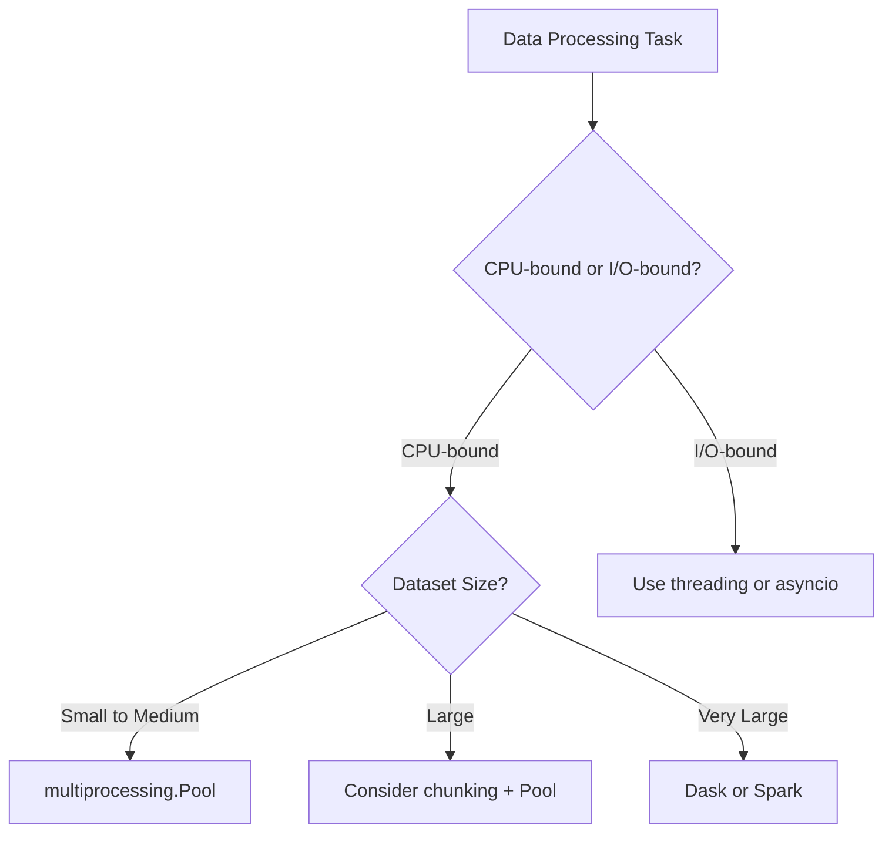

# How to Process Datasets with Parallel Jobs in Python

Author: [nawazdhandala](https://www.github.com/nawazdhandala)

Tags: Python, Parallel Processing, Multiprocessing, Data Processing, Performance, Concurrency

Description: Learn how to process large datasets efficiently using parallel jobs in Python. This guide covers multiprocessing, concurrent.futures, joblib, and practical patterns for CPU-bound and I/O-bound workloads.

---

> Processing large datasets sequentially can take hours or days. Parallel processing lets you use all your CPU cores to finish in a fraction of the time. This guide shows you how to parallelize data processing in Python the right way.

Modern machines have multiple CPU cores, but Python's Global Interpreter Lock (GIL) prevents threads from running Python code in parallel. For CPU-bound tasks like data transformation, you need multiprocessing. For I/O-bound tasks, threading or async can work. This guide covers both scenarios with practical code you can adapt.

---

## Choosing the Right Approach

Different workloads need different parallelization strategies:



| Workload Type | Examples | Best Approach |
|--------------|----------|---------------|
| CPU-bound | Data transformation, calculations | multiprocessing |
| I/O-bound | API calls, file reads | threading, asyncio |
| Mixed | Transform + API calls | Process pool + async |

---

## Basic Parallel Processing with ProcessPoolExecutor

The `concurrent.futures` module provides a clean interface for parallel execution. Start here for most use cases.

```python
# basic_parallel.py
# Simple parallel processing with ProcessPoolExecutor
from concurrent.futures import ProcessPoolExecutor, as_completed
from typing import List, Any
import time

def process_item(item: dict) -> dict:
    """
    Process a single item. This runs in a separate process.
    Must be a top-level function (not a lambda or method).
    """
    # Simulate CPU-intensive work
    result = item.copy()
    result["processed"] = True
    result["value"] = item["value"] ** 2
    time.sleep(0.1)  # Simulate computation time
    return result

def process_dataset_parallel(
    items: List[dict],
    max_workers: int = None
) -> List[dict]:
    """
    Process a list of items in parallel using multiple CPU cores.

    Args:
        items: List of items to process
        max_workers: Number of worker processes (defaults to CPU count)

    Returns:
        List of processed items in the same order
    """
    results = [None] * len(items)  # Pre-allocate for order preservation

    # ProcessPoolExecutor handles process creation and cleanup
    with ProcessPoolExecutor(max_workers=max_workers) as executor:
        # Submit all tasks and track their original index
        future_to_index = {
            executor.submit(process_item, item): i
            for i, item in enumerate(items)
        }

        # Collect results as they complete
        for future in as_completed(future_to_index):
            index = future_to_index[future]
            try:
                results[index] = future.result()
            except Exception as exc:
                print(f"Item {index} generated exception: {exc}")
                results[index] = {"error": str(exc)}

    return results

# Example usage
if __name__ == "__main__":
    # Create sample dataset
    dataset = [{"id": i, "value": i * 10} for i in range(100)]

    start = time.time()
    results = process_dataset_parallel(dataset, max_workers=4)
    elapsed = time.time() - start

    print(f"Processed {len(results)} items in {elapsed:.2f}s")
```

---

## Chunked Processing for Large Datasets

For very large datasets, process in chunks to control memory usage and provide progress feedback.

```python
# chunked_parallel.py
# Process large datasets in chunks
from concurrent.futures import ProcessPoolExecutor, as_completed
from typing import List, Iterator, Callable, TypeVar
import math

T = TypeVar('T')

def chunk_list(items: List[T], chunk_size: int) -> Iterator[List[T]]:
    """Split a list into chunks of specified size"""
    for i in range(0, len(items), chunk_size):
        yield items[i:i + chunk_size]

def process_chunk(chunk: List[dict]) -> List[dict]:
    """
    Process a chunk of items. Runs in a separate process.
    Processing in chunks reduces inter-process communication overhead.
    """
    results = []
    for item in chunk:
        # Your processing logic here
        processed = item.copy()
        processed["processed"] = True
        processed["value_squared"] = item["value"] ** 2
        results.append(processed)
    return results

def parallel_chunked_processing(
    items: List[dict],
    chunk_size: int = 1000,
    max_workers: int = None,
    progress_callback: Callable[[int, int], None] = None
) -> List[dict]:
    """
    Process a large dataset in parallel chunks.

    Args:
        items: Full dataset to process
        chunk_size: Number of items per chunk
        max_workers: Number of parallel workers
        progress_callback: Optional callback(completed, total) for progress updates

    Returns:
        All processed items as a flat list
    """
    chunks = list(chunk_list(items, chunk_size))
    total_chunks = len(chunks)
    completed_chunks = 0
    all_results = []

    with ProcessPoolExecutor(max_workers=max_workers) as executor:
        # Submit all chunks
        future_to_chunk_index = {
            executor.submit(process_chunk, chunk): i
            for i, chunk in enumerate(chunks)
        }

        # Create a list to store results in order
        chunk_results = [None] * total_chunks

        # Collect results as they complete
        for future in as_completed(future_to_chunk_index):
            chunk_index = future_to_chunk_index[future]

            try:
                chunk_results[chunk_index] = future.result()
            except Exception as exc:
                print(f"Chunk {chunk_index} failed: {exc}")
                chunk_results[chunk_index] = []

            completed_chunks += 1

            # Report progress
            if progress_callback:
                progress_callback(completed_chunks, total_chunks)

    # Flatten results maintaining order
    for chunk_result in chunk_results:
        all_results.extend(chunk_result)

    return all_results

# Example with progress reporting
def show_progress(completed: int, total: int):
    percent = (completed / total) * 100
    print(f"Progress: {completed}/{total} chunks ({percent:.1f}%)")

if __name__ == "__main__":
    # Large dataset
    large_dataset = [{"id": i, "value": i} for i in range(100000)]

    results = parallel_chunked_processing(
        large_dataset,
        chunk_size=5000,
        max_workers=4,
        progress_callback=show_progress
    )

    print(f"Processed {len(results)} items")
```

---

## Using joblib for Scientific Computing

The joblib library is popular in the data science community. It provides memory mapping for large arrays and integrates well with NumPy.

```python
# joblib_processing.py
# Parallel processing with joblib
from joblib import Parallel, delayed, Memory
from typing import List, Callable
import numpy as np
import tempfile
import os

# Optional: Set up caching for expensive computations
cache_dir = tempfile.mkdtemp()
memory = Memory(cache_dir, verbose=0)

@memory.cache
def expensive_computation(data: np.ndarray) -> np.ndarray:
    """
    Expensive computation that benefits from caching.
    Results are cached to disk and reused if inputs match.
    """
    # Simulate complex computation
    result = np.fft.fft(data)
    return np.abs(result)

def process_array_chunk(chunk: np.ndarray, operation: str) -> np.ndarray:
    """
    Process a chunk of array data.
    Must be a top-level function for joblib.
    """
    if operation == "normalize":
        return (chunk - chunk.mean()) / chunk.std()
    elif operation == "square":
        return chunk ** 2
    elif operation == "fft":
        return expensive_computation(chunk)
    else:
        return chunk

def parallel_array_processing(
    data: np.ndarray,
    operation: str,
    n_jobs: int = -1,  # -1 means use all cores
    chunk_size: int = 10000
) -> np.ndarray:
    """
    Process a large NumPy array in parallel chunks.

    Args:
        data: Input array
        operation: Operation to perform
        n_jobs: Number of parallel jobs (-1 for all cores)
        chunk_size: Size of each chunk

    Returns:
        Processed array
    """
    # Split data into chunks
    n_chunks = max(1, len(data) // chunk_size)
    chunks = np.array_split(data, n_chunks)

    # Process chunks in parallel
    # delayed() creates a lazy function call
    # Parallel() executes them across processes
    results = Parallel(n_jobs=n_jobs, verbose=1)(
        delayed(process_array_chunk)(chunk, operation)
        for chunk in chunks
    )

    # Concatenate results
    return np.concatenate(results)

def parallel_dataframe_processing(
    df,  # pandas DataFrame
    func: Callable,
    n_jobs: int = -1
):
    """
    Process a pandas DataFrame in parallel by row groups.
    """
    import pandas as pd

    # Split DataFrame into chunks
    n_chunks = n_jobs if n_jobs > 0 else os.cpu_count()
    df_chunks = np.array_split(df, n_chunks)

    # Process chunks in parallel
    results = Parallel(n_jobs=n_jobs)(
        delayed(func)(chunk) for chunk in df_chunks
    )

    # Concatenate back into single DataFrame
    return pd.concat(results, ignore_index=True)

# Example usage
if __name__ == "__main__":
    # Generate large array
    data = np.random.randn(1000000)

    # Process in parallel
    normalized = parallel_array_processing(data, "normalize", n_jobs=4)

    print(f"Original mean: {data.mean():.4f}, std: {data.std():.4f}")
    print(f"Normalized mean: {normalized.mean():.4f}, std: {normalized.std():.4f}")
```

---

## Handling Failures and Retries

Production code needs to handle failures gracefully. Here's a robust pattern with retries and error collection.

```python
# robust_parallel.py
# Production-ready parallel processing with error handling
from concurrent.futures import ProcessPoolExecutor, as_completed, TimeoutError
from dataclasses import dataclass, field
from typing import List, Dict, Any, Optional, Callable
from enum import Enum
import time
import logging

logging.basicConfig(level=logging.INFO)
logger = logging.getLogger(__name__)

class ProcessingStatus(Enum):
    SUCCESS = "success"
    FAILED = "failed"
    TIMEOUT = "timeout"
    RETRYING = "retrying"

@dataclass
class ProcessingResult:
    """Result of processing a single item"""
    item_id: Any
    status: ProcessingStatus
    result: Optional[Any] = None
    error: Optional[str] = None
    attempts: int = 1
    duration_ms: float = 0

@dataclass
class BatchResult:
    """Summary of batch processing"""
    total: int = 0
    successful: int = 0
    failed: int = 0
    results: List[ProcessingResult] = field(default_factory=list)

    @property
    def success_rate(self) -> float:
        return self.successful / self.total if self.total > 0 else 0

def process_with_retry(
    item: dict,
    process_func: Callable,
    max_retries: int = 3,
    retry_delay: float = 1.0
) -> ProcessingResult:
    """
    Process a single item with retry logic.
    Runs in a worker process.
    """
    item_id = item.get("id", "unknown")
    attempts = 0
    last_error = None
    start_time = time.time()

    while attempts < max_retries:
        attempts += 1
        try:
            result = process_func(item)
            duration = (time.time() - start_time) * 1000

            return ProcessingResult(
                item_id=item_id,
                status=ProcessingStatus.SUCCESS,
                result=result,
                attempts=attempts,
                duration_ms=duration
            )
        except Exception as e:
            last_error = str(e)
            if attempts < max_retries:
                time.sleep(retry_delay * attempts)  # Exponential backoff

    duration = (time.time() - start_time) * 1000
    return ProcessingResult(
        item_id=item_id,
        status=ProcessingStatus.FAILED,
        error=last_error,
        attempts=attempts,
        duration_ms=duration
    )

class ParallelProcessor:
    """
    Production-ready parallel processor with:
    - Configurable workers
    - Timeout handling
    - Retry logic
    - Progress tracking
    - Error aggregation
    """

    def __init__(
        self,
        max_workers: int = None,
        timeout_per_item: float = 30.0,
        max_retries: int = 3
    ):
        self.max_workers = max_workers
        self.timeout = timeout_per_item
        self.max_retries = max_retries

    def process_batch(
        self,
        items: List[dict],
        process_func: Callable,
        on_progress: Callable[[int, int], None] = None
    ) -> BatchResult:
        """
        Process a batch of items in parallel with full error handling.
        """
        batch_result = BatchResult(total=len(items))

        with ProcessPoolExecutor(max_workers=self.max_workers) as executor:
            # Submit all tasks
            futures = {
                executor.submit(
                    process_with_retry,
                    item,
                    process_func,
                    self.max_retries
                ): item
                for item in items
            }

            completed = 0

            for future in as_completed(futures, timeout=self.timeout * len(items)):
                original_item = futures[future]

                try:
                    result = future.result(timeout=self.timeout)
                    batch_result.results.append(result)

                    if result.status == ProcessingStatus.SUCCESS:
                        batch_result.successful += 1
                    else:
                        batch_result.failed += 1

                except TimeoutError:
                    # Individual item timeout
                    batch_result.failed += 1
                    batch_result.results.append(ProcessingResult(
                        item_id=original_item.get("id"),
                        status=ProcessingStatus.TIMEOUT,
                        error="Processing timeout exceeded"
                    ))

                completed += 1
                if on_progress:
                    on_progress(completed, len(items))

        return batch_result

# Example processing function that might fail
def transform_record(record: dict) -> dict:
    """Example transformation that might fail"""
    if record.get("id", 0) % 10 == 0:
        # Simulate occasional failures
        raise ValueError(f"Failed to process record {record['id']}")

    return {
        "id": record["id"],
        "transformed_value": record["value"] * 2,
        "processed_at": time.time()
    }

# Usage example
if __name__ == "__main__":
    processor = ParallelProcessor(
        max_workers=4,
        timeout_per_item=10.0,
        max_retries=3
    )

    # Sample data with some problematic records
    data = [{"id": i, "value": i * 100} for i in range(50)]

    def progress(done, total):
        print(f"Processed {done}/{total}")

    result = processor.process_batch(
        data,
        transform_record,
        on_progress=progress
    )

    print(f"\nBatch complete:")
    print(f"  Total: {result.total}")
    print(f"  Successful: {result.successful}")
    print(f"  Failed: {result.failed}")
    print(f"  Success rate: {result.success_rate:.1%}")

    # Show failed items
    failures = [r for r in result.results if r.status != ProcessingStatus.SUCCESS]
    if failures:
        print(f"\nFailed items:")
        for f in failures[:5]:  # Show first 5
            print(f"  {f.item_id}: {f.error}")
```

---

## Shared State and Inter-Process Communication

Sometimes workers need to share state or communicate. Use Manager objects for this.

```python
# shared_state.py
# Parallel processing with shared state
from multiprocessing import Manager, Pool
from typing import List, Dict
import time

def worker_with_shared_state(args):
    """
    Worker function that updates shared counters.
    The shared dict is managed by the Manager and is process-safe.
    """
    item, shared_counters = args

    try:
        # Process the item
        result = item["value"] ** 2

        # Update shared counter (thread-safe)
        shared_counters["processed"] += 1

        return {"id": item["id"], "result": result}
    except Exception as e:
        shared_counters["failed"] += 1
        return {"id": item["id"], "error": str(e)}

def process_with_shared_counters(items: List[dict]) -> Dict:
    """
    Process items while maintaining shared counters across workers.
    """
    # Manager creates shared objects that work across processes
    with Manager() as manager:
        # Create a shared dictionary for counters
        shared_counters = manager.dict()
        shared_counters["processed"] = 0
        shared_counters["failed"] = 0

        # Prepare arguments (each worker gets item + shared dict)
        worker_args = [(item, shared_counters) for item in items]

        # Process with pool
        with Pool() as pool:
            results = pool.map(worker_with_shared_state, worker_args)

        # Convert manager dict to regular dict before manager closes
        final_counters = dict(shared_counters)

    return {
        "results": results,
        "counters": final_counters
    }

# Progress tracking with shared state
def worker_with_progress(args):
    """Worker that updates a shared progress counter"""
    item, progress_dict, total = args

    # Simulate work
    time.sleep(0.1)
    result = item["value"] * 2

    # Update progress
    progress_dict["completed"] += 1

    # Calculate and store progress percentage
    progress_dict["percentage"] = (progress_dict["completed"] / total) * 100

    return result

if __name__ == "__main__":
    data = [{"id": i, "value": i} for i in range(20)]

    result = process_with_shared_counters(data)

    print(f"Results: {len(result['results'])} items")
    print(f"Counters: {result['counters']}")
```

---

## Memory-Efficient Processing with Generators

For truly massive datasets that don't fit in memory, process with generators and write results directly to disk.

```python
# streaming_parallel.py
# Memory-efficient parallel processing for huge datasets
from concurrent.futures import ProcessPoolExecutor, as_completed
from typing import Iterator, List, Callable
import json
import os

def process_and_write_chunk(
    chunk: List[dict],
    process_func: Callable,
    output_file: str
) -> int:
    """
    Process a chunk and write results directly to a file.
    Returns the number of items processed.
    """
    processed_count = 0

    with open(output_file, 'w') as f:
        for item in chunk:
            try:
                result = process_func(item)
                f.write(json.dumps(result) + '\n')
                processed_count += 1
            except Exception as e:
                # Log error but continue processing
                pass

    return processed_count

def stream_large_file(filepath: str, chunk_size: int) -> Iterator[List[dict]]:
    """
    Read a large JSON-lines file in chunks.
    Memory efficient - only holds one chunk at a time.
    """
    chunk = []

    with open(filepath, 'r') as f:
        for line in f:
            chunk.append(json.loads(line))

            if len(chunk) >= chunk_size:
                yield chunk
                chunk = []

    # Yield remaining items
    if chunk:
        yield chunk

def parallel_stream_processing(
    input_file: str,
    output_dir: str,
    process_func: Callable,
    chunk_size: int = 10000,
    max_workers: int = 4
) -> int:
    """
    Process a huge file in parallel, writing results to multiple output files.

    Args:
        input_file: Path to input JSON-lines file
        output_dir: Directory for output chunk files
        process_func: Function to process each item
        chunk_size: Items per chunk
        max_workers: Parallel workers

    Returns:
        Total items processed
    """
    os.makedirs(output_dir, exist_ok=True)
    total_processed = 0

    with ProcessPoolExecutor(max_workers=max_workers) as executor:
        futures = []

        # Submit chunks as we read them
        for i, chunk in enumerate(stream_large_file(input_file, chunk_size)):
            output_file = os.path.join(output_dir, f"chunk_{i:05d}.jsonl")

            future = executor.submit(
                process_and_write_chunk,
                chunk,
                process_func,
                output_file
            )
            futures.append(future)

            # Limit pending futures to control memory
            if len(futures) >= max_workers * 2:
                # Wait for some to complete
                done_futures = [f for f in futures if f.done()]
                for f in done_futures:
                    total_processed += f.result()
                    futures.remove(f)

        # Wait for remaining futures
        for future in as_completed(futures):
            total_processed += future.result()

    return total_processed

def merge_output_files(output_dir: str, final_output: str):
    """Merge all chunk files into a single output file"""
    chunk_files = sorted([
        os.path.join(output_dir, f)
        for f in os.listdir(output_dir)
        if f.endswith('.jsonl')
    ])

    with open(final_output, 'w') as outfile:
        for chunk_file in chunk_files:
            with open(chunk_file, 'r') as infile:
                outfile.write(infile.read())
```

---

## Best Practices

1. **Choose the right tool** - Use multiprocessing for CPU-bound tasks, threading for I/O-bound tasks.

2. **Process in chunks** - Reduces overhead and allows progress tracking.

3. **Handle failures gracefully** - Use retries and collect errors for later analysis.

4. **Watch memory usage** - Large datasets need streaming approaches.

5. **Profile first** - Make sure parallelization actually helps your specific workload.

6. **Use the right number of workers** - CPU cores for CPU-bound, more for I/O-bound.

---

## Conclusion

Parallel processing can dramatically speed up data processing, but it requires careful design. Start with ProcessPoolExecutor for simplicity, add chunking for large datasets, and implement proper error handling for production use. The patterns in this guide will help you build parallel processing pipelines that are both fast and reliable.

---

*Need to monitor your data processing jobs? [OneUptime](https://oneuptime.com) provides comprehensive monitoring and alerting for batch jobs, helping you track progress, catch failures, and optimize performance.*

**Related Reading:**
- [How to Build a Log Aggregation Service in Python](https://oneuptime.com/blog/post/2026-01-21-log-aggregation-service-python/view)
- [How to Implement Structured Logging with OpenTelemetry in Python](https://oneuptime.com/blog/post/2025-01-06-python-structured-logging-opentelemetry/view)
