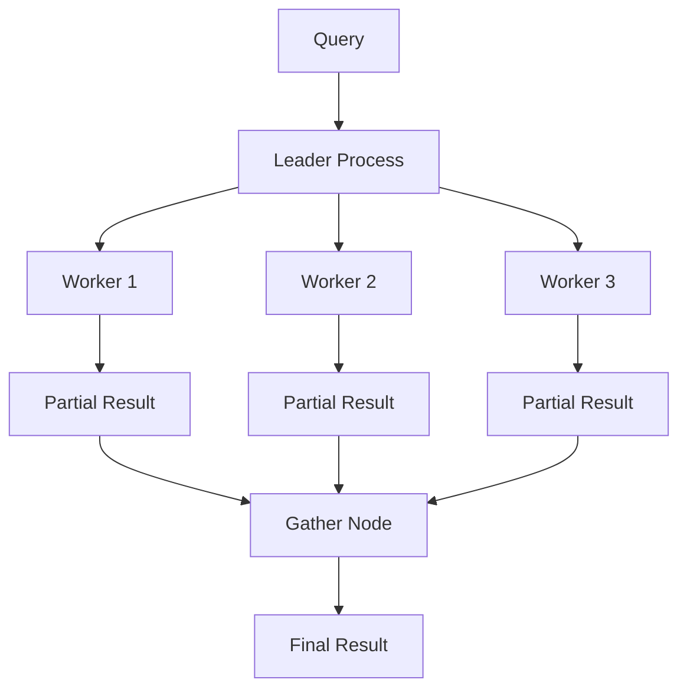

# How to Speed Up Scans with Parallel Queries in PostgreSQL

Author: [nawazdhandala](https://www.github.com/nawazdhandala)

Tags: PostgreSQL, Performance, Parallel Query, Database Optimization, Query Tuning

Description: Learn how PostgreSQL parallel queries work, when they kick in, and how to tune them for maximum performance on large table scans and aggregations.

---

Scanning a 100-million-row table with a single CPU core takes forever. PostgreSQL can use multiple CPU cores to execute queries in parallel, dramatically reducing execution time for analytical workloads. This guide explains how parallel queries work and how to tune them.

## How Parallel Queries Work

PostgreSQL divides work among multiple worker processes that run simultaneously. The leader process coordinates workers and combines their results.



## Checking Parallel Query Configuration

Verify parallel queries are enabled:

```sql
-- Check current settings
SHOW max_parallel_workers;           -- Total workers available
SHOW max_parallel_workers_per_gather; -- Workers per query
SHOW parallel_tuple_cost;            -- Cost estimate per tuple
SHOW parallel_setup_cost;            -- Startup cost for parallelism
SHOW min_parallel_table_scan_size;   -- Minimum table size for parallel scan
SHOW min_parallel_index_scan_size;   -- Minimum index size for parallel scan
```

Default settings are conservative. For dedicated database servers:

```sql
-- Enable more parallelism
SET max_parallel_workers = 8;
SET max_parallel_workers_per_gather = 4;

-- Or permanently in postgresql.conf
-- max_parallel_workers = 8
-- max_parallel_workers_per_gather = 4
```

## Understanding Execution Plans

Check if a query uses parallelism with EXPLAIN:

```sql
-- Create a test table
CREATE TABLE sales (
    id serial PRIMARY KEY,
    product_id integer,
    amount numeric(10,2),
    sale_date date,
    region varchar(50)
);

-- Insert test data (10 million rows)
INSERT INTO sales (product_id, amount, sale_date, region)
SELECT
    (random() * 1000)::integer,
    (random() * 1000)::numeric(10,2),
    '2020-01-01'::date + (random() * 1500)::integer,
    (ARRAY['North', 'South', 'East', 'West'])[1 + (random() * 3)::integer]
FROM generate_series(1, 10000000);

-- Update statistics
ANALYZE sales;
```

Now check the execution plan:

```sql
EXPLAIN (ANALYZE, BUFFERS, FORMAT TEXT)
SELECT region, sum(amount)
FROM sales
GROUP BY region;
```

A parallel plan shows "Gather" and "Workers Planned":

```
Finalize GroupAggregate  (cost=... rows=4 width=...)
  ->  Gather Merge  (cost=... rows=16 width=...)
        Workers Planned: 4
        Workers Launched: 4
        ->  Sort  (cost=... rows=4 width=...)
              Sort Key: region
              ->  Partial HashAggregate  (cost=... rows=4 width=...)
                    ->  Parallel Seq Scan on sales  (cost=... rows=... width=...)
```

## Operations That Support Parallelism

### Parallel Sequential Scans

Large table scans benefit the most:

```sql
-- Count without index (uses parallel scan)
EXPLAIN ANALYZE
SELECT count(*) FROM sales;

-- Parallel Seq Scan divides the table among workers
-- Each worker scans a portion and counts locally
-- Gather combines partial counts
```

### Parallel Aggregates

Aggregations like SUM, COUNT, AVG use partial aggregation:

```sql
-- Each worker computes a partial sum
-- Leader combines partial results
EXPLAIN ANALYZE
SELECT sum(amount), avg(amount), count(*)
FROM sales
WHERE sale_date > '2023-01-01';
```

### Parallel Hash Joins

Large joins can execute in parallel:

```sql
CREATE TABLE products (
    id serial PRIMARY KEY,
    name varchar(100),
    category varchar(50)
);

INSERT INTO products (name, category)
SELECT 'Product ' || i, (ARRAY['Electronics', 'Clothing', 'Food'])[1 + (random() * 2)::integer]
FROM generate_series(1, 1000) i;

ANALYZE products;

-- Parallel hash join
EXPLAIN ANALYZE
SELECT p.category, sum(s.amount)
FROM sales s
JOIN products p ON s.product_id = p.id
GROUP BY p.category;
```

### Parallel Index Scans

Index scans can also parallelize:

```sql
-- Create an index
CREATE INDEX sales_date_idx ON sales(sale_date);

-- Parallel index scan on range query
EXPLAIN ANALYZE
SELECT count(*), sum(amount)
FROM sales
WHERE sale_date BETWEEN '2022-01-01' AND '2022-12-31';
```

## Tuning Parallel Query Performance

### Increase Worker Count for Large Tables

```sql
-- For a dedicated analytics server
ALTER SYSTEM SET max_parallel_workers = 16;
ALTER SYSTEM SET max_parallel_workers_per_gather = 8;
SELECT pg_reload_conf();
```

### Adjust Cost Parameters

If PostgreSQL isn't using parallelism when it should:

```sql
-- Lower the costs to encourage parallelism
SET parallel_tuple_cost = 0.001;  -- Default 0.01
SET parallel_setup_cost = 100;    -- Default 1000

-- Reduce minimum table size threshold
SET min_parallel_table_scan_size = '1MB';  -- Default 8MB
```

### Force Parallelism for Testing

```sql
-- Force parallel query (for testing only)
SET parallel_tuple_cost = 0;
SET parallel_setup_cost = 0;
SET max_parallel_workers_per_gather = 4;

-- Now even small queries may parallelize
EXPLAIN ANALYZE SELECT count(*) FROM sales;
```

### Table-Level Parallel Worker Hints

Override defaults for specific tables:

```sql
-- Allow up to 8 workers for this large table
ALTER TABLE sales SET (parallel_workers = 8);

-- Check the setting
SELECT relname, reloptions
FROM pg_class
WHERE relname = 'sales';
```

## Monitoring Parallel Query Execution

### Check Active Workers

```sql
-- View running parallel workers
SELECT pid, query, backend_type
FROM pg_stat_activity
WHERE backend_type = 'parallel worker';
```

### Measure Actual Speedup

```sql
-- Benchmark with parallelism disabled
SET max_parallel_workers_per_gather = 0;

EXPLAIN ANALYZE
SELECT region, sum(amount) FROM sales GROUP BY region;

-- Enable parallelism and compare
SET max_parallel_workers_per_gather = 4;

EXPLAIN ANALYZE
SELECT region, sum(amount) FROM sales GROUP BY region;
```

Typical speedup is 2-4x with 4 workers, not a perfect 4x due to coordination overhead.

## When Parallel Queries Do Not Help

### Small Result Sets with Indexes

```sql
-- Index lookup returns few rows - parallelism adds overhead
EXPLAIN ANALYZE
SELECT * FROM sales WHERE id = 12345;
```

### Write Operations

INSERT, UPDATE, DELETE are not parallelized (except CREATE TABLE AS SELECT):

```sql
-- Serial execution
EXPLAIN ANALYZE
UPDATE sales SET amount = amount * 1.1 WHERE region = 'North';
```

### Queries with Side Effects

Functions marked PARALLEL UNSAFE prevent parallelism:

```sql
-- This won't parallelize if the function isn't parallel-safe
SELECT my_unsafe_function(amount) FROM sales;
```

## Making Custom Functions Parallel-Safe

Mark functions that can safely run in parallel:

```sql
-- A simple calculation is safe
CREATE OR REPLACE FUNCTION calculate_tax(amount numeric)
RETURNS numeric AS $$
BEGIN
    RETURN amount * 0.08;
END;
$$ LANGUAGE plpgsql PARALLEL SAFE IMMUTABLE;

-- Now it can execute in parallel workers
EXPLAIN ANALYZE
SELECT sum(calculate_tax(amount)) FROM sales;
```

Function safety levels:
- **PARALLEL SAFE** - Can run in any parallel worker
- **PARALLEL RESTRICTED** - Only runs in leader (accesses sequences, temp tables)
- **PARALLEL UNSAFE** - Prevents parallelism entirely (writes data, uses cursors)

## Parallel CREATE INDEX

Creating indexes on large tables benefits from parallelism:

```sql
-- Check current setting
SHOW max_parallel_maintenance_workers;

-- Increase for large index builds
SET max_parallel_maintenance_workers = 4;

-- Create index (uses parallel workers internally)
CREATE INDEX CONCURRENTLY sales_amount_idx ON sales(amount);
```

## Practical Example: Analytics Query

A realistic analytics query that benefits from parallelism:

```sql
-- Monthly revenue by region with parallel execution
EXPLAIN (ANALYZE, BUFFERS)
SELECT
    date_trunc('month', sale_date) AS month,
    region,
    count(*) AS transactions,
    sum(amount) AS revenue,
    avg(amount) AS avg_transaction
FROM sales
WHERE sale_date >= '2022-01-01'
GROUP BY date_trunc('month', sale_date), region
ORDER BY month, region;
```

With 4 workers on a 10-million-row table, expect 3-4x speedup compared to single-threaded execution.

## Configuration Summary

For an analytics workload on a server with 8 CPU cores:

```ini
# postgresql.conf
max_parallel_workers = 8                   # Total workers
max_parallel_workers_per_gather = 4        # Per query
max_parallel_maintenance_workers = 4       # For index builds
parallel_tuple_cost = 0.01                 # Default
parallel_setup_cost = 1000                 # Default
min_parallel_table_scan_size = 8MB         # Default
min_parallel_index_scan_size = 512kB       # Default
```

---

Parallel queries can turn minute-long scans into seconds. The key is having enough data to justify the parallelization overhead - typically tables over 8MB with queries that scan significant portions. Monitor your workload, adjust worker counts based on available CPU cores, and let PostgreSQL do the heavy lifting across multiple cores.
