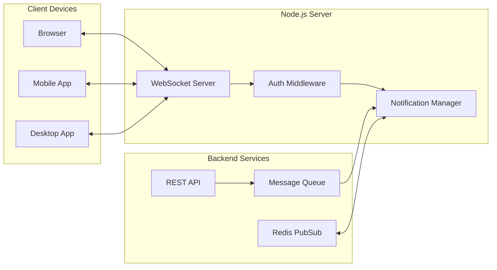

# How to Build Push Notifications with WebSockets in Node.js

Author: [nawazdhandala](https://www.github.com/nawazdhandala)

Tags: Node.js, WebSockets, Push Notifications, Real-time, Socket.io, TypeScript, Backend

Description: Learn how to build a real-time push notification system using WebSockets in Node.js. This guide covers connection management, message routing, scaling with Redis, and handling reconnections gracefully.

---

> Users expect instant updates. Polling wastes resources and adds latency. WebSockets provide a persistent connection for real-time push notifications that feel instant. Build a notification system that scales.

Real-time notifications improve user experience dramatically. Whether it is chat messages, order updates, or system alerts, WebSockets deliver them instantly without constant polling.

---

## Overview



---

## Setting Up the WebSocket Server

Start with a basic WebSocket server using the ws library:

```typescript
// server.ts
import { WebSocketServer, WebSocket } from 'ws';
import { createServer } from 'http';
import express from 'express';

const app = express();
const server = createServer(app);

// Create WebSocket server attached to HTTP server
// This allows running both REST API and WebSockets on same port
const wss = new WebSocketServer({
  server,
  path: '/notifications'  // WebSocket endpoint path
});

// Track connected clients with their user information
interface ConnectedClient {
  socket: WebSocket;
  userId: string;
  deviceId: string;
  connectedAt: Date;
  lastPing: Date;
}

const clients: Map<string, ConnectedClient> = new Map();

wss.on('connection', (socket: WebSocket, request) => {
  console.log('New WebSocket connection');

  // Handle incoming messages from client
  socket.on('message', (data: Buffer) => {
    try {
      const message = JSON.parse(data.toString());
      handleMessage(socket, message);
    } catch (error) {
      console.error('Invalid message format:', error);
    }
  });

  // Handle connection close
  socket.on('close', (code: number, reason: Buffer) => {
    console.log(`Connection closed: ${code} - ${reason.toString()}`);
    removeClient(socket);
  });

  // Handle errors
  socket.on('error', (error: Error) => {
    console.error('WebSocket error:', error);
    removeClient(socket);
  });
});

// Start server
const PORT = process.env.PORT || 3000;
server.listen(PORT, () => {
  console.log(`Server running on port ${PORT}`);
});
```

---

## Authentication Middleware

Authenticate WebSocket connections before allowing access:

```typescript
// auth.ts
import { IncomingMessage } from 'http';
import { WebSocket } from 'ws';
import jwt from 'jsonwebtoken';

interface AuthPayload {
  userId: string;
  deviceId: string;
  permissions: string[];
}

// Verify JWT token from connection request
function authenticateConnection(request: IncomingMessage): AuthPayload | null {
  // Token can be in query string or Authorization header
  const url = new URL(request.url!, `http://${request.headers.host}`);
  const token = url.searchParams.get('token') ||
    request.headers.authorization?.replace('Bearer ', '');

  if (!token) {
    return null;
  }

  try {
    // Verify and decode the JWT token
    const decoded = jwt.verify(token, process.env.JWT_SECRET!) as AuthPayload;
    return decoded;
  } catch (error) {
    console.error('Token verification failed:', error);
    return null;
  }
}

// Apply authentication to WebSocket server
wss.on('connection', (socket: WebSocket, request: IncomingMessage) => {
  const auth = authenticateConnection(request);

  if (!auth) {
    // Close connection with unauthorized status
    socket.close(4001, 'Unauthorized');
    return;
  }

  // Store authenticated client
  const clientKey = `${auth.userId}:${auth.deviceId}`;
  clients.set(clientKey, {
    socket,
    userId: auth.userId,
    deviceId: auth.deviceId,
    connectedAt: new Date(),
    lastPing: new Date()
  });

  console.log(`Client authenticated: ${clientKey}`);

  // Send connection confirmation
  socket.send(JSON.stringify({
    type: 'connected',
    userId: auth.userId,
    timestamp: new Date().toISOString()
  }));
});
```

---

## Message Types and Handlers

Define a protocol for client-server communication:

```typescript
// messages.ts

// Message types sent between client and server
type MessageType =
  | 'ping'           // Keep-alive from client
  | 'pong'           // Keep-alive response
  | 'subscribe'      // Subscribe to notification channels
  | 'unsubscribe'    // Unsubscribe from channels
  | 'notification'   // Push notification to client
  | 'ack';           // Acknowledgment of received notification

interface BaseMessage {
  type: MessageType;
  id?: string;       // Message ID for acknowledgment tracking
}

interface PingMessage extends BaseMessage {
  type: 'ping';
}

interface SubscribeMessage extends BaseMessage {
  type: 'subscribe';
  channels: string[];
}

interface NotificationMessage extends BaseMessage {
  type: 'notification';
  channel: string;
  payload: {
    title: string;
    body: string;
    data?: Record<string, any>;
    priority: 'low' | 'normal' | 'high';
  };
  timestamp: string;
}

interface AckMessage extends BaseMessage {
  type: 'ack';
  messageId: string;
}

type ClientMessage = PingMessage | SubscribeMessage | AckMessage;
type ServerMessage = NotificationMessage | { type: 'pong' } | { type: 'subscribed'; channels: string[] };

// Handle incoming messages from clients
function handleMessage(socket: WebSocket, message: ClientMessage): void {
  const client = findClientBySocket(socket);
  if (!client) return;

  switch (message.type) {
    case 'ping':
      // Update last ping time and respond
      client.lastPing = new Date();
      socket.send(JSON.stringify({ type: 'pong' }));
      break;

    case 'subscribe':
      subscribeToChannels(client, message.channels);
      socket.send(JSON.stringify({
        type: 'subscribed',
        channels: message.channels
      }));
      break;

    case 'ack':
      handleAcknowledgment(client, message.messageId);
      break;

    default:
      console.warn('Unknown message type:', message);
  }
}

function findClientBySocket(socket: WebSocket): ConnectedClient | undefined {
  for (const client of clients.values()) {
    if (client.socket === socket) {
      return client;
    }
  }
  return undefined;
}
```

---

## Channel Subscription System

Allow clients to subscribe to specific notification channels:

```typescript
// channels.ts

// Track which users are subscribed to which channels
const channelSubscriptions: Map<string, Set<string>> = new Map();

// Subscribe a client to channels
function subscribeToChannels(client: ConnectedClient, channels: string[]): void {
  const clientKey = `${client.userId}:${client.deviceId}`;

  for (const channel of channels) {
    // Validate channel name and permissions
    if (!isValidChannel(channel)) {
      console.warn(`Invalid channel: ${channel}`);
      continue;
    }

    if (!canSubscribe(client.userId, channel)) {
      console.warn(`User ${client.userId} cannot subscribe to ${channel}`);
      continue;
    }

    // Add client to channel subscription set
    if (!channelSubscriptions.has(channel)) {
      channelSubscriptions.set(channel, new Set());
    }
    channelSubscriptions.get(channel)!.add(clientKey);

    console.log(`${clientKey} subscribed to ${channel}`);
  }
}

// Unsubscribe client from channels
function unsubscribeFromChannels(client: ConnectedClient, channels: string[]): void {
  const clientKey = `${client.userId}:${client.deviceId}`;

  for (const channel of channels) {
    const subscribers = channelSubscriptions.get(channel);
    if (subscribers) {
      subscribers.delete(clientKey);
      if (subscribers.size === 0) {
        channelSubscriptions.delete(channel);
      }
    }
  }
}

// Remove client from all channels when disconnecting
function removeClient(socket: WebSocket): void {
  for (const [key, client] of clients.entries()) {
    if (client.socket === socket) {
      // Unsubscribe from all channels
      for (const [channel, subscribers] of channelSubscriptions.entries()) {
        subscribers.delete(key);
      }
      clients.delete(key);
      console.log(`Client removed: ${key}`);
      break;
    }
  }
}

// Validate channel name format
function isValidChannel(channel: string): boolean {
  // Channels must be alphanumeric with dots and hyphens
  return /^[a-zA-Z0-9._-]+$/.test(channel);
}

// Check if user can subscribe to a channel
function canSubscribe(userId: string, channel: string): boolean {
  // User-specific channels: user.{userId}.*
  if (channel.startsWith('user.')) {
    const channelUserId = channel.split('.')[1];
    return channelUserId === userId;
  }

  // Public channels are open to all
  if (channel.startsWith('public.')) {
    return true;
  }

  // Add more permission checks as needed
  return true;
}
```

---

## Notification Manager

Create a service for sending notifications:

```typescript
// notification-manager.ts
import { v4 as uuidv4 } from 'uuid';

interface Notification {
  id: string;
  channel: string;
  title: string;
  body: string;
  data?: Record<string, any>;
  priority: 'low' | 'normal' | 'high';
  createdAt: Date;
}

// Track pending notifications awaiting acknowledgment
interface PendingNotification {
  notification: Notification;
  clientKey: string;
  sentAt: Date;
  retryCount: number;
}

const pendingNotifications: Map<string, PendingNotification> = new Map();
const MAX_RETRIES = 3;
const RETRY_DELAY_MS = 5000;

class NotificationManager {
  // Send notification to a specific channel
  async sendToChannel(
    channel: string,
    title: string,
    body: string,
    data?: Record<string, any>,
    priority: 'low' | 'normal' | 'high' = 'normal'
  ): Promise<number> {
    const notification: Notification = {
      id: uuidv4(),
      channel,
      title,
      body,
      data,
      priority,
      createdAt: new Date()
    };

    const subscribers = channelSubscriptions.get(channel);
    if (!subscribers || subscribers.size === 0) {
      console.log(`No subscribers for channel: ${channel}`);
      return 0;
    }

    let sentCount = 0;
    for (const clientKey of subscribers) {
      const client = clients.get(clientKey);
      if (client && client.socket.readyState === WebSocket.OPEN) {
        this.sendToClient(client, notification);
        sentCount++;
      }
    }

    console.log(`Notification sent to ${sentCount} clients on ${channel}`);
    return sentCount;
  }

  // Send notification to a specific user (all their devices)
  async sendToUser(
    userId: string,
    title: string,
    body: string,
    data?: Record<string, any>,
    priority: 'low' | 'normal' | 'high' = 'normal'
  ): Promise<number> {
    const notification: Notification = {
      id: uuidv4(),
      channel: `user.${userId}`,
      title,
      body,
      data,
      priority,
      createdAt: new Date()
    };

    let sentCount = 0;
    for (const [key, client] of clients.entries()) {
      if (client.userId === userId && client.socket.readyState === WebSocket.OPEN) {
        this.sendToClient(client, notification);
        sentCount++;
      }
    }

    return sentCount;
  }

  // Send notification to a specific client
  private sendToClient(client: ConnectedClient, notification: Notification): void {
    const message: NotificationMessage = {
      type: 'notification',
      id: notification.id,
      channel: notification.channel,
      payload: {
        title: notification.title,
        body: notification.body,
        data: notification.data,
        priority: notification.priority
      },
      timestamp: notification.createdAt.toISOString()
    };

    try {
      client.socket.send(JSON.stringify(message));

      // Track pending notification for retry logic
      const clientKey = `${client.userId}:${client.deviceId}`;
      pendingNotifications.set(`${notification.id}:${clientKey}`, {
        notification,
        clientKey,
        sentAt: new Date(),
        retryCount: 0
      });

      // Set timeout for retry if not acknowledged
      this.scheduleRetry(notification.id, clientKey);
    } catch (error) {
      console.error('Failed to send notification:', error);
    }
  }

  // Retry sending unacknowledged notifications
  private scheduleRetry(notificationId: string, clientKey: string): void {
    setTimeout(() => {
      const pendingKey = `${notificationId}:${clientKey}`;
      const pending = pendingNotifications.get(pendingKey);

      if (!pending) {
        // Already acknowledged
        return;
      }

      if (pending.retryCount >= MAX_RETRIES) {
        console.log(`Max retries reached for ${pendingKey}`);
        pendingNotifications.delete(pendingKey);
        // Store for offline delivery
        this.storeForOfflineDelivery(pending);
        return;
      }

      // Retry sending
      const client = clients.get(clientKey);
      if (client && client.socket.readyState === WebSocket.OPEN) {
        pending.retryCount++;
        pending.sentAt = new Date();
        this.sendToClient(client, pending.notification);
      }
    }, RETRY_DELAY_MS);
  }

  // Store notification for delivery when user comes online
  private storeForOfflineDelivery(pending: PendingNotification): void {
    // Store in database for later delivery
    console.log(`Storing notification ${pending.notification.id} for offline delivery`);
    // Implementation depends on your database
  }
}

// Handle acknowledgment from client
function handleAcknowledgment(client: ConnectedClient, messageId: string): void {
  const clientKey = `${client.userId}:${client.deviceId}`;
  const pendingKey = `${messageId}:${clientKey}`;

  if (pendingNotifications.has(pendingKey)) {
    pendingNotifications.delete(pendingKey);
    console.log(`Notification ${messageId} acknowledged by ${clientKey}`);
  }
}

export const notificationManager = new NotificationManager();
```

---

## REST API for Sending Notifications

Expose endpoints for triggering notifications from other services:

```typescript
// api.ts
import express from 'express';
import { notificationManager } from './notification-manager';

const router = express.Router();

// Send notification to a channel
router.post('/notifications/channel', async (req, res) => {
  const { channel, title, body, data, priority } = req.body;

  if (!channel || !title || !body) {
    return res.status(400).json({ error: 'Missing required fields' });
  }

  try {
    const sentCount = await notificationManager.sendToChannel(
      channel,
      title,
      body,
      data,
      priority
    );

    res.json({
      success: true,
      sentCount,
      channel
    });
  } catch (error) {
    console.error('Failed to send notification:', error);
    res.status(500).json({ error: 'Failed to send notification' });
  }
});

// Send notification to a specific user
router.post('/notifications/user/:userId', async (req, res) => {
  const { userId } = req.params;
  const { title, body, data, priority } = req.body;

  if (!title || !body) {
    return res.status(400).json({ error: 'Missing required fields' });
  }

  try {
    const sentCount = await notificationManager.sendToUser(
      userId,
      title,
      body,
      data,
      priority
    );

    res.json({
      success: true,
      sentCount,
      userId
    });
  } catch (error) {
    console.error('Failed to send notification:', error);
    res.status(500).json({ error: 'Failed to send notification' });
  }
});

// Get connected clients stats
router.get('/notifications/stats', (req, res) => {
  const stats = {
    connectedClients: clients.size,
    activeChannels: channelSubscriptions.size,
    pendingNotifications: pendingNotifications.size
  };

  res.json(stats);
});

app.use('/api', router);
```

---

## Scaling with Redis PubSub

Scale to multiple server instances using Redis:

```typescript
// redis-adapter.ts
import Redis from 'ioredis';
import { notificationManager } from './notification-manager';

const publisher = new Redis(process.env.REDIS_URL);
const subscriber = new Redis(process.env.REDIS_URL);

const NOTIFICATION_CHANNEL = 'notifications';

// Subscribe to Redis channel for notifications from other servers
subscriber.subscribe(NOTIFICATION_CHANNEL, (err) => {
  if (err) {
    console.error('Failed to subscribe to Redis:', err);
    return;
  }
  console.log('Subscribed to Redis notification channel');
});

// Handle notifications from Redis
subscriber.on('message', async (channel, message) => {
  if (channel !== NOTIFICATION_CHANNEL) return;

  try {
    const data = JSON.parse(message);

    // Check if this notification is for a client connected to this server
    if (data.type === 'channel') {
      await notificationManager.sendToChannel(
        data.channel,
        data.title,
        data.body,
        data.data,
        data.priority
      );
    } else if (data.type === 'user') {
      await notificationManager.sendToUser(
        data.userId,
        data.title,
        data.body,
        data.data,
        data.priority
      );
    }
  } catch (error) {
    console.error('Failed to process Redis message:', error);
  }
});

// Publish notification to all server instances
export async function broadcastNotification(
  type: 'channel' | 'user',
  target: string,
  title: string,
  body: string,
  data?: Record<string, any>,
  priority?: 'low' | 'normal' | 'high'
): Promise<void> {
  const message = JSON.stringify({
    type,
    [type === 'channel' ? 'channel' : 'userId']: target,
    title,
    body,
    data,
    priority: priority || 'normal'
  });

  await publisher.publish(NOTIFICATION_CHANNEL, message);
}
```

---

## Client-Side Implementation

Example JavaScript client for connecting to the WebSocket server:

```typescript
// client.ts (Browser)

class NotificationClient {
  private socket: WebSocket | null = null;
  private reconnectAttempts = 0;
  private maxReconnectAttempts = 5;
  private reconnectDelay = 1000;
  private pingInterval: number | null = null;

  constructor(private url: string, private token: string) {}

  // Connect to the notification server
  connect(): Promise<void> {
    return new Promise((resolve, reject) => {
      const wsUrl = `${this.url}?token=${this.token}`;
      this.socket = new WebSocket(wsUrl);

      this.socket.onopen = () => {
        console.log('Connected to notification server');
        this.reconnectAttempts = 0;
        this.startPingInterval();
        resolve();
      };

      this.socket.onmessage = (event) => {
        this.handleMessage(JSON.parse(event.data));
      };

      this.socket.onclose = (event) => {
        console.log('Disconnected:', event.code, event.reason);
        this.stopPingInterval();
        this.attemptReconnect();
      };

      this.socket.onerror = (error) => {
        console.error('WebSocket error:', error);
        reject(error);
      };
    });
  }

  // Subscribe to notification channels
  subscribe(channels: string[]): void {
    this.send({
      type: 'subscribe',
      channels
    });
  }

  // Handle incoming messages
  private handleMessage(message: any): void {
    switch (message.type) {
      case 'connected':
        console.log('Authenticated as:', message.userId);
        break;

      case 'pong':
        // Server responded to ping
        break;

      case 'notification':
        this.handleNotification(message);
        break;

      case 'subscribed':
        console.log('Subscribed to:', message.channels);
        break;
    }
  }

  // Process and display notification
  private handleNotification(message: any): void {
    console.log('Notification received:', message);

    // Send acknowledgment
    this.send({
      type: 'ack',
      messageId: message.id
    });

    // Display notification (browser API)
    if (Notification.permission === 'granted') {
      new Notification(message.payload.title, {
        body: message.payload.body,
        data: message.payload.data
      });
    }

    // Dispatch custom event for app to handle
    window.dispatchEvent(new CustomEvent('notification', {
      detail: message
    }));
  }

  // Send message to server
  private send(message: any): void {
    if (this.socket && this.socket.readyState === WebSocket.OPEN) {
      this.socket.send(JSON.stringify(message));
    }
  }

  // Keep connection alive with ping
  private startPingInterval(): void {
    this.pingInterval = window.setInterval(() => {
      this.send({ type: 'ping' });
    }, 30000);
  }

  private stopPingInterval(): void {
    if (this.pingInterval) {
      clearInterval(this.pingInterval);
      this.pingInterval = null;
    }
  }

  // Reconnect with exponential backoff
  private attemptReconnect(): void {
    if (this.reconnectAttempts >= this.maxReconnectAttempts) {
      console.error('Max reconnect attempts reached');
      return;
    }

    const delay = this.reconnectDelay * Math.pow(2, this.reconnectAttempts);
    this.reconnectAttempts++;

    console.log(`Reconnecting in ${delay}ms...`);
    setTimeout(() => this.connect(), delay);
  }

  // Close connection
  disconnect(): void {
    this.stopPingInterval();
    if (this.socket) {
      this.socket.close();
      this.socket = null;
    }
  }
}

// Usage
const client = new NotificationClient(
  'wss://api.example.com/notifications',
  localStorage.getItem('authToken')!
);

client.connect().then(() => {
  client.subscribe(['user.123', 'public.announcements']);
});

window.addEventListener('notification', (event: CustomEvent) => {
  console.log('App received notification:', event.detail);
});
```

---

## Best Practices

1. **Always authenticate** WebSocket connections
2. **Implement heartbeats** to detect dead connections
3. **Handle reconnection** gracefully on the client
4. **Use message acknowledgments** for important notifications
5. **Scale with Redis PubSub** for multiple server instances
6. **Store offline notifications** for delivery when users reconnect

---

## Conclusion

WebSockets provide efficient real-time notifications compared to polling. Key takeaways:

- **Persistent connections** reduce latency and server load
- **Channel subscriptions** enable targeted notifications
- **Acknowledgments** ensure delivery reliability
- **Redis PubSub** enables horizontal scaling

Build notification systems that keep users informed in real-time without wasting resources.

---

*Building real-time applications? [OneUptime](https://oneuptime.com) provides uptime monitoring and alerting to ensure your WebSocket servers stay online and responsive.*
