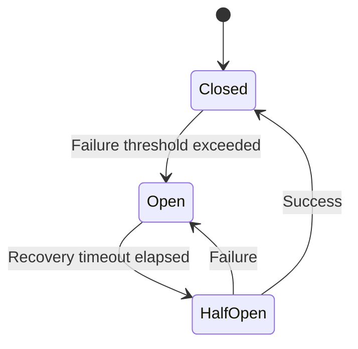

# How to Implement Circuit Breakers in Python

Author: [nawazdhandala](https://www.github.com/nawazdhandala)

Tags: Python, Circuit Breaker, Resilience, Fault Tolerance, Microservices, pybreaker, Distributed Systems, Error Handling

Description: Learn how to implement the circuit breaker pattern in Python to build resilient applications. This guide covers the theory, practical implementation with pybreaker, custom implementations, and integration with web frameworks.

---

> When your application depends on external services, a single failing dependency can bring down your entire system. The circuit breaker pattern prevents cascading failures by detecting when a service is unhealthy and temporarily stopping requests to it.

Think of a circuit breaker like the electrical ones in your home. When there is a problem, the breaker trips to prevent damage. Similarly, a software circuit breaker trips when a service fails repeatedly, giving it time to recover before resuming normal operations.

---

## Understanding the Circuit Breaker Pattern

A circuit breaker has three states:



**Closed**: Normal operation. Requests pass through and failures are counted. If failures exceed a threshold, the circuit opens.

**Open**: The circuit rejects all requests immediately without calling the protected service. After a timeout period, it transitions to half-open.

**Half-Open**: A limited number of test requests are allowed through. If they succeed, the circuit closes. If they fail, it opens again.

---

## Using pybreaker Library

The pybreaker library provides a mature circuit breaker implementation:

```bash
pip install pybreaker
```

Basic usage:

```python
# basic_circuit_breaker.py
# Circuit breaker basics with pybreaker

import pybreaker
import requests

# Create a circuit breaker instance
# Opens after 5 failures within 30 seconds
# Stays open for 60 seconds before trying again
payment_breaker = pybreaker.CircuitBreaker(
    fail_max=5,              # Failures before opening
    reset_timeout=60,        # Seconds to wait before half-open
    exclude=[ValueError],    # Exceptions that don't count as failures
)


@payment_breaker
def process_payment(order_id: str, amount: float) -> dict:
    """
    Process a payment through external payment service.
    The circuit breaker protects this call.
    """
    response = requests.post(
        "https://api.payment-provider.com/charge",
        json={"order_id": order_id, "amount": amount},
        timeout=10
    )
    response.raise_for_status()
    return response.json()


def handle_order_payment(order_id: str, amount: float):
    """
    Handle payment with circuit breaker protection.
    Falls back gracefully when the breaker is open.
    """
    try:
        result = process_payment(order_id, amount)
        return {"status": "success", "transaction": result}

    except pybreaker.CircuitBreakerError:
        # Circuit is open - service is known to be failing
        # Queue for retry instead of failing the request
        queue_payment_for_retry(order_id, amount)
        return {"status": "queued", "message": "Payment will be processed shortly"}

    except requests.RequestException as e:
        # Network error - counted as failure by breaker
        return {"status": "error", "message": str(e)}


def queue_payment_for_retry(order_id: str, amount: float):
    """Queue a payment for later processing when service recovers."""
    # Implementation depends on your queue system
    pass
```

---

## Configuring Circuit Breaker Behavior

Customize the circuit breaker for your specific needs:

```python
# configured_breaker.py
# Advanced circuit breaker configuration

import pybreaker
import logging
from datetime import datetime

logger = logging.getLogger(__name__)


class CircuitBreakerListener(pybreaker.CircuitBreakerListener):
    """
    Listener to track circuit breaker state changes.
    Useful for monitoring and alerting.
    """

    def state_change(self, breaker, old_state, new_state):
        """Called when the circuit breaker changes state."""
        logger.warning(
            f"Circuit breaker '{breaker.name}' changed from {old_state} to {new_state}",
            extra={
                "breaker_name": breaker.name,
                "old_state": str(old_state),
                "new_state": str(new_state),
                "failure_count": breaker.fail_counter,
                "timestamp": datetime.utcnow().isoformat()
            }
        )

        # Alert when circuit opens
        if str(new_state) == "open":
            send_alert(
                f"Circuit breaker {breaker.name} opened",
                severity="warning"
            )

    def before_call(self, breaker, func, *args, **kwargs):
        """Called before each protected call."""
        logger.debug(f"Calling {func.__name__} through breaker {breaker.name}")

    def success(self, breaker):
        """Called on successful call."""
        logger.debug(f"Success on breaker {breaker.name}")

    def failure(self, breaker, exception):
        """Called on failed call."""
        logger.info(
            f"Failure on breaker {breaker.name}: {exception}",
            extra={"exception_type": type(exception).__name__}
        )


def send_alert(message: str, severity: str = "info"):
    """Send an alert to monitoring system."""
    pass  # Implement with your alerting system


# Create a circuit breaker with custom listener
inventory_breaker = pybreaker.CircuitBreaker(
    fail_max=3,                # Open after 3 failures
    reset_timeout=30,          # Try again after 30 seconds
    listeners=[CircuitBreakerListener()],
    name="inventory-service",  # Name for logging/monitoring
)


# You can also exclude specific exceptions from counting as failures
def is_client_error(exception):
    """Determine if an exception represents a client error (4xx)."""
    if isinstance(exception, requests.HTTPError):
        return 400 <= exception.response.status_code < 500
    return False


api_breaker = pybreaker.CircuitBreaker(
    fail_max=5,
    reset_timeout=60,
    # Client errors (4xx) are not the service's fault
    # Don't count them toward the failure threshold
    exclude=[ValueError, KeyError],
    # Custom function to exclude certain exceptions
    # exclude=lambda e: is_client_error(e),
    name="external-api"
)
```

---

## Building a Custom Circuit Breaker

For more control, build your own circuit breaker:

```python
# custom_circuit_breaker.py
# A custom circuit breaker implementation

import time
import threading
from enum import Enum
from typing import Callable, Any, Optional
from functools import wraps
from dataclasses import dataclass, field
from collections import deque


class CircuitState(Enum):
    CLOSED = "closed"
    OPEN = "open"
    HALF_OPEN = "half_open"


@dataclass
class CircuitBreakerConfig:
    """Configuration for the circuit breaker."""
    failure_threshold: int = 5       # Failures before opening
    success_threshold: int = 2       # Successes to close from half-open
    timeout_seconds: float = 30.0    # Time before trying half-open
    half_open_max_calls: int = 3     # Max calls allowed in half-open state


@dataclass
class CircuitStats:
    """Statistics for the circuit breaker."""
    total_calls: int = 0
    successful_calls: int = 0
    failed_calls: int = 0
    rejected_calls: int = 0
    last_failure_time: Optional[float] = None
    last_state_change: Optional[float] = None


class CircuitBreaker:
    """
    A thread-safe circuit breaker implementation.
    Protects external calls from cascading failures.
    """

    def __init__(self, name: str, config: Optional[CircuitBreakerConfig] = None):
        self.name = name
        self.config = config or CircuitBreakerConfig()

        # Current state
        self._state = CircuitState.CLOSED
        self._failure_count = 0
        self._success_count = 0
        self._half_open_calls = 0

        # Timestamps
        self._opened_at: Optional[float] = None

        # Thread safety
        self._lock = threading.RLock()

        # Statistics
        self.stats = CircuitStats()

        # Recent failures for sliding window (optional)
        self._recent_failures: deque = deque(maxlen=100)

    @property
    def state(self) -> CircuitState:
        """Get current state, checking for timeout transition."""
        with self._lock:
            if self._state == CircuitState.OPEN:
                if self._should_attempt_reset():
                    self._transition_to(CircuitState.HALF_OPEN)
            return self._state

    def _should_attempt_reset(self) -> bool:
        """Check if enough time has passed to try half-open."""
        if self._opened_at is None:
            return False
        elapsed = time.time() - self._opened_at
        return elapsed >= self.config.timeout_seconds

    def _transition_to(self, new_state: CircuitState):
        """Transition to a new state."""
        old_state = self._state
        self._state = new_state
        self.stats.last_state_change = time.time()

        if new_state == CircuitState.OPEN:
            self._opened_at = time.time()
            self._failure_count = 0
        elif new_state == CircuitState.HALF_OPEN:
            self._half_open_calls = 0
            self._success_count = 0
        elif new_state == CircuitState.CLOSED:
            self._failure_count = 0
            self._success_count = 0
            self._opened_at = None

    def _record_success(self):
        """Record a successful call."""
        with self._lock:
            self.stats.total_calls += 1
            self.stats.successful_calls += 1

            if self._state == CircuitState.HALF_OPEN:
                self._success_count += 1
                if self._success_count >= self.config.success_threshold:
                    self._transition_to(CircuitState.CLOSED)

    def _record_failure(self, exception: Exception):
        """Record a failed call."""
        with self._lock:
            self.stats.total_calls += 1
            self.stats.failed_calls += 1
            self.stats.last_failure_time = time.time()
            self._recent_failures.append(time.time())

            if self._state == CircuitState.HALF_OPEN:
                # Any failure in half-open reopens the circuit
                self._transition_to(CircuitState.OPEN)
            elif self._state == CircuitState.CLOSED:
                self._failure_count += 1
                if self._failure_count >= self.config.failure_threshold:
                    self._transition_to(CircuitState.OPEN)

    def _can_execute(self) -> bool:
        """Check if a call is allowed in current state."""
        current_state = self.state  # This may trigger state transition

        if current_state == CircuitState.CLOSED:
            return True
        elif current_state == CircuitState.OPEN:
            self.stats.rejected_calls += 1
            return False
        elif current_state == CircuitState.HALF_OPEN:
            with self._lock:
                if self._half_open_calls < self.config.half_open_max_calls:
                    self._half_open_calls += 1
                    return True
                return False
        return False

    def call(self, func: Callable, *args, **kwargs) -> Any:
        """
        Execute a function with circuit breaker protection.
        Raises CircuitOpenError if the circuit is open.
        """
        if not self._can_execute():
            raise CircuitOpenError(
                f"Circuit breaker '{self.name}' is open"
            )

        try:
            result = func(*args, **kwargs)
            self._record_success()
            return result
        except Exception as e:
            self._record_failure(e)
            raise

    def __call__(self, func: Callable) -> Callable:
        """Decorator to wrap a function with circuit breaker."""
        @wraps(func)
        def wrapper(*args, **kwargs):
            return self.call(func, *args, **kwargs)
        return wrapper


class CircuitOpenError(Exception):
    """Raised when trying to call through an open circuit."""
    pass


# Usage example
inventory_breaker = CircuitBreaker(
    name="inventory-service",
    config=CircuitBreakerConfig(
        failure_threshold=3,
        success_threshold=2,
        timeout_seconds=30
    )
)


@inventory_breaker
def check_inventory(product_id: str) -> int:
    """Check inventory level for a product."""
    response = requests.get(
        f"https://inventory-service/products/{product_id}/stock",
        timeout=5
    )
    response.raise_for_status()
    return response.json()["quantity"]
```

---

## Circuit Breaker with Fallbacks

Provide fallback behavior when the circuit is open:

```python
# fallback_patterns.py
# Circuit breaker with fallback strategies

import pybreaker
from functools import wraps
from typing import Callable, Any, TypeVar, Optional

T = TypeVar('T')


def with_fallback(
    breaker: pybreaker.CircuitBreaker,
    fallback: Callable[..., T],
    cache: Optional[dict] = None
):
    """
    Decorator that adds fallback behavior to circuit-protected functions.
    Falls back when circuit is open or call fails.
    """
    def decorator(func: Callable[..., T]) -> Callable[..., T]:
        @wraps(func)
        def wrapper(*args, **kwargs) -> T:
            # Try cached value first if cache is provided
            cache_key = None
            if cache is not None:
                cache_key = (func.__name__, args, tuple(kwargs.items()))
                if cache_key in cache:
                    try:
                        # Try the real call
                        result = breaker.call(func, *args, **kwargs)
                        cache[cache_key] = result  # Update cache on success
                        return result
                    except (pybreaker.CircuitBreakerError, Exception):
                        # Return cached value on failure
                        return cache[cache_key]

            # No cache, try call with fallback
            try:
                result = breaker.call(func, *args, **kwargs)
                if cache is not None and cache_key:
                    cache[cache_key] = result
                return result
            except pybreaker.CircuitBreakerError:
                # Circuit is open
                return fallback(*args, **kwargs)
            except Exception:
                # Call failed
                return fallback(*args, **kwargs)

        return wrapper
    return decorator


# Example: Product service with fallback

product_breaker = pybreaker.CircuitBreaker(
    fail_max=3,
    reset_timeout=30,
    name="product-service"
)

# Simple cache for fallback values
product_cache = {}


def get_product_fallback(product_id: str) -> dict:
    """
    Fallback when product service is unavailable.
    Returns minimal information from local cache or defaults.
    """
    # Check local database or cache
    cached = get_from_local_db(product_id)
    if cached:
        return cached

    # Return a default placeholder
    return {
        "id": product_id,
        "name": "Product temporarily unavailable",
        "price": None,
        "available": False
    }


@with_fallback(product_breaker, get_product_fallback, cache=product_cache)
def get_product(product_id: str) -> dict:
    """Get product details from product service."""
    response = requests.get(
        f"https://product-service/products/{product_id}",
        timeout=5
    )
    response.raise_for_status()
    return response.json()


def get_from_local_db(product_id: str) -> Optional[dict]:
    """Get product from local database cache."""
    # Implementation depends on your database
    return None
```

---

## Integration with FastAPI

Integrate circuit breakers with FastAPI:

```python
# fastapi_integration.py
# Circuit breaker integration with FastAPI

from fastapi import FastAPI, HTTPException, Depends
from fastapi.responses import JSONResponse
import pybreaker
import httpx
from typing import Optional
from contextlib import asynccontextmanager

app = FastAPI()


# Create circuit breakers for each external service
class ServiceBreakers:
    """Container for all circuit breakers."""

    payment = pybreaker.CircuitBreaker(
        fail_max=3,
        reset_timeout=30,
        name="payment-service"
    )

    inventory = pybreaker.CircuitBreaker(
        fail_max=5,
        reset_timeout=60,
        name="inventory-service"
    )

    notification = pybreaker.CircuitBreaker(
        fail_max=10,
        reset_timeout=120,
        name="notification-service"
    )


breakers = ServiceBreakers()


# HTTP client with circuit breaker
class ProtectedClient:
    """HTTP client with circuit breaker protection."""

    def __init__(self, base_url: str, breaker: pybreaker.CircuitBreaker):
        self.base_url = base_url
        self.breaker = breaker
        self.client = httpx.AsyncClient(timeout=10.0)

    async def get(self, path: str) -> dict:
        """Make a GET request through the circuit breaker."""
        def make_request():
            # Note: For async, we need to handle this differently
            # This is a simplified example
            import requests
            response = requests.get(f"{self.base_url}{path}", timeout=10)
            response.raise_for_status()
            return response.json()

        return self.breaker.call(make_request)

    async def post(self, path: str, data: dict) -> dict:
        """Make a POST request through the circuit breaker."""
        def make_request():
            import requests
            response = requests.post(
                f"{self.base_url}{path}",
                json=data,
                timeout=10
            )
            response.raise_for_status()
            return response.json()

        return self.breaker.call(make_request)


# Service clients
payment_client = ProtectedClient(
    "https://payment-service",
    breakers.payment
)

inventory_client = ProtectedClient(
    "https://inventory-service",
    breakers.inventory
)


@app.get("/api/products/{product_id}")
async def get_product(product_id: str):
    """Get product with inventory information."""
    try:
        inventory = await inventory_client.get(f"/products/{product_id}/stock")
        return {"product_id": product_id, "inventory": inventory}

    except pybreaker.CircuitBreakerError:
        # Return degraded response when circuit is open
        return JSONResponse(
            status_code=200,
            content={
                "product_id": product_id,
                "inventory": None,
                "notice": "Inventory information temporarily unavailable"
            }
        )


@app.post("/api/orders")
async def create_order(order: dict):
    """Create an order with payment processing."""
    try:
        # Process payment through circuit breaker
        payment_result = await payment_client.post("/charge", {
            "amount": order["total"],
            "customer_id": order["customer_id"]
        })

        return {"order_id": "ord_123", "payment": payment_result}

    except pybreaker.CircuitBreakerError:
        raise HTTPException(
            status_code=503,
            detail="Payment service temporarily unavailable. Please try again later."
        )


@app.get("/api/health/breakers")
async def breaker_health():
    """Health check endpoint showing circuit breaker states."""
    return {
        "payment": {
            "state": str(breakers.payment.state),
            "fail_counter": breakers.payment.fail_counter
        },
        "inventory": {
            "state": str(breakers.inventory.state),
            "fail_counter": breakers.inventory.fail_counter
        },
        "notification": {
            "state": str(breakers.notification.state),
            "fail_counter": breakers.notification.fail_counter
        }
    }
```

---

## Testing Circuit Breakers

Test your circuit breaker logic:

```python
# test_circuit_breaker.py
# Testing circuit breaker behavior

import pytest
import pybreaker
from unittest.mock import Mock, patch
import time


class TestCircuitBreaker:
    """Test suite for circuit breaker functionality."""

    def test_circuit_opens_after_failures(self):
        """Circuit should open after reaching failure threshold."""
        breaker = pybreaker.CircuitBreaker(fail_max=3, reset_timeout=10)

        @breaker
        def failing_function():
            raise ConnectionError("Service unavailable")

        # Fail 3 times to open the circuit
        for _ in range(3):
            with pytest.raises(ConnectionError):
                failing_function()

        # Next call should raise CircuitBreakerError
        with pytest.raises(pybreaker.CircuitBreakerError):
            failing_function()

        assert breaker.state == pybreaker.STATE_OPEN

    def test_circuit_closes_after_success(self):
        """Circuit should close after successful calls in half-open state."""
        breaker = pybreaker.CircuitBreaker(fail_max=2, reset_timeout=0.1)
        call_count = 0

        @breaker
        def sometimes_fails():
            nonlocal call_count
            call_count += 1
            if call_count <= 2:
                raise ConnectionError("Failing")
            return "success"

        # Open the circuit
        for _ in range(2):
            with pytest.raises(ConnectionError):
                sometimes_fails()

        assert breaker.state == pybreaker.STATE_OPEN

        # Wait for reset timeout
        time.sleep(0.2)

        # Should succeed and close circuit
        result = sometimes_fails()
        assert result == "success"
        assert breaker.state == pybreaker.STATE_CLOSED

    def test_circuit_stays_open_on_half_open_failure(self):
        """Circuit should reopen if half-open test fails."""
        breaker = pybreaker.CircuitBreaker(fail_max=1, reset_timeout=0.1)

        @breaker
        def always_fails():
            raise ConnectionError("Always fails")

        # Open the circuit
        with pytest.raises(ConnectionError):
            always_fails()

        time.sleep(0.2)  # Enter half-open

        # Fail again in half-open
        with pytest.raises(ConnectionError):
            always_fails()

        # Should be open again
        assert breaker.state == pybreaker.STATE_OPEN

    def test_excluded_exceptions_dont_count(self):
        """Excluded exceptions should not count toward failure threshold."""
        breaker = pybreaker.CircuitBreaker(
            fail_max=2,
            exclude=[ValueError]
        )

        @breaker
        def raises_value_error():
            raise ValueError("Bad input")

        # These should not open the circuit
        for _ in range(10):
            with pytest.raises(ValueError):
                raises_value_error()

        # Circuit should still be closed
        assert breaker.state == pybreaker.STATE_CLOSED
```

---

## Best Practices

1. **Set appropriate thresholds**: Too sensitive and you will get false positives. Too lenient and cascading failures will occur.

2. **Use meaningful timeouts**: The reset timeout should be long enough for the service to recover.

3. **Monitor circuit state**: Alert when circuits open so you can investigate the underlying issue.

4. **Implement fallbacks**: When the circuit is open, provide degraded functionality rather than hard failures.

5. **Test failure scenarios**: Verify your circuit breakers work correctly under load.

6. **Use different breakers per service**: Each external dependency should have its own circuit breaker.

---

*Building resilient applications? [OneUptime](https://oneuptime.com) helps you monitor service health, track circuit breaker states, and alert on degraded performance.*

**Related Reading:**
- [How to Implement Distributed Locks with Redlock in Python](https://oneuptime.com/blog/post/2026-01-25-python-distributed-locks-redlock/view)
- [How to Build Task Queues with Dramatiq in Python](https://oneuptime.com/blog/post/2026-01-24-python-task-queues-dramatiq/view)
