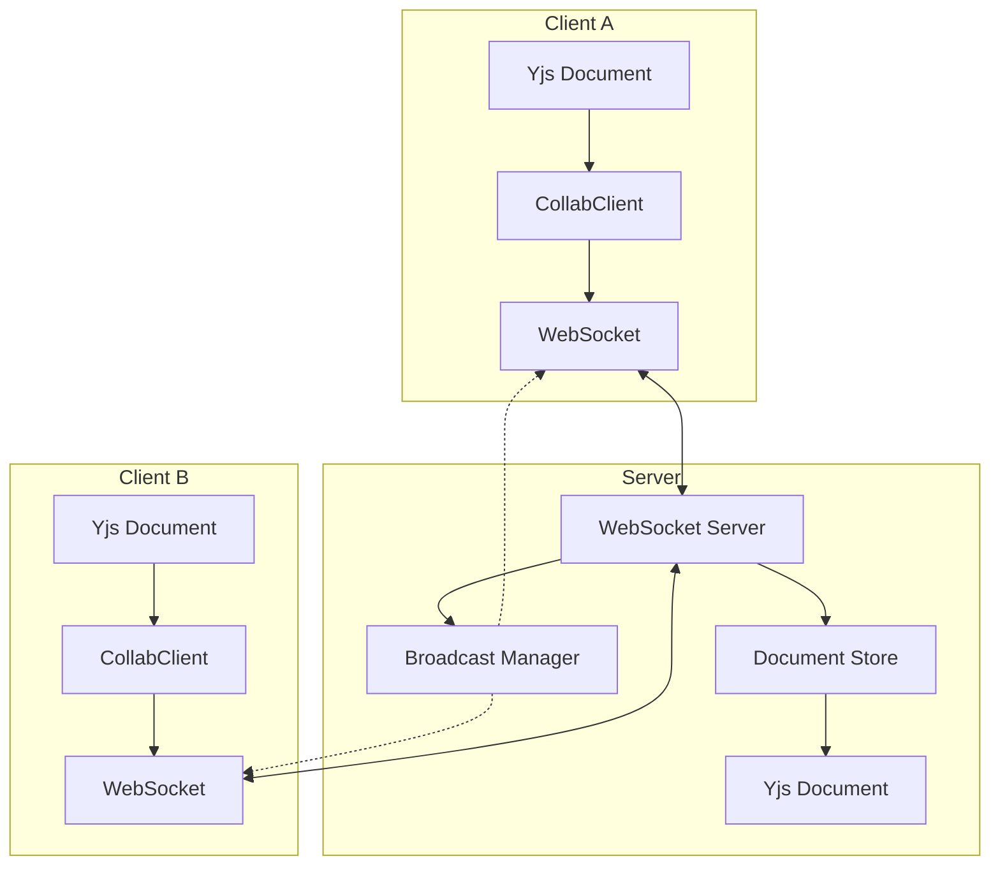

# How to Build Real-Time Collaborative Editing in Node.js

Author: [nawazdhandala](https://www.github.com/nawazdhandala)

Tags: Real-Time, Collaborative Editing, Node.js, WebSocket, CRDT, OT, Yjs, Socket.io

Description: Learn how to build real-time collaborative editing features in Node.js using CRDTs and WebSockets. This guide covers conflict resolution, operational transformation alternatives, and practical implementation with Yjs.

---

> Real-time collaborative editing allows multiple users to work on the same document simultaneously, seeing each other's changes instantly. This feature powers tools like Google Docs, Figma, and Notion. Building it yourself requires solving complex problems around conflict resolution and network synchronization.

The challenge with collaborative editing is not just sending updates between users. It is ensuring that when two people edit the same content at the same time, the result is consistent for everyone without losing any changes. This guide shows you how to build this using Conflict-free Replicated Data Types (CRDTs) with the Yjs library.

---

## Prerequisites

Before starting, you should have:
- Node.js 18 or higher
- Basic understanding of WebSockets
- Familiarity with TypeScript
- A code editor with good TypeScript support

---

## Understanding the Problem

When two users edit a document simultaneously, their changes can conflict. Consider this scenario:

```
Original text: "Hello World"

User A deletes "World" -> "Hello "
User B changes "World" to "Universe" -> "Hello Universe"

What should the final result be?
```

There are two main approaches to solving this:

1. **Operational Transformation (OT)**: Transform operations based on concurrent changes. Used by Google Docs.
2. **CRDTs**: Data structures that automatically merge without conflicts. Used by Figma and many modern apps.

We will use CRDTs because they are easier to implement correctly and work better in peer-to-peer scenarios.

---

## Project Setup

Create a new project with the required dependencies.

```bash
mkdir collab-editor
cd collab-editor
npm init -y
npm install yjs y-websocket ws express uuid
npm install -D typescript @types/node @types/ws @types/express ts-node nodemon
npx tsc --init
```

Update your tsconfig.json for modern Node.js development.

```json
{
  "compilerOptions": {
    "target": "ES2022",
    "module": "commonjs",
    "lib": ["ES2022"],
    "outDir": "./dist",
    "rootDir": "./src",
    "strict": true,
    "esModuleInterop": true,
    "skipLibCheck": true
  },
  "include": ["src/**/*"]
}
```

---

## Understanding Yjs

Yjs is a CRDT implementation that provides shared data types. These types automatically handle conflicts when multiple users make concurrent edits.

```typescript
// src/understanding-yjs.ts
import * as Y from 'yjs';

// Create a Yjs document - this is the collaborative state container
const doc = new Y.Doc();

// Get a shared text type - changes sync automatically
const yText = doc.getText('content');

// Insert text at position 0
yText.insert(0, 'Hello ');

// Insert more text at the end
yText.insert(6, 'World');

console.log(yText.toString()); // "Hello World"

// Observe changes to the text
yText.observe(event => {
  console.log('Text changed:', event.changes);
});

// Delete 5 characters starting at position 6
yText.delete(6, 5);

console.log(yText.toString()); // "Hello "

// Yjs also supports other shared types
const yArray = doc.getArray('items');
const yMap = doc.getMap('metadata');

// Array operations
yArray.push(['item1', 'item2']);
yArray.insert(1, ['inserted']);

// Map operations
yMap.set('author', 'John');
yMap.set('lastModified', new Date().toISOString());
```

---

## Building the WebSocket Server

Create a WebSocket server that synchronizes Yjs documents between clients.

```typescript
// src/server/websocket-server.ts
import * as Y from 'yjs';
import * as ws from 'ws';
import * as http from 'http';
import { v4 as uuidv4 } from 'uuid';

// Store documents by room/document ID
const documents = new Map<string, Y.Doc>();

// Track connected clients per document
const documentClients = new Map<string, Set<ws.WebSocket>>();

// Message types for the sync protocol
interface SyncMessage {
  type: 'sync-step-1' | 'sync-step-2' | 'update' | 'awareness';
  documentId: string;
  data?: Uint8Array;
  clientId?: string;
}

// Get or create a document for a room
function getDocument(documentId: string): Y.Doc {
  let doc = documents.get(documentId);

  if (!doc) {
    doc = new Y.Doc();
    documents.set(documentId, doc);

    // Set up persistence or initial content here if needed
    const yText = doc.getText('content');
    if (yText.length === 0) {
      yText.insert(0, '# Welcome\n\nStart typing to collaborate...\n');
    }

    console.log(`Created new document: ${documentId}`);
  }

  return doc;
}

// Broadcast update to all clients except sender
function broadcastUpdate(
  documentId: string,
  update: Uint8Array,
  excludeClient?: ws.WebSocket
): void {
  const clients = documentClients.get(documentId);
  if (!clients) return;

  const message: SyncMessage = {
    type: 'update',
    documentId,
    data: update,
  };

  const encoded = JSON.stringify({
    ...message,
    data: Array.from(update), // Convert Uint8Array for JSON
  });

  clients.forEach(client => {
    if (client !== excludeClient && client.readyState === ws.WebSocket.OPEN) {
      client.send(encoded);
    }
  });
}

// Handle a new WebSocket connection
function handleConnection(socket: ws.WebSocket, documentId: string): void {
  const clientId = uuidv4();
  console.log(`Client ${clientId} connected to document ${documentId}`);

  // Add client to the document's client set
  if (!documentClients.has(documentId)) {
    documentClients.set(documentId, new Set());
  }
  documentClients.get(documentId)!.add(socket);

  const doc = getDocument(documentId);

  // Send initial document state to the new client
  const initialState = Y.encodeStateAsUpdate(doc);
  const initMessage: SyncMessage = {
    type: 'sync-step-1',
    documentId,
    data: initialState,
    clientId,
  };

  socket.send(JSON.stringify({
    ...initMessage,
    data: Array.from(initialState),
  }));

  // Handle incoming messages from this client
  socket.on('message', (rawMessage: ws.RawData) => {
    try {
      const message = JSON.parse(rawMessage.toString());

      if (message.type === 'update' && message.data) {
        // Convert array back to Uint8Array
        const update = new Uint8Array(message.data);

        // Apply update to server document
        Y.applyUpdate(doc, update);

        // Broadcast to other clients
        broadcastUpdate(documentId, update, socket);

        console.log(`Applied update from client ${clientId}, doc size: ${doc.getText('content').length}`);
      }
    } catch (error) {
      console.error('Error processing message:', error);
    }
  });

  // Clean up when client disconnects
  socket.on('close', () => {
    console.log(`Client ${clientId} disconnected from ${documentId}`);
    documentClients.get(documentId)?.delete(socket);

    // Clean up empty document client sets
    if (documentClients.get(documentId)?.size === 0) {
      documentClients.delete(documentId);
      // Optionally persist and remove the document after timeout
    }
  });

  socket.on('error', (error) => {
    console.error(`WebSocket error for client ${clientId}:`, error);
  });
}

// Create and start the server
export function createServer(port: number): http.Server {
  const server = http.createServer();
  const wss = new ws.WebSocketServer({ server });

  wss.on('connection', (socket, request) => {
    // Extract document ID from URL path: /doc/{documentId}
    const url = new URL(request.url || '', `http://localhost:${port}`);
    const pathParts = url.pathname.split('/');
    const documentId = pathParts[2] || 'default';

    handleConnection(socket, documentId);
  });

  server.listen(port, () => {
    console.log(`Collaborative editing server running on port ${port}`);
  });

  return server;
}

// Start the server if this file is run directly
if (require.main === module) {
  createServer(3001);
}
```

---

## Building the Client Library

Create a client that connects to the server and synchronizes a local Yjs document.

```typescript
// src/client/collab-client.ts
import * as Y from 'yjs';
import WebSocket from 'ws';

interface CollabClientOptions {
  serverUrl: string;
  documentId: string;
  onSync?: () => void;
  onUpdate?: (update: Uint8Array) => void;
  onDisconnect?: () => void;
}

export class CollabClient {
  private doc: Y.Doc;
  private socket: WebSocket | null = null;
  private options: CollabClientOptions;
  private reconnectTimeout: NodeJS.Timeout | null = null;
  private isConnected = false;

  constructor(options: CollabClientOptions) {
    this.options = options;
    this.doc = new Y.Doc();

    // Listen for local changes and send to server
    this.doc.on('update', (update: Uint8Array, origin: any) => {
      // Only send updates that originated locally
      if (origin !== 'remote' && this.isConnected) {
        this.sendUpdate(update);
      }
    });
  }

  // Connect to the collaboration server
  connect(): Promise<void> {
    return new Promise((resolve, reject) => {
      const url = `${this.options.serverUrl}/doc/${this.options.documentId}`;

      this.socket = new WebSocket(url);

      this.socket.on('open', () => {
        console.log('Connected to collaboration server');
        this.isConnected = true;

        if (this.reconnectTimeout) {
          clearTimeout(this.reconnectTimeout);
          this.reconnectTimeout = null;
        }
      });

      this.socket.on('message', (data: Buffer) => {
        try {
          const message = JSON.parse(data.toString());
          this.handleMessage(message);

          // Resolve on first sync
          if (message.type === 'sync-step-1') {
            resolve();
          }
        } catch (error) {
          console.error('Error parsing message:', error);
        }
      });

      this.socket.on('close', () => {
        console.log('Disconnected from server');
        this.isConnected = false;
        this.options.onDisconnect?.();
        this.scheduleReconnect();
      });

      this.socket.on('error', (error) => {
        console.error('WebSocket error:', error);
        reject(error);
      });
    });
  }

  // Handle incoming messages from server
  private handleMessage(message: any): void {
    if (!message.data) return;

    // Convert array back to Uint8Array
    const update = new Uint8Array(message.data);

    switch (message.type) {
      case 'sync-step-1':
        // Initial state from server
        Y.applyUpdate(this.doc, update, 'remote');
        console.log('Received initial document state');
        this.options.onSync?.();
        break;

      case 'update':
        // Update from another client
        Y.applyUpdate(this.doc, update, 'remote');
        this.options.onUpdate?.(update);
        break;
    }
  }

  // Send a local update to the server
  private sendUpdate(update: Uint8Array): void {
    if (!this.socket || this.socket.readyState !== WebSocket.OPEN) {
      console.warn('Cannot send update: not connected');
      return;
    }

    const message = {
      type: 'update',
      documentId: this.options.documentId,
      data: Array.from(update),
    };

    this.socket.send(JSON.stringify(message));
  }

  // Attempt to reconnect after disconnection
  private scheduleReconnect(): void {
    if (this.reconnectTimeout) return;

    this.reconnectTimeout = setTimeout(() => {
      console.log('Attempting to reconnect...');
      this.connect().catch(error => {
        console.error('Reconnection failed:', error);
        this.scheduleReconnect();
      });
    }, 3000);
  }

  // Get the shared text content
  getText(name: string = 'content'): Y.Text {
    return this.doc.getText(name);
  }

  // Get the shared map
  getMap(name: string): Y.Map<any> {
    return this.doc.getMap(name);
  }

  // Get the shared array
  getArray(name: string): Y.Array<any> {
    return this.doc.getArray(name);
  }

  // Get the underlying Yjs document
  getDoc(): Y.Doc {
    return this.doc;
  }

  // Disconnect from the server
  disconnect(): void {
    if (this.reconnectTimeout) {
      clearTimeout(this.reconnectTimeout);
    }

    if (this.socket) {
      this.socket.close();
      this.socket = null;
    }

    this.isConnected = false;
  }
}
```

---

## Adding Awareness for User Presence

Awareness lets users see who else is editing and where their cursors are.

```typescript
// src/client/awareness.ts
import * as Y from 'yjs';

export interface UserState {
  id: string;
  name: string;
  color: string;
  cursor?: {
    index: number;
    length: number;
  };
}

export class AwarenessManager {
  private states = new Map<string, UserState>();
  private localUser: UserState;
  private onChange?: (users: UserState[]) => void;

  constructor(userId: string, userName: string) {
    // Generate a random color for this user
    const colors = ['#FF6B6B', '#4ECDC4', '#45B7D1', '#96CEB4', '#FFEAA7', '#DDA0DD'];
    const color = colors[Math.floor(Math.random() * colors.length)];

    this.localUser = {
      id: userId,
      name: userName,
      color,
    };

    this.states.set(userId, this.localUser);
  }

  // Update local user cursor position
  updateCursor(index: number, length: number = 0): void {
    this.localUser.cursor = { index, length };
    this.states.set(this.localUser.id, { ...this.localUser });
    this.notifyChange();
  }

  // Update remote user state
  updateRemoteUser(user: UserState): void {
    this.states.set(user.id, user);
    this.notifyChange();
  }

  // Remove a user when they disconnect
  removeUser(userId: string): void {
    this.states.delete(userId);
    this.notifyChange();
  }

  // Get all active users
  getUsers(): UserState[] {
    return Array.from(this.states.values());
  }

  // Get local user state for sending to server
  getLocalState(): UserState {
    return { ...this.localUser };
  }

  // Register callback for state changes
  onUsersChange(callback: (users: UserState[]) => void): void {
    this.onChange = callback;
  }

  private notifyChange(): void {
    this.onChange?.(this.getUsers());
  }
}
```

---

## Building a Simple Text Editor Interface

Here is a simple example that ties everything together.

```typescript
// src/example/editor-demo.ts
import { CollabClient } from '../client/collab-client';
import { AwarenessManager } from '../client/awareness';
import * as readline from 'readline';

async function runDemo() {
  const documentId = 'demo-document';
  const userName = process.argv[2] || `User-${Math.floor(Math.random() * 1000)}`;

  console.log(`Starting editor as: ${userName}`);
  console.log('Commands: type text to insert, /delete N to delete N chars, /show to display, /quit to exit\n');

  // Create the collaborative client
  const client = new CollabClient({
    serverUrl: 'ws://localhost:3001',
    documentId,
    onSync: () => {
      console.log('\n--- Document synced ---');
      console.log(client.getText().toString());
      console.log('--- End of document ---\n');
    },
    onUpdate: () => {
      console.log('\n--- Remote update received ---');
      console.log(client.getText().toString());
      console.log('--- End of document ---\n');
    },
    onDisconnect: () => {
      console.log('Disconnected from server, attempting to reconnect...');
    },
  });

  // Create awareness manager for presence
  const awareness = new AwarenessManager(
    Math.random().toString(36).substring(7),
    userName
  );

  // Connect to the server
  try {
    await client.connect();
    console.log('Connected successfully!\n');
  } catch (error) {
    console.error('Failed to connect:', error);
    process.exit(1);
  }

  // Get the shared text
  const yText = client.getText();

  // Track cursor position
  let cursorPosition = yText.length;

  // Set up command line interface
  const rl = readline.createInterface({
    input: process.stdin,
    output: process.stdout,
  });

  rl.on('line', (input) => {
    if (input === '/quit') {
      client.disconnect();
      rl.close();
      process.exit(0);
    }

    if (input === '/show') {
      console.log('\n--- Current document ---');
      console.log(yText.toString());
      console.log(`--- Length: ${yText.length}, Cursor: ${cursorPosition} ---\n`);
      return;
    }

    if (input.startsWith('/delete ')) {
      const count = parseInt(input.split(' ')[1], 10);
      if (!isNaN(count) && count > 0 && cursorPosition >= count) {
        yText.delete(cursorPosition - count, count);
        cursorPosition -= count;
        console.log(`Deleted ${count} characters`);
      }
      return;
    }

    if (input.startsWith('/goto ')) {
      const pos = parseInt(input.split(' ')[1], 10);
      if (!isNaN(pos) && pos >= 0 && pos <= yText.length) {
        cursorPosition = pos;
        awareness.updateCursor(cursorPosition);
        console.log(`Cursor moved to position ${cursorPosition}`);
      }
      return;
    }

    // Default: insert text at cursor position
    yText.insert(cursorPosition, input + '\n');
    cursorPosition += input.length + 1;
    awareness.updateCursor(cursorPosition);
    console.log(`Inserted "${input}" at position ${cursorPosition - input.length - 1}`);
  });

  // Observe text changes
  yText.observe((event) => {
    // Update cursor position based on changes
    event.changes.delta.forEach((change: any) => {
      if (change.retain) {
        // No position change needed
      } else if (change.insert) {
        // Text was inserted before cursor
        const insertLength = typeof change.insert === 'string'
          ? change.insert.length
          : 1;
        // Cursor adjustment handled by the change origin
      } else if (change.delete) {
        // Text was deleted
      }
    });
  });

  console.log('Ready! Start typing...\n');
}

runDemo().catch(console.error);
```

---

## Architecture Overview

Here is how the components work together:



---

## Running the Example

Start the server and run multiple clients to see collaboration in action.

```bash
# Terminal 1: Start the server
npx ts-node src/server/websocket-server.ts

# Terminal 2: Start first client
npx ts-node src/example/editor-demo.ts Alice

# Terminal 3: Start second client
npx ts-node src/example/editor-demo.ts Bob
```

Type in either terminal and watch the changes appear in both. The CRDT ensures that even if both users type at the same time, the results merge correctly.

---

## Production Considerations

When deploying collaborative editing to production, consider these aspects:

1. **Persistence**: Save documents to a database periodically and on server shutdown
2. **Scaling**: Use a message broker like Redis to sync between multiple server instances
3. **Authentication**: Verify user identity and document access permissions
4. **Rate limiting**: Prevent abuse by limiting update frequency
5. **Compression**: Yjs updates can be compressed for bandwidth efficiency
6. **Offline support**: Yjs works offline and syncs when reconnected

---

## Conclusion

Building real-time collaborative editing is complex, but libraries like Yjs handle the hardest parts. CRDTs provide automatic conflict resolution that works reliably across network partitions and high-latency connections.

The key components are:
- A CRDT library (Yjs) for conflict-free data synchronization
- WebSockets for real-time communication
- A server that relays updates between clients
- Awareness features for user presence and cursors

Start with a simple text editor and expand to richer document types as you understand the patterns better.

---

*Need to monitor your collaborative editing infrastructure? [OneUptime](https://oneuptime.com) tracks WebSocket connection health, latency, and sync failures so you can keep your users collaborating smoothly.*
