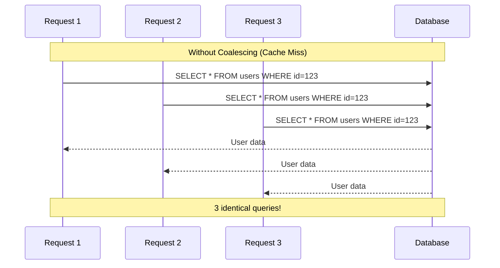
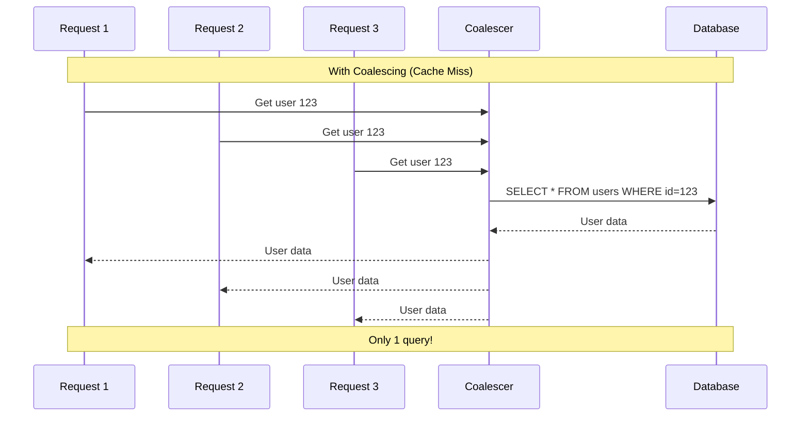

# How to Reduce DB Load with Request Coalescing in Python

Author: [nawazdhandala](https://www.github.com/nawazdhandala)

Tags: Python, Request Coalescing, Database, Performance, Async, Caching, Optimization, Scalability

Description: Learn how to implement request coalescing in Python to dramatically reduce database load. When multiple concurrent requests need the same data, coalescing ensures only one database query is made while all requesters share the result.

---

> Request coalescing, also known as request deduplication or single-flighting, is a technique where concurrent requests for the same resource are merged into a single backend call. Instead of ten requests hitting your database, one request fetches the data and ten clients receive the result.

This pattern is incredibly effective for reducing load on databases, caches, and external APIs. It is especially valuable during traffic spikes when many users request the same popular content simultaneously.

---

## The Problem: Thundering Herd

Consider what happens when a cache entry expires and 100 concurrent requests arrive for the same data:



With coalescing, only one query executes:



---

## Basic Coalescer Implementation

Let us build a coalescer from scratch. The core idea is simple: track in-flight requests by key, and when a duplicate request arrives, have it wait for the existing request instead of starting a new one.

```python
# coalescer.py
# Request coalescing to prevent duplicate concurrent database calls
import asyncio
from typing import TypeVar, Generic, Callable, Awaitable, Dict, Optional
from dataclasses import dataclass
from datetime import datetime, timedelta

T = TypeVar('T')

@dataclass
class InFlightRequest(Generic[T]):
    """Tracks an in-flight request and its waiters"""
    future: asyncio.Future
    created_at: datetime
    waiter_count: int = 1

class RequestCoalescer(Generic[T]):
    """
    Coalesces concurrent requests for the same key.
    Only one actual request is made while others wait for the result.
    """

    def __init__(self, timeout_seconds: float = 30.0):
        self.timeout_seconds = timeout_seconds
        self.in_flight: Dict[str, InFlightRequest] = {}
        self.lock = asyncio.Lock()

    async def execute(
        self,
        key: str,
        fetch_func: Callable[[], Awaitable[T]]
    ) -> T:
        """
        Execute a request with coalescing.
        If another request for the same key is in flight, wait for it.
        Otherwise, execute the fetch function and share the result.
        """
        async with self.lock:
            # Check if there is already an in-flight request for this key
            if key in self.in_flight:
                in_flight = self.in_flight[key]
                in_flight.waiter_count += 1
                future = in_flight.future
            else:
                # No in-flight request - we will make the actual call
                future = asyncio.get_event_loop().create_future()
                self.in_flight[key] = InFlightRequest(
                    future=future,
                    created_at=datetime.utcnow()
                )
                # Release lock and execute the fetch
                asyncio.create_task(self._execute_fetch(key, fetch_func, future))

        # Wait for the result (whether we initiated it or not)
        try:
            result = await asyncio.wait_for(future, timeout=self.timeout_seconds)
            return result
        except asyncio.TimeoutError:
            # Clean up on timeout
            async with self.lock:
                if key in self.in_flight:
                    del self.in_flight[key]
            raise

    async def _execute_fetch(
        self,
        key: str,
        fetch_func: Callable[[], Awaitable[T]],
        future: asyncio.Future
    ):
        """Execute the actual fetch and resolve the future"""
        try:
            result = await fetch_func()
            future.set_result(result)
        except Exception as e:
            future.set_exception(e)
        finally:
            # Clean up the in-flight tracking
            async with self.lock:
                if key in self.in_flight:
                    del self.in_flight[key]

    def get_stats(self) -> Dict:
        """Get statistics about in-flight requests"""
        return {
            "in_flight_count": len(self.in_flight),
            "requests": {
                key: {
                    "waiter_count": req.waiter_count,
                    "age_seconds": (datetime.utcnow() - req.created_at).total_seconds()
                }
                for key, req in self.in_flight.items()
            }
        }
```

---

## Using the Coalescer

Here is how to use the coalescer with a database query:

```python
# usage_example.py
# Example usage of request coalescing with a database
import asyncio
import asyncpg
from coalescer import RequestCoalescer

# Create a coalescer instance - typically one per resource type
user_coalescer = RequestCoalescer()

class UserRepository:
    """Repository with request coalescing for database queries"""

    def __init__(self, pool: asyncpg.Pool):
        self.pool = pool
        self.coalescer = RequestCoalescer(timeout_seconds=30.0)

    async def get_user(self, user_id: int) -> dict:
        """
        Get a user by ID with coalescing.
        Concurrent requests for the same user share a single DB query.
        """
        # Create a coalescing key that identifies this specific request
        key = f"user:{user_id}"

        # Define the actual fetch function
        async def fetch():
            async with self.pool.acquire() as conn:
                row = await conn.fetchrow(
                    "SELECT * FROM users WHERE id = $1",
                    user_id
                )
                return dict(row) if row else None

        # Execute with coalescing
        return await self.coalescer.execute(key, fetch)

    async def get_user_with_posts(self, user_id: int) -> dict:
        """
        Get a user with their recent posts.
        Different query, different coalescing key.
        """
        key = f"user_with_posts:{user_id}"

        async def fetch():
            async with self.pool.acquire() as conn:
                user = await conn.fetchrow(
                    "SELECT * FROM users WHERE id = $1",
                    user_id
                )
                posts = await conn.fetch(
                    "SELECT * FROM posts WHERE user_id = $1 ORDER BY created_at DESC LIMIT 10",
                    user_id
                )
                return {
                    "user": dict(user) if user else None,
                    "posts": [dict(p) for p in posts]
                }

        return await self.coalescer.execute(key, fetch)

# Demonstration of coalescing in action
async def demo_coalescing():
    """Show how coalescing reduces database calls"""
    pool = await asyncpg.create_pool("postgresql://localhost/mydb")
    repo = UserRepository(pool)

    # Simulate 10 concurrent requests for the same user
    # Without coalescing: 10 database queries
    # With coalescing: 1 database query
    tasks = [repo.get_user(123) for _ in range(10)]
    results = await asyncio.gather(*tasks)

    print(f"Got {len(results)} results from 1 database query")

    await pool.close()
```

---

## Coalescer with Caching

For even better performance, combine coalescing with a short-lived cache. The cache handles repeated requests over time, while coalescing handles concurrent requests at the same instant.

```python
# coalescer_with_cache.py
# Request coalescing combined with TTL-based caching
import asyncio
from typing import TypeVar, Generic, Callable, Awaitable, Dict, Optional, Tuple
from dataclasses import dataclass
from datetime import datetime, timedelta
import time

T = TypeVar('T')

@dataclass
class CacheEntry(Generic[T]):
    """A cached value with expiration"""
    value: T
    expires_at: float  # Unix timestamp

    def is_expired(self) -> bool:
        return time.time() >= self.expires_at

class CachingCoalescer(Generic[T]):
    """
    Combines request coalescing with TTL-based caching.
    - Cache hit: Return immediately
    - Cache miss with in-flight request: Wait for existing request
    - Cache miss without in-flight: Execute and cache the result
    """

    def __init__(
        self,
        default_ttl_seconds: float = 60.0,
        timeout_seconds: float = 30.0,
        max_cache_size: int = 10000
    ):
        self.default_ttl_seconds = default_ttl_seconds
        self.timeout_seconds = timeout_seconds
        self.max_cache_size = max_cache_size

        self.cache: Dict[str, CacheEntry] = {}
        self.in_flight: Dict[str, asyncio.Future] = {}
        self.lock = asyncio.Lock()

        # Stats
        self.hits = 0
        self.misses = 0
        self.coalesced = 0

    async def get(
        self,
        key: str,
        fetch_func: Callable[[], Awaitable[T]],
        ttl_seconds: Optional[float] = None
    ) -> T:
        """
        Get a value with caching and coalescing.
        """
        ttl = ttl_seconds or self.default_ttl_seconds

        # Fast path: check cache without lock
        if key in self.cache and not self.cache[key].is_expired():
            self.hits += 1
            return self.cache[key].value

        async with self.lock:
            # Double-check cache under lock
            if key in self.cache and not self.cache[key].is_expired():
                self.hits += 1
                return self.cache[key].value

            # Cache miss - check for in-flight request
            if key in self.in_flight:
                self.coalesced += 1
                future = self.in_flight[key]
            else:
                # No in-flight request - create one
                self.misses += 1
                future = asyncio.get_event_loop().create_future()
                self.in_flight[key] = future
                asyncio.create_task(self._fetch_and_cache(key, fetch_func, future, ttl))

        # Wait for result
        return await asyncio.wait_for(future, timeout=self.timeout_seconds)

    async def _fetch_and_cache(
        self,
        key: str,
        fetch_func: Callable[[], Awaitable[T]],
        future: asyncio.Future,
        ttl_seconds: float
    ):
        """Fetch value, cache it, and resolve waiters"""
        try:
            value = await fetch_func()

            # Store in cache
            self._evict_if_needed()
            self.cache[key] = CacheEntry(
                value=value,
                expires_at=time.time() + ttl_seconds
            )

            future.set_result(value)

        except Exception as e:
            future.set_exception(e)
        finally:
            async with self.lock:
                if key in self.in_flight:
                    del self.in_flight[key]

    def _evict_if_needed(self):
        """Evict expired entries or oldest if cache is full"""
        # Remove expired entries
        now = time.time()
        expired_keys = [k for k, v in self.cache.items() if v.expires_at <= now]
        for key in expired_keys:
            del self.cache[key]

        # If still over limit, remove oldest entries
        if len(self.cache) >= self.max_cache_size:
            sorted_keys = sorted(
                self.cache.keys(),
                key=lambda k: self.cache[k].expires_at
            )
            for key in sorted_keys[:len(sorted_keys) // 4]:
                del self.cache[key]

    def invalidate(self, key: str):
        """Remove a key from the cache"""
        if key in self.cache:
            del self.cache[key]

    def invalidate_prefix(self, prefix: str):
        """Remove all keys matching a prefix"""
        keys_to_remove = [k for k in self.cache.keys() if k.startswith(prefix)]
        for key in keys_to_remove:
            del self.cache[key]

    def get_stats(self) -> Dict:
        """Get cache and coalescing statistics"""
        total = self.hits + self.misses
        hit_rate = self.hits / total if total > 0 else 0

        return {
            "cache_size": len(self.cache),
            "in_flight_count": len(self.in_flight),
            "hits": self.hits,
            "misses": self.misses,
            "coalesced": self.coalesced,
            "hit_rate": hit_rate
        }
```

---

## FastAPI Integration

Here is a complete FastAPI application using the caching coalescer:

```python
# fastapi_coalescer.py
# FastAPI application with request coalescing
from fastapi import FastAPI, HTTPException, Depends
from contextlib import asynccontextmanager
import asyncpg
from coalescer_with_cache import CachingCoalescer

# Global instances
db_pool: asyncpg.Pool = None
user_cache = CachingCoalescer(default_ttl_seconds=300)  # 5 min cache
product_cache = CachingCoalescer(default_ttl_seconds=60)  # 1 min cache

@asynccontextmanager
async def lifespan(app: FastAPI):
    """Setup and teardown"""
    global db_pool
    db_pool = await asyncpg.create_pool(
        "postgresql://localhost/mydb",
        min_size=5,
        max_size=20
    )
    yield
    await db_pool.close()

app = FastAPI(lifespan=lifespan)

@app.get("/users/{user_id}")
async def get_user(user_id: int):
    """
    Get a user by ID.
    Uses caching coalescer to prevent duplicate database queries.
    """
    key = f"user:{user_id}"

    async def fetch():
        async with db_pool.acquire() as conn:
            row = await conn.fetchrow(
                "SELECT id, name, email, created_at FROM users WHERE id = $1",
                user_id
            )
            if not row:
                raise HTTPException(status_code=404, detail="User not found")
            return dict(row)

    return await user_cache.get(key, fetch)

@app.get("/products/{product_id}")
async def get_product(product_id: int):
    """
    Get a product by ID with shorter cache TTL.
    Product data changes more frequently than user data.
    """
    key = f"product:{product_id}"

    async def fetch():
        async with db_pool.acquire() as conn:
            row = await conn.fetchrow(
                "SELECT * FROM products WHERE id = $1",
                product_id
            )
            if not row:
                raise HTTPException(status_code=404, detail="Product not found")
            return dict(row)

    # Shorter TTL for products
    return await product_cache.get(key, fetch, ttl_seconds=30)

@app.put("/users/{user_id}")
async def update_user(user_id: int, data: dict):
    """
    Update a user and invalidate the cache.
    """
    async with db_pool.acquire() as conn:
        await conn.execute(
            "UPDATE users SET name = $1, email = $2 WHERE id = $3",
            data.get("name"),
            data.get("email"),
            user_id
        )

    # Invalidate cache after update
    user_cache.invalidate(f"user:{user_id}")

    return {"status": "updated"}

@app.delete("/cache/users")
async def clear_user_cache():
    """Admin endpoint to clear user cache"""
    user_cache.invalidate_prefix("user:")
    return {"status": "cleared"}

@app.get("/stats/cache")
async def cache_stats():
    """Get cache statistics for monitoring"""
    return {
        "user_cache": user_cache.get_stats(),
        "product_cache": product_cache.get_stats()
    }
```

---

## Handling Edge Cases

### Negative Caching

Sometimes you want to cache "not found" results to prevent repeated database lookups for non-existent resources:

```python
# negative_caching.py
# Cache negative results (not found) to prevent repeated lookups
from typing import Optional

class NegativeCachingCoalescer(CachingCoalescer):
    """
    Extends CachingCoalescer to handle negative results.
    Caches "not found" with a shorter TTL.
    """

    def __init__(self, negative_ttl_seconds: float = 60.0, **kwargs):
        super().__init__(**kwargs)
        self.negative_ttl_seconds = negative_ttl_seconds

    async def get_or_none(
        self,
        key: str,
        fetch_func: Callable[[], Awaitable[Optional[T]]]
    ) -> Optional[T]:
        """
        Get a value, caching None results with shorter TTL.
        """
        # Check if we have a cached negative result
        negative_key = f"_negative:{key}"
        if negative_key in self.cache and not self.cache[negative_key].is_expired():
            return None

        async def fetch_with_negative_cache():
            result = await fetch_func()
            if result is None:
                # Cache the negative result
                self.cache[negative_key] = CacheEntry(
                    value=True,  # Just a marker
                    expires_at=time.time() + self.negative_ttl_seconds
                )
            return result

        return await self.get(key, fetch_with_negative_cache)
```

### Error Handling

When a coalesced request fails, all waiters receive the same exception. You might want to implement retry logic:

```python
# retry_coalescer.py
# Coalescer with retry logic for transient failures
import random

class RetryingCoalescer(CachingCoalescer):
    """
    Coalescer that retries on transient failures.
    Uses exponential backoff with jitter.
    """

    def __init__(self, max_retries: int = 3, **kwargs):
        super().__init__(**kwargs)
        self.max_retries = max_retries

    async def get_with_retry(
        self,
        key: str,
        fetch_func: Callable[[], Awaitable[T]],
        retryable_exceptions: tuple = (Exception,)
    ) -> T:
        """
        Get with automatic retry on failure.
        """
        async def fetch_with_retry():
            last_exception = None

            for attempt in range(self.max_retries):
                try:
                    return await fetch_func()
                except retryable_exceptions as e:
                    last_exception = e
                    if attempt < self.max_retries - 1:
                        # Exponential backoff with jitter
                        delay = (2 ** attempt) + random.uniform(0, 1)
                        await asyncio.sleep(delay)

            raise last_exception

        return await self.get(key, fetch_with_retry)
```

---

## Best Practices

### 1. Choose Coalescing Keys Carefully

```python
# Good: Specific key for the exact query
key = f"user:{user_id}"

# Bad: Generic key that might collide
key = f"{user_id}"  # Could conflict with other ID types
```

### 2. Monitor Hit Rates

```python
# Track and alert on cache performance
@app.get("/health")
async def health():
    stats = user_cache.get_stats()
    if stats["hit_rate"] < 0.5:
        return {"status": "degraded", "reason": "low cache hit rate"}
    return {"status": "healthy"}
```

### 3. Invalidate on Writes

```python
# Always invalidate cache when data changes
async def update_user(user_id: int, data: dict):
    await db.execute("UPDATE users SET ...", ...)
    user_cache.invalidate(f"user:{user_id}")
```

---

## Conclusion

Request coalescing is a simple but powerful technique for reducing backend load. By ensuring that concurrent requests for the same data share a single database query, you can handle traffic spikes gracefully without overwhelming your database. Combined with TTL-based caching, this pattern provides both instant scalability during concurrent bursts and sustained performance over time.

---

*Need to monitor your cache hit rates and database load? [OneUptime](https://oneuptime.com) provides real-time monitoring with alerts when your caching efficiency drops.*

**Related Reading:**
- [How to Build a Data Aggregation Service in Python](https://oneuptime.com/blog/post/2026-01-24-data-aggregation-service-python/view)
- [How to Implement Token Bucket Rate Limiting in Python](https://oneuptime.com/blog/post/2026-01-22-token-bucket-rate-limiting-python/view)
