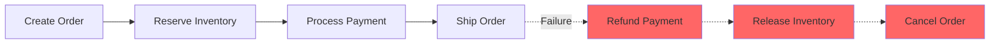

# How to Implement Saga Pattern in Python

Author: [nawazdhandala](https://www.github.com/nawazdhandala)

Tags: Python, Saga Pattern, Distributed Systems, Microservices, Transactions, Event-Driven Architecture

Description: Learn how to implement the Saga pattern in Python to manage distributed transactions across microservices. This guide covers choreography and orchestration approaches with practical, production-ready code examples.

---

> Distributed transactions are hard. The Saga pattern solves this by breaking a transaction into a series of local transactions, each with a compensating action if things go wrong. This guide shows you how to implement both orchestration and choreography sagas in Python.

When you split a monolith into microservices, you lose the ability to wrap operations in a single database transaction. The Saga pattern provides eventual consistency by coordinating transactions across services with automatic rollback on failures.

---

## Understanding the Saga Pattern

A saga is a sequence of local transactions. If one step fails, compensating transactions undo the previous steps.



### Two Approaches

| Approach | How It Works | Best For |
|----------|--------------|----------|
| **Orchestration** | Central coordinator controls steps | Complex workflows, visibility |
| **Choreography** | Services react to events | Simple workflows, loose coupling |

---

## Saga Step Definition

First, let's define the building blocks for saga steps.

```python
# saga_core.py
# Core definitions for Saga pattern implementation
from dataclasses import dataclass, field
from typing import Callable, Any, Optional, Dict, List
from enum import Enum
from abc import ABC, abstractmethod
import uuid
from datetime import datetime

class SagaStatus(Enum):
    """Possible states for a saga execution"""
    PENDING = "pending"  # Not started
    RUNNING = "running"  # In progress
    COMPLETED = "completed"  # All steps succeeded
    COMPENSATING = "compensating"  # Rolling back
    FAILED = "failed"  # Completed with failure
    COMPENSATED = "compensated"  # Successfully rolled back

@dataclass
class SagaStep:
    """
    Represents a single step in a saga.

    Each step has:
    - name: Identifier for the step
    - action: Function to execute the step
    - compensation: Function to undo the step if later steps fail
    """
    name: str
    action: Callable[[Dict[str, Any]], Any]  # Execute the step
    compensation: Callable[[Dict[str, Any]], Any]  # Undo the step
    timeout_seconds: float = 30.0  # Max time for step execution

@dataclass
class SagaContext:
    """
    Holds state during saga execution.

    The context is passed to each step and accumulates results.
    This allows steps to access data from previous steps.
    """
    saga_id: str = field(default_factory=lambda: str(uuid.uuid4()))
    data: Dict[str, Any] = field(default_factory=dict)  # Input data
    results: Dict[str, Any] = field(default_factory=dict)  # Step outputs
    completed_steps: List[str] = field(default_factory=list)  # For compensation
    started_at: datetime = field(default_factory=datetime.utcnow)
    status: SagaStatus = SagaStatus.PENDING

    def set_result(self, step_name: str, result: Any):
        """Store the result of a step"""
        self.results[step_name] = result
        self.completed_steps.append(step_name)

    def get_result(self, step_name: str) -> Optional[Any]:
        """Retrieve the result of a previous step"""
        return self.results.get(step_name)
```

---

## Orchestration-Based Saga

The orchestrator pattern uses a central coordinator that executes steps sequentially and handles compensation on failure.

```python
# saga_orchestrator.py
# Orchestration-based Saga implementation
from typing import List, Optional
import asyncio
import logging

logger = logging.getLogger(__name__)

class SagaOrchestrator:
    """
    Central coordinator for saga execution.

    The orchestrator:
    1. Executes steps in order
    2. Tracks completed steps
    3. Runs compensations in reverse order on failure
    """

    def __init__(self, steps: List[SagaStep]):
        self.steps = steps
        self._step_map = {step.name: step for step in steps}

    async def execute(self, initial_data: Dict[str, Any]) -> SagaContext:
        """
        Execute the saga with the given initial data.

        Args:
            initial_data: Input data for the saga

        Returns:
            SagaContext with final status and results
        """
        context = SagaContext(data=initial_data)
        context.status = SagaStatus.RUNNING

        logger.info(f"Starting saga {context.saga_id}")

        try:
            # Execute each step in order
            for step in self.steps:
                await self._execute_step(step, context)

            # All steps completed successfully
            context.status = SagaStatus.COMPLETED
            logger.info(f"Saga {context.saga_id} completed successfully")

        except Exception as e:
            logger.error(f"Saga {context.saga_id} failed at step: {e}")

            # Run compensations for completed steps
            await self._compensate(context)

        return context

    async def _execute_step(self, step: SagaStep, context: SagaContext):
        """Execute a single saga step with timeout"""
        logger.info(f"Executing step: {step.name}")

        try:
            # Run the step action with timeout
            result = await asyncio.wait_for(
                self._run_action(step.action, context),
                timeout=step.timeout_seconds
            )

            # Store result in context
            context.set_result(step.name, result)
            logger.info(f"Step {step.name} completed")

        except asyncio.TimeoutError:
            raise SagaStepError(f"Step {step.name} timed out")
        except Exception as e:
            raise SagaStepError(f"Step {step.name} failed: {str(e)}")

    async def _run_action(
        self,
        action: Callable,
        context: SagaContext
    ) -> Any:
        """Run an action, handling both sync and async functions"""
        result = action(context)

        # Await if the action is a coroutine
        if asyncio.iscoroutine(result):
            return await result
        return result

    async def _compensate(self, context: SagaContext):
        """Run compensation for all completed steps in reverse order"""
        context.status = SagaStatus.COMPENSATING
        logger.info(f"Starting compensation for saga {context.saga_id}")

        # Reverse through completed steps
        for step_name in reversed(context.completed_steps):
            step = self._step_map[step_name]

            try:
                logger.info(f"Compensating step: {step_name}")
                await self._run_action(step.compensation, context)
                logger.info(f"Compensation for {step_name} completed")

            except Exception as e:
                # Log but continue with other compensations
                logger.error(f"Compensation for {step_name} failed: {e}")

        context.status = SagaStatus.COMPENSATED
        logger.info(f"Saga {context.saga_id} compensated")

class SagaStepError(Exception):
    """Raised when a saga step fails"""
    pass
```

---

## Order Processing Saga Example

Here is a complete example implementing an e-commerce order saga.

```python
# order_saga.py
# E-commerce order processing saga
from dataclasses import dataclass
from typing import Optional
import httpx

@dataclass
class OrderData:
    """Order information for the saga"""
    customer_id: str
    items: List[dict]  # List of {product_id, quantity, price}
    total_amount: float
    shipping_address: str

# Define the saga steps

async def create_order(context: SagaContext) -> dict:
    """
    Step 1: Create the order in pending state.

    This creates a record of the order but doesn't finalize it.
    The order stays pending until all other steps complete.
    """
    order_data = context.data["order"]

    # Call order service to create pending order
    async with httpx.AsyncClient() as client:
        response = await client.post(
            "http://order-service/orders",
            json={
                "customer_id": order_data.customer_id,
                "items": order_data.items,
                "status": "pending"
            }
        )
        response.raise_for_status()
        return response.json()  # Returns {order_id: "..."}

async def compensate_create_order(context: SagaContext):
    """Compensation: Cancel the order"""
    order_id = context.get_result("create_order")["order_id"]

    async with httpx.AsyncClient() as client:
        await client.patch(
            f"http://order-service/orders/{order_id}",
            json={"status": "cancelled"}
        )

async def reserve_inventory(context: SagaContext) -> dict:
    """
    Step 2: Reserve inventory for order items.

    This puts a hold on the items so they can't be sold
    to someone else while we process payment.
    """
    order_data = context.data["order"]
    order_id = context.get_result("create_order")["order_id"]

    async with httpx.AsyncClient() as client:
        response = await client.post(
            "http://inventory-service/reservations",
            json={
                "order_id": order_id,
                "items": [
                    {"product_id": item["product_id"], "quantity": item["quantity"]}
                    for item in order_data.items
                ]
            }
        )
        response.raise_for_status()
        return response.json()  # Returns {reservation_id: "..."}

async def compensate_reserve_inventory(context: SagaContext):
    """Compensation: Release the inventory reservation"""
    reservation_id = context.get_result("reserve_inventory")["reservation_id"]

    async with httpx.AsyncClient() as client:
        await client.delete(
            f"http://inventory-service/reservations/{reservation_id}"
        )

async def process_payment(context: SagaContext) -> dict:
    """
    Step 3: Charge the customer's payment method.

    This is often the most critical step since it involves
    real money changing hands.
    """
    order_data = context.data["order"]
    order_id = context.get_result("create_order")["order_id"]

    async with httpx.AsyncClient() as client:
        response = await client.post(
            "http://payment-service/payments",
            json={
                "order_id": order_id,
                "customer_id": order_data.customer_id,
                "amount": order_data.total_amount,
                "currency": "USD"
            }
        )
        response.raise_for_status()
        return response.json()  # Returns {payment_id: "...", transaction_id: "..."}

async def compensate_process_payment(context: SagaContext):
    """Compensation: Refund the payment"""
    payment_result = context.get_result("process_payment")

    async with httpx.AsyncClient() as client:
        await client.post(
            f"http://payment-service/payments/{payment_result['payment_id']}/refund",
            json={"reason": "Order saga compensation"}
        )

async def schedule_shipping(context: SagaContext) -> dict:
    """
    Step 4: Schedule order for shipping.

    This is the final step that triggers fulfillment.
    """
    order_data = context.data["order"]
    order_id = context.get_result("create_order")["order_id"]

    async with httpx.AsyncClient() as client:
        response = await client.post(
            "http://shipping-service/shipments",
            json={
                "order_id": order_id,
                "address": order_data.shipping_address,
                "items": order_data.items
            }
        )
        response.raise_for_status()
        return response.json()

async def compensate_schedule_shipping(context: SagaContext):
    """Compensation: Cancel the shipment"""
    shipment = context.get_result("schedule_shipping")

    if shipment and shipment.get("shipment_id"):
        async with httpx.AsyncClient() as client:
            await client.delete(
                f"http://shipping-service/shipments/{shipment['shipment_id']}"
            )

# Build the saga
order_saga = SagaOrchestrator([
    SagaStep(
        name="create_order",
        action=create_order,
        compensation=compensate_create_order
    ),
    SagaStep(
        name="reserve_inventory",
        action=reserve_inventory,
        compensation=compensate_reserve_inventory
    ),
    SagaStep(
        name="process_payment",
        action=process_payment,
        compensation=compensate_process_payment,
        timeout_seconds=60.0  # Payment might be slow
    ),
    SagaStep(
        name="schedule_shipping",
        action=schedule_shipping,
        compensation=compensate_schedule_shipping
    )
])

# Execute the saga
async def place_order(order: OrderData) -> SagaContext:
    """Entry point for placing an order"""
    return await order_saga.execute({"order": order})
```

---

## Choreography-Based Saga

In choreography, services react to events without a central coordinator.

```python
# saga_choreography.py
# Event-driven choreography saga implementation
from dataclasses import dataclass
from typing import Callable, Dict, Any, List
from enum import Enum
import json

class EventType(Enum):
    """Event types for saga choreography"""
    ORDER_CREATED = "order.created"
    ORDER_CANCELLED = "order.cancelled"
    INVENTORY_RESERVED = "inventory.reserved"
    INVENTORY_RELEASED = "inventory.released"
    INVENTORY_RESERVATION_FAILED = "inventory.reservation_failed"
    PAYMENT_COMPLETED = "payment.completed"
    PAYMENT_FAILED = "payment.failed"
    PAYMENT_REFUNDED = "payment.refunded"
    SHIPPING_SCHEDULED = "shipping.scheduled"
    SHIPPING_CANCELLED = "shipping.cancelled"

@dataclass
class SagaEvent:
    """Event structure for saga choreography"""
    event_type: EventType
    saga_id: str
    payload: Dict[str, Any]
    correlation_id: str  # Links related events

class EventBus:
    """Simple in-memory event bus for demonstration"""

    def __init__(self):
        self._handlers: Dict[EventType, List[Callable]] = {}

    def subscribe(self, event_type: EventType, handler: Callable):
        """Register a handler for an event type"""
        if event_type not in self._handlers:
            self._handlers[event_type] = []
        self._handlers[event_type].append(handler)

    async def publish(self, event: SagaEvent):
        """Publish an event to all subscribers"""
        handlers = self._handlers.get(event.event_type, [])
        for handler in handlers:
            await handler(event)

# Global event bus
event_bus = EventBus()

# Inventory Service Handler
class InventoryService:
    """Inventory service that reacts to order events"""

    def __init__(self, event_bus: EventBus):
        self.event_bus = event_bus
        # Subscribe to relevant events
        event_bus.subscribe(EventType.ORDER_CREATED, self.on_order_created)
        event_bus.subscribe(EventType.PAYMENT_FAILED, self.on_payment_failed)

    async def on_order_created(self, event: SagaEvent):
        """React to order creation by reserving inventory"""
        try:
            # Reserve inventory
            reservation = await self._reserve_inventory(
                event.payload["order_id"],
                event.payload["items"]
            )

            # Publish success event
            await self.event_bus.publish(SagaEvent(
                event_type=EventType.INVENTORY_RESERVED,
                saga_id=event.saga_id,
                payload={
                    "order_id": event.payload["order_id"],
                    "reservation_id": reservation["id"]
                },
                correlation_id=event.correlation_id
            ))

        except Exception as e:
            # Publish failure event
            await self.event_bus.publish(SagaEvent(
                event_type=EventType.INVENTORY_RESERVATION_FAILED,
                saga_id=event.saga_id,
                payload={
                    "order_id": event.payload["order_id"],
                    "error": str(e)
                },
                correlation_id=event.correlation_id
            ))

    async def on_payment_failed(self, event: SagaEvent):
        """React to payment failure by releasing inventory"""
        await self._release_inventory(event.payload["order_id"])

        await self.event_bus.publish(SagaEvent(
            event_type=EventType.INVENTORY_RELEASED,
            saga_id=event.saga_id,
            payload={"order_id": event.payload["order_id"]},
            correlation_id=event.correlation_id
        ))

    async def _reserve_inventory(self, order_id: str, items: list) -> dict:
        """Reserve inventory items"""
        # Implementation here
        return {"id": f"res-{order_id}"}

    async def _release_inventory(self, order_id: str):
        """Release inventory reservation"""
        # Implementation here
        pass

# Payment Service Handler
class PaymentService:
    """Payment service that reacts to inventory events"""

    def __init__(self, event_bus: EventBus):
        self.event_bus = event_bus
        event_bus.subscribe(EventType.INVENTORY_RESERVED, self.on_inventory_reserved)

    async def on_inventory_reserved(self, event: SagaEvent):
        """Process payment after inventory is reserved"""
        try:
            payment = await self._process_payment(
                event.payload["order_id"]
            )

            await self.event_bus.publish(SagaEvent(
                event_type=EventType.PAYMENT_COMPLETED,
                saga_id=event.saga_id,
                payload={
                    "order_id": event.payload["order_id"],
                    "payment_id": payment["id"]
                },
                correlation_id=event.correlation_id
            ))

        except Exception as e:
            await self.event_bus.publish(SagaEvent(
                event_type=EventType.PAYMENT_FAILED,
                saga_id=event.saga_id,
                payload={
                    "order_id": event.payload["order_id"],
                    "error": str(e)
                },
                correlation_id=event.correlation_id
            ))

    async def _process_payment(self, order_id: str) -> dict:
        """Process payment for order"""
        # Implementation here
        return {"id": f"pay-{order_id}"}
```

---

## Saga State Persistence

For production systems, you need to persist saga state for recovery.

```python
# saga_persistence.py
# Saga state persistence for recovery and monitoring
from typing import Optional
from datetime import datetime
import json

class SagaRepository:
    """
    Persist saga state for recovery and monitoring.

    In production, this would use a database like PostgreSQL.
    """

    def __init__(self, db_connection):
        self.db = db_connection

    async def save(self, context: SagaContext):
        """Save saga state to database"""
        await self.db.execute(
            """
            INSERT INTO sagas (id, status, data, results, completed_steps, started_at, updated_at)
            VALUES ($1, $2, $3, $4, $5, $6, $7)
            ON CONFLICT (id) DO UPDATE SET
                status = $2,
                results = $4,
                completed_steps = $5,
                updated_at = $7
            """,
            context.saga_id,
            context.status.value,
            json.dumps(context.data),
            json.dumps(context.results),
            json.dumps(context.completed_steps),
            context.started_at,
            datetime.utcnow()
        )

    async def load(self, saga_id: str) -> Optional[SagaContext]:
        """Load saga state from database"""
        row = await self.db.fetchrow(
            "SELECT * FROM sagas WHERE id = $1",
            saga_id
        )

        if not row:
            return None

        return SagaContext(
            saga_id=row["id"],
            data=json.loads(row["data"]),
            results=json.loads(row["results"]),
            completed_steps=json.loads(row["completed_steps"]),
            started_at=row["started_at"],
            status=SagaStatus(row["status"])
        )

    async def find_stuck_sagas(self, timeout_minutes: int = 30) -> List[SagaContext]:
        """Find sagas that have been running too long"""
        rows = await self.db.fetch(
            """
            SELECT * FROM sagas
            WHERE status = 'running'
            AND updated_at < NOW() - INTERVAL '$1 minutes'
            """,
            timeout_minutes
        )

        return [self._row_to_context(row) for row in rows]
```

---

## Testing Sagas

Testing sagas requires simulating failures at different points.

```python
# test_saga.py
# Tests for saga implementation
import pytest
from unittest.mock import AsyncMock, patch

class TestOrderSaga:
    """Tests for the order processing saga"""

    @pytest.mark.asyncio
    async def test_successful_order(self):
        """All steps complete successfully"""
        order = OrderData(
            customer_id="cust-123",
            items=[{"product_id": "prod-1", "quantity": 2, "price": 10.0}],
            total_amount=20.0,
            shipping_address="123 Main St"
        )

        result = await place_order(order)

        assert result.status == SagaStatus.COMPLETED
        assert "create_order" in result.completed_steps
        assert "process_payment" in result.completed_steps

    @pytest.mark.asyncio
    async def test_payment_failure_triggers_compensation(self):
        """Payment failure should compensate previous steps"""
        # Mock payment to fail
        with patch("order_saga.process_payment") as mock_payment:
            mock_payment.side_effect = Exception("Payment declined")

            order = OrderData(
                customer_id="cust-123",
                items=[{"product_id": "prod-1", "quantity": 1, "price": 10.0}],
                total_amount=10.0,
                shipping_address="123 Main St"
            )

            result = await place_order(order)

            assert result.status == SagaStatus.COMPENSATED
            # Order and inventory should be compensated
            assert "create_order" in result.completed_steps
            assert "reserve_inventory" in result.completed_steps
            # Payment was not completed
            assert "process_payment" not in result.completed_steps

    @pytest.mark.asyncio
    async def test_compensation_order_is_reversed(self):
        """Compensations should run in reverse order"""
        compensation_order = []

        async def track_compensation(name):
            async def comp(ctx):
                compensation_order.append(name)
            return comp

        # Test with tracked compensations
        # Verify order is: shipping -> payment -> inventory -> order
```

---

## Best Practices

### 1. Make Compensations Idempotent

```python
async def compensate_payment(context: SagaContext):
    """Idempotent compensation - safe to run multiple times"""
    payment_id = context.get_result("process_payment")["payment_id"]

    # Check if already refunded before refunding
    status = await get_payment_status(payment_id)
    if status != "refunded":
        await refund_payment(payment_id)
```

### 2. Use Correlation IDs

```python
# Track related events across services
correlation_id = str(uuid.uuid4())
# Include in all events for this saga
```

### 3. Set Appropriate Timeouts

```python
SagaStep(
    name="process_payment",
    action=process_payment,
    compensation=compensate_payment,
    timeout_seconds=60.0  # Payment providers can be slow
)
```

---

## Conclusion

The Saga pattern is essential for distributed transactions:

- **Orchestration** gives you central control and visibility
- **Choreography** provides loose coupling through events
- **Compensation** ensures eventual consistency on failures

Start with orchestration for complex workflows where you need visibility. Use choreography when services need to remain decoupled.

---

*Need to monitor your distributed transactions? [OneUptime](https://oneuptime.com) provides distributed tracing to track saga execution across services.*

**Related Reading:**
- [How to Implement Circuit Breakers in Python](https://oneuptime.com/blog/post/2026-01-23-python-circuit-breakers/view)
- [How to Build a Message Queue Consumer in Python](https://oneuptime.com/blog/post/2026-02-06-debug-message-queue-consumer-lag-bottlenecks/view)
