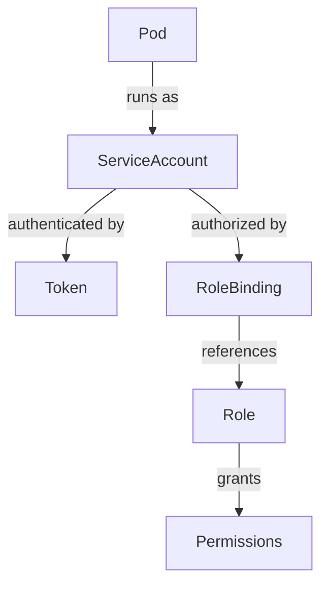

# How to Create and Manage ServiceAccounts in Kubernetes

Author: [nawazdhandala](https://www.github.com/nawazdhandala)

Tags: Kubernetes, ServiceAccounts, RBAC, Security, Authentication

Description: Learn how to create and manage ServiceAccounts in Kubernetes for pod identity and API access. This guide covers RBAC bindings, token management, and security best practices.

---

ServiceAccounts provide an identity for pods running in Kubernetes. They are used for authentication when pods need to communicate with the Kubernetes API or external services. This guide covers creating ServiceAccounts, binding them to roles, and managing their tokens securely.

## What is a ServiceAccount?

Every pod runs with a ServiceAccount identity. By default, pods use the `default` ServiceAccount in their namespace, which has minimal permissions. Custom ServiceAccounts let you grant specific permissions to specific workloads.



## Create a ServiceAccount

Basic ServiceAccount creation:

```yaml
# serviceaccount.yaml
apiVersion: v1
kind: ServiceAccount
metadata:
  name: my-app-sa
  namespace: production
  labels:
    app: my-app
```

Apply it:

```bash
kubectl apply -f serviceaccount.yaml

# Or create imperatively
kubectl create serviceaccount my-app-sa -n production
```

List ServiceAccounts:

```bash
kubectl get serviceaccounts -n production
# NAME        SECRETS   AGE
# default     0         30d
# my-app-sa   0         5s
```

## Assign ServiceAccount to Pods

Specify the ServiceAccount in your pod or deployment spec:

```yaml
# deployment.yaml
apiVersion: apps/v1
kind: Deployment
metadata:
  name: my-app
  namespace: production
spec:
  replicas: 3
  selector:
    matchLabels:
      app: my-app
  template:
    metadata:
      labels:
        app: my-app
    spec:
      serviceAccountName: my-app-sa  # Use custom ServiceAccount
      containers:
      - name: app
        image: myapp:1.0
```

Verify the pod uses the correct ServiceAccount:

```bash
kubectl get pod my-app-xxx -n production -o jsonpath='{.spec.serviceAccountName}'
# my-app-sa
```

## Grant Permissions with RBAC

ServiceAccounts have no permissions by default. Use Roles and RoleBindings to grant access:

```yaml
# rbac.yaml
# Role defines what actions are allowed
apiVersion: rbac.authorization.k8s.io/v1
kind: Role
metadata:
  name: configmap-reader
  namespace: production
rules:
- apiGroups: [""]  # Core API group
  resources: ["configmaps"]
  verbs: ["get", "list", "watch"]
---
# RoleBinding connects the ServiceAccount to the Role
apiVersion: rbac.authorization.k8s.io/v1
kind: RoleBinding
metadata:
  name: my-app-configmap-reader
  namespace: production
subjects:
- kind: ServiceAccount
  name: my-app-sa
  namespace: production
roleRef:
  kind: Role
  name: configmap-reader
  apiGroup: rbac.authorization.k8s.io
```

Apply and verify:

```bash
kubectl apply -f rbac.yaml

# Check what the ServiceAccount can do
kubectl auth can-i list configmaps --as=system:serviceaccount:production:my-app-sa -n production
# yes

kubectl auth can-i delete pods --as=system:serviceaccount:production:my-app-sa -n production
# no
```

## Cluster-Wide Permissions

For permissions across all namespaces, use ClusterRole and ClusterRoleBinding:

```yaml
# cluster-rbac.yaml
apiVersion: rbac.authorization.k8s.io/v1
kind: ClusterRole
metadata:
  name: namespace-lister
rules:
- apiGroups: [""]
  resources: ["namespaces"]
  verbs: ["get", "list"]
---
apiVersion: rbac.authorization.k8s.io/v1
kind: ClusterRoleBinding
metadata:
  name: my-app-namespace-lister
subjects:
- kind: ServiceAccount
  name: my-app-sa
  namespace: production
roleRef:
  kind: ClusterRole
  name: namespace-lister
  apiGroup: rbac.authorization.k8s.io
```

## ServiceAccount Tokens

Kubernetes automatically mounts a token into pods. You can also create long-lived tokens:

### Automatic Token (Kubernetes 1.22+)

Tokens are projected into pods automatically with bounded lifetime:

```bash
# Check token inside a pod
kubectl exec my-app-pod -- cat /var/run/secrets/kubernetes.io/serviceaccount/token
```

### Create a Long-Lived Token (Kubernetes 1.24+)

```yaml
# token-secret.yaml
apiVersion: v1
kind: Secret
metadata:
  name: my-app-sa-token
  namespace: production
  annotations:
    kubernetes.io/service-account.name: my-app-sa
type: kubernetes.io/service-account-token
```

```bash
kubectl apply -f token-secret.yaml

# Get the token
kubectl get secret my-app-sa-token -n production -o jsonpath='{.data.token}' | base64 -d
```

### Request a Time-Bound Token

```bash
# Create a token that expires in 1 hour
kubectl create token my-app-sa -n production --duration=1h
```

## Disable Token Auto-Mounting

If a pod does not need Kubernetes API access, disable token mounting:

```yaml
# Per-ServiceAccount
apiVersion: v1
kind: ServiceAccount
metadata:
  name: no-api-sa
automountServiceAccountToken: false

# Or per-Pod
apiVersion: v1
kind: Pod
metadata:
  name: my-pod
spec:
  automountServiceAccountToken: false
  containers:
  - name: app
    image: myapp:1.0
```

## Common Permission Patterns

### Read-Only Access to Own Namespace

```yaml
apiVersion: rbac.authorization.k8s.io/v1
kind: Role
metadata:
  name: namespace-viewer
rules:
- apiGroups: ["", "apps", "batch"]
  resources: ["*"]
  verbs: ["get", "list", "watch"]
```

### Deployment Manager

```yaml
apiVersion: rbac.authorization.k8s.io/v1
kind: Role
metadata:
  name: deployment-manager
rules:
- apiGroups: ["apps"]
  resources: ["deployments", "replicasets"]
  verbs: ["get", "list", "watch", "create", "update", "patch", "delete"]
- apiGroups: [""]
  resources: ["pods"]
  verbs: ["get", "list", "watch"]
```

### Secret Reader (Specific Secrets Only)

```yaml
apiVersion: rbac.authorization.k8s.io/v1
kind: Role
metadata:
  name: specific-secret-reader
rules:
- apiGroups: [""]
  resources: ["secrets"]
  resourceNames: ["db-credentials", "api-keys"]  # Only these secrets
  verbs: ["get"]
```

### Pod Exec (for Debugging)

```yaml
apiVersion: rbac.authorization.k8s.io/v1
kind: Role
metadata:
  name: pod-exec
rules:
- apiGroups: [""]
  resources: ["pods"]
  verbs: ["get", "list"]
- apiGroups: [""]
  resources: ["pods/exec"]
  verbs: ["create"]
```

## ServiceAccounts for External Access

ServiceAccounts can authenticate external tools (kubectl, CI/CD):

```bash
# Create ServiceAccount for CI
kubectl create serviceaccount ci-deployer -n production

# Create token
kubectl create token ci-deployer -n production --duration=8760h > ci-token.txt

# Get cluster CA
kubectl config view --raw -o jsonpath='{.clusters[0].cluster.certificate-authority-data}' | base64 -d > ca.crt

# Use in CI pipeline
kubectl --server=https://k8s.example.com \
  --token=$(cat ci-token.txt) \
  --certificate-authority=ca.crt \
  get pods -n production
```

## Audit ServiceAccount Usage

Check what ServiceAccounts exist and their permissions:

```bash
# List all ServiceAccounts
kubectl get serviceaccounts --all-namespaces

# Check RoleBindings for a ServiceAccount
kubectl get rolebindings,clusterrolebindings --all-namespaces \
  -o jsonpath='{range .items[?(@.subjects[*].name=="my-app-sa")]}{.metadata.name}{"\n"}{end}'

# List all permissions for a ServiceAccount
kubectl auth can-i --list --as=system:serviceaccount:production:my-app-sa
```

## Security Best Practices

1. **Create dedicated ServiceAccounts** - Do not use the default ServiceAccount
2. **Least privilege** - Grant only required permissions
3. **Use resourceNames** - Limit access to specific resources when possible
4. **Disable auto-mounting** - For pods that do not need API access
5. **Use short-lived tokens** - Prefer projected tokens over long-lived secrets
6. **Audit regularly** - Review ServiceAccount permissions periodically

```yaml
# Example: Secure ServiceAccount setup
apiVersion: v1
kind: ServiceAccount
metadata:
  name: minimal-sa
  namespace: production
automountServiceAccountToken: false  # Disabled by default
---
apiVersion: v1
kind: Pod
metadata:
  name: needs-api
spec:
  serviceAccountName: minimal-sa
  automountServiceAccountToken: true  # Explicitly enable when needed
  containers:
  - name: app
    image: myapp:1.0
```

## Summary

ServiceAccounts provide identity for pods in Kubernetes. Create dedicated ServiceAccounts for each application, bind them to Roles with minimal required permissions, and disable token auto-mounting when API access is not needed. Use projected tokens (automatic) for pods and time-bound tokens for external tools. Regular auditing of ServiceAccount permissions helps maintain security.
