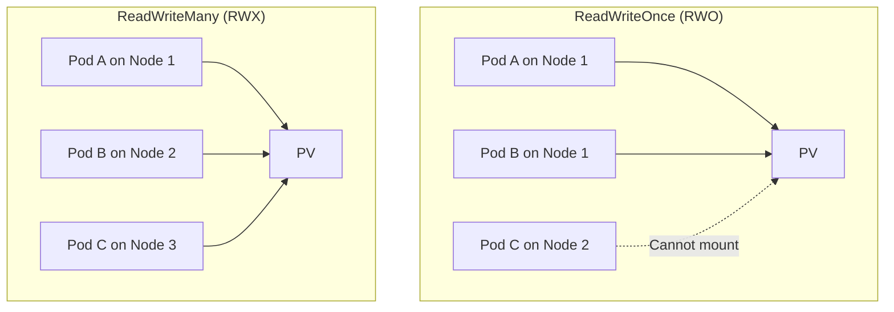

# How to Share Storage Between Pods Using PersistentVolumeClaim

Author: [nawazdhandala](https://www.github.com/nawazdhandala)

Tags: Kubernetes, Storage, PersistentVolumeClaim, NFS, SharedStorage

Description: Learn how to share storage between multiple pods in Kubernetes using PersistentVolumeClaims with ReadWriteMany access mode. This guide covers NFS, cloud storage, and practical examples.

---

Sometimes multiple pods need access to the same files. A content management system might have upload pods and serving pods that share a media directory. A data pipeline might have producer and consumer pods accessing a shared queue directory. Kubernetes supports this through PersistentVolumeClaims with `ReadWriteMany` (RWX) access mode.

## Understanding Access Modes

PersistentVolumes support three access modes:

| Mode | Abbreviation | Description |
|------|--------------|-------------|
| ReadWriteOnce | RWO | Single node read-write |
| ReadOnlyMany | ROX | Multiple nodes read-only |
| ReadWriteMany | RWX | Multiple nodes read-write |

For shared storage between pods, you need RWX:



## Storage Options That Support RWX

Not all storage backends support ReadWriteMany:

| Storage Type | RWX Support | Notes |
|--------------|-------------|-------|
| NFS | Yes | Most common for on-prem |
| AWS EFS | Yes | Elastic File System |
| GCP Filestore | Yes | Managed NFS |
| Azure Files | Yes | SMB/NFS |
| Ceph FS | Yes | Distributed filesystem |
| GlusterFS | Yes | Distributed filesystem |
| AWS EBS | No | Block storage, RWO only |
| GCP Persistent Disk | No | Block storage, RWO only |
| Azure Disk | No | Block storage, RWO only |

## Method 1: NFS Server in Cluster

Set up a simple NFS server for testing or small deployments:

```yaml
# nfs-server.yaml
apiVersion: apps/v1
kind: Deployment
metadata:
  name: nfs-server
spec:
  replicas: 1
  selector:
    matchLabels:
      app: nfs-server
  template:
    metadata:
      labels:
        app: nfs-server
    spec:
      containers:
      - name: nfs-server
        image: k8s.gcr.io/volume-nfs:0.8
        ports:
        - name: nfs
          containerPort: 2049
        - name: mountd
          containerPort: 20048
        - name: rpcbind
          containerPort: 111
        securityContext:
          privileged: true
        volumeMounts:
        - name: storage
          mountPath: /exports
      volumes:
      - name: storage
        emptyDir: {}  # Use PVC for persistence
---
apiVersion: v1
kind: Service
metadata:
  name: nfs-server
spec:
  ports:
  - name: nfs
    port: 2049
  - name: mountd
    port: 20048
  - name: rpcbind
    port: 111
  selector:
    app: nfs-server
```

Create a PV and PVC for the NFS share:

```yaml
# nfs-pv-pvc.yaml
apiVersion: v1
kind: PersistentVolume
metadata:
  name: nfs-shared-pv
spec:
  capacity:
    storage: 10Gi
  accessModes:
    - ReadWriteMany
  nfs:
    server: nfs-server.default.svc.cluster.local
    path: /exports
---
apiVersion: v1
kind: PersistentVolumeClaim
metadata:
  name: shared-data
spec:
  accessModes:
    - ReadWriteMany
  resources:
    requests:
      storage: 10Gi
  storageClassName: ""  # Use pre-provisioned PV
```

## Method 2: AWS EFS with CSI Driver

For AWS EKS, use the EFS CSI driver:

```bash
# Install EFS CSI driver
kubectl apply -k "github.com/kubernetes-sigs/aws-efs-csi-driver/deploy/kubernetes/overlays/stable/?ref=master"
```

Create a StorageClass and PVC:

```yaml
# efs-storage.yaml
apiVersion: storage.k8s.io/v1
kind: StorageClass
metadata:
  name: efs-sc
provisioner: efs.csi.aws.com
parameters:
  provisioningMode: efs-ap
  fileSystemId: fs-12345678  # Your EFS file system ID
  directoryPerms: "700"
---
apiVersion: v1
kind: PersistentVolumeClaim
metadata:
  name: shared-data
spec:
  accessModes:
    - ReadWriteMany
  storageClassName: efs-sc
  resources:
    requests:
      storage: 5Gi
```

## Method 3: GCP Filestore

For GKE, use Filestore:

```yaml
# filestore-storage.yaml
apiVersion: storage.k8s.io/v1
kind: StorageClass
metadata:
  name: filestore-sc
provisioner: filestore.csi.storage.gke.io
parameters:
  tier: standard
  network: default
allowVolumeExpansion: true
---
apiVersion: v1
kind: PersistentVolumeClaim
metadata:
  name: shared-data
spec:
  accessModes:
    - ReadWriteMany
  storageClassName: filestore-sc
  resources:
    requests:
      storage: 1Ti  # Filestore minimum is 1TB
```

## Using Shared Storage in Pods

Once you have an RWX PVC, multiple pods can mount it:

```yaml
# shared-storage-pods.yaml
apiVersion: apps/v1
kind: Deployment
metadata:
  name: content-writer
spec:
  replicas: 2  # Multiple writers
  selector:
    matchLabels:
      app: content-writer
  template:
    metadata:
      labels:
        app: content-writer
    spec:
      containers:
      - name: writer
        image: busybox:1.35
        command: ["sh", "-c", "while true; do echo $(date) >> /shared/log.txt; sleep 5; done"]
        volumeMounts:
        - name: shared-storage
          mountPath: /shared
      volumes:
      - name: shared-storage
        persistentVolumeClaim:
          claimName: shared-data
---
apiVersion: apps/v1
kind: Deployment
metadata:
  name: content-reader
spec:
  replicas: 3  # Multiple readers
  selector:
    matchLabels:
      app: content-reader
  template:
    metadata:
      labels:
        app: content-reader
    spec:
      containers:
      - name: reader
        image: busybox:1.35
        command: ["sh", "-c", "while true; do tail -f /shared/log.txt; done"]
        volumeMounts:
        - name: shared-storage
          mountPath: /shared
      volumes:
      - name: shared-storage
        persistentVolumeClaim:
          claimName: shared-data
```

## Practical Example: Shared Upload Directory

A web application with upload and processing services:

```yaml
# media-upload-system.yaml
apiVersion: v1
kind: PersistentVolumeClaim
metadata:
  name: media-storage
spec:
  accessModes:
    - ReadWriteMany
  storageClassName: efs-sc
  resources:
    requests:
      storage: 100Gi
---
# Upload API - receives files
apiVersion: apps/v1
kind: Deployment
metadata:
  name: upload-api
spec:
  replicas: 3
  selector:
    matchLabels:
      app: upload-api
  template:
    metadata:
      labels:
        app: upload-api
    spec:
      containers:
      - name: api
        image: myapp/upload-api:1.0
        ports:
        - containerPort: 8080
        volumeMounts:
        - name: media
          mountPath: /uploads
        env:
        - name: UPLOAD_DIR
          value: /uploads
      volumes:
      - name: media
        persistentVolumeClaim:
          claimName: media-storage
---
# Image processor - resizes uploaded images
apiVersion: apps/v1
kind: Deployment
metadata:
  name: image-processor
spec:
  replicas: 2
  selector:
    matchLabels:
      app: image-processor
  template:
    metadata:
      labels:
        app: image-processor
    spec:
      containers:
      - name: processor
        image: myapp/image-processor:1.0
        volumeMounts:
        - name: media
          mountPath: /uploads
      volumes:
      - name: media
        persistentVolumeClaim:
          claimName: media-storage
---
# CDN/Web server - serves processed files
apiVersion: apps/v1
kind: Deployment
metadata:
  name: media-server
spec:
  replicas: 5
  selector:
    matchLabels:
      app: media-server
  template:
    metadata:
      labels:
        app: media-server
    spec:
      containers:
      - name: nginx
        image: nginx:1.25
        ports:
        - containerPort: 80
        volumeMounts:
        - name: media
          mountPath: /usr/share/nginx/html/media
          readOnly: true  # Read-only for serving
      volumes:
      - name: media
        persistentVolumeClaim:
          claimName: media-storage
```

## Handling File Locking

When multiple pods write to the same files, consider locking:

```python
# Python example with file locking
import fcntl
import os

def write_with_lock(filepath, data):
    """Write to a shared file with exclusive lock."""
    with open(filepath, 'a') as f:
        # Acquire exclusive lock
        fcntl.flock(f.fileno(), fcntl.LOCK_EX)
        try:
            f.write(data)
            f.flush()
            os.fsync(f.fileno())
        finally:
            # Release lock
            fcntl.flock(f.fileno(), fcntl.LOCK_UN)
```

Or use separate files per pod:

```yaml
env:
- name: POD_NAME
  valueFrom:
    fieldRef:
      fieldPath: metadata.name
# Each pod writes to /shared/${POD_NAME}/data.txt
```

## Troubleshooting

### PVC Stuck in Pending

```bash
# Check PVC status
kubectl describe pvc shared-data

# Common issues:
# - No StorageClass with RWX provisioner
# - Insufficient EFS/Filestore quota
```

### Mount Failures

```bash
# Check pod events
kubectl describe pod my-pod

# Check NFS server connectivity
kubectl run test --rm -it --image=busybox -- ping nfs-server

# Test NFS mount manually
kubectl run test --rm -it --image=busybox -- sh
mount -t nfs nfs-server:/exports /mnt
```

### Permission Issues

```bash
# Check file permissions in shared volume
kubectl exec my-pod -- ls -la /shared

# Fix with init container
initContainers:
- name: fix-permissions
  image: busybox:1.35
  command: ["sh", "-c", "chmod -R 777 /shared"]
  volumeMounts:
  - name: shared-storage
    mountPath: /shared
```

## Summary

Sharing storage between pods requires a PersistentVolumeClaim with `ReadWriteMany` access mode. Use NFS for on-premises clusters, or managed services like AWS EFS, GCP Filestore, or Azure Files for cloud deployments. Multiple pods can then mount the same PVC and access shared files. Consider file locking for concurrent writes, and use read-only mounts for pods that only need to read data. Check your storage provider's RWX support before planning shared storage architectures.
