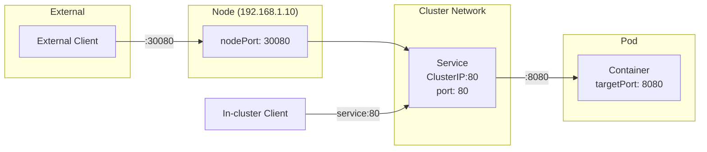

# How to Understand targetPort vs port vs nodePort in Kubernetes Services

Author: [nawazdhandala](https://www.github.com/nawazdhandala)

Tags: Kubernetes, Services, Networking, Configuration, Troubleshooting

Description: Learn the difference between targetPort, port, and nodePort in Kubernetes Services. This guide explains when to use each and how traffic flows through these ports.

---

Kubernetes Service port configuration confuses many developers. You have `port`, `targetPort`, and `nodePort`, and mixing them up breaks connectivity. This guide clarifies what each port does and how traffic flows through them.

## The Three Ports Explained

Every Kubernetes Service has up to three port configurations:

| Port Type | Description | Used By |
|-----------|-------------|---------|
| `port` | The port the Service listens on | Clients connecting to the Service |
| `targetPort` | The port on the Pod/container | The application in the container |
| `nodePort` | The port on every cluster node | External traffic (NodePort/LoadBalancer only) |

## Traffic Flow Visualization



## Understanding Each Port

### port (Service Port)

The `port` is what clients use to connect to your Service. It is the port exposed by the Service's ClusterIP:

```yaml
apiVersion: v1
kind: Service
metadata:
  name: web-service
spec:
  selector:
    app: web
  ports:
  - port: 80  # Clients connect to port 80
    targetPort: 8080
```

Other pods connect using:

```bash
# Connect to service on port 80
curl http://web-service:80
# Or simply (port 80 is the default for HTTP)
curl http://web-service
```

### targetPort (Container Port)

The `targetPort` is the port your application actually listens on inside the container. It must match what your application is configured to use:

```yaml
apiVersion: v1
kind: Pod
metadata:
  name: web-pod
  labels:
    app: web
spec:
  containers:
  - name: web
    image: nginx:1.25
    ports:
    - containerPort: 8080  # App listens on 8080
---
apiVersion: v1
kind: Service
metadata:
  name: web-service
spec:
  selector:
    app: web
  ports:
  - port: 80
    targetPort: 8080  # Forward to container port 8080
```

If `targetPort` is not specified, it defaults to the same value as `port`.

### nodePort (External Access Port)

The `nodePort` exposes the Service on every node's IP at a specific port. It is only available for NodePort and LoadBalancer Services:

```yaml
apiVersion: v1
kind: Service
metadata:
  name: web-service
spec:
  type: NodePort
  selector:
    app: web
  ports:
  - port: 80
    targetPort: 8080
    nodePort: 30080  # Access via any node IP on port 30080
```

Access the Service externally:

```bash
# Get node IP
kubectl get nodes -o wide

# Access via node IP and nodePort
curl http://192.168.1.10:30080
```

nodePort must be in the range 30000-32767 (configurable in kube-apiserver).

## Common Configuration Examples

### Example 1: Simple Web Application

```yaml
# App listens on port 3000, expose as port 80
apiVersion: v1
kind: Service
metadata:
  name: web-app
spec:
  selector:
    app: web
  ports:
  - name: http
    port: 80        # Service port (what clients use)
    targetPort: 3000  # Container port (where app listens)
```

Internal access: `http://web-app:80` or `http://web-app`

### Example 2: NodePort with Explicit Port Numbers

```yaml
# Expose externally with specific nodePort
apiVersion: v1
kind: Service
metadata:
  name: web-app
spec:
  type: NodePort
  selector:
    app: web
  ports:
  - name: http
    port: 80          # ClusterIP port
    targetPort: 3000  # Container port
    nodePort: 30080   # External port on all nodes
```

Internal access: `http://web-app:80`
External access: `http://<node-ip>:30080`

### Example 3: Named targetPort

Reference container ports by name instead of number:

```yaml
# Pod with named port
apiVersion: v1
kind: Pod
metadata:
  name: web-pod
  labels:
    app: web
spec:
  containers:
  - name: web
    image: myapp:1.0
    ports:
    - name: http-server  # Name the port
      containerPort: 8080
---
# Service references port by name
apiVersion: v1
kind: Service
metadata:
  name: web-service
spec:
  selector:
    app: web
  ports:
  - port: 80
    targetPort: http-server  # Reference by name
```

Named ports are useful when different deployments use different container ports.

### Example 4: Multiple Ports

```yaml
# Application with HTTP and HTTPS
apiVersion: v1
kind: Service
metadata:
  name: web-service
spec:
  selector:
    app: web
  ports:
  - name: http
    port: 80
    targetPort: 8080
  - name: https
    port: 443
    targetPort: 8443
```

### Example 5: LoadBalancer Service

```yaml
apiVersion: v1
kind: Service
metadata:
  name: web-service
spec:
  type: LoadBalancer
  selector:
    app: web
  ports:
  - name: http
    port: 80          # External LB port
    targetPort: 8080  # Container port
    # nodePort auto-assigned or can be specified
```

## Troubleshooting Port Issues

### Connection Refused

The most common issue is targetPort mismatch:

```bash
# Check what port your container listens on
kubectl exec web-pod -- netstat -tlnp
# or
kubectl exec web-pod -- ss -tlnp

# Check Service endpoints
kubectl get endpoints web-service
# Should show pod IPs with targetPort
```

### Service Has No Endpoints

If the Service port and container port do not align:

```bash
# Check Service definition
kubectl get svc web-service -o yaml

# Check Pod port definition
kubectl get pod web-pod -o jsonpath='{.spec.containers[*].ports}'

# Verify selector matches pod labels
kubectl get svc web-service -o jsonpath='{.spec.selector}'
kubectl get pods -l app=web
```

### nodePort Not Reachable

```bash
# Verify nodePort is in allowed range
kubectl get svc web-service -o jsonpath='{.spec.ports[0].nodePort}'

# Check node firewall rules
# (cloud provider security groups, iptables, etc.)

# Test from the node itself
curl localhost:30080
```

## Quick Reference

```yaml
apiVersion: v1
kind: Service
metadata:
  name: example
spec:
  type: NodePort  # or ClusterIP, LoadBalancer
  selector:
    app: myapp
  ports:
  - name: http
    protocol: TCP
    port: 80        # 1. Service listens here
    targetPort: 8080  # 2. Forwards to container port
    nodePort: 30080   # 3. External access (NodePort/LB only)
```

Traffic path:
1. **External**: `client -> nodePort:30080 -> Service:80 -> Pod:8080`
2. **Internal**: `client -> Service:80 -> Pod:8080`

## Summary

Understanding the three ports is straightforward once you know their roles:
- **port**: What clients connect to (Service level)
- **targetPort**: What the app listens on (Container level)
- **nodePort**: External access point (Node level, optional)

Always verify your targetPort matches the port your application is actually listening on. Use named ports when container ports might vary across deployments. When troubleshooting, check endpoints first to see if the Service can reach your pods.
