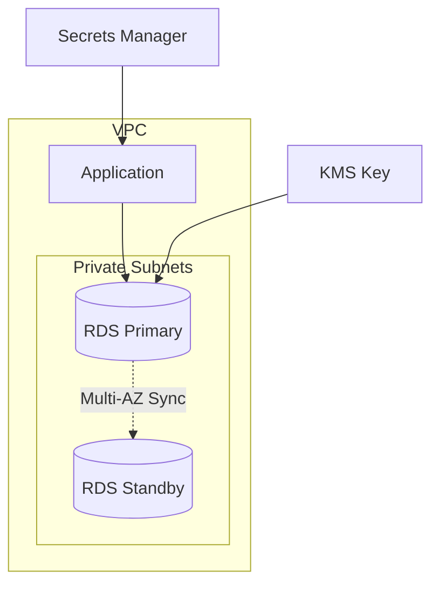

# How to Deploy Database Resources with Terraform

Author: [nawazdhandala](https://www.github.com/nawazdhandala)

Tags: Terraform, Database, RDS, PostgreSQL, Infrastructure as Code, DevOps

Description: A practical guide to deploying and managing database infrastructure with Terraform, covering RDS, Aurora, security configurations, backups, read replicas, and production best practices.

---

Database infrastructure requires careful planning because changes often mean downtime or data loss. Terraform helps by making database configurations reproducible, version-controlled, and auditable. This guide covers deploying production-ready databases on AWS with RDS, Aurora, and related resources.

## RDS PostgreSQL Instance

Start with a basic but production-ready PostgreSQL deployment.

```hcl
# Database subnet group
resource "aws_db_subnet_group" "main" {
  name        = "main-db-subnet-group"
  description = "Subnet group for main database"
  subnet_ids  = var.private_subnet_ids

  tags = {
    Name = "main-db-subnet-group"
  }
}

# Security group for database
resource "aws_security_group" "database" {
  name        = "database-sg"
  description = "Security group for database access"
  vpc_id      = var.vpc_id

  ingress {
    description     = "PostgreSQL from application"
    from_port       = 5432
    to_port         = 5432
    protocol        = "tcp"
    security_groups = [var.app_security_group_id]
  }

  tags = {
    Name = "database-sg"
  }
}

# Parameter group for custom settings
resource "aws_db_parameter_group" "postgres" {
  family = "postgres15"
  name   = "custom-postgres15"

  parameter {
    name  = "log_connections"
    value = "1"
  }

  parameter {
    name  = "log_disconnections"
    value = "1"
  }

  parameter {
    name  = "log_lock_waits"
    value = "1"
  }

  parameter {
    name  = "log_min_duration_statement"
    value = "1000"  # Log queries taking > 1 second
  }

  parameter {
    name         = "shared_preload_libraries"
    value        = "pg_stat_statements"
    apply_method = "pending-reboot"
  }

  tags = {
    Name = "custom-postgres15"
  }
}

# RDS instance
resource "aws_db_instance" "main" {
  identifier = "main-database"

  # Engine configuration
  engine               = "postgres"
  engine_version       = "15.4"
  instance_class       = var.db_instance_class
  parameter_group_name = aws_db_parameter_group.postgres.name

  # Storage
  allocated_storage     = var.db_allocated_storage
  max_allocated_storage = var.db_max_allocated_storage  # Enable autoscaling
  storage_type          = "gp3"
  storage_encrypted     = true
  kms_key_id            = var.kms_key_arn

  # Network
  db_subnet_group_name   = aws_db_subnet_group.main.name
  vpc_security_group_ids = [aws_security_group.database.id]
  publicly_accessible    = false
  port                   = 5432

  # Authentication
  username                    = var.db_username
  manage_master_user_password = true  # Use Secrets Manager for password

  # High availability
  multi_az = var.environment == "production"

  # Backup
  backup_retention_period = 7
  backup_window           = "03:00-04:00"
  maintenance_window      = "Mon:04:00-Mon:05:00"
  skip_final_snapshot     = var.environment != "production"
  final_snapshot_identifier = var.environment == "production" ? "${var.environment}-final-snapshot" : null
  copy_tags_to_snapshot   = true

  # Monitoring
  performance_insights_enabled          = true
  performance_insights_retention_period = 7
  monitoring_interval                   = 60
  monitoring_role_arn                   = aws_iam_role.rds_monitoring.arn
  enabled_cloudwatch_logs_exports       = ["postgresql", "upgrade"]

  # Protection
  deletion_protection = var.environment == "production"

  # Apply changes during maintenance window
  apply_immediately = var.environment != "production"

  tags = {
    Name        = "main-database"
    Environment = var.environment
  }

  lifecycle {
    prevent_destroy = true

    # Ignore password changes made via Secrets Manager
    ignore_changes = [
      manage_master_user_password,
    ]
  }
}

# IAM role for enhanced monitoring
resource "aws_iam_role" "rds_monitoring" {
  name = "rds-monitoring-role"

  assume_role_policy = jsonencode({
    Version = "2012-10-17"
    Statement = [{
      Action = "sts:AssumeRole"
      Effect = "Allow"
      Principal = {
        Service = "monitoring.rds.amazonaws.com"
      }
    }]
  })
}

resource "aws_iam_role_policy_attachment" "rds_monitoring" {
  role       = aws_iam_role.rds_monitoring.name
  policy_arn = "arn:aws:iam::aws:policy/service-role/AmazonRDSEnhancedMonitoringRole"
}
```



## Read Replicas

Add read replicas for read scaling and disaster recovery.

```hcl
# Read replica in same region
resource "aws_db_instance" "replica" {
  count = var.environment == "production" ? var.read_replica_count : 0

  identifier          = "main-database-replica-${count.index + 1}"
  replicate_source_db = aws_db_instance.main.identifier

  instance_class    = var.replica_instance_class
  storage_encrypted = true
  kms_key_id        = var.kms_key_arn

  # Replicas can have different instance class
  # but inherit most settings from primary

  vpc_security_group_ids = [aws_security_group.database.id]
  publicly_accessible    = false

  performance_insights_enabled          = true
  performance_insights_retention_period = 7
  monitoring_interval                   = 60
  monitoring_role_arn                   = aws_iam_role.rds_monitoring.arn

  # No backups on replicas (they get it from primary)
  backup_retention_period = 0

  tags = {
    Name        = "main-database-replica-${count.index + 1}"
    Environment = var.environment
  }
}

# Cross-region replica for DR
resource "aws_db_instance" "dr_replica" {
  count    = var.enable_cross_region_replica ? 1 : 0
  provider = aws.dr_region

  identifier          = "main-database-dr-replica"
  replicate_source_db = aws_db_instance.main.arn  # ARN for cross-region

  instance_class    = var.dr_replica_instance_class
  storage_encrypted = true
  kms_key_id        = var.dr_kms_key_arn

  db_subnet_group_name   = var.dr_db_subnet_group_name
  vpc_security_group_ids = [var.dr_security_group_id]
  publicly_accessible    = false

  # Enable backups on DR replica for promotion
  backup_retention_period = 7

  tags = {
    Name        = "main-database-dr-replica"
    Environment = var.environment
  }
}
```

## Aurora Cluster

For higher performance and availability, use Aurora.

```hcl
# Aurora cluster
resource "aws_rds_cluster" "main" {
  cluster_identifier = "main-aurora-cluster"

  engine         = "aurora-postgresql"
  engine_version = "15.4"
  engine_mode    = "provisioned"

  database_name                   = var.database_name
  master_username                 = var.db_username
  manage_master_user_password     = true
  iam_database_authentication_enabled = true

  db_subnet_group_name   = aws_db_subnet_group.main.name
  vpc_security_group_ids = [aws_security_group.database.id]
  port                   = 5432

  storage_encrypted = true
  kms_key_id        = var.kms_key_arn

  backup_retention_period = 7
  preferred_backup_window = "03:00-04:00"
  preferred_maintenance_window = "Mon:04:00-Mon:05:00"
  skip_final_snapshot     = var.environment != "production"
  final_snapshot_identifier = var.environment == "production" ? "main-aurora-final" : null
  copy_tags_to_snapshot   = true

  enabled_cloudwatch_logs_exports = ["postgresql"]

  deletion_protection = var.environment == "production"

  serverlessv2_scaling_configuration {
    min_capacity = 0.5
    max_capacity = 16
  }

  tags = {
    Name        = "main-aurora-cluster"
    Environment = var.environment
  }

  lifecycle {
    prevent_destroy = true
  }
}

# Aurora instances
resource "aws_rds_cluster_instance" "main" {
  count = var.aurora_instance_count

  identifier         = "main-aurora-${count.index + 1}"
  cluster_identifier = aws_rds_cluster.main.id

  instance_class = "db.serverless"  # For Serverless v2
  engine         = aws_rds_cluster.main.engine
  engine_version = aws_rds_cluster.main.engine_version

  db_subnet_group_name = aws_db_subnet_group.main.name
  publicly_accessible  = false

  performance_insights_enabled          = true
  performance_insights_retention_period = 7
  monitoring_interval                   = 60
  monitoring_role_arn                   = aws_iam_role.rds_monitoring.arn

  tags = {
    Name        = "main-aurora-${count.index + 1}"
    Environment = var.environment
  }
}

# Cluster endpoint for writes
output "aurora_cluster_endpoint" {
  value       = aws_rds_cluster.main.endpoint
  description = "Aurora cluster endpoint for writes"
}

# Reader endpoint for reads
output "aurora_reader_endpoint" {
  value       = aws_rds_cluster.main.reader_endpoint
  description = "Aurora reader endpoint for read queries"
}
```

## ElastiCache Redis

Add Redis for caching and session storage.

```hcl
# Subnet group for ElastiCache
resource "aws_elasticache_subnet_group" "main" {
  name        = "main-cache-subnet-group"
  description = "Subnet group for ElastiCache"
  subnet_ids  = var.private_subnet_ids
}

# Security group for Redis
resource "aws_security_group" "redis" {
  name        = "redis-sg"
  description = "Security group for Redis"
  vpc_id      = var.vpc_id

  ingress {
    description     = "Redis from application"
    from_port       = 6379
    to_port         = 6379
    protocol        = "tcp"
    security_groups = [var.app_security_group_id]
  }

  tags = {
    Name = "redis-sg"
  }
}

# Parameter group
resource "aws_elasticache_parameter_group" "redis" {
  family = "redis7"
  name   = "custom-redis7"

  parameter {
    name  = "maxmemory-policy"
    value = "volatile-lru"
  }
}

# Redis replication group (cluster mode disabled)
resource "aws_elasticache_replication_group" "main" {
  replication_group_id = "main-redis"
  description          = "Main Redis cluster"

  engine               = "redis"
  engine_version       = "7.0"
  node_type            = var.redis_node_type
  port                 = 6379
  parameter_group_name = aws_elasticache_parameter_group.redis.name

  # High availability
  num_cache_clusters         = var.environment == "production" ? 2 : 1
  automatic_failover_enabled = var.environment == "production"
  multi_az_enabled           = var.environment == "production"

  subnet_group_name  = aws_elasticache_subnet_group.main.name
  security_group_ids = [aws_security_group.redis.id]

  # Encryption
  at_rest_encryption_enabled = true
  transit_encryption_enabled = true
  auth_token                 = var.redis_auth_token

  # Maintenance
  maintenance_window       = "Mon:05:00-Mon:06:00"
  snapshot_retention_limit = var.environment == "production" ? 7 : 0
  snapshot_window          = "03:00-04:00"

  # Notifications
  notification_topic_arn = var.sns_topic_arn

  tags = {
    Name        = "main-redis"
    Environment = var.environment
  }
}
```

## Database Secrets Management

```hcl
# Generate random password
resource "random_password" "db" {
  length  = 32
  special = true
  # Exclude characters that cause issues in connection strings
  override_special = "!#$%&*()-_=+[]{}<>:?"
}

# Store in Secrets Manager
resource "aws_secretsmanager_secret" "db" {
  name        = "${var.environment}/database/credentials"
  description = "Database credentials for ${var.environment}"

  # Rotation configuration
  # rotation_lambda_arn = aws_lambda_function.rotate_secret.arn
  # rotation_rules {
  #   automatically_after_days = 30
  # }

  tags = {
    Environment = var.environment
  }
}

resource "aws_secretsmanager_secret_version" "db" {
  secret_id = aws_secretsmanager_secret.db.id

  secret_string = jsonencode({
    username = var.db_username
    password = random_password.db.result
    host     = aws_db_instance.main.address
    port     = aws_db_instance.main.port
    database = var.database_name
    # Full connection string
    connection_string = "postgresql://${var.db_username}:${random_password.db.result}@${aws_db_instance.main.endpoint}/${var.database_name}"
  })
}
```

## Variables

```hcl
variable "environment" {
  description = "Environment name"
  type        = string
}

variable "vpc_id" {
  description = "VPC ID"
  type        = string
}

variable "private_subnet_ids" {
  description = "Private subnet IDs for database"
  type        = list(string)
}

variable "app_security_group_id" {
  description = "Security group ID of application servers"
  type        = string
}

variable "kms_key_arn" {
  description = "KMS key ARN for encryption"
  type        = string
}

variable "db_instance_class" {
  description = "RDS instance class"
  type        = string
  default     = "db.t3.medium"
}

variable "db_allocated_storage" {
  description = "Initial allocated storage in GB"
  type        = number
  default     = 20
}

variable "db_max_allocated_storage" {
  description = "Maximum storage for autoscaling in GB"
  type        = number
  default     = 100
}

variable "db_username" {
  description = "Database master username"
  type        = string
  default     = "dbadmin"
}

variable "database_name" {
  description = "Name of the database to create"
  type        = string
  default     = "application"
}

variable "read_replica_count" {
  description = "Number of read replicas"
  type        = number
  default     = 1
}
```

## Outputs

```hcl
output "db_endpoint" {
  description = "RDS endpoint"
  value       = aws_db_instance.main.endpoint
}

output "db_port" {
  description = "RDS port"
  value       = aws_db_instance.main.port
}

output "db_name" {
  description = "Database name"
  value       = aws_db_instance.main.db_name
}

output "secret_arn" {
  description = "Secrets Manager secret ARN"
  value       = aws_secretsmanager_secret.db.arn
}

output "replica_endpoints" {
  description = "Read replica endpoints"
  value       = aws_db_instance.replica[*].endpoint
}

output "redis_endpoint" {
  description = "Redis primary endpoint"
  value       = aws_elasticache_replication_group.main.primary_endpoint_address
}
```

---

Database infrastructure in Terraform requires balancing flexibility with safety. Use lifecycle rules to prevent accidental destruction, enable encryption everywhere, and leverage managed secrets. Start with smaller instance classes and use autoscaling for storage. The patterns here work for development through production with appropriate variable adjustments.
