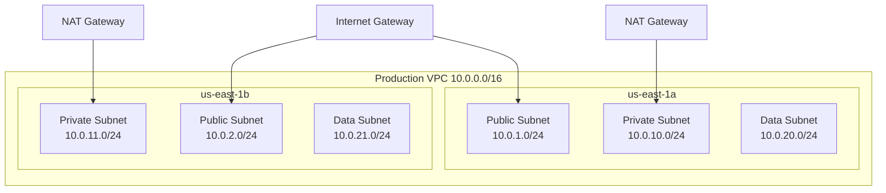

# How to Deploy Network Infrastructure with Terraform

Author: [nawazdhandala](https://www.github.com/nawazdhandala)

Tags: Terraform, Networking, VPC, Infrastructure as Code, DevOps, AWS

Description: A comprehensive guide to deploying production-ready network infrastructure with Terraform, covering VPCs, subnets, routing, NAT gateways, VPC peering, and Transit Gateway configurations.

---

Network infrastructure forms the foundation of cloud deployments. Getting it right from the start prevents painful migrations later. This guide walks through building production-grade networking with Terraform, from basic VPC layouts to complex multi-VPC architectures.

## VPC Design Fundamentals

Before writing code, plan your network architecture. Consider:

- CIDR ranges that will not overlap with on-premises or peered networks
- Subnet sizing for current and future growth
- Public vs private subnet requirements
- High availability across availability zones



## Complete VPC Module

```hcl
# variables.tf
variable "name" {
  description = "Name prefix for all resources"
  type        = string
}

variable "vpc_cidr" {
  description = "CIDR block for the VPC"
  type        = string
  default     = "10.0.0.0/16"
}

variable "availability_zones" {
  description = "List of availability zones"
  type        = list(string)
}

variable "enable_nat_gateway" {
  description = "Enable NAT Gateway for private subnets"
  type        = bool
  default     = true
}

variable "single_nat_gateway" {
  description = "Use a single NAT Gateway instead of one per AZ"
  type        = bool
  default     = false
}

variable "tags" {
  description = "Tags to apply to all resources"
  type        = map(string)
  default     = {}
}
```

```hcl
# main.tf
locals {
  az_count = length(var.availability_zones)

  # Calculate subnet CIDR blocks
  # Public: 10.0.1.0/24, 10.0.2.0/24, 10.0.3.0/24
  # Private: 10.0.10.0/24, 10.0.11.0/24, 10.0.12.0/24
  # Data: 10.0.20.0/24, 10.0.21.0/24, 10.0.22.0/24
  public_subnets  = [for i in range(local.az_count) : cidrsubnet(var.vpc_cidr, 8, i + 1)]
  private_subnets = [for i in range(local.az_count) : cidrsubnet(var.vpc_cidr, 8, i + 10)]
  data_subnets    = [for i in range(local.az_count) : cidrsubnet(var.vpc_cidr, 8, i + 20)]
}

# VPC
resource "aws_vpc" "main" {
  cidr_block           = var.vpc_cidr
  enable_dns_hostnames = true
  enable_dns_support   = true

  tags = merge(var.tags, {
    Name = "${var.name}-vpc"
  })
}

# Internet Gateway
resource "aws_internet_gateway" "main" {
  vpc_id = aws_vpc.main.id

  tags = merge(var.tags, {
    Name = "${var.name}-igw"
  })
}

# Public Subnets
resource "aws_subnet" "public" {
  count = local.az_count

  vpc_id                  = aws_vpc.main.id
  cidr_block              = local.public_subnets[count.index]
  availability_zone       = var.availability_zones[count.index]
  map_public_ip_on_launch = true

  tags = merge(var.tags, {
    Name                     = "${var.name}-public-${var.availability_zones[count.index]}"
    Tier                     = "public"
    "kubernetes.io/role/elb" = "1"
  })
}

# Private Subnets
resource "aws_subnet" "private" {
  count = local.az_count

  vpc_id            = aws_vpc.main.id
  cidr_block        = local.private_subnets[count.index]
  availability_zone = var.availability_zones[count.index]

  tags = merge(var.tags, {
    Name                              = "${var.name}-private-${var.availability_zones[count.index]}"
    Tier                              = "private"
    "kubernetes.io/role/internal-elb" = "1"
  })
}

# Data Subnets (for databases, caches)
resource "aws_subnet" "data" {
  count = local.az_count

  vpc_id            = aws_vpc.main.id
  cidr_block        = local.data_subnets[count.index]
  availability_zone = var.availability_zones[count.index]

  tags = merge(var.tags, {
    Name = "${var.name}-data-${var.availability_zones[count.index]}"
    Tier = "data"
  })
}

# Elastic IPs for NAT Gateways
resource "aws_eip" "nat" {
  count  = var.enable_nat_gateway ? (var.single_nat_gateway ? 1 : local.az_count) : 0
  domain = "vpc"

  tags = merge(var.tags, {
    Name = "${var.name}-nat-eip-${count.index + 1}"
  })

  depends_on = [aws_internet_gateway.main]
}

# NAT Gateways
resource "aws_nat_gateway" "main" {
  count = var.enable_nat_gateway ? (var.single_nat_gateway ? 1 : local.az_count) : 0

  allocation_id = aws_eip.nat[count.index].id
  subnet_id     = aws_subnet.public[count.index].id

  tags = merge(var.tags, {
    Name = "${var.name}-nat-${count.index + 1}"
  })

  depends_on = [aws_internet_gateway.main]
}

# Public Route Table
resource "aws_route_table" "public" {
  vpc_id = aws_vpc.main.id

  tags = merge(var.tags, {
    Name = "${var.name}-public-rt"
  })
}

resource "aws_route" "public_internet" {
  route_table_id         = aws_route_table.public.id
  destination_cidr_block = "0.0.0.0/0"
  gateway_id             = aws_internet_gateway.main.id
}

resource "aws_route_table_association" "public" {
  count = local.az_count

  subnet_id      = aws_subnet.public[count.index].id
  route_table_id = aws_route_table.public.id
}

# Private Route Tables
resource "aws_route_table" "private" {
  count = var.enable_nat_gateway ? (var.single_nat_gateway ? 1 : local.az_count) : 1

  vpc_id = aws_vpc.main.id

  tags = merge(var.tags, {
    Name = "${var.name}-private-rt-${count.index + 1}"
  })
}

resource "aws_route" "private_nat" {
  count = var.enable_nat_gateway ? (var.single_nat_gateway ? 1 : local.az_count) : 0

  route_table_id         = aws_route_table.private[count.index].id
  destination_cidr_block = "0.0.0.0/0"
  nat_gateway_id         = aws_nat_gateway.main[var.single_nat_gateway ? 0 : count.index].id
}

resource "aws_route_table_association" "private" {
  count = local.az_count

  subnet_id      = aws_subnet.private[count.index].id
  route_table_id = aws_route_table.private[var.single_nat_gateway ? 0 : count.index].id
}

# Data Route Tables (same as private)
resource "aws_route_table_association" "data" {
  count = local.az_count

  subnet_id      = aws_subnet.data[count.index].id
  route_table_id = aws_route_table.private[var.single_nat_gateway ? 0 : count.index].id
}
```

## Network ACLs

```hcl
# Network ACL for public subnets
resource "aws_network_acl" "public" {
  vpc_id     = aws_vpc.main.id
  subnet_ids = aws_subnet.public[*].id

  # Allow HTTP inbound
  ingress {
    protocol   = "tcp"
    rule_no    = 100
    action     = "allow"
    cidr_block = "0.0.0.0/0"
    from_port  = 80
    to_port    = 80
  }

  # Allow HTTPS inbound
  ingress {
    protocol   = "tcp"
    rule_no    = 110
    action     = "allow"
    cidr_block = "0.0.0.0/0"
    from_port  = 443
    to_port    = 443
  }

  # Allow ephemeral ports inbound (for responses)
  ingress {
    protocol   = "tcp"
    rule_no    = 120
    action     = "allow"
    cidr_block = "0.0.0.0/0"
    from_port  = 1024
    to_port    = 65535
  }

  # Allow all outbound
  egress {
    protocol   = "-1"
    rule_no    = 100
    action     = "allow"
    cidr_block = "0.0.0.0/0"
    from_port  = 0
    to_port    = 0
  }

  tags = merge(var.tags, {
    Name = "${var.name}-public-nacl"
  })
}

# Network ACL for data subnets (more restrictive)
resource "aws_network_acl" "data" {
  vpc_id     = aws_vpc.main.id
  subnet_ids = aws_subnet.data[*].id

  # Allow traffic from VPC only
  ingress {
    protocol   = "-1"
    rule_no    = 100
    action     = "allow"
    cidr_block = var.vpc_cidr
    from_port  = 0
    to_port    = 0
  }

  # Deny all other inbound
  ingress {
    protocol   = "-1"
    rule_no    = 200
    action     = "deny"
    cidr_block = "0.0.0.0/0"
    from_port  = 0
    to_port    = 0
  }

  # Allow outbound to VPC
  egress {
    protocol   = "-1"
    rule_no    = 100
    action     = "allow"
    cidr_block = var.vpc_cidr
    from_port  = 0
    to_port    = 0
  }

  tags = merge(var.tags, {
    Name = "${var.name}-data-nacl"
  })
}
```

## VPC Endpoints

```hcl
# S3 Gateway Endpoint (free)
resource "aws_vpc_endpoint" "s3" {
  vpc_id            = aws_vpc.main.id
  service_name      = "com.amazonaws.${data.aws_region.current.name}.s3"
  vpc_endpoint_type = "Gateway"

  route_table_ids = concat(
    [aws_route_table.public.id],
    aws_route_table.private[*].id
  )

  tags = merge(var.tags, {
    Name = "${var.name}-s3-endpoint"
  })
}

# DynamoDB Gateway Endpoint (free)
resource "aws_vpc_endpoint" "dynamodb" {
  vpc_id            = aws_vpc.main.id
  service_name      = "com.amazonaws.${data.aws_region.current.name}.dynamodb"
  vpc_endpoint_type = "Gateway"

  route_table_ids = aws_route_table.private[*].id

  tags = merge(var.tags, {
    Name = "${var.name}-dynamodb-endpoint"
  })
}

# Interface Endpoints (for private access to AWS services)
resource "aws_vpc_endpoint" "interface" {
  for_each = toset([
    "ecr.api",
    "ecr.dkr",
    "logs",
    "monitoring",
    "secretsmanager",
    "ssm",
    "ssmmessages",
    "ec2messages"
  ])

  vpc_id              = aws_vpc.main.id
  service_name        = "com.amazonaws.${data.aws_region.current.name}.${each.value}"
  vpc_endpoint_type   = "Interface"
  subnet_ids          = aws_subnet.private[*].id
  security_group_ids  = [aws_security_group.vpc_endpoints.id]
  private_dns_enabled = true

  tags = merge(var.tags, {
    Name = "${var.name}-${each.value}-endpoint"
  })
}

# Security group for VPC endpoints
resource "aws_security_group" "vpc_endpoints" {
  name        = "${var.name}-vpc-endpoints"
  description = "Security group for VPC endpoints"
  vpc_id      = aws_vpc.main.id

  ingress {
    from_port   = 443
    to_port     = 443
    protocol    = "tcp"
    cidr_blocks = [var.vpc_cidr]
  }

  tags = merge(var.tags, {
    Name = "${var.name}-vpc-endpoints-sg"
  })
}

data "aws_region" "current" {}
```

## VPC Peering

Connect two VPCs for private communication.

```hcl
# Peering connection
resource "aws_vpc_peering_connection" "peer" {
  vpc_id        = aws_vpc.main.id
  peer_vpc_id   = var.peer_vpc_id
  peer_owner_id = var.peer_owner_id
  peer_region   = var.peer_region
  auto_accept   = false

  tags = merge(var.tags, {
    Name = "${var.name}-peering"
  })
}

# Accept peering (when in same account)
resource "aws_vpc_peering_connection_accepter" "peer" {
  count = var.peer_owner_id == data.aws_caller_identity.current.account_id ? 1 : 0

  vpc_peering_connection_id = aws_vpc_peering_connection.peer.id
  auto_accept               = true

  tags = merge(var.tags, {
    Name = "${var.name}-peering-accepter"
  })
}

# Routes to peer VPC
resource "aws_route" "peer_private" {
  count = local.az_count

  route_table_id            = aws_route_table.private[count.index].id
  destination_cidr_block    = var.peer_vpc_cidr
  vpc_peering_connection_id = aws_vpc_peering_connection.peer.id
}

data "aws_caller_identity" "current" {}
```

## Transit Gateway

For connecting multiple VPCs and on-premises networks.

```hcl
# Transit Gateway
resource "aws_ec2_transit_gateway" "main" {
  description                     = "Main Transit Gateway"
  default_route_table_association = "disable"
  default_route_table_propagation = "disable"
  dns_support                     = "enable"
  vpn_ecmp_support                = "enable"

  tags = merge(var.tags, {
    Name = "${var.name}-tgw"
  })
}

# Transit Gateway Route Table
resource "aws_ec2_transit_gateway_route_table" "main" {
  transit_gateway_id = aws_ec2_transit_gateway.main.id

  tags = merge(var.tags, {
    Name = "${var.name}-tgw-rt"
  })
}

# VPC Attachments
resource "aws_ec2_transit_gateway_vpc_attachment" "vpcs" {
  for_each = var.vpc_attachments

  transit_gateway_id = aws_ec2_transit_gateway.main.id
  vpc_id             = each.value.vpc_id
  subnet_ids         = each.value.subnet_ids

  transit_gateway_default_route_table_association = false
  transit_gateway_default_route_table_propagation = false

  tags = merge(var.tags, {
    Name = "${var.name}-tgw-attachment-${each.key}"
  })
}

# Route Table Associations
resource "aws_ec2_transit_gateway_route_table_association" "vpcs" {
  for_each = var.vpc_attachments

  transit_gateway_attachment_id  = aws_ec2_transit_gateway_vpc_attachment.vpcs[each.key].id
  transit_gateway_route_table_id = aws_ec2_transit_gateway_route_table.main.id
}

# Route Table Propagations
resource "aws_ec2_transit_gateway_route_table_propagation" "vpcs" {
  for_each = var.vpc_attachments

  transit_gateway_attachment_id  = aws_ec2_transit_gateway_vpc_attachment.vpcs[each.key].id
  transit_gateway_route_table_id = aws_ec2_transit_gateway_route_table.main.id
}
```

## Outputs

```hcl
# outputs.tf
output "vpc_id" {
  description = "The ID of the VPC"
  value       = aws_vpc.main.id
}

output "vpc_cidr_block" {
  description = "The CIDR block of the VPC"
  value       = aws_vpc.main.cidr_block
}

output "public_subnet_ids" {
  description = "List of public subnet IDs"
  value       = aws_subnet.public[*].id
}

output "private_subnet_ids" {
  description = "List of private subnet IDs"
  value       = aws_subnet.private[*].id
}

output "data_subnet_ids" {
  description = "List of data subnet IDs"
  value       = aws_subnet.data[*].id
}

output "nat_gateway_ips" {
  description = "List of NAT Gateway public IPs"
  value       = aws_eip.nat[*].public_ip
}

output "internet_gateway_id" {
  description = "The ID of the Internet Gateway"
  value       = aws_internet_gateway.main.id
}
```

---

Network infrastructure requires careful planning because changes often require recreating resources. Start with a CIDR range large enough for growth, use consistent naming, and document your subnet purposes. The investment in proper network design pays dividends as your infrastructure scales.
