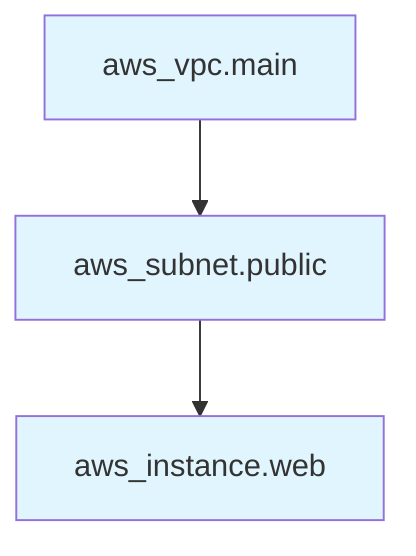

# How to Manage Resource Dependencies in Terraform

Author: [nawazdhandala](https://www.github.com/nawazdhandala)

Tags: Terraform, Infrastructure as Code, Dependencies, DevOps, Resource Management

Description: Learn how Terraform manages resource dependencies automatically and manually, including implicit dependencies through references, explicit depends_on, and strategies for handling complex dependency chains.

---

Terraform builds a dependency graph of your resources to determine the correct order for creation and destruction. Most dependencies are inferred automatically from resource references, but sometimes you need to specify them explicitly. Understanding how dependencies work helps you debug ordering issues and design better infrastructure code.

## Implicit Dependencies

Terraform automatically detects dependencies when one resource references another. This is the preferred method because Terraform understands why the dependency exists.

```hcl
# VPC must exist before subnets
resource "aws_vpc" "main" {
  cidr_block = "10.0.0.0/16"

  tags = {
    Name = "main-vpc"
  }
}

# Implicit dependency on aws_vpc.main through vpc_id reference
resource "aws_subnet" "public" {
  vpc_id     = aws_vpc.main.id  # This creates the dependency
  cidr_block = "10.0.1.0/24"

  tags = {
    Name = "public-subnet"
  }
}

# Implicit dependency chain: VPC -> Subnet -> Instance
resource "aws_instance" "web" {
  ami           = var.ami_id
  instance_type = "t3.micro"
  subnet_id     = aws_subnet.public.id  # Depends on subnet

  tags = {
    Name = "web-server"
  }
}
```



## Explicit Dependencies with depends_on

When there is no direct reference but a dependency exists, use `depends_on`. This commonly happens with IAM roles, where the role must exist before resources can assume it.

```hcl
# IAM role for Lambda
resource "aws_iam_role" "lambda" {
  name = "lambda-execution-role"

  assume_role_policy = jsonencode({
    Version = "2012-10-17"
    Statement = [{
      Action = "sts:AssumeRole"
      Effect = "Allow"
      Principal = {
        Service = "lambda.amazonaws.com"
      }
    }]
  })
}

# IAM policy attachment
resource "aws_iam_role_policy_attachment" "lambda_basic" {
  role       = aws_iam_role.lambda.name
  policy_arn = "arn:aws:iam::aws:policy/service-role/AWSLambdaBasicExecutionRole"
}

# Lambda function needs the policy attached before it can work
resource "aws_lambda_function" "processor" {
  function_name = "data-processor"
  role          = aws_iam_role.lambda.arn  # Implicit dependency on role
  handler       = "index.handler"
  runtime       = "nodejs18.x"
  filename      = "function.zip"

  # Explicit dependency on policy attachment
  # Without this, Lambda might be created before policy is attached
  depends_on = [aws_iam_role_policy_attachment.lambda_basic]
}
```

### When depends_on is Necessary

```hcl
# S3 bucket for logs
resource "aws_s3_bucket" "logs" {
  bucket = "my-app-logs"
}

# Bucket policy (no direct reference from bucket)
resource "aws_s3_bucket_policy" "logs" {
  bucket = aws_s3_bucket.logs.id
  policy = data.aws_iam_policy_document.logs.json
}

# CloudWatch log group that writes to S3
resource "aws_cloudwatch_log_subscription_filter" "logs" {
  name            = "log-subscription"
  log_group_name  = aws_cloudwatch_log_group.app.name
  filter_pattern  = ""
  destination_arn = aws_kinesis_firehose_delivery_stream.logs.arn
  role_arn        = aws_iam_role.cloudwatch.arn

  # Policy must be attached before subscription can write
  depends_on = [aws_s3_bucket_policy.logs]
}
```

## Visualizing Dependencies

Use `terraform graph` to see the dependency graph.

```bash
# Generate DOT format graph
terraform graph > graph.dot

# Convert to PNG (requires graphviz)
terraform graph | dot -Tpng > graph.png

# View specific resource dependencies
terraform graph -type=plan | grep -E "aws_instance|aws_subnet|aws_vpc"
```

## Module Dependencies

Modules create implicit dependencies through output references.

```hcl
# Network module
module "network" {
  source = "./modules/network"

  vpc_cidr = "10.0.0.0/16"
}

# Compute module depends on network
module "compute" {
  source = "./modules/compute"

  vpc_id     = module.network.vpc_id      # Implicit dependency
  subnet_ids = module.network.subnet_ids  # Implicit dependency
}

# Database module depends on network
module "database" {
  source = "./modules/database"

  subnet_ids = module.network.subnet_ids
  vpc_id     = module.network.vpc_id

  # Also needs compute security group
  app_security_group_id = module.compute.security_group_id
}
```

### Explicit Module Dependencies

```hcl
module "monitoring" {
  source = "./modules/monitoring"

  # Even though we don't reference outputs directly,
  # monitoring setup needs infrastructure to exist
  depends_on = [
    module.network,
    module.compute,
    module.database
  ]
}
```

## Data Source Dependencies

Data sources can depend on resources when you need to query something after creation.

```hcl
# Create an EKS cluster
resource "aws_eks_cluster" "main" {
  name     = "main-cluster"
  role_arn = aws_iam_role.eks_cluster.arn

  vpc_config {
    subnet_ids = var.subnet_ids
  }
}

# Query the cluster's OIDC provider after creation
data "tls_certificate" "eks" {
  url = aws_eks_cluster.main.identity[0].oidc[0].issuer

  # Implicit dependency - waits for cluster to exist
}

# Create OIDC provider using the certificate
resource "aws_iam_openid_connect_provider" "eks" {
  url             = aws_eks_cluster.main.identity[0].oidc[0].issuer
  client_id_list  = ["sts.amazonaws.com"]
  thumbprint_list = [data.tls_certificate.eks.certificates[0].sha1_fingerprint]
}
```

## Handling Circular Dependencies

Terraform does not allow circular dependencies. If you encounter one, restructure your resources.

```hcl
# BAD: Circular dependency
# Security Group A references Security Group B
# Security Group B references Security Group A

# GOOD: Use separate rule resources
resource "aws_security_group" "web" {
  name        = "web"
  description = "Web servers"
  vpc_id      = aws_vpc.main.id
}

resource "aws_security_group" "api" {
  name        = "api"
  description = "API servers"
  vpc_id      = aws_vpc.main.id
}

# Separate rules break the cycle
resource "aws_security_group_rule" "web_to_api" {
  type                     = "egress"
  from_port                = 8080
  to_port                  = 8080
  protocol                 = "tcp"
  security_group_id        = aws_security_group.web.id
  source_security_group_id = aws_security_group.api.id
}

resource "aws_security_group_rule" "api_from_web" {
  type                     = "ingress"
  from_port                = 8080
  to_port                  = 8080
  protocol                 = "tcp"
  security_group_id        = aws_security_group.api.id
  source_security_group_id = aws_security_group.web.id
}
```

## Dependency Ordering for Destruction

Dependencies also affect destruction order. Terraform destroys resources in reverse dependency order.

```hcl
# Create order: VPC -> Subnet -> Instance
# Destroy order: Instance -> Subnet -> VPC

resource "aws_vpc" "main" {
  cidr_block = "10.0.0.0/16"
}

resource "aws_subnet" "main" {
  vpc_id     = aws_vpc.main.id
  cidr_block = "10.0.1.0/24"
}

resource "aws_instance" "main" {
  ami           = var.ami_id
  instance_type = "t3.micro"
  subnet_id     = aws_subnet.main.id
}
```

### Handling Destruction Issues

```hcl
# Some resources need cleanup before destruction
resource "aws_s3_bucket" "data" {
  bucket = "my-data-bucket"

  # Force destroy even if bucket has objects
  force_destroy = true
}

# For resources that can't be destroyed automatically
resource "null_resource" "cleanup" {
  triggers = {
    bucket_id = aws_s3_bucket.data.id
  }

  provisioner "local-exec" {
    when    = destroy
    command = "aws s3 rm s3://${self.triggers.bucket_id} --recursive"
  }
}
```

## Parallel Creation

Terraform creates resources in parallel when there are no dependencies between them.

```hcl
# These three resources can be created simultaneously
resource "aws_s3_bucket" "logs" {
  bucket = "my-logs"
}

resource "aws_s3_bucket" "data" {
  bucket = "my-data"
}

resource "aws_s3_bucket" "backups" {
  bucket = "my-backups"
}

# These depend on the buckets but are independent of each other
resource "aws_s3_bucket_versioning" "logs" {
  bucket = aws_s3_bucket.logs.id
  versioning_configuration {
    status = "Enabled"
  }
}

resource "aws_s3_bucket_versioning" "data" {
  bucket = aws_s3_bucket.data.id
  versioning_configuration {
    status = "Enabled"
  }
}
```

## Debugging Dependency Issues

### Resource Already Exists

When Terraform tries to create a resource that already exists, check if the dependency order ensures proper cleanup.

```hcl
# Problem: DNS record not deleted before new one created
resource "aws_route53_record" "www" {
  zone_id = data.aws_route53_zone.main.zone_id
  name    = "www"
  type    = "A"

  alias {
    name                   = aws_lb.main.dns_name
    zone_id                = aws_lb.main.zone_id
    evaluate_target_health = true
  }

  # Solution: Use create_before_destroy
  lifecycle {
    create_before_destroy = true
  }
}
```

### Timeout Waiting for Dependencies

```hcl
resource "aws_db_instance" "main" {
  identifier = "main-db"
  # ... configuration ...

  # Increase timeout for slow operations
  timeouts {
    create = "60m"
    delete = "60m"
  }
}
```

## Best Practices

1. **Prefer implicit dependencies** - Let Terraform infer dependencies from references when possible.

2. **Use depends_on sparingly** - Only when there is no way to create an implicit dependency.

3. **Document explicit dependencies** - Add comments explaining why depends_on is needed.

4. **Avoid circular dependencies** - Restructure resources using separate rule/association resources.

5. **Test destruction** - Run `terraform destroy` in development to verify proper ordering.

```hcl
resource "aws_lambda_function" "processor" {
  function_name = "processor"
  role          = aws_iam_role.lambda.arn
  handler       = "index.handler"
  runtime       = "nodejs18.x"
  filename      = "function.zip"

  # IMPORTANT: Lambda execution role needs CloudWatch Logs permissions
  # attached before the function can write logs. Without this explicit
  # dependency, the function may fail on first invocation.
  depends_on = [aws_iam_role_policy_attachment.lambda_logs]
}
```

---

Terraform's dependency management is mostly automatic, but understanding how it works helps you debug issues and design better configurations. Favor implicit dependencies through references, add explicit depends_on only when necessary, and always verify that your destroy operations complete successfully.
