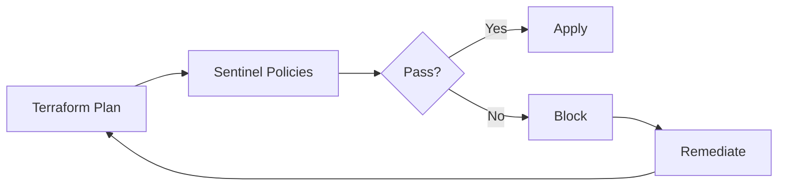

# How to Implement Policy as Code with Sentinel

Author: [nawazdhandala](https://www.github.com/nawazdhandala)

Tags: Terraform, Sentinel, Policy as Code, Governance, HashiCorp, Compliance

Description: Learn how to enforce infrastructure policies with HashiCorp Sentinel, from basic rules to complex governance requirements, including cost controls, security standards, and compliance automation.

---

Sentinel is HashiCorp's policy-as-code framework that integrates with Terraform Cloud and Enterprise. It lets you define rules that every Terraform plan must pass before applying. This enables automated governance, security enforcement, and compliance checking without manual review bottlenecks.

## Why Policy as Code

Manual infrastructure reviews do not scale. As teams grow and infrastructure becomes more complex, relying on human review for every change leads to:

- Bottlenecks waiting for approvals
- Inconsistent enforcement
- Missed violations
- Audit gaps

Sentinel solves these by codifying policies that run automatically on every Terraform plan.



## Sentinel Basics

Sentinel policies are written in the Sentinel language, which is designed for policy logic.

```hcl
# Basic policy structure
import "tfplan/v2" as tfplan

# Main rule that determines pass/fail
main = rule {
    all_instances_have_tags
}

# Helper rule
all_instances_have_tags = rule {
    all tfplan.resource_changes as _, rc {
        rc.type is "aws_instance" implies
        rc.change.after.tags is not null
    }
}
```

## Setting Up Sentinel in Terraform Cloud

1. Create a policy set in Terraform Cloud
2. Link it to workspaces
3. Define enforcement levels

### Policy Set Structure

```
sentinel/
|-- sentinel.hcl         # Configuration file
|-- policies/
|   |-- require-tags.sentinel
|   |-- restrict-instance-types.sentinel
|   |-- enforce-encryption.sentinel
|-- test/
    |-- require-tags/
    |   |-- pass.hcl
    |   |-- fail.hcl
    |-- restrict-instance-types/
        |-- pass.hcl
        |-- fail.hcl
```

### sentinel.hcl Configuration

```hcl
# sentinel.hcl
policy "require-tags" {
  source            = "./policies/require-tags.sentinel"
  enforcement_level = "hard-mandatory"
}

policy "restrict-instance-types" {
  source            = "./policies/restrict-instance-types.sentinel"
  enforcement_level = "soft-mandatory"
}

policy "enforce-encryption" {
  source            = "./policies/enforce-encryption.sentinel"
  enforcement_level = "hard-mandatory"
}
```

### Enforcement Levels

- **advisory** - Logged but does not block applies
- **soft-mandatory** - Can be overridden by authorized users
- **hard-mandatory** - Cannot be overridden; blocks applies

## Common Policy Patterns

### Require Tags on All Resources

```hcl
# policies/require-tags.sentinel
import "tfplan/v2" as tfplan
import "strings"

# Required tags for all taggable resources
required_tags = ["Environment", "Owner", "Project"]

# Get all resources that support tags
get_taggable_resources = func() {
    return filter tfplan.resource_changes as _, rc {
        rc.mode is "managed" and
        rc.change.actions is not ["delete"] and
        rc.change.after.tags is not undefined
    }
}

# Check if resource has all required tags
has_required_tags = func(resource) {
    tags = resource.change.after.tags else {}

    missing_tags = []
    for required_tags as tag {
        if tags[tag] is undefined or tags[tag] is null {
            append(missing_tags, tag)
        }
    }

    return length(missing_tags) is 0
}

# Main rule
main = rule {
    all get_taggable_resources() as _, resource {
        has_required_tags(resource)
    }
}
```

### Restrict Instance Types

```hcl
# policies/restrict-instance-types.sentinel
import "tfplan/v2" as tfplan

# Allowed instance types by environment
allowed_types = {
    "production": ["t3.medium", "t3.large", "t3.xlarge", "m5.large", "m5.xlarge"],
    "staging":    ["t3.micro", "t3.small", "t3.medium"],
    "dev":        ["t3.micro", "t3.small"],
}

# Get EC2 instances from plan
get_ec2_instances = func() {
    return filter tfplan.resource_changes as _, rc {
        rc.type is "aws_instance" and
        rc.mode is "managed" and
        rc.change.actions is not ["delete"]
    }
}

# Validate instance type
validate_instance_type = func(instance) {
    env = instance.change.after.tags["Environment"] else "dev"
    instance_type = instance.change.after.instance_type
    allowed = allowed_types[env] else allowed_types["dev"]

    return instance_type in allowed
}

main = rule {
    all get_ec2_instances() as _, instance {
        validate_instance_type(instance)
    }
}
```

### Enforce S3 Bucket Encryption

```hcl
# policies/enforce-encryption.sentinel
import "tfplan/v2" as tfplan

# Get S3 buckets
get_s3_buckets = func() {
    return filter tfplan.resource_changes as _, rc {
        rc.type is "aws_s3_bucket" and
        rc.mode is "managed" and
        rc.change.actions is not ["delete"]
    }
}

# Get encryption configurations
get_encryption_configs = func() {
    return filter tfplan.resource_changes as _, rc {
        rc.type is "aws_s3_bucket_server_side_encryption_configuration" and
        rc.mode is "managed"
    }
}

# Check if bucket has encryption configuration
bucket_has_encryption = func(bucket_name) {
    configs = get_encryption_configs()

    for configs as _, config {
        if config.change.after.bucket contains bucket_name {
            return true
        }
    }
    return false
}

main = rule {
    buckets = get_s3_buckets()
    all buckets as _, bucket {
        bucket_has_encryption(bucket.change.after.bucket)
    }
}
```

## Cost Control Policies

### Maximum Resource Count

```hcl
# policies/max-resources.sentinel
import "tfplan/v2" as tfplan

# Maximum allowed instances
max_instances = 10

get_ec2_instances = func() {
    return filter tfplan.resource_changes as _, rc {
        rc.type is "aws_instance" and
        rc.mode is "managed" and
        rc.change.actions is not ["delete"]
    }
}

main = rule {
    length(get_ec2_instances()) <= max_instances
}
```

### Restrict Expensive Resources

```hcl
# policies/restrict-expensive-resources.sentinel
import "tfplan/v2" as tfplan

# Resources that require special approval
expensive_resources = [
    "aws_db_instance",
    "aws_redshift_cluster",
    "aws_elasticsearch_domain",
    "aws_emr_cluster",
]

get_expensive_resources = func() {
    return filter tfplan.resource_changes as _, rc {
        rc.type in expensive_resources and
        rc.mode is "managed" and
        rc.change.actions contains "create"
    }
}

# Allow in production only
main = rule {
    resources = get_expensive_resources()
    all resources as _, r {
        tags = r.change.after.tags else {}
        tags["Environment"] is "production"
    }
}
```

## Security Policies

### Prevent Public S3 Buckets

```hcl
# policies/no-public-s3.sentinel
import "tfplan/v2" as tfplan

# Get S3 bucket ACL configurations
get_bucket_acls = func() {
    return filter tfplan.resource_changes as _, rc {
        rc.type is "aws_s3_bucket_acl" and
        rc.mode is "managed" and
        rc.change.actions is not ["delete"]
    }
}

# Get public access block configurations
get_public_access_blocks = func() {
    return filter tfplan.resource_changes as _, rc {
        rc.type is "aws_s3_bucket_public_access_block" and
        rc.mode is "managed"
    }
}

# Check for public ACLs
no_public_acls = rule {
    all get_bucket_acls() as _, acl {
        acl.change.after.acl not in ["public-read", "public-read-write", "authenticated-read"]
    }
}

# Check that public access is blocked
public_access_blocked = rule {
    blocks = get_public_access_blocks()
    all blocks as _, block {
        after = block.change.after
        after.block_public_acls is true and
        after.block_public_policy is true and
        after.ignore_public_acls is true and
        after.restrict_public_buckets is true
    }
}

main = rule {
    no_public_acls and public_access_blocked
}
```

### Require VPC for Databases

```hcl
# policies/require-vpc-database.sentinel
import "tfplan/v2" as tfplan

get_rds_instances = func() {
    return filter tfplan.resource_changes as _, rc {
        rc.type is "aws_db_instance" and
        rc.mode is "managed" and
        rc.change.actions is not ["delete"]
    }
}

main = rule {
    all get_rds_instances() as _, db {
        after = db.change.after

        # Must have subnet group (VPC)
        after.db_subnet_group_name is not null and

        # Must not be publicly accessible
        after.publicly_accessible is false
    }
}
```

## Testing Sentinel Policies

### Pass Test

```hcl
# test/require-tags/pass.hcl
mock "tfplan/v2" {
  module {
    source = "mock-tfplan-pass.sentinel"
  }
}

test {
  rules = {
    main = true
  }
}
```

### Fail Test

```hcl
# test/require-tags/fail.hcl
mock "tfplan/v2" {
  module {
    source = "mock-tfplan-fail.sentinel"
  }
}

test {
  rules = {
    main = false
  }
}
```

### Mock Data

```hcl
# test/require-tags/mock-tfplan-pass.sentinel
resource_changes = {
    "aws_instance.web": {
        "type": "aws_instance",
        "mode": "managed",
        "change": {
            "actions": ["create"],
            "after": {
                "instance_type": "t3.micro",
                "tags": {
                    "Environment": "production",
                    "Owner": "platform-team",
                    "Project": "web-app"
                }
            }
        }
    }
}
```

Run tests with:

```bash
sentinel test
```

## Using Sentinel with tfconfig

Access Terraform configuration (HCL) alongside the plan.

```hcl
# policies/no-hardcoded-secrets.sentinel
import "tfconfig/v2" as tfconfig
import "strings"

# Check for hardcoded secrets in variables
get_sensitive_patterns = func() {
    return ["password", "secret", "api_key", "token", "credentials"]
}

# Find variables that might contain secrets
check_variables = func() {
    violations = []

    for tfconfig.variables as name, v {
        for get_sensitive_patterns() as pattern {
            if strings.contains(strings.to_lower(name), pattern) {
                if v.default is not null {
                    append(violations, name)
                }
            }
        }
    }

    return violations
}

main = rule {
    length(check_variables()) is 0
}
```

## Best Practices

1. **Start with advisory policies** - Let teams see violations before enforcing.

2. **Use meaningful error messages** - Help users understand why policies fail.

3. **Test policies thoroughly** - Use mock data for both passing and failing cases.

4. **Version control policies** - Treat policies like code with reviews and history.

5. **Group related policies** - Organize by concern (security, cost, compliance).

6. **Document policy requirements** - Explain what the policy enforces and why.

```hcl
# Good: Clear error message
main = rule when length(violations) > 0 {
    print("ERROR: The following resources are missing required tags:")
    print(violations)
    false
} else {
    true
}
```

---

Sentinel brings automation to infrastructure governance. Start with a few critical policies like tagging and security requirements, then expand coverage as your team gains experience. The goal is not to block every change but to catch violations early and consistently, freeing up human reviewers for more complex decisions.
