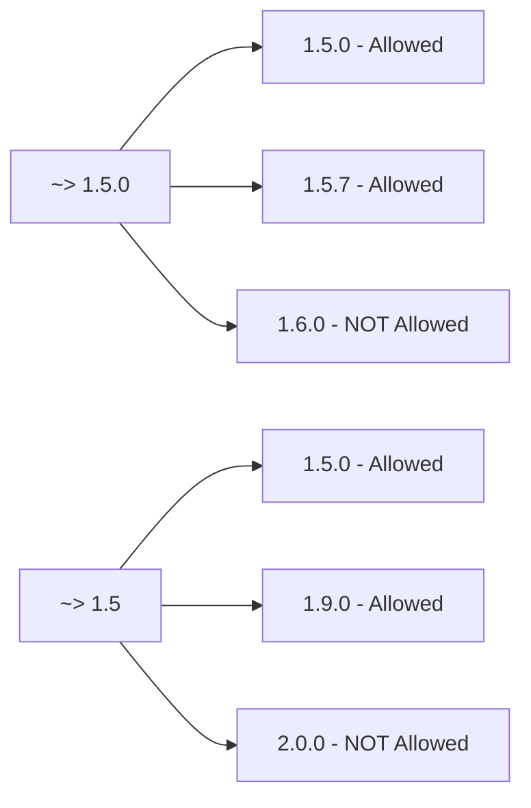

# How to Manage Version Constraints in Terraform

Author: [nawazdhandala](https://www.github.com/nawazdhandala)

Tags: Terraform, Version Constraints, Infrastructure as Code, DevOps, Dependencies

Description: Learn how to specify and manage version constraints for Terraform itself, providers, and modules to ensure reproducible infrastructure deployments and safe upgrades.

---

Version constraints in Terraform ensure your infrastructure deploys consistently across team members and CI/CD pipelines. Without proper constraints, different versions of Terraform or providers can produce different results or fail entirely. This guide covers version management for Terraform, providers, and modules.

## Terraform Core Version Constraints

Specify the required Terraform version in your configuration.

```hcl
terraform {
  # Require at least version 1.5.0
  required_version = ">= 1.5.0"
}

# More specific constraint
terraform {
  # Require 1.5.x but not 1.6.0 or higher
  required_version = "~> 1.5.0"
}

# Range constraint
terraform {
  # Between 1.5.0 and 2.0.0 (exclusive)
  required_version = ">= 1.5.0, < 2.0.0"
}
```

### Constraint Operators

| Operator | Meaning | Example |
|----------|---------|---------|
| `=` | Exact version | `= 1.5.0` |
| `!=` | Not this version | `!= 1.5.1` |
| `>`, `>=` | Greater than | `>= 1.5.0` |
| `<`, `<=` | Less than | `< 2.0.0` |
| `~>` | Pessimistic (allows patch updates) | `~> 1.5.0` allows 1.5.x |



## Provider Version Constraints

Pin provider versions to avoid unexpected changes.

```hcl
terraform {
  required_version = ">= 1.5.0"

  required_providers {
    aws = {
      source  = "hashicorp/aws"
      version = "~> 5.0"
    }

    google = {
      source  = "hashicorp/google"
      version = ">= 4.0, < 6.0"
    }

    azurerm = {
      source  = "hashicorp/azurerm"
      version = "~> 3.75"
    }

    kubernetes = {
      source  = "hashicorp/kubernetes"
      version = "~> 2.23"
    }

    random = {
      source  = "hashicorp/random"
      version = "~> 3.5"
    }

    null = {
      source  = "hashicorp/null"
      version = "~> 3.2"
    }
  }
}
```

### Why Pin Provider Versions

Without version constraints, `terraform init` downloads the latest provider version. This can break your configuration when:

- A provider releases a breaking change
- A new version deprecates resources you use
- Different team members get different versions

```hcl
# BAD: No version constraint
terraform {
  required_providers {
    aws = {
      source = "hashicorp/aws"
      # No version specified - uses latest
    }
  }
}

# GOOD: Pessimistic constraint
terraform {
  required_providers {
    aws = {
      source  = "hashicorp/aws"
      version = "~> 5.0"  # Allows 5.x but not 6.0
    }
  }
}

# ALSO GOOD: Range constraint for more control
terraform {
  required_providers {
    aws = {
      source  = "hashicorp/aws"
      version = ">= 5.0, < 5.50"  # Specific range
    }
  }
}
```

## The Dependency Lock File

Terraform creates `.terraform.lock.hcl` to lock exact provider versions.

```hcl
# .terraform.lock.hcl (auto-generated)
provider "registry.terraform.io/hashicorp/aws" {
  version     = "5.31.0"
  constraints = "~> 5.0"
  hashes = [
    "h1:abc123...",
    "zh:def456...",
  ]
}
```

### Managing the Lock File

```bash
# Initialize and create/update lock file
terraform init

# Upgrade providers within constraints
terraform init -upgrade

# Update lock file for multiple platforms
terraform providers lock \
  -platform=linux_amd64 \
  -platform=darwin_amd64 \
  -platform=darwin_arm64 \
  -platform=windows_amd64
```

Always commit `.terraform.lock.hcl` to version control.

## Module Version Constraints

Pin module versions to ensure reproducibility.

### Registry Modules

```hcl
# Version constraint for registry modules
module "vpc" {
  source  = "terraform-aws-modules/vpc/aws"
  version = "~> 5.0"

  name = "my-vpc"
  cidr = "10.0.0.0/16"
}

# Exact version for critical infrastructure
module "eks" {
  source  = "terraform-aws-modules/eks/aws"
  version = "= 19.21.0"  # Exact version

  cluster_name = "my-cluster"
}

# Range for flexibility
module "rds" {
  source  = "terraform-aws-modules/rds/aws"
  version = ">= 6.0, < 7.0"

  identifier = "my-database"
}
```

### Git-Based Modules

```hcl
# Specific tag
module "network" {
  source = "git::https://github.com/org/terraform-modules.git//network?ref=v1.2.0"
}

# Specific commit
module "database" {
  source = "git::https://github.com/org/terraform-modules.git//database?ref=abc1234"
}

# Branch (not recommended for production)
module "experimental" {
  source = "git::https://github.com/org/terraform-modules.git//experimental?ref=feature-branch"
}
```

### Local Modules

Local modules do not have version constraints but you should document them.

```hcl
# Local module - version managed by your repository
module "app" {
  source = "./modules/app"

  # Document the module version in comments or README
  # Module version: 1.0.0 (based on commit abc123)
}
```

## Version Constraint Strategies

### For Development

Use looser constraints to get latest patches.

```hcl
terraform {
  required_version = ">= 1.5.0"

  required_providers {
    aws = {
      source  = "hashicorp/aws"
      version = "~> 5.0"
    }
  }
}
```

### For Production

Use tighter constraints for stability.

```hcl
terraform {
  required_version = "~> 1.5.7"  # Minor version pinned

  required_providers {
    aws = {
      source  = "hashicorp/aws"
      version = "~> 5.31.0"  # Patch version pinned
    }
  }
}
```

### For Shared Modules

Use wide constraints for compatibility.

```hcl
# modules/vpc/versions.tf
terraform {
  required_version = ">= 1.3.0"

  required_providers {
    aws = {
      source  = "hashicorp/aws"
      version = ">= 4.0, < 6.0"  # Wide range
    }
  }
}
```

## Upgrading Versions Safely

### Step 1: Check Current Versions

```bash
# Show current provider versions
terraform version

# Show providers in state
terraform providers
```

### Step 2: Update Constraints

```hcl
# Before
terraform {
  required_providers {
    aws = {
      source  = "hashicorp/aws"
      version = "~> 4.0"
    }
  }
}

# After
terraform {
  required_providers {
    aws = {
      source  = "hashicorp/aws"
      version = "~> 5.0"
    }
  }
}
```

### Step 3: Upgrade Providers

```bash
# Upgrade providers within new constraints
terraform init -upgrade

# Review changes in lock file
git diff .terraform.lock.hcl
```

### Step 4: Plan and Review

```bash
# Create a plan to see any changes
terraform plan -out=upgrade.plan

# Review the plan carefully for unexpected changes
```

### Step 5: Apply in Non-Production First

```bash
# Apply to development first
terraform apply upgrade.plan

# Then staging, then production
```

## Handling Version Conflicts

When modules require different provider versions, you may see conflicts.

```
Error: Failed to query available provider packages

Could not retrieve the list of available versions for provider
hashicorp/aws: no available releases match the given constraints
~> 4.0, ~> 5.0
```

### Resolution Strategies

1. **Update the stricter constraint**

```hcl
# Change module to accept wider range
terraform {
  required_providers {
    aws = {
      source  = "hashicorp/aws"
      version = ">= 4.0"  # Wider constraint
    }
  }
}
```

2. **Use provider aliases for different versions** (not recommended)

3. **Update modules to use compatible versions**

## Automation and CI/CD

### Renovate Configuration

```json
{
  "extends": ["config:base"],
  "terraform": {
    "enabled": true
  },
  "packageRules": [
    {
      "matchManagers": ["terraform"],
      "matchUpdateTypes": ["minor", "patch"],
      "automerge": true
    },
    {
      "matchManagers": ["terraform"],
      "matchUpdateTypes": ["major"],
      "automerge": false
    }
  ]
}
```

### Dependabot Configuration

```yaml
# .github/dependabot.yml
version: 2
updates:
  - package-ecosystem: "terraform"
    directory: "/"
    schedule:
      interval: "weekly"
    open-pull-requests-limit: 5
```

## Best Practices

1. **Always specify Terraform version** - Avoid surprises from version differences.

2. **Use pessimistic constraints (~>)** - Allow patches but prevent major/minor surprises.

3. **Commit the lock file** - Ensures everyone uses the same versions.

4. **Test upgrades in non-production** - Provider updates can have breaking changes.

5. **Document version requirements** - Add comments explaining constraint choices.

6. **Automate updates** - Use Dependabot or Renovate to track available updates.

7. **Review provider changelogs** - Before upgrading, check for breaking changes.

```hcl
terraform {
  # Terraform 1.5+ required for check blocks and import blocks
  required_version = ">= 1.5.0, < 2.0.0"

  required_providers {
    aws = {
      source  = "hashicorp/aws"
      # Version 5.x required for new EKS features
      # Pinned to 5.31 to avoid breaking change in 5.32
      version = "~> 5.31.0"
    }
  }
}
```

---

Version constraints are your safety net against unexpected infrastructure changes. Start with pessimistic constraints that allow patches, commit your lock file, and establish a regular upgrade cadence. The small investment in version management prevents hours of debugging mysterious failures caused by version drift.
