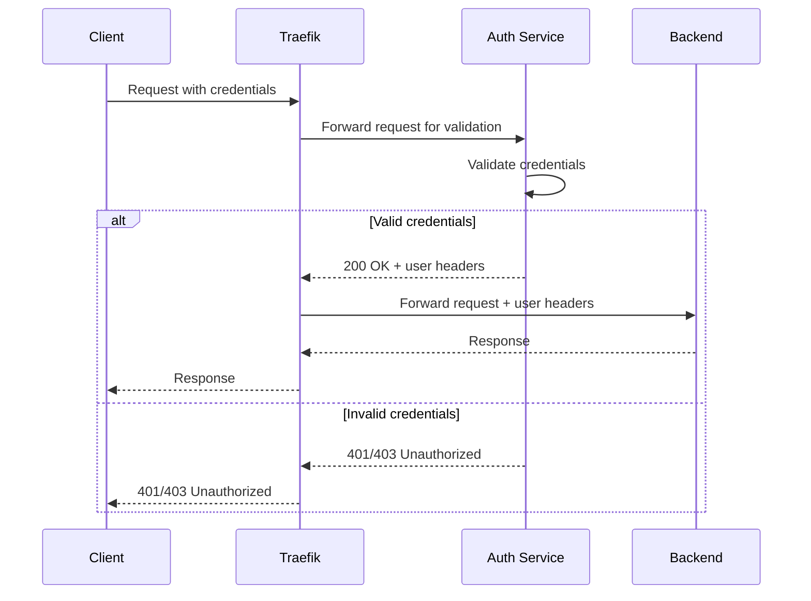
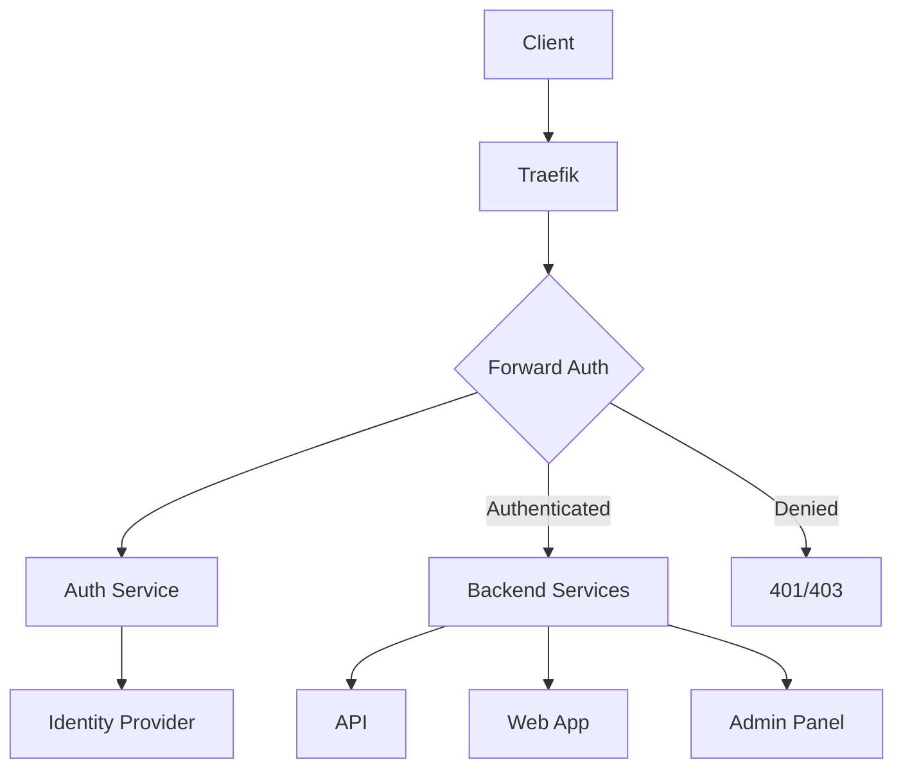

# How to Implement Forward Authentication in Traefik

Author: [nawazdhandala](https://www.github.com/nawazdhandala)

Tags: Traefik, Authentication, Forward Auth, OAuth, Security

Description: Configure Traefik forward authentication to delegate authentication to external services, enabling SSO, OAuth, and custom auth solutions.

---

Forward authentication delegates authentication decisions to an external service. Instead of Traefik validating credentials directly, it forwards requests to an authentication service that decides whether to allow or deny access. This pattern enables sophisticated authentication scenarios like OAuth, JWT validation, and single sign-on.

This guide covers setting up forward authentication in Traefik, integrating with popular auth providers, and building custom authentication services.

## How Forward Authentication Works

When a request arrives, Traefik forwards it to the auth service. Based on the response:

- **2xx response**: Request is allowed; Traefik forwards to the backend
- **Non-2xx response**: Request is denied; Traefik returns the auth service response to the client



## Basic Forward Auth Configuration

Create a forward auth middleware:

```yaml
# forward-auth-middleware.yaml
apiVersion: traefik.io/v1alpha1
kind: Middleware
metadata:
  name: forward-auth
  namespace: default
spec:
  forwardAuth:
    # URL of your authentication service
    address: http://auth-service.default.svc:8080/verify
    # Headers to forward from the original request
    authRequestHeaders:
      - Authorization
      - Cookie
    # Headers from auth response to forward to backend
    authResponseHeaders:
      - X-User-ID
      - X-User-Email
      - X-User-Role
```

Apply to a route:

```yaml
# protected-route.yaml
apiVersion: traefik.io/v1alpha1
kind: IngressRoute
metadata:
  name: protected-api
  namespace: default
spec:
  entryPoints:
    - websecure
  routes:
    - match: Host(`api.example.com`)
      kind: Rule
      middlewares:
        - name: forward-auth
      services:
        - name: api-service
          port: 8080
  tls: {}
```

## Building a Custom Auth Service

Create a simple authentication service:

```python
# auth_service.py
from flask import Flask, request, Response
import jwt

app = Flask(__name__)
SECRET_KEY = "your-secret-key"

@app.route('/verify')
def verify():
    # Extract token from Authorization header
    auth_header = request.headers.get('Authorization', '')

    if not auth_header.startswith('Bearer '):
        return Response('Missing token', status=401)

    token = auth_header[7:]  # Remove 'Bearer ' prefix

    try:
        # Validate JWT token
        payload = jwt.decode(token, SECRET_KEY, algorithms=['HS256'])

        # Return success with user info headers
        response = Response('OK', status=200)
        response.headers['X-User-ID'] = str(payload.get('sub'))
        response.headers['X-User-Email'] = payload.get('email', '')
        response.headers['X-User-Role'] = payload.get('role', 'user')
        return response

    except jwt.ExpiredSignatureError:
        return Response('Token expired', status=401)
    except jwt.InvalidTokenError:
        return Response('Invalid token', status=401)

if __name__ == '__main__':
    app.run(host='0.0.0.0', port=8080)
```

Deploy the auth service:

```yaml
# auth-service-deployment.yaml
apiVersion: apps/v1
kind: Deployment
metadata:
  name: auth-service
  namespace: default
spec:
  replicas: 2
  selector:
    matchLabels:
      app: auth-service
  template:
    metadata:
      labels:
        app: auth-service
    spec:
      containers:
        - name: auth
          image: your-registry/auth-service:latest
          ports:
            - containerPort: 8080
          env:
            - name: SECRET_KEY
              valueFrom:
                secretKeyRef:
                  name: auth-secrets
                  key: jwt-secret
---
apiVersion: v1
kind: Service
metadata:
  name: auth-service
  namespace: default
spec:
  selector:
    app: auth-service
  ports:
    - port: 8080
      targetPort: 8080
```

## Integrating with OAuth2 Proxy

OAuth2 Proxy handles OAuth authentication flow with various providers:

```yaml
# oauth2-proxy-deployment.yaml
apiVersion: apps/v1
kind: Deployment
metadata:
  name: oauth2-proxy
  namespace: default
spec:
  replicas: 2
  selector:
    matchLabels:
      app: oauth2-proxy
  template:
    metadata:
      labels:
        app: oauth2-proxy
    spec:
      containers:
        - name: oauth2-proxy
          image: quay.io/oauth2-proxy/oauth2-proxy:v7.5.0
          args:
            - --provider=google
            - --email-domain=yourcompany.com
            - --upstream=http://localhost:8080
            - --http-address=0.0.0.0:4180
            - --cookie-secure=true
            - --cookie-domain=.example.com
            - --set-xauthrequest=true
          env:
            - name: OAUTH2_PROXY_CLIENT_ID
              valueFrom:
                secretKeyRef:
                  name: oauth2-secrets
                  key: client-id
            - name: OAUTH2_PROXY_CLIENT_SECRET
              valueFrom:
                secretKeyRef:
                  name: oauth2-secrets
                  key: client-secret
            - name: OAUTH2_PROXY_COOKIE_SECRET
              valueFrom:
                secretKeyRef:
                  name: oauth2-secrets
                  key: cookie-secret
          ports:
            - containerPort: 4180
---
apiVersion: v1
kind: Service
metadata:
  name: oauth2-proxy
  namespace: default
spec:
  selector:
    app: oauth2-proxy
  ports:
    - port: 4180
      targetPort: 4180
```

Configure Traefik to use OAuth2 Proxy:

```yaml
# oauth2-forward-auth.yaml
apiVersion: traefik.io/v1alpha1
kind: Middleware
metadata:
  name: oauth2-auth
  namespace: default
spec:
  forwardAuth:
    address: http://oauth2-proxy.default.svc:4180/oauth2/auth
    trustForwardHeader: true
    authResponseHeaders:
      - X-Auth-Request-User
      - X-Auth-Request-Email
      - X-Auth-Request-Groups
---
# Separate route for OAuth2 callback
apiVersion: traefik.io/v1alpha1
kind: IngressRoute
metadata:
  name: oauth2-routes
  namespace: default
spec:
  entryPoints:
    - websecure
  routes:
    # OAuth callback and sign-in routes (not protected)
    - match: Host(`auth.example.com`) && PathPrefix(`/oauth2`)
      kind: Rule
      services:
        - name: oauth2-proxy
          port: 4180
  tls: {}
---
# Protected application
apiVersion: traefik.io/v1alpha1
kind: IngressRoute
metadata:
  name: protected-app
  namespace: default
spec:
  entryPoints:
    - websecure
  routes:
    - match: Host(`app.example.com`)
      kind: Rule
      middlewares:
        - name: oauth2-auth
      services:
        - name: app-service
          port: 80
  tls: {}
```

## Header Propagation

Control which headers flow between services:

```yaml
# header-propagation.yaml
apiVersion: traefik.io/v1alpha1
kind: Middleware
metadata:
  name: auth-with-headers
  namespace: default
spec:
  forwardAuth:
    address: http://auth-service:8080/verify
    # Headers from client request sent to auth service
    authRequestHeaders:
      - Authorization
      - Cookie
      - X-Forwarded-For
      - X-Real-IP
    # Headers from auth response added to backend request
    authResponseHeaders:
      - X-User-ID
      - X-User-Email
      - X-User-Role
      - X-Tenant-ID
    # Headers from auth response copied to client response
    # (useful for setting cookies)
    authResponseHeadersRegex: "^X-Auth-"
```

## Caching Authentication Results

Reduce load on auth service with response caching:

```yaml
# auth-with-cache.yaml
apiVersion: traefik.io/v1alpha1
kind: Middleware
metadata:
  name: cached-auth
  namespace: default
spec:
  forwardAuth:
    address: http://auth-service:8080/verify
    authRequestHeaders:
      - Authorization
    authResponseHeaders:
      - X-User-ID
    # Trust headers that auth service sets
    trustForwardHeader: true
```

Implement caching in your auth service:

```python
# cached_auth_service.py
from flask import Flask, request, Response
from functools import lru_cache
import jwt
import time

app = Flask(__name__)

@lru_cache(maxsize=1000)
def validate_token_cached(token, timestamp):
    """Cache validation results for 5 minutes"""
    # timestamp parameter forces cache refresh every 5 minutes
    try:
        return jwt.decode(token, SECRET_KEY, algorithms=['HS256'])
    except:
        return None

@app.route('/verify')
def verify():
    auth_header = request.headers.get('Authorization', '')
    if not auth_header.startswith('Bearer '):
        return Response('Missing token', status=401)

    token = auth_header[7:]
    # Round timestamp to 5-minute windows for caching
    cache_timestamp = int(time.time() / 300)

    payload = validate_token_cached(token, cache_timestamp)

    if payload:
        response = Response('OK', status=200)
        response.headers['X-User-ID'] = str(payload.get('sub'))
        return response
    else:
        return Response('Invalid token', status=401)
```

## Role-Based Access Control

Implement RBAC through forward auth:

```yaml
# rbac-auth.yaml
# Admin-only middleware
apiVersion: traefik.io/v1alpha1
kind: Middleware
metadata:
  name: admin-auth
  namespace: default
spec:
  forwardAuth:
    address: http://auth-service:8080/verify?required_role=admin
    authRequestHeaders:
      - Authorization
    authResponseHeaders:
      - X-User-ID
      - X-User-Role
---
# User-level middleware
apiVersion: traefik.io/v1alpha1
kind: Middleware
metadata:
  name: user-auth
  namespace: default
spec:
  forwardAuth:
    address: http://auth-service:8080/verify?required_role=user
    authRequestHeaders:
      - Authorization
    authResponseHeaders:
      - X-User-ID
      - X-User-Role
---
apiVersion: traefik.io/v1alpha1
kind: IngressRoute
metadata:
  name: rbac-routes
  namespace: default
spec:
  entryPoints:
    - websecure
  routes:
    # Admin routes
    - match: Host(`api.example.com`) && PathPrefix(`/admin`)
      kind: Rule
      middlewares:
        - name: admin-auth
      services:
        - name: admin-service
          port: 8080

    # User routes
    - match: Host(`api.example.com`) && PathPrefix(`/api`)
      kind: Rule
      middlewares:
        - name: user-auth
      services:
        - name: api-service
          port: 8080

    # Public routes
    - match: Host(`api.example.com`) && PathPrefix(`/public`)
      kind: Rule
      services:
        - name: public-service
          port: 8080
  tls: {}
```

## Error Handling

Customize error responses from the auth service:

```python
# auth_with_errors.py
from flask import Flask, request, Response, jsonify

app = Flask(__name__)

@app.route('/verify')
def verify():
    auth_header = request.headers.get('Authorization', '')

    if not auth_header:
        return jsonify({
            "error": "authentication_required",
            "message": "Please provide an Authorization header"
        }), 401

    if not auth_header.startswith('Bearer '):
        return jsonify({
            "error": "invalid_format",
            "message": "Authorization header must use Bearer scheme"
        }), 401

    token = auth_header[7:]

    try:
        payload = jwt.decode(token, SECRET_KEY, algorithms=['HS256'])
        response = Response('', status=200)
        response.headers['X-User-ID'] = str(payload.get('sub'))
        return response

    except jwt.ExpiredSignatureError:
        return jsonify({
            "error": "token_expired",
            "message": "Your session has expired, please log in again"
        }), 401

    except jwt.InvalidTokenError as e:
        return jsonify({
            "error": "invalid_token",
            "message": "The provided token is invalid"
        }), 401
```

## Testing Forward Auth

Verify your setup works correctly:

```bash
# Test without token - should get 401
curl -v https://api.example.com/protected

# Test with invalid token - should get 401
curl -v -H "Authorization: Bearer invalid" https://api.example.com/protected

# Test with valid token - should succeed
TOKEN=$(curl -s -X POST https://auth.example.com/login \
  -d '{"username":"test","password":"test"}' | jq -r '.token')
curl -v -H "Authorization: Bearer $TOKEN" https://api.example.com/protected

# Check that user headers are passed to backend
# (requires backend to echo headers)
curl -H "Authorization: Bearer $TOKEN" https://api.example.com/debug/headers
```

## Architecture Overview



## Best Practices

1. **Keep auth service fast**: Authentication adds latency to every request
2. **Cache when possible**: Reduce load on auth service and identity providers
3. **Use TLS**: Always use HTTPS between Traefik and auth service
4. **Handle errors gracefully**: Return clear error messages to clients
5. **Log authentication events**: Track successful and failed auth attempts
6. **Implement health checks**: Ensure auth service availability
7. **Plan for auth service failure**: Consider fail-open vs fail-close behavior

---

Forward authentication separates authentication logic from your applications and proxy configuration. Your services receive pre-validated requests with user context in headers. This pattern scales well, supports complex auth flows, and keeps security logic centralized in a dedicated service.
