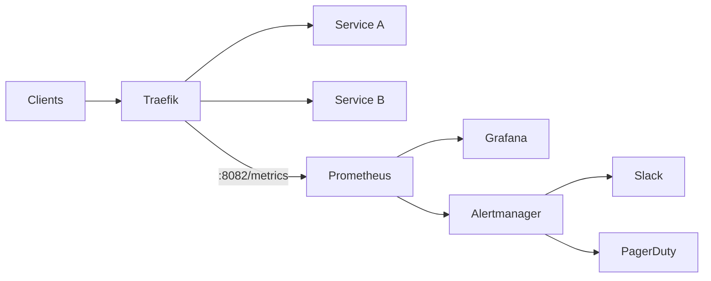

# How to Configure Prometheus Metrics with Traefik

Author: [nawazdhandala](https://www.github.com/nawazdhandala)

Tags: Traefik, Prometheus, Metrics, Monitoring, Observability

Description: Enable and configure Prometheus metrics in Traefik for comprehensive monitoring, including custom labels, histograms, and Grafana dashboard setup.

---

Traefik exposes rich metrics about request rates, latencies, and errors in Prometheus format. These metrics are essential for monitoring application health, setting up alerts, and debugging performance issues. With proper configuration, you get visibility into every request flowing through your proxy.

This guide covers enabling Prometheus metrics in Traefik, configuring useful labels, setting up scraping, and building dashboards for visualization.

## Enabling Prometheus Metrics

Add the metrics configuration to Traefik's static configuration:

```yaml
# traefik-metrics-config.yaml
apiVersion: v1
kind: ConfigMap
metadata:
  name: traefik-config
  namespace: traefik
data:
  traefik.yaml: |
    # Define entrypoints
    entryPoints:
      web:
        address: ":80"
      websecure:
        address: ":443"
      # Dedicated entrypoint for metrics
      metrics:
        address: ":8082"

    # Enable Prometheus metrics
    metrics:
      prometheus:
        # Expose metrics on the metrics entrypoint
        entryPoint: metrics
        # Add labels for detailed breakdowns
        addEntryPointsLabels: true
        addRoutersLabels: true
        addServicesLabels: true
        # Histogram buckets for latency distribution
        buckets:
          - 0.005
          - 0.01
          - 0.025
          - 0.05
          - 0.1
          - 0.25
          - 0.5
          - 1.0
          - 2.5
          - 5.0
          - 10.0

    providers:
      kubernetesCRD: {}
```

## Exposing Metrics Endpoint

Update the Traefik Service to expose the metrics port:

```yaml
# traefik-service-metrics.yaml
apiVersion: v1
kind: Service
metadata:
  name: traefik
  namespace: traefik
  labels:
    app: traefik
spec:
  type: LoadBalancer
  selector:
    app: traefik
  ports:
    - name: web
      port: 80
      targetPort: 80
    - name: websecure
      port: 443
      targetPort: 443
    - name: metrics
      port: 8082
      targetPort: 8082
```

Verify metrics are exposed:

```bash
# Port-forward to access metrics locally
kubectl port-forward -n traefik svc/traefik 8082:8082

# Fetch metrics
curl http://localhost:8082/metrics
```

## Available Metrics

Traefik exposes these key metrics:

```text
# Request counters
traefik_entrypoint_requests_total{code, method, protocol, entrypoint}
traefik_router_requests_total{code, method, protocol, router, service}
traefik_service_requests_total{code, method, protocol, service}

# Request duration histograms
traefik_entrypoint_request_duration_seconds_bucket{...}
traefik_router_request_duration_seconds_bucket{...}
traefik_service_request_duration_seconds_bucket{...}

# Open connections
traefik_entrypoint_open_connections{entrypoint, method, protocol}
traefik_service_open_connections{method, protocol, service}

# TLS metrics
traefik_tls_certs_not_after{cn, sans, serial}

# Retry metrics
traefik_service_retries_total{service}
```

## Configuring Prometheus Scraping

### Using ServiceMonitor (Prometheus Operator)

```yaml
# traefik-servicemonitor.yaml
apiVersion: monitoring.coreos.com/v1
kind: ServiceMonitor
metadata:
  name: traefik
  namespace: monitoring
  labels:
    release: prometheus
spec:
  namespaceSelector:
    matchNames:
      - traefik
  selector:
    matchLabels:
      app: traefik
  endpoints:
    - port: metrics
      interval: 15s
      path: /metrics
```

### Using Prometheus Config (Static)

```yaml
# prometheus-config.yaml
scrape_configs:
  - job_name: 'traefik'
    static_configs:
      - targets: ['traefik.traefik.svc:8082']
    metrics_path: /metrics
    scrape_interval: 15s
```

## Essential Prometheus Queries

### Request Rate

```promql
# Requests per second by service
sum(rate(traefik_service_requests_total[5m])) by (service)

# Requests per second by status code
sum(rate(traefik_service_requests_total[5m])) by (code)

# Total request rate through Traefik
sum(rate(traefik_entrypoint_requests_total[5m]))
```

### Error Rate

```promql
# 5xx error rate by service
sum(rate(traefik_service_requests_total{code=~"5.."}[5m])) by (service)
/
sum(rate(traefik_service_requests_total[5m])) by (service)

# 4xx error rate (client errors)
sum(rate(traefik_service_requests_total{code=~"4.."}[5m])) by (service)
/
sum(rate(traefik_service_requests_total[5m])) by (service)

# All non-2xx responses
sum(rate(traefik_service_requests_total{code!~"2.."}[5m]))
```

### Latency

```promql
# P50 latency by service
histogram_quantile(0.50,
  sum(rate(traefik_service_request_duration_seconds_bucket[5m])) by (le, service)
)

# P95 latency by service
histogram_quantile(0.95,
  sum(rate(traefik_service_request_duration_seconds_bucket[5m])) by (le, service)
)

# P99 latency by service
histogram_quantile(0.99,
  sum(rate(traefik_service_request_duration_seconds_bucket[5m])) by (le, service)
)

# Average latency
sum(rate(traefik_service_request_duration_seconds_sum[5m])) by (service)
/
sum(rate(traefik_service_request_duration_seconds_count[5m])) by (service)
```

### Connection Metrics

```promql
# Current open connections by entrypoint
traefik_entrypoint_open_connections

# Connection count over time
sum(traefik_service_open_connections) by (service)
```

## Setting Up Alerts

Create alerting rules for common issues:

```yaml
# traefik-alerts.yaml
apiVersion: monitoring.coreos.com/v1
kind: PrometheusRule
metadata:
  name: traefik-alerts
  namespace: monitoring
spec:
  groups:
    - name: traefik
      rules:
        # High error rate alert
        - alert: TraefikHighErrorRate
          expr: |
            sum(rate(traefik_service_requests_total{code=~"5.."}[5m])) by (service)
            /
            sum(rate(traefik_service_requests_total[5m])) by (service)
            > 0.05
          for: 5m
          labels:
            severity: warning
          annotations:
            summary: "High error rate on {{ $labels.service }}"
            description: "Error rate is {{ $value | humanizePercentage }}"

        # High latency alert
        - alert: TraefikHighLatency
          expr: |
            histogram_quantile(0.95,
              sum(rate(traefik_service_request_duration_seconds_bucket[5m])) by (le, service)
            ) > 2
          for: 5m
          labels:
            severity: warning
          annotations:
            summary: "High latency on {{ $labels.service }}"
            description: "P95 latency is {{ $value | humanizeDuration }}"

        # Traefik down alert
        - alert: TraefikDown
          expr: up{job="traefik"} == 0
          for: 1m
          labels:
            severity: critical
          annotations:
            summary: "Traefik is down"
            description: "Traefik instance {{ $labels.instance }} is not responding"

        # Certificate expiring soon
        - alert: TraefikCertExpiringSoon
          expr: |
            (traefik_tls_certs_not_after - time()) / 86400 < 14
          for: 1h
          labels:
            severity: warning
          annotations:
            summary: "TLS certificate expiring soon"
            description: "Certificate for {{ $labels.cn }} expires in {{ $value | humanize }} days"

        # High retry rate
        - alert: TraefikHighRetryRate
          expr: |
            sum(rate(traefik_service_retries_total[5m])) by (service)
            /
            sum(rate(traefik_service_requests_total[5m])) by (service)
            > 0.1
          for: 5m
          labels:
            severity: warning
          annotations:
            summary: "High retry rate on {{ $labels.service }}"
            description: "{{ $value | humanizePercentage }} of requests are being retried"
```

## Grafana Dashboard

Create a dashboard for visualizing Traefik metrics:

```json
{
  "title": "Traefik Overview",
  "panels": [
    {
      "title": "Request Rate",
      "type": "graph",
      "targets": [
        {
          "expr": "sum(rate(traefik_service_requests_total[5m])) by (service)",
          "legendFormat": "{{ service }}"
        }
      ]
    },
    {
      "title": "Error Rate",
      "type": "graph",
      "targets": [
        {
          "expr": "sum(rate(traefik_service_requests_total{code=~\"5..\"}[5m])) by (service) / sum(rate(traefik_service_requests_total[5m])) by (service)",
          "legendFormat": "{{ service }}"
        }
      ]
    },
    {
      "title": "P95 Latency",
      "type": "graph",
      "targets": [
        {
          "expr": "histogram_quantile(0.95, sum(rate(traefik_service_request_duration_seconds_bucket[5m])) by (le, service))",
          "legendFormat": "{{ service }}"
        }
      ]
    },
    {
      "title": "Status Codes",
      "type": "piechart",
      "targets": [
        {
          "expr": "sum(increase(traefik_service_requests_total[1h])) by (code)",
          "legendFormat": "{{ code }}"
        }
      ]
    }
  ]
}
```

Import a pre-built dashboard from Grafana.com (Dashboard ID: 4475 or 17346).

## Custom Labels for Better Granularity

Add custom headers and track them:

```yaml
# custom-labels.yaml
apiVersion: v1
kind: ConfigMap
metadata:
  name: traefik-config
  namespace: traefik
data:
  traefik.yaml: |
    metrics:
      prometheus:
        entryPoint: metrics
        addEntryPointsLabels: true
        addRoutersLabels: true
        addServicesLabels: true
        # These increase cardinality - use carefully
        # headerLabels:
        #   X-Tenant-ID: tenant
        #   X-API-Version: api_version
```

## Metrics Cardinality Management

High cardinality metrics can overwhelm Prometheus. Control this:

```yaml
# low-cardinality-config.yaml
apiVersion: v1
kind: ConfigMap
metadata:
  name: traefik-config
  namespace: traefik
data:
  traefik.yaml: |
    metrics:
      prometheus:
        entryPoint: metrics
        # Disable router labels if you have many routes
        addRoutersLabels: false
        # Keep service labels for essential breakdowns
        addServicesLabels: true
        addEntryPointsLabels: true
        # Reduce histogram buckets
        buckets:
          - 0.1
          - 0.5
          - 1.0
          - 5.0
```

## Architecture with Metrics



## Testing Your Metrics Setup

Generate load and verify metrics appear:

```bash
# Generate traffic
for i in {1..1000}; do
  curl -s -o /dev/null https://api.example.com/health
  sleep 0.1
done

# Check Prometheus has the metrics
curl -G "http://prometheus:9090/api/v1/query" \
  --data-urlencode "query=traefik_service_requests_total"

# Verify in Grafana
# Open your dashboard and confirm graphs update
```

## Best Practices

1. **Set appropriate scrape interval**: 15-30 seconds balances freshness and load
2. **Control cardinality**: Disable labels you do not need
3. **Use recording rules**: Pre-compute expensive queries
4. **Set retention appropriately**: Keep detailed metrics for 15-30 days
5. **Create runbooks**: Link alerts to debugging procedures
6. **Test alerts**: Verify alerts fire correctly before production

---

Prometheus metrics transform Traefik from a black box into a transparent system with full observability. Request rates, latencies, and error rates become visible and alertable. Combined with Grafana dashboards, you get real-time insight into all traffic flowing through your infrastructure.
