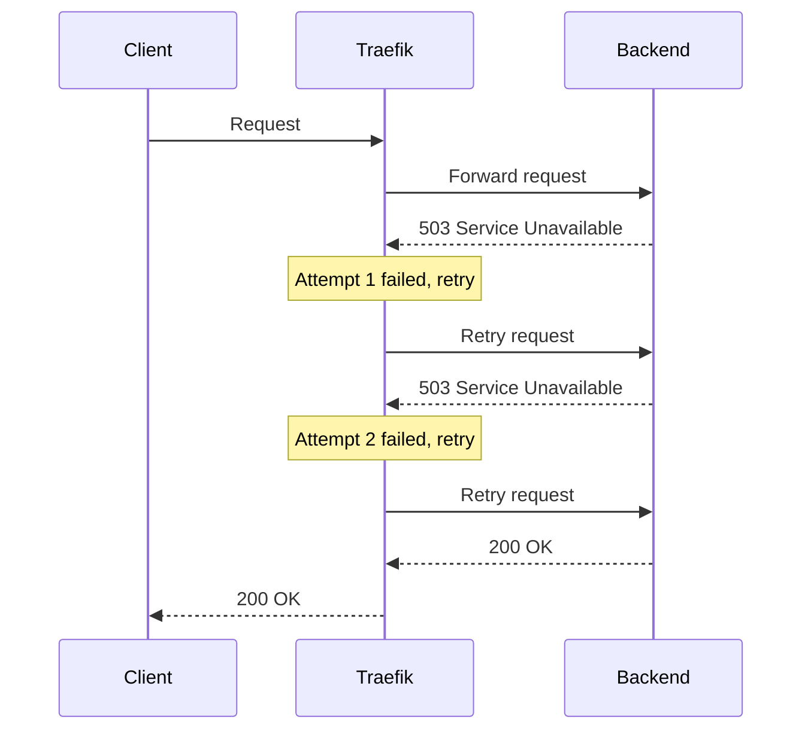
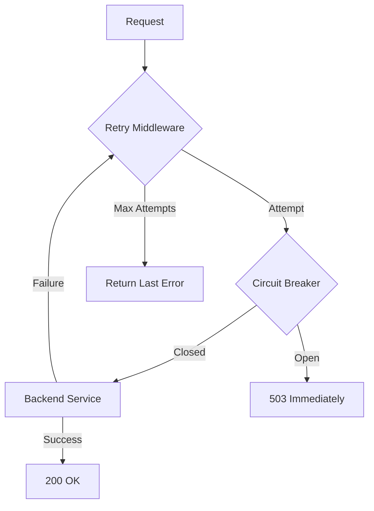

# How to Implement Retry Middleware in Traefik

Author: [nawazdhandala](https://www.github.com/nawazdhandala)

Tags: Traefik, Retry, Resilience, Middleware, Fault Tolerance

Description: Configure retry middleware in Traefik to automatically retry failed requests, handling transient failures and improving application reliability.

---

Network requests fail. Servers restart, connections drop, and temporary overload causes timeouts. Instead of surfacing every transient failure to users, Traefik's retry middleware can automatically retry failed requests, often succeeding on subsequent attempts.

This guide covers configuring retry logic in Traefik, from basic setup to advanced patterns that prevent retry storms and handle different failure scenarios appropriately.

## When to Use Retries

Retries work best for:

- **Transient network failures**: Brief connectivity issues that resolve quickly
- **Server restarts**: Pod replacements during deployments
- **Temporary overload**: Backend briefly unable to accept connections
- **Connection resets**: TCP connections dropped unexpectedly

Retries are not appropriate for:

- **Client errors (4xx)**: Bad requests will not succeed on retry
- **Business logic failures**: Application rejections should not be retried
- **Idempotency issues**: POST requests that create duplicates

## Basic Retry Configuration

Create a retry middleware:

```yaml
# retry-middleware.yaml
apiVersion: traefik.io/v1alpha1
kind: Middleware
metadata:
  name: retry
  namespace: default
spec:
  retry:
    # Maximum number of retry attempts
    attempts: 3
    # Initial wait time between retries
    initialInterval: 100ms
```

Apply it to a route:

```yaml
# retry-route.yaml
apiVersion: traefik.io/v1alpha1
kind: IngressRoute
metadata:
  name: api
  namespace: default
spec:
  entryPoints:
    - websecure
  routes:
    - match: Host(`api.example.com`)
      kind: Rule
      middlewares:
        - name: retry
      services:
        - name: api-service
          port: 8080
  tls: {}
```

## Understanding Retry Behavior

Traefik retries requests when:

- Network errors occur (connection refused, reset, timeout)
- Backend returns 5xx status codes (by default)

Traefik does NOT retry when:

- Backend returns successful response (2xx)
- Backend returns client error (4xx)
- Request body has already been consumed



## Configuring Retry Intervals

Control the timing between retries:

```yaml
# retry-intervals.yaml
apiVersion: traefik.io/v1alpha1
kind: Middleware
metadata:
  name: retry-with-backoff
  namespace: default
spec:
  retry:
    attempts: 4
    # Initial interval between retries
    initialInterval: 100ms
```

The retry intervals follow exponential backoff by default:
- Attempt 1: immediate
- Attempt 2: wait ~100ms
- Attempt 3: wait ~200ms
- Attempt 4: wait ~400ms

## Limiting Total Retry Duration

Prevent retries from taking too long:

```yaml
# retry-with-timeout.yaml
apiVersion: traefik.io/v1alpha1
kind: Middleware
metadata:
  name: bounded-retry
  namespace: default
spec:
  retry:
    attempts: 5
    initialInterval: 200ms
```

Combine with a timeout middleware to cap total request duration:

```yaml
# timeout-middleware.yaml
apiVersion: traefik.io/v1alpha1
kind: Middleware
metadata:
  name: request-timeout
  namespace: default
spec:
  # Overall request timeout including retries
  # Note: This is handled via forwardingTimeouts in service config
---
apiVersion: traefik.io/v1alpha1
kind: IngressRoute
metadata:
  name: api
  namespace: default
spec:
  entryPoints:
    - websecure
  routes:
    - match: Host(`api.example.com`)
      kind: Rule
      middlewares:
        - name: bounded-retry
      services:
        - name: api-service
          port: 8080
          # Response timeout limits each attempt
          responseForwarding:
            flushInterval: 100ms
  tls: {}
```

## Safe Retries for Idempotent Operations

Only retry operations that are safe to repeat:

```yaml
# idempotent-routes.yaml
# GET requests are safe to retry
apiVersion: traefik.io/v1alpha1
kind: Middleware
metadata:
  name: retry-reads
  namespace: default
spec:
  retry:
    attempts: 3
    initialInterval: 100ms
---
# No retry for POST/PUT operations (might cause duplicates)
apiVersion: traefik.io/v1alpha1
kind: IngressRoute
metadata:
  name: api
  namespace: default
spec:
  entryPoints:
    - websecure
  routes:
    # Read operations with retry
    - match: Host(`api.example.com`) && Method(`GET`, `HEAD`, `OPTIONS`)
      kind: Rule
      middlewares:
        - name: retry-reads
      services:
        - name: api-service
          port: 8080

    # Write operations without retry
    - match: Host(`api.example.com`) && Method(`POST`, `PUT`, `DELETE`, `PATCH`)
      kind: Rule
      # No retry middleware
      services:
        - name: api-service
          port: 8080
  tls: {}
```

## Retry with Circuit Breaker

Combine retries with circuit breaker to prevent retry storms:

```yaml
# retry-with-breaker.yaml
apiVersion: traefik.io/v1alpha1
kind: Middleware
metadata:
  name: retry
  namespace: default
spec:
  retry:
    attempts: 3
    initialInterval: 100ms
---
apiVersion: traefik.io/v1alpha1
kind: Middleware
metadata:
  name: circuit-breaker
  namespace: default
spec:
  circuitBreaker:
    expression: NetworkErrorRatio() > 0.50
---
apiVersion: traefik.io/v1alpha1
kind: IngressRoute
metadata:
  name: resilient-api
  namespace: default
spec:
  entryPoints:
    - websecure
  routes:
    - match: Host(`api.example.com`)
      kind: Rule
      middlewares:
        # Order: retry handles individual failures
        # Circuit breaker prevents hammering failing service
        - name: retry
        - name: circuit-breaker
      services:
        - name: api-service
          port: 8080
  tls: {}
```

Flow with both middlewares:



## Different Retry Policies per Service

Apply different retry strategies based on service criticality:

```yaml
# tiered-retries.yaml
# Critical service: aggressive retries
apiVersion: traefik.io/v1alpha1
kind: Middleware
metadata:
  name: retry-critical
  namespace: default
spec:
  retry:
    attempts: 5
    initialInterval: 50ms
---
# Standard service: moderate retries
apiVersion: traefik.io/v1alpha1
kind: Middleware
metadata:
  name: retry-standard
  namespace: default
spec:
  retry:
    attempts: 3
    initialInterval: 100ms
---
# Non-critical service: minimal retries
apiVersion: traefik.io/v1alpha1
kind: Middleware
metadata:
  name: retry-minimal
  namespace: default
spec:
  retry:
    attempts: 2
    initialInterval: 200ms
---
apiVersion: traefik.io/v1alpha1
kind: IngressRoute
metadata:
  name: services
  namespace: default
spec:
  entryPoints:
    - websecure
  routes:
    - match: Host(`api.example.com`) && PathPrefix(`/payments`)
      kind: Rule
      middlewares:
        - name: retry-critical
      services:
        - name: payment-service
          port: 8080

    - match: Host(`api.example.com`) && PathPrefix(`/users`)
      kind: Rule
      middlewares:
        - name: retry-standard
      services:
        - name: user-service
          port: 8080

    - match: Host(`api.example.com`) && PathPrefix(`/analytics`)
      kind: Rule
      middlewares:
        - name: retry-minimal
      services:
        - name: analytics-service
          port: 8080
  tls: {}
```

## Monitoring Retry Behavior

Track retries through Traefik metrics:

```yaml
# Enable metrics in Traefik
apiVersion: v1
kind: ConfigMap
metadata:
  name: traefik-config
  namespace: traefik
data:
  traefik.yaml: |
    metrics:
      prometheus:
        addEntryPointsLabels: true
        addServicesLabels: true
        addRoutersLabels: true
```

Query retry-related metrics:

```promql
# Total requests with retries
sum(rate(traefik_service_retries_total[5m])) by (service)

# Retry ratio - percentage of requests that needed retries
sum(rate(traefik_service_retries_total[5m])) by (service)
/
sum(rate(traefik_service_requests_total[5m])) by (service)

# High retry rate alert
sum(rate(traefik_service_retries_total[5m])) by (service)
/
sum(rate(traefik_service_requests_total[5m])) by (service)
> 0.1
```

## Testing Retry Configuration

Verify retries work as expected:

```bash
# Deploy a service that fails intermittently
kubectl run flaky-app --image=kennethreitz/httpbin --port=80

# Inject failures using httpbin endpoints
# /status/503 returns 503 Service Unavailable

# Test with retries enabled
for i in {1..20}; do
  curl -s -o /dev/null -w "%{http_code} %{time_total}s\n" \
    https://api.example.com/status/503
done

# Observe that some requests succeed due to retries
# (if backend is intermittently failing)
```

Check Traefik logs for retry activity:

```bash
kubectl logs -n traefik deployment/traefik | grep -i retry
```

## Avoiding Retry Storms

When multiple clients retry simultaneously, it can overwhelm a recovering service. Mitigate this:

```yaml
# jitter-and-limits.yaml
apiVersion: traefik.io/v1alpha1
kind: Middleware
metadata:
  name: safe-retry
  namespace: default
spec:
  retry:
    # Fewer attempts to reduce amplification
    attempts: 2
    # Longer initial interval to spread retries
    initialInterval: 500ms
```

Additional strategies:

1. **Use circuit breakers**: Stop retries when service is clearly down
2. **Add jitter**: Traefik adds some randomization by default
3. **Limit concurrent requests**: Use rate limiting before retry
4. **Set reasonable timeouts**: Fast timeouts prevent pile-up

## Retry Headers for Debugging

Add headers to track retry attempts:

```yaml
# retry-headers.yaml
apiVersion: traefik.io/v1alpha1
kind: Middleware
metadata:
  name: retry-with-headers
  namespace: default
spec:
  retry:
    attempts: 3
    initialInterval: 100ms
---
apiVersion: traefik.io/v1alpha1
kind: Middleware
metadata:
  name: add-attempt-header
  namespace: default
spec:
  headers:
    customRequestHeaders:
      X-Retry-Count: "{{ .Attempt }}"
---
apiVersion: traefik.io/v1alpha1
kind: IngressRoute
metadata:
  name: api
  namespace: default
spec:
  entryPoints:
    - websecure
  routes:
    - match: Host(`api.example.com`)
      kind: Rule
      middlewares:
        - name: retry-with-headers
        - name: add-attempt-header
      services:
        - name: api-service
          port: 8080
  tls: {}
```

Your backend can log the retry count for debugging.

## Best Practices

1. **Start conservative**: Begin with 2-3 attempts and adjust based on data
2. **Use exponential backoff**: The default behavior spreads out retries
3. **Combine with circuit breaker**: Prevents retry storms to failing services
4. **Separate read and write operations**: Only retry idempotent operations
5. **Monitor retry rates**: High retry rates indicate underlying issues
6. **Set timeouts**: Prevent retries from extending request duration indefinitely
7. **Test failure scenarios**: Verify retry behavior before production

---

Retry middleware adds significant resilience to your services with minimal configuration. Transient failures become invisible to users, and your system handles temporary disruptions gracefully. Combined with circuit breakers and proper monitoring, retries make your architecture robust against the realities of distributed systems.
