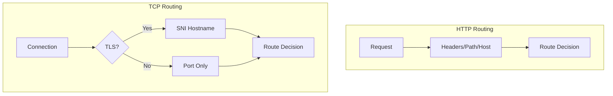
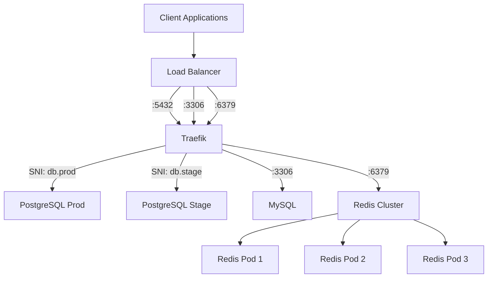

# How to Configure Traefik for TCP Services

Author: [nawazdhandala](https://www.github.com/nawazdhandala)

Tags: Traefik, TCP, Database, Load Balancing, Networking

Description: Route TCP traffic through Traefik for databases, message queues, and custom protocols with TLS termination and SNI-based routing.

---

While Traefik is commonly used for HTTP traffic, it also handles raw TCP connections. This is essential for routing traffic to databases like PostgreSQL and MySQL, message brokers like Redis and RabbitMQ, or any custom TCP-based protocol.

This guide covers TCP routing in Traefik, including basic configuration, TLS termination, SNI-based routing, and production patterns for database access.

## TCP vs HTTP Routing

HTTP routing uses headers, paths, and hostnames for routing decisions. TCP operates at a lower level where this information is not available (unless using TLS with SNI). For TCP:

- Without TLS: Route based on port only
- With TLS: Route based on SNI (Server Name Indication) hostname



## Enabling TCP Entrypoints

First, define TCP entrypoints in Traefik's configuration:

```yaml
# traefik-tcp-config.yaml
apiVersion: v1
kind: ConfigMap
metadata:
  name: traefik-config
  namespace: traefik
data:
  traefik.yaml: |
    entryPoints:
      # HTTP entrypoints
      web:
        address: ":80"
      websecure:
        address: ":443"

      # TCP entrypoints for databases
      postgres:
        address: ":5432"
      mysql:
        address: ":3306"
      redis:
        address: ":6379"

      # Generic TCP entrypoint
      tcp-generic:
        address: ":9000"

    providers:
      kubernetesCRD: {}
```

Expose TCP ports in the Traefik Service:

```yaml
# traefik-tcp-service.yaml
apiVersion: v1
kind: Service
metadata:
  name: traefik
  namespace: traefik
spec:
  type: LoadBalancer
  selector:
    app: traefik
  ports:
    - name: web
      port: 80
      targetPort: 80
    - name: websecure
      port: 443
      targetPort: 443
    - name: postgres
      port: 5432
      targetPort: 5432
    - name: mysql
      port: 3306
      targetPort: 3306
    - name: redis
      port: 6379
      targetPort: 6379
```

## Basic TCP Routing

Create an IngressRouteTCP to route PostgreSQL traffic:

```yaml
# postgres-tcp-route.yaml
apiVersion: traefik.io/v1alpha1
kind: IngressRouteTCP
metadata:
  name: postgres
  namespace: default
spec:
  entryPoints:
    - postgres
  routes:
    - match: HostSNI(`*`)  # Match all connections on this port
      services:
        - name: postgres-service
          port: 5432
```

The `HostSNI(*)` matcher accepts all connections since plain TCP does not have hostname information.

## TLS Passthrough

For encrypted database connections where the backend handles TLS:

```yaml
# tls-passthrough.yaml
apiVersion: traefik.io/v1alpha1
kind: IngressRouteTCP
metadata:
  name: postgres-tls
  namespace: default
spec:
  entryPoints:
    - postgres
  routes:
    - match: HostSNI(`*`)
      services:
        - name: postgres-service
          port: 5432
  tls:
    passthrough: true  # Forward encrypted traffic as-is
```

TLS passthrough means Traefik does not decrypt the traffic. The database server handles TLS termination.

## SNI-Based TCP Routing

With TLS, you can route to different backends based on the requested hostname:

```yaml
# sni-routing.yaml
# Route to production database
apiVersion: traefik.io/v1alpha1
kind: IngressRouteTCP
metadata:
  name: postgres-prod
  namespace: default
spec:
  entryPoints:
    - postgres
  routes:
    - match: HostSNI(`db.prod.example.com`)
      services:
        - name: postgres-prod
          port: 5432
  tls:
    passthrough: true

---
# Route to staging database
apiVersion: traefik.io/v1alpha1
kind: IngressRouteTCP
metadata:
  name: postgres-staging
  namespace: default
spec:
  entryPoints:
    - postgres
  routes:
    - match: HostSNI(`db.staging.example.com`)
      services:
        - name: postgres-staging
          port: 5432
  tls:
    passthrough: true
```

Clients connect using the hostname:

```bash
# Connect to production database
psql "host=db.prod.example.com port=5432 dbname=mydb sslmode=require"

# Connect to staging database
psql "host=db.staging.example.com port=5432 dbname=mydb sslmode=require"
```

## TLS Termination at Traefik

Traefik can terminate TLS and forward unencrypted traffic to the backend:

```yaml
# tls-termination.yaml
apiVersion: traefik.io/v1alpha1
kind: IngressRouteTCP
metadata:
  name: redis-tls
  namespace: default
spec:
  entryPoints:
    - redis
  routes:
    - match: HostSNI(`redis.example.com`)
      services:
        - name: redis-service
          port: 6379
  tls:
    # Traefik terminates TLS
    certResolver: letsencrypt
```

Note: Let's Encrypt certificates require domain validation. For internal services, use self-signed certificates.

## Custom TLS Certificates

For internal TCP services, create a TLS secret and reference it:

```yaml
# tcp-tls-secret.yaml
apiVersion: v1
kind: Secret
metadata:
  name: postgres-tls-cert
  namespace: default
type: kubernetes.io/tls
data:
  tls.crt: <base64-encoded-certificate>
  tls.key: <base64-encoded-private-key>
---
apiVersion: traefik.io/v1alpha1
kind: IngressRouteTCP
metadata:
  name: postgres-custom-tls
  namespace: default
spec:
  entryPoints:
    - postgres
  routes:
    - match: HostSNI(`postgres.internal.example.com`)
      services:
        - name: postgres-service
          port: 5432
  tls:
    secretName: postgres-tls-cert
```

## TCP Load Balancing

Traefik load balances TCP connections across multiple backend pods:

```yaml
# tcp-load-balance.yaml
# Redis cluster with multiple replicas
apiVersion: apps/v1
kind: Deployment
metadata:
  name: redis
  namespace: default
spec:
  replicas: 3
  selector:
    matchLabels:
      app: redis
  template:
    metadata:
      labels:
        app: redis
    spec:
      containers:
        - name: redis
          image: redis:7
          ports:
            - containerPort: 6379
---
apiVersion: v1
kind: Service
metadata:
  name: redis-service
  namespace: default
spec:
  selector:
    app: redis
  ports:
    - port: 6379
      targetPort: 6379
---
apiVersion: traefik.io/v1alpha1
kind: IngressRouteTCP
metadata:
  name: redis
  namespace: default
spec:
  entryPoints:
    - redis
  routes:
    - match: HostSNI(`*`)
      services:
        - name: redis-service
          port: 6379
          # Weight for weighted load balancing (optional)
          weight: 1
          # Connection timeout
          terminationDelay: 100
```

## Weighted TCP Routing

Route different percentages of TCP traffic to different services:

```yaml
# tcp-weighted.yaml
apiVersion: traefik.io/v1alpha1
kind: IngressRouteTCP
metadata:
  name: postgres-weighted
  namespace: default
spec:
  entryPoints:
    - postgres
  routes:
    - match: HostSNI(`*`)
      services:
        # Primary database gets 90% of connections
        - name: postgres-primary
          port: 5432
          weight: 90
        # Read replica gets 10% of connections
        - name: postgres-replica
          port: 5432
          weight: 10
```

## TCP Middleware

Traefik supports middleware for TCP connections:

```yaml
# tcp-middleware.yaml
# IP whitelist for database access
apiVersion: traefik.io/v1alpha1
kind: MiddlewareTCP
metadata:
  name: db-ipwhitelist
  namespace: default
spec:
  ipAllowList:
    sourceRange:
      - 10.0.0.0/8
      - 192.168.1.0/24
---
apiVersion: traefik.io/v1alpha1
kind: IngressRouteTCP
metadata:
  name: postgres-restricted
  namespace: default
spec:
  entryPoints:
    - postgres
  routes:
    - match: HostSNI(`*`)
      middlewares:
        - name: db-ipwhitelist
      services:
        - name: postgres-service
          port: 5432
```

## Multiple Services on One Port

Use SNI to multiplex services on a single port:

```yaml
# multiplexed-tcp.yaml
apiVersion: traefik.io/v1alpha1
kind: IngressRouteTCP
metadata:
  name: db-postgres
  namespace: default
spec:
  entryPoints:
    - tcp-generic  # All use port 9000
  routes:
    - match: HostSNI(`postgres.example.com`)
      services:
        - name: postgres-service
          port: 5432
  tls:
    passthrough: true
---
apiVersion: traefik.io/v1alpha1
kind: IngressRouteTCP
metadata:
  name: db-mysql
  namespace: default
spec:
  entryPoints:
    - tcp-generic  # All use port 9000
  routes:
    - match: HostSNI(`mysql.example.com`)
      services:
        - name: mysql-service
          port: 3306
  tls:
    passthrough: true
---
apiVersion: traefik.io/v1alpha1
kind: IngressRouteTCP
metadata:
  name: db-redis
  namespace: default
spec:
  entryPoints:
    - tcp-generic  # All use port 9000
  routes:
    - match: HostSNI(`redis.example.com`)
      services:
        - name: redis-service
          port: 6379
  tls:
    passthrough: true
```

All three databases accessible via port 9000 with different hostnames.

## Health Checks for TCP

Configure health checks to remove unhealthy backends:

```yaml
# tcp-health-check.yaml
apiVersion: traefik.io/v1alpha1
kind: IngressRouteTCP
metadata:
  name: postgres-with-health
  namespace: default
spec:
  entryPoints:
    - postgres
  routes:
    - match: HostSNI(`*`)
      services:
        - name: postgres-service
          port: 5432
          proxyProtocol:
            version: 2
```

For TCP services, Kubernetes liveness/readiness probes handle health checking at the pod level.

## Debugging TCP Routes

Verify TCP routing is working:

```bash
# Check Traefik logs for TCP connections
kubectl logs -n traefik deployment/traefik | grep -i tcp

# Test TCP connection
nc -zv traefik.example.com 5432

# Test with openssl for TLS
openssl s_client -connect traefik.example.com:5432 -servername postgres.example.com

# Check IngressRouteTCP status
kubectl get ingressroutetcp -A
kubectl describe ingressroutetcp postgres -n default
```

## Architecture Diagram



## Production Considerations

1. **Security**: Always use TLS for database connections, even internally
2. **Connection pooling**: Consider using PgBouncer or ProxySQL in front of databases
3. **Timeouts**: Configure appropriate connection and idle timeouts
4. **IP restrictions**: Use TCP middleware to restrict database access by IP
5. **Monitoring**: Track TCP connection metrics in Prometheus
6. **High availability**: Use multiple Traefik replicas and proper backend failover

---

TCP routing in Traefik extends its capabilities beyond HTTP to databases and other TCP services. SNI-based routing enables sophisticated multi-tenant setups on shared ports. Combined with TLS termination and middleware, Traefik becomes a versatile gateway for all your network traffic.
