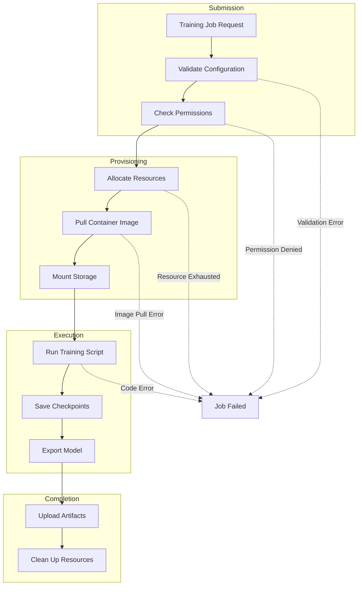

# How to Fix 'AI Platform' Training Errors

Author: [nawazdhandala](https://www.github.com/nawazdhandala)

Tags: AI Platform, Google Cloud, Machine Learning, Vertex AI, Training, Errors, GCP

Description: Learn how to diagnose and fix common Google Cloud AI Platform and Vertex AI training errors including resource issues, permission problems, and code failures.

---

Training machine learning models on Google Cloud AI Platform (now part of Vertex AI) can fail for many reasons. From misconfigured resources to permission issues to code bugs, the error messages are not always clear about what went wrong. This guide covers the most common training errors and provides practical solutions.

## Understanding the Training Pipeline

Before debugging, it helps to understand where errors can occur in the training pipeline.



## Error: PERMISSION_DENIED

This is one of the most frequent errors when starting with AI Platform training.

### Symptoms

```text
googleapiclient.errors.HttpError: 403 Permission 'ml.jobs.create' denied on resource
```

### Solution

Ensure the service account has the necessary IAM roles.

```bash
# Get the default Compute Engine service account
PROJECT_NUMBER=$(gcloud projects describe $PROJECT_ID --format="value(projectNumber)")
SERVICE_ACCOUNT="$PROJECT_NUMBER-compute@developer.gserviceaccount.com"

# Grant AI Platform Admin role
gcloud projects add-iam-policy-binding $PROJECT_ID \
    --member="serviceAccount:$SERVICE_ACCOUNT" \
    --role="roles/ml.admin"

# Grant access to Cloud Storage buckets used for training
gcloud storage buckets add-iam-policy-binding gs://my-training-bucket \
    --member="serviceAccount:$SERVICE_ACCOUNT" \
    --role="roles/storage.objectAdmin"

# For Vertex AI, also grant Vertex AI User role
gcloud projects add-iam-policy-binding $PROJECT_ID \
    --member="serviceAccount:$SERVICE_ACCOUNT" \
    --role="roles/aiplatform.user"
```

For custom service accounts, create and configure properly.

```bash
# Create a dedicated service account for training
gcloud iam service-accounts create ml-training-sa \
    --display-name="ML Training Service Account"

# Grant necessary roles
gcloud projects add-iam-policy-binding $PROJECT_ID \
    --member="serviceAccount:ml-training-sa@$PROJECT_ID.iam.gserviceaccount.com" \
    --role="roles/aiplatform.user"

gcloud projects add-iam-policy-binding $PROJECT_ID \
    --member="serviceAccount:ml-training-sa@$PROJECT_ID.iam.gserviceaccount.com" \
    --role="roles/storage.objectAdmin"
```

## Error: RESOURCE_EXHAUSTED

This occurs when the requested compute resources are not available in the specified region.

### Symptoms

```text
RESOURCE_EXHAUSTED: Quota 'GPUS_ALL_REGIONS' exceeded. Limit: 0.0
```

### Solution

```bash
# Check current GPU quota
gcloud compute regions describe us-central1 \
    --format="table(quotas.metric,quotas.limit,quotas.usage)" \
    | grep -i gpu

# Request a quota increase through the console or gcloud
gcloud compute regions describe us-central1 --format="value(quotas)"
```

Alternatively, try a different region or machine type.

```python
from google.cloud import aiplatform

def submit_training_job_with_fallback(
    display_name,
    container_uri,
    regions=["us-central1", "us-east1", "us-west1"]
):
    """Submit training job with region fallback on resource exhaustion."""

    aiplatform.init(project="my-project")

    for region in regions:
        try:
            aiplatform.init(location=region)

            job = aiplatform.CustomJob(
                display_name=display_name,
                worker_pool_specs=[
                    {
                        "machine_spec": {
                            "machine_type": "n1-standard-8",
                            "accelerator_type": "NVIDIA_TESLA_T4",
                            "accelerator_count": 1,
                        },
                        "replica_count": 1,
                        "container_spec": {
                            "image_uri": container_uri,
                        },
                    }
                ],
            )

            job.run(sync=False)
            print(f"Job submitted successfully in {region}")
            return job

        except Exception as e:
            if "RESOURCE_EXHAUSTED" in str(e):
                print(f"Resources exhausted in {region}, trying next region...")
                continue
            raise

    raise Exception("All regions exhausted, no resources available")
```

## Error: Container Image Pull Failed

Training jobs fail when the specified container image cannot be pulled.

### Symptoms

```text
Failed to pull image: rpc error: code = NotFound desc = failed to pull and unpack image
```

### Solution

Verify the image exists and is accessible.

```bash
# Check if the image exists in Container Registry
gcloud container images list-tags gcr.io/$PROJECT_ID/my-training-image

# Check if the image exists in Artifact Registry
gcloud artifacts docker images list \
    us-central1-docker.pkg.dev/$PROJECT_ID/ml-images/my-training-image

# Make sure the service account can access the registry
gcloud artifacts repositories add-iam-policy-binding ml-images \
    --location=us-central1 \
    --member="serviceAccount:$SERVICE_ACCOUNT" \
    --role="roles/artifactregistry.reader"
```

Build and push the image correctly.

```dockerfile
# Dockerfile for training
FROM gcr.io/deeplearning-platform-release/tf2-gpu.2-12

WORKDIR /app

# Copy requirements and install dependencies
COPY requirements.txt .
RUN pip install --no-cache-dir -r requirements.txt

# Copy training code
COPY trainer/ ./trainer/

# Set entrypoint
ENTRYPOINT ["python", "-m", "trainer.task"]
```

```bash
# Build and push the image
docker build -t gcr.io/$PROJECT_ID/my-training-image:latest .
docker push gcr.io/$PROJECT_ID/my-training-image:latest

# Verify the image is accessible
gcloud container images describe gcr.io/$PROJECT_ID/my-training-image:latest
```

## Error: Training Script Crashes

When your training code crashes, the error details are often in the logs.

### Diagnosing Code Errors

```bash
# View training job logs
gcloud ai custom-jobs describe $JOB_ID \
    --region=us-central1 \
    --format="value(error)"

# Stream logs from a running or completed job
gcloud ai custom-jobs stream-logs $JOB_ID --region=us-central1

# Search logs in Cloud Logging
gcloud logging read 'resource.type="ml_job" severity>=ERROR' \
    --limit=50 \
    --format="table(timestamp,jsonPayload.message)"
```

### Common Code Issues and Fixes

**Out of Memory (OOM) Errors**

```python
import tensorflow as tf

def configure_gpu_memory():
    """Configure GPU memory growth to prevent OOM errors."""

    gpus = tf.config.list_physical_devices('GPU')
    if gpus:
        try:
            # Enable memory growth - allocate memory as needed
            for gpu in gpus:
                tf.config.experimental.set_memory_growth(gpu, True)

            # Alternatively, set a hard memory limit
            # tf.config.set_logical_device_configuration(
            #     gpus[0],
            #     [tf.config.LogicalDeviceConfiguration(memory_limit=8192)]
            # )

        except RuntimeError as e:
            # Memory growth must be set before GPUs are initialized
            print(f"GPU configuration error: {e}")

# Call at the beginning of your training script
configure_gpu_memory()
```

**Data Loading Issues**

```python
import tensorflow as tf
from google.cloud import storage

def create_dataset_from_gcs(gcs_pattern, batch_size=32):
    """Create a TensorFlow dataset from GCS with proper error handling."""

    # List files matching the pattern
    file_pattern = tf.io.gfile.glob(gcs_pattern)

    if not file_pattern:
        raise ValueError(f"No files found matching pattern: {gcs_pattern}")

    print(f"Found {len(file_pattern)} files for training")

    # Create dataset with prefetching for performance
    dataset = tf.data.TFRecordDataset(
        file_pattern,
        num_parallel_reads=tf.data.AUTOTUNE
    )

    # Parse and preprocess
    dataset = dataset.map(
        parse_example,
        num_parallel_calls=tf.data.AUTOTUNE
    )

    # Batch and prefetch
    dataset = dataset.batch(batch_size)
    dataset = dataset.prefetch(tf.data.AUTOTUNE)

    return dataset

def parse_example(serialized):
    """Parse a TFRecord example with error handling."""

    feature_description = {
        'image': tf.io.FixedLenFeature([], tf.string),
        'label': tf.io.FixedLenFeature([], tf.int64),
    }

    try:
        example = tf.io.parse_single_example(serialized, feature_description)
        image = tf.io.decode_jpeg(example['image'], channels=3)
        image = tf.image.resize(image, [224, 224])
        image = tf.cast(image, tf.float32) / 255.0
        label = example['label']
        return image, label
    except tf.errors.InvalidArgumentError as e:
        tf.print(f"Error parsing example: {e}")
        raise
```

## Error: Checkpoint Save Failures

Training can fail when saving checkpoints to Cloud Storage.

### Symptoms

```text
tensorflow.python.framework.errors_impl.NotFoundError: Error executing an HTTP request:
HTTP response code 404 with body 'Not Found'
```

### Solution

Ensure the bucket exists and is accessible.

```python
import os
from google.cloud import storage

def setup_checkpoint_directory(bucket_name, job_id):
    """Set up checkpoint directory with proper permissions verification."""

    client = storage.Client()
    bucket = client.bucket(bucket_name)

    # Verify bucket exists
    if not bucket.exists():
        raise ValueError(f"Bucket {bucket_name} does not exist")

    # Create checkpoint path
    checkpoint_path = f"gs://{bucket_name}/checkpoints/{job_id}"

    # Test write access by creating a marker file
    test_blob = bucket.blob(f"checkpoints/{job_id}/.write_test")
    try:
        test_blob.upload_from_string("test")
        test_blob.delete()
        print(f"Write access verified for {checkpoint_path}")
    except Exception as e:
        raise PermissionError(f"Cannot write to {checkpoint_path}: {e}")

    return checkpoint_path

# In your training script
checkpoint_path = setup_checkpoint_directory("my-bucket", os.environ.get("CLOUD_ML_JOB_ID", "local"))

# Configure TensorFlow to use the checkpoint path
checkpoint_callback = tf.keras.callbacks.ModelCheckpoint(
    filepath=os.path.join(checkpoint_path, "model_{epoch:02d}.keras"),
    save_best_only=True,
    save_weights_only=False,
    verbose=1
)
```

## Error: Hyperparameter Tuning Failures

Hyperparameter tuning jobs have additional failure modes.

### Symptoms

```text
Trial failed: The training code did not report any metrics to the service.
```

### Solution

Make sure your training code reports metrics correctly.

```python
import hypertune

def train_and_report_metrics(hparams):
    """Train model and report metrics for hyperparameter tuning."""

    # Initialize the hyperparameter tuning reporter
    hpt = hypertune.HyperTune()

    # Build model with hyperparameters
    model = build_model(
        learning_rate=hparams['learning_rate'],
        hidden_units=hparams['hidden_units'],
        dropout_rate=hparams['dropout_rate']
    )

    # Custom callback to report metrics during training
    class HypertuneCallback(tf.keras.callbacks.Callback):
        def on_epoch_end(self, epoch, logs=None):
            # Report the metric you want to optimize
            # The metric name must match your config
            hpt.report_hyperparameter_tuning_metric(
                hyperparameter_metric_tag='accuracy',
                metric_value=logs['val_accuracy'],
                global_step=epoch
            )

    # Train with the callback
    history = model.fit(
        train_dataset,
        validation_data=val_dataset,
        epochs=hparams['epochs'],
        callbacks=[HypertuneCallback()]
    )

    # Report final metric
    final_accuracy = max(history.history['val_accuracy'])
    hpt.report_hyperparameter_tuning_metric(
        hyperparameter_metric_tag='accuracy',
        metric_value=final_accuracy,
        global_step=hparams['epochs']
    )

    return model

if __name__ == "__main__":
    import argparse

    parser = argparse.ArgumentParser()
    parser.add_argument('--learning_rate', type=float, default=0.01)
    parser.add_argument('--hidden_units', type=int, default=128)
    parser.add_argument('--dropout_rate', type=float, default=0.2)
    parser.add_argument('--epochs', type=int, default=10)

    args = parser.parse_args()
    hparams = vars(args)

    train_and_report_metrics(hparams)
```

## Debugging with Local Testing

Always test your training code locally before submitting to AI Platform.

```bash
# Test with local run using the Vertex AI SDK
python -m trainer.task \
    --learning_rate=0.01 \
    --epochs=2 \
    --data_path=gs://my-bucket/data

# Test in a container locally
docker run -it --gpus all \
    -v ~/.config/gcloud:/root/.config/gcloud \
    -e GOOGLE_APPLICATION_CREDENTIALS=/root/.config/gcloud/application_default_credentials.json \
    gcr.io/$PROJECT_ID/my-training-image:latest \
    --learning_rate=0.01 \
    --epochs=2
```

## Monitoring Training Jobs

Set up proper monitoring to catch issues early.

```python
from google.cloud import aiplatform
from google.cloud import monitoring_v3
import time

def monitor_training_job(job_name, check_interval=60):
    """Monitor a training job and alert on failures."""

    aiplatform.init(project="my-project", location="us-central1")

    job = aiplatform.CustomJob.get(job_name)

    while job.state not in ["JOB_STATE_SUCCEEDED", "JOB_STATE_FAILED", "JOB_STATE_CANCELLED"]:
        print(f"Job state: {job.state}")

        # Check for warning signs
        if job.state == "JOB_STATE_RUNNING":
            # Monitor GPU utilization, memory usage, etc.
            check_resource_utilization(job)

        time.sleep(check_interval)
        job = aiplatform.CustomJob.get(job_name)

    if job.state == "JOB_STATE_FAILED":
        print(f"Job failed with error: {job.error}")
        # Send alert notification
        send_alert(f"Training job {job_name} failed: {job.error}")
    else:
        print(f"Job completed with state: {job.state}")

def check_resource_utilization(job):
    """Check if resources are being utilized efficiently."""

    # Query Cloud Monitoring for GPU utilization
    client = monitoring_v3.MetricServiceClient()
    project_name = f"projects/my-project"

    # If GPU utilization is consistently low, the job might be stuck
    # on data loading or CPU-bound operations
    pass
```

## Summary

AI Platform and Vertex AI training errors typically fall into these categories:

- **Permission issues**: Ensure service accounts have ml.admin, storage access, and aiplatform.user roles
- **Resource exhaustion**: Check quotas, try different regions, or use smaller machine types
- **Container issues**: Verify images exist and are accessible by the service account
- **Code errors**: Test locally first, check logs for stack traces, and handle errors gracefully
- **Checkpoint failures**: Verify GCS bucket permissions and paths before training starts

A systematic approach to debugging - starting with permissions, then resources, then code - will help you resolve most training failures quickly.
