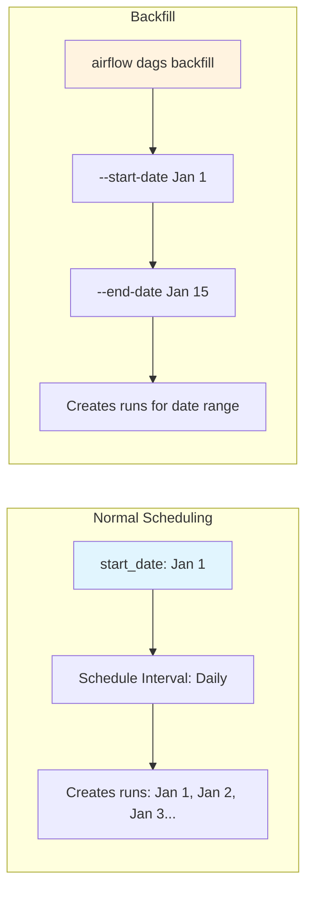
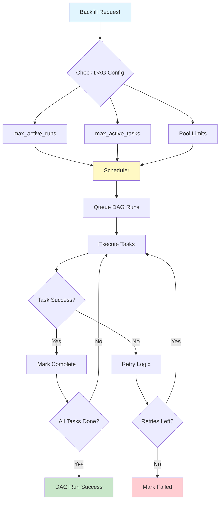

# How to Fix 'Backfill' Job Issues in Airflow

Author: [nawazdhandala](https://www.github.com/nawazdhandala)

Tags: Apache Airflow, Data Engineering, ETL, Backfill, DAGs, Scheduling, Data Pipelines, Troubleshooting

Description: Learn how to diagnose and fix common backfill job issues in Apache Airflow, including catchup problems, date handling, resource management, and parallel execution strategies.

---

> Backfill operations in Airflow are essential for reprocessing historical data, but they come with unique challenges. Understanding how Airflow handles backfills helps you avoid common pitfalls and run them efficiently.

When you need to reprocess historical data in Airflow, whether due to bug fixes, new data sources, or schema changes, backfill jobs are your tool. But they often fail or behave unexpectedly. This guide covers the most common backfill issues and how to fix them.

---

## Understanding Backfill Mechanics

Airflow's scheduler creates DAG runs based on the schedule interval and start date. Backfills replay historical runs.



---

## Common Issue 1: Catchup Creating Unwanted Runs

When you set `catchup=True`, Airflow creates runs for all intervals between start_date and now.

```python
# catchup_problem.py
# This DAG will create hundreds of runs on first deployment

from airflow import DAG
from airflow.operators.python import PythonOperator
from datetime import datetime, timedelta

# BAD: Start date far in the past with catchup enabled
default_args = {
    'owner': 'data-team',
    'retries': 3,
    'retry_delay': timedelta(minutes=5),
}

with DAG(
    dag_id='problematic_catchup',
    default_args=default_args,
    start_date=datetime(2020, 1, 1),  # 5+ years of backlog!
    schedule_interval='@daily',
    catchup=True,  # Default is True - creates all historical runs
) as dag:

    def process_data(**context):
        execution_date = context['ds']
        print(f"Processing {execution_date}")

    task = PythonOperator(
        task_id='process',
        python_callable=process_data,
    )
```

```python
# catchup_fixed.py
# Proper catchup configuration

from airflow import DAG
from airflow.operators.python import PythonOperator
from datetime import datetime, timedelta

default_args = {
    'owner': 'data-team',
    'retries': 3,
    'retry_delay': timedelta(minutes=5),
}

with DAG(
    dag_id='controlled_catchup',
    default_args=default_args,
    # Use a recent start date for new DAGs
    start_date=datetime(2026, 1, 1),
    schedule_interval='@daily',
    # Disable automatic catchup - use explicit backfill instead
    catchup=False,
    # Limit concurrent backfill runs
    max_active_runs=3,
) as dag:

    def process_data(**context):
        execution_date = context['ds']
        print(f"Processing {execution_date}")

    task = PythonOperator(
        task_id='process',
        python_callable=process_data,
    )
```

---

## Common Issue 2: Date Parameter Confusion

Airflow's date parameters can be confusing during backfills.

```python
# date_handling.py
# Understanding execution_date vs data_interval

from airflow import DAG
from airflow.operators.python import PythonOperator
from datetime import datetime, timedelta
from airflow.models import Variable

default_args = {
    'owner': 'data-team',
    'retries': 2,
}

with DAG(
    dag_id='date_aware_backfill',
    default_args=default_args,
    start_date=datetime(2026, 1, 1),
    schedule_interval='@daily',
    catchup=False,
) as dag:

    def process_with_correct_dates(**context):
        """
        Airflow 2.x date variables explained:

        - data_interval_start: Start of the data interval being processed
        - data_interval_end: End of the data interval being processed
        - ds: data_interval_start as YYYY-MM-DD string
        - ds_nodash: data_interval_start as YYYYMMDD string
        - logical_date: When this DAG run is logically scheduled

        For a daily DAG processing Jan 15:
        - data_interval_start = Jan 15 00:00:00
        - data_interval_end = Jan 16 00:00:00
        - The DAG actually runs on Jan 16 (after the interval completes)
        """

        # Use data_interval for partitioned data sources
        start = context['data_interval_start']
        end = context['data_interval_end']

        print(f"Processing data from {start} to {end}")

        # Format for common use cases
        partition_date = context['ds']  # "2026-01-15"
        s3_path = f"s3://bucket/data/dt={partition_date}/"

        # For hourly data, use the actual timestamps
        query = f"""
            SELECT * FROM events
            WHERE event_time >= '{start.isoformat()}'
            AND event_time < '{end.isoformat()}'
        """

        print(f"Query: {query}")
        print(f"S3 path: {s3_path}")

    task = PythonOperator(
        task_id='process',
        python_callable=process_with_correct_dates,
    )
```

---

## Common Issue 3: Resource Exhaustion During Backfills

Running many backfill tasks simultaneously overwhelms databases and clusters.

```python
# resource_controlled_backfill.py
# Limit parallel execution during backfills

from airflow import DAG
from airflow.operators.python import PythonOperator
from airflow.utils.task_group import TaskGroup
from datetime import datetime, timedelta

default_args = {
    'owner': 'data-team',
    'retries': 3,
    'retry_delay': timedelta(minutes=5),
    # Use pools to limit concurrent database connections
    'pool': 'database_pool',
}

with DAG(
    dag_id='resource_aware_backfill',
    default_args=default_args,
    start_date=datetime(2026, 1, 1),
    schedule_interval='@daily',
    catchup=False,
    # Limit concurrent DAG runs
    max_active_runs=2,
    # Limit concurrent tasks across all runs
    max_active_tasks=8,
) as dag:

    def extract_data(**context):
        """Extract with connection pooling awareness"""
        import time

        # Simulate database query
        partition = context['ds']
        print(f"Extracting data for {partition}")
        time.sleep(10)  # Simulate work

        return {'records': 1000}

    def transform_data(**context):
        """Transform with memory awareness"""
        # Pull data from previous task
        ti = context['ti']
        extract_result = ti.xcom_pull(task_ids='extract')

        print(f"Transforming {extract_result['records']} records")

        return {'processed': extract_result['records']}

    def load_data(**context):
        """Load with rate limiting"""
        ti = context['ti']
        transform_result = ti.xcom_pull(task_ids='transform')

        print(f"Loading {transform_result['processed']} records")

    extract = PythonOperator(
        task_id='extract',
        python_callable=extract_data,
        # This task uses the database pool
        pool='database_pool',
        pool_slots=2,  # Consumes 2 slots from the pool
    )

    transform = PythonOperator(
        task_id='transform',
        python_callable=transform_data,
        # No pool - uses CPU/memory only
    )

    load = PythonOperator(
        task_id='load',
        python_callable=load_data,
        # Different pool for destination
        pool='warehouse_pool',
        pool_slots=1,
    )

    extract >> transform >> load
```

Create pools in Airflow to limit concurrent resource usage:

```bash
# Create pools via CLI
airflow pools set database_pool 10 "Limit concurrent database connections"
airflow pools set warehouse_pool 5 "Limit concurrent warehouse writes"

# Or via API
curl -X POST "http://airflow:8080/api/v1/pools" \
  -H "Content-Type: application/json" \
  -d '{"name": "database_pool", "slots": 10, "description": "Database connection limit"}'
```

---

## Common Issue 4: Idempotency Problems

Backfills must be idempotent - running the same date twice should produce the same result.

```python
# idempotent_backfill.py
# Design tasks that can safely run multiple times

from airflow import DAG
from airflow.operators.python import PythonOperator
from airflow.providers.postgres.operators.postgres import PostgresOperator
from datetime import datetime, timedelta

default_args = {
    'owner': 'data-team',
    'retries': 2,
}

with DAG(
    dag_id='idempotent_backfill',
    default_args=default_args,
    start_date=datetime(2026, 1, 1),
    schedule_interval='@daily',
    catchup=False,
) as dag:

    # BAD: Appends data on every run - duplicates on re-run
    # INSERT INTO daily_metrics SELECT ... FROM source WHERE dt = '{{ ds }}'

    # GOOD: Delete-then-insert pattern ensures idempotency
    delete_existing = PostgresOperator(
        task_id='delete_existing',
        postgres_conn_id='warehouse',
        sql="""
            -- Delete existing data for this partition before inserting
            DELETE FROM daily_metrics
            WHERE metric_date = '{{ ds }}';
        """,
    )

    insert_new = PostgresOperator(
        task_id='insert_new',
        postgres_conn_id='warehouse',
        sql="""
            -- Insert fresh data for this partition
            INSERT INTO daily_metrics (metric_date, user_count, revenue)
            SELECT
                '{{ ds }}' as metric_date,
                COUNT(DISTINCT user_id) as user_count,
                SUM(amount) as revenue
            FROM events
            WHERE event_date = '{{ ds }}';
        """,
    )

    # Alternative: Use MERGE/UPSERT for idempotency
    upsert_metrics = PostgresOperator(
        task_id='upsert_metrics',
        postgres_conn_id='warehouse',
        sql="""
            -- PostgreSQL ON CONFLICT for upsert
            INSERT INTO daily_metrics (metric_date, user_count, revenue)
            SELECT
                '{{ ds }}' as metric_date,
                COUNT(DISTINCT user_id) as user_count,
                SUM(amount) as revenue
            FROM events
            WHERE event_date = '{{ ds }}'
            ON CONFLICT (metric_date)
            DO UPDATE SET
                user_count = EXCLUDED.user_count,
                revenue = EXCLUDED.revenue,
                updated_at = NOW();
        """,
    )

    delete_existing >> insert_new
```

---

## Running Backfills Correctly

Use the CLI or API to run controlled backfills.

```bash
# Basic backfill command
airflow dags backfill \
    --start-date 2026-01-01 \
    --end-date 2026-01-15 \
    --dag-id my_daily_dag

# Limit parallelism to avoid overwhelming resources
airflow dags backfill \
    --start-date 2026-01-01 \
    --end-date 2026-01-15 \
    --dag-id my_daily_dag \
    --max-active-runs 2

# Rerun only failed tasks (don't re-execute successful ones)
airflow dags backfill \
    --start-date 2026-01-01 \
    --end-date 2026-01-15 \
    --dag-id my_daily_dag \
    --rerun-failed-tasks

# Reset and rerun specific tasks
airflow dags backfill \
    --start-date 2026-01-01 \
    --end-date 2026-01-15 \
    --dag-id my_daily_dag \
    --task-regex "^transform.*" \
    --reset-dagruns

# Dry run to see what would execute
airflow dags backfill \
    --start-date 2026-01-01 \
    --end-date 2026-01-15 \
    --dag-id my_daily_dag \
    --dry-run
```

---

## Monitoring Backfill Progress

Track backfill progress to ensure completion.

```python
# backfill_monitoring.py
# Script to monitor backfill progress

from airflow.models import DagRun, TaskInstance
from airflow.utils.session import provide_session
from datetime import datetime
import sys

@provide_session
def check_backfill_progress(dag_id, start_date, end_date, session=None):
    """Check progress of a backfill operation"""

    # Query DAG runs in the backfill range
    dag_runs = session.query(DagRun).filter(
        DagRun.dag_id == dag_id,
        DagRun.execution_date >= start_date,
        DagRun.execution_date <= end_date,
    ).all()

    total = len(dag_runs)
    succeeded = sum(1 for dr in dag_runs if dr.state == 'success')
    failed = sum(1 for dr in dag_runs if dr.state == 'failed')
    running = sum(1 for dr in dag_runs if dr.state == 'running')
    queued = sum(1 for dr in dag_runs if dr.state == 'queued')

    print(f"Backfill Progress for {dag_id}")
    print(f"Date range: {start_date} to {end_date}")
    print(f"{'='*40}")
    print(f"Total runs: {total}")
    print(f"Succeeded:  {succeeded} ({succeeded/total*100:.1f}%)")
    print(f"Failed:     {failed}")
    print(f"Running:    {running}")
    print(f"Queued:     {queued}")

    # List failed runs for investigation
    if failed > 0:
        print(f"\nFailed runs:")
        for dr in dag_runs:
            if dr.state == 'failed':
                print(f"  - {dr.execution_date}")

                # Get failed task instances
                failed_tasks = session.query(TaskInstance).filter(
                    TaskInstance.dag_id == dag_id,
                    TaskInstance.run_id == dr.run_id,
                    TaskInstance.state == 'failed',
                ).all()

                for ti in failed_tasks:
                    print(f"    Task: {ti.task_id}")

if __name__ == '__main__':
    check_backfill_progress(
        dag_id='my_daily_dag',
        start_date=datetime(2026, 1, 1),
        end_date=datetime(2026, 1, 15),
    )
```

---

## Backfill Architecture Diagram



---

## Best Practices

1. **Disable catchup by default**: Set `catchup=False` and use explicit backfill commands for historical processing.

2. **Design for idempotency**: Every task should be safe to run multiple times. Use delete-then-insert or upsert patterns.

3. **Use pools to limit resources**: Prevent backfills from overwhelming databases and external services.

4. **Start with dry runs**: Use `--dry-run` to verify what will execute before running actual backfills.

5. **Monitor progress**: Track backfill completion and investigate failures promptly.

6. **Consider dependencies**: If downstream DAGs depend on backfilled data, coordinate the backfill order.

7. **Document backfill procedures**: Keep runbooks for common backfill scenarios specific to your DAGs.

---

## Conclusion

Backfill issues in Airflow usually stem from configuration problems, non-idempotent tasks, or resource constraints. By designing DAGs with backfills in mind from the start, using proper date handling, implementing resource controls, and ensuring idempotency, you can run backfills reliably. When things go wrong, the monitoring and debugging techniques in this guide will help you identify and fix issues quickly.
