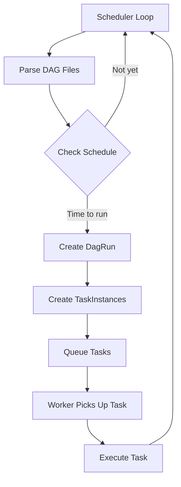
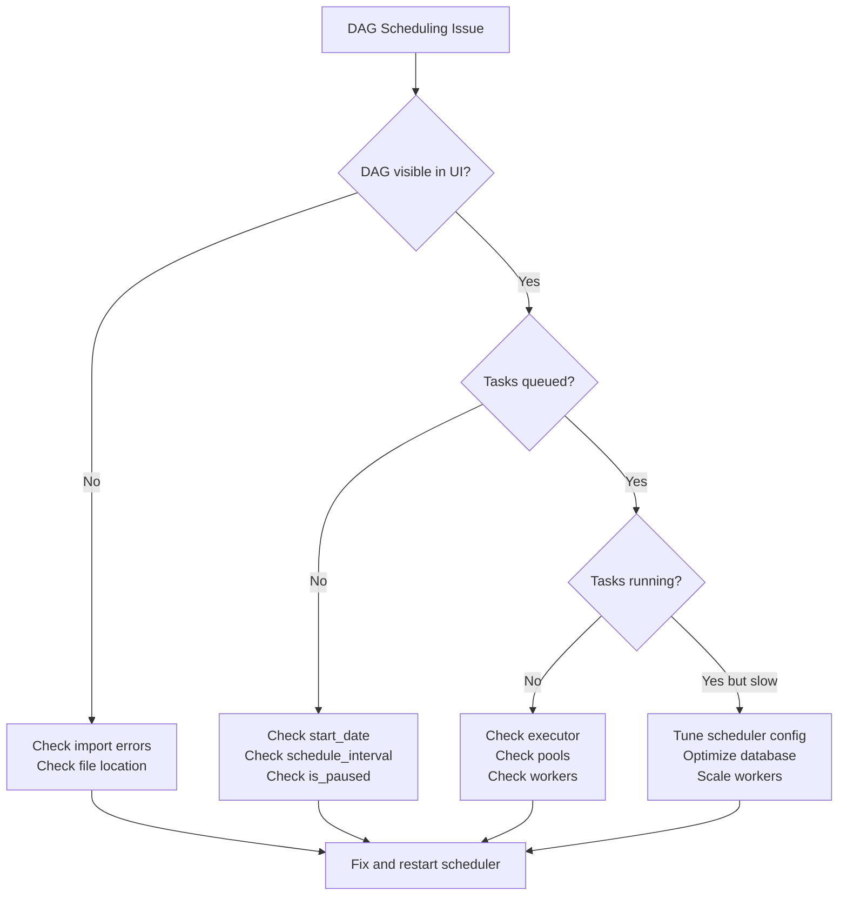

# How to Fix "DAG Scheduling" Airflow Issues

Author: [nawazdhandala](https://www.github.com/nawazdhandala)

Tags: Apache Airflow, DAG, Scheduling, Data Engineering, Workflow Orchestration, Debugging

Description: Learn how to diagnose and fix common DAG scheduling issues in Apache Airflow including delays, missed runs, and stuck tasks.

---

Apache Airflow is a powerful workflow orchestration platform, but DAG scheduling issues can be frustrating to debug. Tasks might not start when expected, runs get skipped, or the scheduler seems to ignore your DAGs entirely. This guide covers the most common scheduling problems and how to fix them.

## Understanding Airflow Scheduling

Before diving into fixes, let us understand how Airflow scheduling works. The scheduler continuously loops through all DAGs, checking if any task instances should be created based on the schedule interval and execution date.



## Common Issues and Solutions

### 1. DAG Not Appearing in UI

Your DAG file exists but does not show up in the Airflow UI.

**Check for Import Errors:**

```bash
# List import errors
airflow dags list-import-errors

# Test specific DAG file
python /path/to/dags/my_dag.py
```

**Common Causes:**

```python
# Bad: Missing DAG assignment to module level
def create_dag():
    dag = DAG('my_dag', ...)
    return dag

# Good: DAG must be at module level
dag = DAG('my_dag', ...)

# Or use dag decorator
from airflow.decorators import dag

@dag(schedule_interval='@daily', start_date=datetime(2026, 1, 1))
def my_pipeline():
    pass

my_dag = my_pipeline()  # Instantiate at module level
```

**Check File Location:**

```python
# In airflow.cfg or environment
# Ensure your DAG file is in the correct folder
AIRFLOW__CORE__DAGS_FOLDER=/opt/airflow/dags

# Verify DAG is detected
airflow dags list | grep my_dag
```

### 2. Tasks Not Starting on Schedule

DAG appears but tasks do not run at expected times.

**Check start_date Configuration:**

```python
from datetime import datetime, timedelta

# Bad: start_date in the future means no runs yet
dag = DAG(
    'my_dag',
    start_date=datetime(2027, 1, 1),  # Future date
    schedule_interval='@daily'
)

# Bad: Dynamic start_date causes issues
dag = DAG(
    'my_dag',
    start_date=datetime.now(),  # Changes on every parse!
    schedule_interval='@daily'
)

# Good: Fixed start_date in the past
dag = DAG(
    'my_dag',
    start_date=datetime(2026, 1, 1),
    schedule_interval='@daily',
    catchup=False  # Prevent backfill of all past runs
)
```

**Understand Execution Date vs Run Time:**

```mermaid
timeline
    title Airflow Scheduling Timeline
    2026-01-24 00:00 : execution_date = 2026-01-24
                     : Data interval start
    2026-01-25 00:00 : Actual run time
                     : Data interval end
                     : Task executes here
```

```python
# A daily DAG scheduled for midnight actually runs at the END of the interval
# execution_date 2026-01-24 runs on 2026-01-25 00:00

# To run immediately at start_date, use schedule_interval=None for manual
# or @once for a single immediate run
```

### 3. Scheduler Delays and Slow Performance

Tasks are queued but take a long time to start.

**Tune Scheduler Configuration:**

```ini
# airflow.cfg optimizations

[scheduler]
# Increase parsing speed
min_file_process_interval = 30
dag_dir_list_interval = 60

# More scheduler processes
parsing_processes = 4

# Faster task scheduling
scheduler_heartbeat_sec = 5
orphaned_tasks_check_interval = 60

[core]
# Increase parallelism
parallelism = 32
dag_concurrency = 16
max_active_runs_per_dag = 16
```

**Check Database Performance:**

```python
# Monitor scheduler performance
from airflow.utils.log.logging_mixin import LoggingMixin

# Enable scheduler health metrics
# In airflow.cfg
[metrics]
statsd_on = True
statsd_host = localhost
statsd_port = 8125
statsd_prefix = airflow
```

```bash
# Check for slow queries
airflow db check

# Clean up old data
airflow db clean --clean-before-timestamp "2025-01-01"
```

### 4. Tasks Stuck in Queued State

Tasks show as queued but never execute.

**Check Worker Availability:**

```bash
# For Celery executor, check workers
celery -A airflow.executors.celery_executor inspect active

# Check if workers are connected
celery -A airflow.executors.celery_executor inspect ping
```

**Check Pool Slots:**

```python
# Tasks use pools to limit concurrency
# Default pool might be full

# Check pool status in UI or CLI
airflow pools list

# Increase default pool
airflow pools set default_pool 128 "Default pool"

# Or specify pool in task
task = BashOperator(
    task_id='my_task',
    bash_command='echo hello',
    pool='my_custom_pool',  # Use dedicated pool
    pool_slots=1,  # Slots this task consumes
    dag=dag
)
```

**Verify Executor Configuration:**

```python
# Check which executor is running
from airflow.configuration import conf
print(conf.get('core', 'executor'))

# For LocalExecutor, check parallelism
# For CeleryExecutor, check worker concurrency
```

### 5. Missed Scheduled Runs

Some DAG runs are skipped entirely.

**Check catchup and max_active_runs:**

```python
dag = DAG(
    'my_dag',
    start_date=datetime(2026, 1, 1),
    schedule_interval='@hourly',
    catchup=True,  # Will backfill all missed runs
    max_active_runs=3,  # Limits concurrent backfill
)

# If catchup=False and scheduler was down, runs are skipped
# Set catchup=True for critical pipelines that must process all intervals
```

**Handle Scheduler Downtime:**

```bash
# Manually trigger missed runs
airflow dags backfill my_dag \
    --start-date 2026-01-20 \
    --end-date 2026-01-24 \
    --reset-dagruns
```

### 6. Timezone Issues

DAGs run at unexpected times due to timezone confusion.

**Explicitly Set Timezone:**

```python
import pendulum

# Good: Explicit timezone
dag = DAG(
    'my_dag',
    start_date=pendulum.datetime(2026, 1, 1, tz='America/New_York'),
    schedule_interval='0 9 * * *',  # 9 AM Eastern
)

# Configure default timezone in airflow.cfg
[core]
default_timezone = America/New_York
```

```python
# Using timezone-aware cron expressions
from airflow.timetables.trigger import CronTriggerTimetable

dag = DAG(
    'my_dag',
    start_date=datetime(2026, 1, 1),
    timetable=CronTriggerTimetable(
        '0 9 * * *',
        timezone='America/New_York'
    ),
)
```

### 7. Dependencies Not Respected

Tasks run out of order or skip dependencies.

**Debug Dependency Issues:**

```python
# Visualize dependencies
# In terminal
airflow tasks test my_dag task_id 2026-01-24

# Check upstream task states
airflow tasks states-for-dag-run my_dag 2026-01-24

# Common mistake: circular dependencies
task_a >> task_b >> task_c >> task_a  # This will fail!
```

**Correct Dependency Patterns:**

```python
from airflow.operators.empty import EmptyOperator

start = EmptyOperator(task_id='start')
end = EmptyOperator(task_id='end')

# Parallel tasks with proper fan-out/fan-in
task_a = BashOperator(task_id='task_a', bash_command='echo A')
task_b = BashOperator(task_id='task_b', bash_command='echo B')
task_c = BashOperator(task_id='task_c', bash_command='echo C')

start >> [task_a, task_b] >> task_c >> end
```

## Debugging Workflow



## Monitoring Setup

```python
# Create a DAG to monitor scheduling health
from airflow import DAG
from airflow.operators.python import PythonOperator
from datetime import datetime, timedelta

def check_scheduler_lag(**context):
    """Alert if execution is too far behind schedule."""
    execution_date = context['execution_date']
    now = datetime.utcnow()
    lag = now - execution_date

    if lag > timedelta(hours=1):
        raise ValueError(f"Scheduler lag too high: {lag}")

    print(f"Scheduler lag: {lag}")

with DAG(
    'scheduler_health_check',
    start_date=datetime(2026, 1, 1),
    schedule_interval='*/15 * * * *',  # Every 15 minutes
    catchup=False,
    tags=['monitoring'],
) as dag:

    check_lag = PythonOperator(
        task_id='check_scheduler_lag',
        python_callable=check_scheduler_lag,
    )
```

## Conclusion

DAG scheduling issues in Airflow usually stem from a few common causes: misconfigured start dates, timezone confusion, resource constraints, or import errors. The key to quick resolution is understanding how the scheduler works and methodically checking each component. Start with the basics like verifying your DAG loads correctly, then move to configuration issues, and finally examine resource constraints. With proper monitoring in place, you can catch scheduling problems early before they impact your data pipelines.
