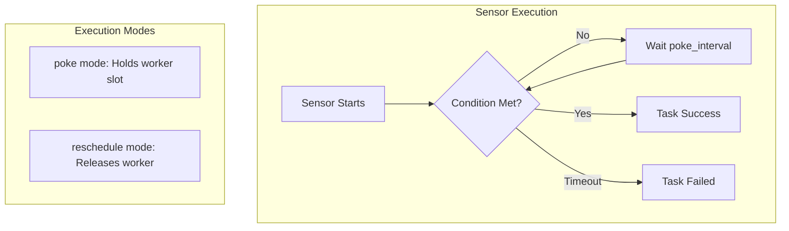
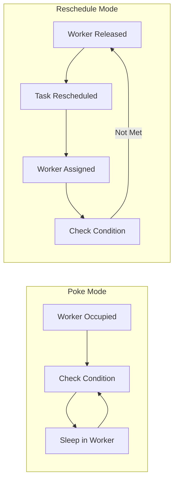

# How to Fix "Sensor" Timeout Issues in Airflow

Author: [nawazdhandala](https://www.github.com/nawazdhandala)

Tags: Apache Airflow, Sensors, Timeout, Data Pipelines, Workflow Orchestration, DAG, Python

Description: A practical guide to diagnosing and fixing sensor timeout issues in Apache Airflow with configuration examples and best practices.

---

Airflow sensors are designed to wait for external conditions before proceeding with downstream tasks. But when sensors timeout, your entire DAG can fail. Understanding why sensors timeout and how to configure them properly is essential for reliable data pipelines.

## Understanding Airflow Sensors

Sensors are special operators that repeatedly check for a condition until it's met or a timeout occurs.



## Common Sensor Timeout Errors

### Error 1: Soft Timeout (execution_timeout)

```
airflow.exceptions.AirflowTaskTimeout:
Timeout, waited 7200 seconds for <Task(FileSensor): wait_for_file>
```

This happens when the task exceeds its `execution_timeout`.

**Solution: Adjust timeout settings**

```python
from airflow import DAG
from airflow.sensors.filesystem import FileSensor
from datetime import datetime, timedelta

default_args = {
    'owner': 'data-team',
    'retries': 2,
    'retry_delay': timedelta(minutes=5),
}

with DAG(
    'file_processing_dag',
    default_args=default_args,
    schedule_interval='@daily',
    start_date=datetime(2024, 1, 1),
    catchup=False
) as dag:

    wait_for_file = FileSensor(
        task_id='wait_for_file',
        filepath='/data/incoming/daily_export_{{ ds }}.csv',
        # How often to check (seconds)
        poke_interval=60,
        # Total time to wait before failing (seconds)
        timeout=7200,  # 2 hours
        # Use reschedule mode for long waits
        mode='reschedule',
        # Soft fail instead of hard fail
        soft_fail=False,
        # Exponential backoff between pokes
        exponential_backoff=True,
    )
```

### Error 2: Sensor Deadlock (Worker Pool Exhaustion)

```
No workers available - all slots occupied by sensors
```

This occurs when too many sensors in poke mode consume all worker slots.

**Solution: Use reschedule mode**

```python
from airflow.sensors.external_task import ExternalTaskSensor

wait_for_upstream = ExternalTaskSensor(
    task_id='wait_for_upstream_dag',
    external_dag_id='upstream_dag',
    external_task_id='final_task',
    # IMPORTANT: Use reschedule for external dependencies
    mode='reschedule',
    # Check every 5 minutes
    poke_interval=300,
    # Wait up to 6 hours
    timeout=21600,
    # How long to look back for successful run
    execution_delta=timedelta(hours=0),
)
```



### Error 3: Connection Timeout

```
airflow.exceptions.AirflowSensorTimeout:
Snap. Time is OUT. Operation failed due to timeout.
Caused by: ConnectionError: HTTPConnectionPool timed out
```

**Solution: Configure connection retries and timeouts**

```python
from airflow.providers.http.sensors.http import HttpSensor

check_api_ready = HttpSensor(
    task_id='check_api_ready',
    http_conn_id='api_connection',
    endpoint='/health',
    # Request timeout (separate from sensor timeout)
    request_params={'timeout': 30},
    # Response check function
    response_check=lambda response: response.json().get('status') == 'healthy',
    # Sensor settings
    poke_interval=30,
    timeout=1800,
    mode='reschedule',
)
```

## Smart Sensor Configuration

For Airflow 2.x, use smart sensors to reduce resource consumption:

```python
# airflow.cfg
[smart_sensor]
use_smart_sensor = true
shard_code_upper_limit = 10000
shards = 4
sensors_enabled = ExternalTaskSensor,FileSensor,S3KeySensor
```

```python
from airflow.sensors.filesystem import FileSensor

# Smart sensor enabled by default for supported sensors
wait_for_file = FileSensor(
    task_id='smart_wait_for_file',
    filepath='/data/input/{{ ds }}.parquet',
    poke_interval=60,
    timeout=3600,
    # Smart sensor batches multiple sensor checks
    mode='poke',  # Required for smart sensor
)
```

## Custom Sensor with Proper Timeout Handling

```python
from airflow.sensors.base import BaseSensorOperator
from airflow.utils.decorators import apply_defaults
import requests
from typing import Any

class RobustApiSensor(BaseSensorOperator):
    """
    Custom sensor with proper timeout and retry handling
    """

    template_fields = ('endpoint',)

    @apply_defaults
    def __init__(
        self,
        endpoint: str,
        expected_status: str = 'complete',
        request_timeout: int = 30,
        *args, **kwargs
    ):
        super().__init__(*args, **kwargs)
        self.endpoint = endpoint
        self.expected_status = expected_status
        self.request_timeout = request_timeout

    def poke(self, context: Any) -> bool:
        self.log.info(f"Checking endpoint: {self.endpoint}")

        try:
            response = requests.get(
                self.endpoint,
                timeout=self.request_timeout
            )
            response.raise_for_status()

            data = response.json()
            current_status = data.get('status')

            self.log.info(f"Current status: {current_status}")

            if current_status == 'failed':
                # Fail immediately on error status
                raise Exception(f"Upstream job failed: {data.get('error')}")

            return current_status == self.expected_status

        except requests.exceptions.Timeout:
            self.log.warning("Request timed out, will retry")
            return False
        except requests.exceptions.ConnectionError as e:
            self.log.warning(f"Connection error: {e}")
            return False

# Usage in DAG
with DAG('custom_sensor_dag', ...) as dag:

    wait_for_job = RobustApiSensor(
        task_id='wait_for_processing_job',
        endpoint='https://api.example.com/jobs/{{ dag_run.conf.job_id }}/status',
        expected_status='complete',
        request_timeout=30,
        poke_interval=120,
        timeout=14400,  # 4 hours
        mode='reschedule',
        soft_fail=True,  # Continue DAG even if times out
    )
```

## Handling Sensor Timeouts Gracefully

### Using soft_fail for Non-Critical Sensors

```python
from airflow.operators.python import BranchPythonOperator

def check_sensor_result(**context):
    """Check if sensor succeeded or soft-failed"""
    ti = context['ti']
    sensor_state = ti.xcom_pull(task_ids='optional_data_sensor', key='sensor_state')

    if sensor_state == 'success':
        return 'process_with_optional_data'
    else:
        return 'process_without_optional_data'

wait_for_optional = FileSensor(
    task_id='optional_data_sensor',
    filepath='/data/optional/enrichment_{{ ds }}.csv',
    poke_interval=60,
    timeout=1800,
    soft_fail=True,  # Don't fail DAG if times out
    mode='reschedule',
)

branch_task = BranchPythonOperator(
    task_id='check_data_availability',
    python_callable=check_sensor_result,
)

wait_for_optional >> branch_task
```

### Implementing Circuit Breaker Pattern

```python
from airflow.sensors.base import BaseSensorOperator
from airflow.models import Variable
import json
from datetime import datetime

class CircuitBreakerSensor(BaseSensorOperator):
    """
    Sensor with circuit breaker to prevent repeated failures
    """

    def __init__(
        self,
        sensor_id: str,
        max_failures: int = 3,
        cooldown_minutes: int = 30,
        *args, **kwargs
    ):
        super().__init__(*args, **kwargs)
        self.sensor_id = sensor_id
        self.max_failures = max_failures
        self.cooldown_minutes = cooldown_minutes

    def _get_circuit_state(self):
        """Get circuit breaker state from Airflow Variable"""
        try:
            state = json.loads(Variable.get(f"circuit_{self.sensor_id}", "{}"))
            return state
        except:
            return {"failures": 0, "last_failure": None, "open": False}

    def _set_circuit_state(self, state):
        """Save circuit breaker state"""
        Variable.set(f"circuit_{self.sensor_id}", json.dumps(state))

    def poke(self, context) -> bool:
        state = self._get_circuit_state()

        # Check if circuit is open (too many failures)
        if state.get("open"):
            last_failure = datetime.fromisoformat(state["last_failure"])
            cooldown_elapsed = (datetime.now() - last_failure).seconds / 60

            if cooldown_elapsed < self.cooldown_minutes:
                self.log.warning(
                    f"Circuit open. Cooldown remaining: "
                    f"{self.cooldown_minutes - cooldown_elapsed:.1f} minutes"
                )
                raise Exception("Circuit breaker is open")
            else:
                # Reset circuit after cooldown
                state = {"failures": 0, "last_failure": None, "open": False}

        # Perform actual check
        try:
            result = self._do_check(context)

            if result:
                # Reset failures on success
                state["failures"] = 0
                self._set_circuit_state(state)

            return result

        except Exception as e:
            state["failures"] += 1
            state["last_failure"] = datetime.now().isoformat()

            if state["failures"] >= self.max_failures:
                state["open"] = True
                self.log.error(f"Circuit opened after {state['failures']} failures")

            self._set_circuit_state(state)
            raise

    def _do_check(self, context) -> bool:
        """Override this method with actual check logic"""
        raise NotImplementedError()
```

## Monitoring Sensor Performance

```python
from airflow.plugins_manager import AirflowPlugin
from airflow.listeners import hookimpl
import logging

logger = logging.getLogger(__name__)

class SensorMetricsListener:
    """Track sensor execution metrics"""

    @hookimpl
    def on_task_instance_running(self, previous_state, task_instance, session):
        if 'Sensor' in task_instance.task.__class__.__name__:
            logger.info(
                f"Sensor started: {task_instance.task_id} "
                f"mode={getattr(task_instance.task, 'mode', 'unknown')}"
            )

    @hookimpl
    def on_task_instance_success(self, previous_state, task_instance, session):
        if 'Sensor' in task_instance.task.__class__.__name__:
            duration = (task_instance.end_date - task_instance.start_date).seconds
            logger.info(
                f"Sensor succeeded: {task_instance.task_id} "
                f"duration={duration}s"
            )
            # Push metrics to monitoring system
            # statsd.timing(f"airflow.sensor.{task_instance.task_id}.duration", duration)

    @hookimpl
    def on_task_instance_failed(self, previous_state, task_instance, session):
        if 'Sensor' in task_instance.task.__class__.__name__:
            logger.error(
                f"Sensor failed: {task_instance.task_id} "
                f"error={task_instance.exception}"
            )

class SensorMetricsPlugin(AirflowPlugin):
    name = "sensor_metrics"
    listeners = [SensorMetricsListener()]
```

## Best Practices Summary

1. **Use reschedule mode** for sensors waiting more than a few minutes
2. **Set appropriate timeouts** based on expected wait times plus buffer
3. **Implement exponential backoff** to reduce load on external systems
4. **Use soft_fail** for non-critical dependencies
5. **Monitor sensor queue depth** and adjust worker pools accordingly
6. **Consider smart sensors** for Airflow 2.x deployments
7. **Add request timeouts** separate from sensor timeouts for HTTP sensors
8. **Implement circuit breakers** for unreliable external dependencies

## Timeout Configuration Reference

| Sensor Type | Recommended Mode | Typical poke_interval | Typical timeout |
|-------------|------------------|----------------------|-----------------|
| FileSensor | reschedule | 60s | 2-4 hours |
| ExternalTaskSensor | reschedule | 300s | 6-12 hours |
| HttpSensor | poke (short) or reschedule | 30-60s | 30 min - 2 hours |
| S3KeySensor | reschedule | 60s | 2-4 hours |
| SqlSensor | poke | 30s | 30 min - 1 hour |

---

Sensor timeouts are often a symptom of unrealistic expectations about external system reliability. Build your DAGs assuming sensors will occasionally fail, and implement graceful degradation paths. A well-designed pipeline handles sensor timeouts without human intervention.
