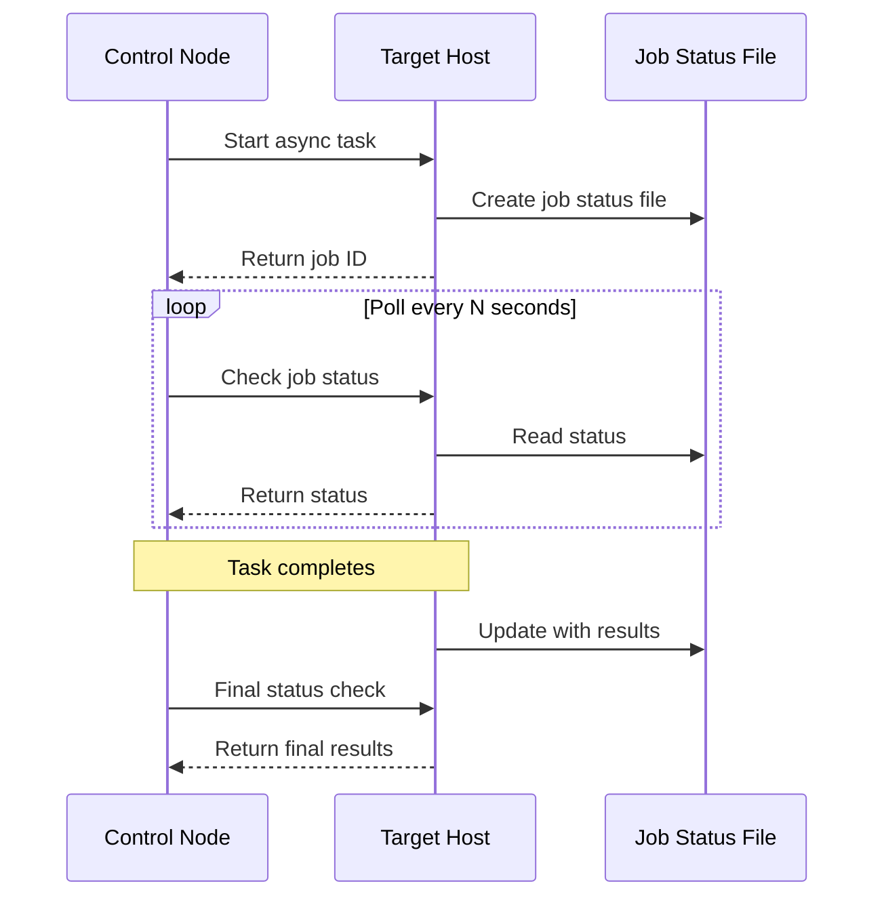
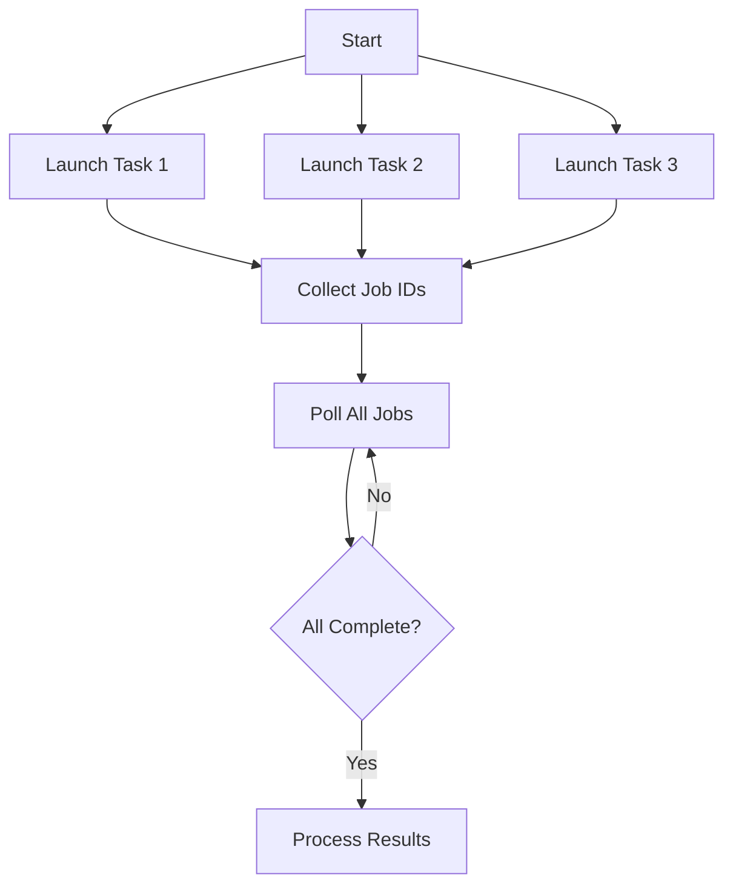

# How to Fix "Async" Long Running Task Errors

Author: [nawazdhandala](https://www.github.com/nawazdhandala)

Tags: Ansible, Async, Long Running Tasks, DevOps, Automation, Troubleshooting, Performance

Description: Learn how to diagnose and fix common Ansible async task errors including timeout issues, polling failures, and status tracking problems.

---

Ansible's async feature allows long-running tasks to execute without blocking playbook execution. However, async tasks come with their own set of challenges. This guide covers common errors and solutions for managing asynchronous tasks effectively.

---

## Understanding Async Task Execution



---

## Common Async Errors

```
FAILED! => {"msg": "async task did not complete within the requested time - 300s"}

FAILED! => {"msg": "Could not find job"}

FAILED! => {"msg": "async_status - Job timed out"}
```

---

## Basic Async Syntax

```yaml
---
# basic-async.yml - Understanding async parameters
- name: Basic async task example
  hosts: all
  tasks:
    # async: Maximum time (seconds) the task can run
    # poll: How often (seconds) to check status (0 = fire and forget)
    - name: Long running task
      ansible.builtin.command: /opt/scripts/long-process.sh
      async: 3600    # Allow up to 1 hour
      poll: 30       # Check every 30 seconds
      register: long_task

    # Fire and forget (poll: 0)
    - name: Background task
      ansible.builtin.command: /opt/scripts/background-job.sh
      async: 3600
      poll: 0
      register: background_job

    # Check status later
    - name: Check background job status
      ansible.builtin.async_status:
        jid: "{{ background_job.ansible_job_id }}"
      register: job_result
      until: job_result.finished
      retries: 120
      delay: 30
```

---

## Solution 1: Task Timeout Errors

The most common async error is the task exceeding the specified async time.

```yaml
---
# fix-timeout.yml - Handle async timeout errors
- name: Handle async timeout errors
  hosts: all
  vars:
    # Define generous timeouts based on task requirements
    backup_timeout: 7200      # 2 hours for backup
    migration_timeout: 3600   # 1 hour for migration
    poll_interval: 60         # Check every minute

  tasks:
    # Estimate task duration before running
    - name: Check database size for timeout estimation
      ansible.builtin.command: du -sb /var/lib/mysql
      register: db_size
      changed_when: false

    # Calculate appropriate timeout (1 minute per GB + buffer)
    - name: Calculate dynamic timeout
      ansible.builtin.set_fact:
        calculated_timeout: "{{ ((db_size.stdout.split()[0] | int / 1073741824) * 60 + 600) | int }}"

    # Run backup with calculated timeout
    - name: Run database backup with dynamic timeout
      ansible.builtin.command: /opt/scripts/backup-database.sh
      async: "{{ calculated_timeout | int }}"
      poll: "{{ poll_interval }}"
      register: backup_result

    # Alternative: Use very long timeout with manual checking
    - name: Start long process with extended timeout
      ansible.builtin.command: /opt/scripts/very-long-process.sh
      async: 86400    # 24 hours maximum
      poll: 0         # Don't wait
      register: long_process

    # Custom polling loop with progress reporting
    - name: Monitor long process
      ansible.builtin.async_status:
        jid: "{{ long_process.ansible_job_id }}"
      register: job_status
      until: job_status.finished
      retries: 1440   # 24 hours with 1-minute intervals
      delay: 60

    # Handle timeout gracefully
    - name: Handle timeout scenario
      when: job_status.finished == false
      block:
        - name: Log timeout
          ansible.builtin.debug:
            msg: "Task timed out after maximum wait time"

        - name: Attempt to get partial results
          ansible.builtin.async_status:
            jid: "{{ long_process.ansible_job_id }}"
            mode: cleanup
          ignore_errors: yes
```

---

## Solution 2: Job Not Found Errors

The async job status file may be missing or inaccessible.

```yaml
---
# fix-job-not-found.yml - Handle missing async jobs
- name: Handle async job not found errors
  hosts: all
  vars:
    async_dir: ~/.ansible_async

  tasks:
    # Ensure async directory exists with correct permissions
    - name: Ensure async directory exists
      ansible.builtin.file:
        path: "{{ async_dir }}"
        state: directory
        mode: '0700'

    # Clean up old async job files
    - name: Clean up old async jobs
      ansible.builtin.find:
        paths: "{{ async_dir }}"
        age: 1d
        recurse: no
      register: old_jobs

    - name: Remove old job files
      ansible.builtin.file:
        path: "{{ item.path }}"
        state: absent
      loop: "{{ old_jobs.files }}"

    # Run async task
    - name: Start async task
      ansible.builtin.command: /opt/scripts/process.sh
      async: 3600
      poll: 0
      register: async_task

    # Verify job file was created
    - name: Verify job file exists
      ansible.builtin.stat:
        path: "{{ async_dir }}/{{ async_task.ansible_job_id }}"
      register: job_file

    - name: Fail if job file missing
      ansible.builtin.fail:
        msg: "Async job file was not created"
      when: not job_file.stat.exists

    # Safe status check with error handling
    - name: Check async status safely
      block:
        - name: Get job status
          ansible.builtin.async_status:
            jid: "{{ async_task.ansible_job_id }}"
          register: job_result
          until: job_result.finished
          retries: 60
          delay: 60
      rescue:
        - name: Handle missing job
          ansible.builtin.debug:
            msg: "Job {{ async_task.ansible_job_id }} not found - may have completed and been cleaned up"

        # Check if process is still running
        - name: Check if process is still running
          ansible.builtin.shell: pgrep -f "process.sh"
          register: process_check
          failed_when: false
          changed_when: false

        - name: Report process status
          ansible.builtin.debug:
            msg: "{{ 'Process still running' if process_check.rc == 0 else 'Process completed or not found' }}"
```

---

## Solution 3: Parallel Async Tasks

Run multiple async tasks in parallel and wait for all to complete.



```yaml
---
# parallel-async.yml - Run multiple async tasks in parallel
- name: Parallel async task execution
  hosts: all
  vars:
    servers_to_backup:
      - database1
      - database2
      - database3

  tasks:
    # Start all backup jobs in parallel
    - name: Start backups on all servers
      ansible.builtin.command: "/opt/scripts/backup.sh {{ item }}"
      async: 7200
      poll: 0
      register: backup_jobs
      loop: "{{ servers_to_backup }}"

    # Create a list of job IDs
    - name: Collect job IDs
      ansible.builtin.set_fact:
        job_ids: "{{ backup_jobs.results | map(attribute='ansible_job_id') | list }}"

    # Wait for all jobs to complete
    - name: Wait for all backups to complete
      ansible.builtin.async_status:
        jid: "{{ item }}"
      register: job_results
      loop: "{{ job_ids }}"
      until: job_results.results | map(attribute='finished') | list | min
      retries: 120
      delay: 60
      ignore_errors: yes

    # Alternative: Check each job individually
    - name: Check each job status
      ansible.builtin.async_status:
        jid: "{{ item.ansible_job_id }}"
      register: individual_result
      until: individual_result.finished
      retries: 120
      delay: 30
      loop: "{{ backup_jobs.results }}"
      loop_control:
        label: "{{ item.item }}"

    # Report results
    - name: Report backup results
      ansible.builtin.debug:
        msg: |
          Server: {{ item.item.item }}
          Status: {{ 'Success' if item.rc == 0 else 'Failed' }}
          Duration: {{ item.delta | default('N/A') }}
      loop: "{{ individual_result.results }}"
      loop_control:
        label: "{{ item.item.item }}"
```

---

## Solution 4: Async with Retries and Error Recovery

```yaml
---
# async-recovery.yml - Async task with error recovery
- name: Async task with error recovery
  hosts: all
  vars:
    max_retries: 3
    async_timeout: 1800

  tasks:
    # Attempt async task with retry logic
    - name: Run async task with retries
      block:
        - name: Start async operation
          ansible.builtin.command: /opt/scripts/flaky-operation.sh
          async: "{{ async_timeout }}"
          poll: 0
          register: async_op

        - name: Wait for completion
          ansible.builtin.async_status:
            jid: "{{ async_op.ansible_job_id }}"
          register: async_result
          until: async_result.finished
          retries: "{{ (async_timeout / 30) | int }}"
          delay: 30

        - name: Verify success
          ansible.builtin.assert:
            that:
              - async_result.rc == 0
            fail_msg: "Async operation failed with rc={{ async_result.rc }}"

      rescue:
        # Clean up failed job
        - name: Clean up failed async job
          ansible.builtin.async_status:
            jid: "{{ async_op.ansible_job_id }}"
            mode: cleanup
          ignore_errors: yes

        # Retry the operation
        - name: Retry async operation
          ansible.builtin.command: /opt/scripts/flaky-operation.sh
          async: "{{ async_timeout }}"
          poll: 30
          register: retry_result
          retries: "{{ max_retries }}"
          delay: 60
          until: retry_result.rc == 0

      always:
        # Log the result
        - name: Log operation result
          ansible.builtin.lineinfile:
            path: /var/log/async-operations.log
            line: "{{ ansible_date_time.iso8601 }} - Operation {{ 'succeeded' if (async_result.rc | default(1)) == 0 else 'failed' }}"
            create: yes
```

---

## Solution 5: Async Status Monitoring

```yaml
---
# async-monitoring.yml - Advanced async status monitoring
- name: Monitor async tasks with progress
  hosts: all
  tasks:
    # Start async task that writes progress
    - name: Start task with progress tracking
      ansible.builtin.shell: |
        # Create progress file
        progress_file="/tmp/task_progress_$$"
        echo "0" > "$progress_file"

        # Run actual task with progress updates
        total_steps=100
        for i in $(seq 1 $total_steps); do
          # Simulate work
          sleep 1
          echo "$i" > "$progress_file"
        done

        # Cleanup
        rm -f "$progress_file"
        echo "Complete"
      async: 300
      poll: 0
      register: progress_task

    # Monitor progress
    - name: Monitor task progress
      ansible.builtin.shell: |
        progress_file=$(ls /tmp/task_progress_* 2>/dev/null | head -1)
        if [ -f "$progress_file" ]; then
          cat "$progress_file"
        else
          echo "waiting"
        fi
      register: current_progress
      changed_when: false
      until: current_progress.stdout == "100" or progress_task_status.finished | default(false)
      retries: 120
      delay: 5

    # Check actual job status
    - name: Check job completion
      ansible.builtin.async_status:
        jid: "{{ progress_task.ansible_job_id }}"
      register: progress_task_status
      until: progress_task_status.finished
      retries: 60
      delay: 5

    # Display final status
    - name: Display task result
      ansible.builtin.debug:
        msg: |
          Task completed: {{ progress_task_status.finished }}
          Return code: {{ progress_task_status.rc }}
          Output: {{ progress_task_status.stdout }}
```

---

## Solution 6: Fire and Forget with Verification

```yaml
---
# fire-and-forget.yml - Fire and forget pattern
- name: Fire and forget with later verification
  hosts: all
  tasks:
    # Start multiple background tasks
    - name: Start background processes
      ansible.builtin.command: "{{ item.cmd }}"
      async: "{{ item.timeout }}"
      poll: 0
      register: bg_tasks
      loop:
        - { name: "log_rotation", cmd: "/opt/scripts/rotate-logs.sh", timeout: 1800 }
        - { name: "cache_warmup", cmd: "/opt/scripts/warm-cache.sh", timeout: 900 }
        - { name: "report_generation", cmd: "/opt/scripts/generate-reports.sh", timeout: 3600 }
      loop_control:
        label: "{{ item.name }}"

    # Store job information for later
    - name: Save job information
      ansible.builtin.copy:
        content: |
          
          {{ result.item.name }}: {{ result.ansible_job_id }}
          
        dest: /tmp/ansible_async_jobs.txt

    # Continue with other tasks
    - name: Continue with other work
      ansible.builtin.debug:
        msg: "Continuing while background tasks run"

    # Later: verify all background tasks completed
    - name: Verify background tasks completed
      ansible.builtin.async_status:
        jid: "{{ item.ansible_job_id }}"
      register: bg_status
      loop: "{{ bg_tasks.results }}"
      loop_control:
        label: "{{ item.item.name }}"
      ignore_errors: yes

    # Report any failures
    - name: Report background task status
      ansible.builtin.debug:
        msg: "{{ item.item.item.name }}: {{ 'completed' if item.finished else 'still running' }} - rc={{ item.rc | default('N/A') }}"
      loop: "{{ bg_status.results }}"
      loop_control:
        label: "{{ item.item.item.name }}"
```

---

## Solution 7: Async with Ansible Collections

```yaml
---
# async-collections.yml - Using async with various modules
- name: Async with different module types
  hosts: all
  become: yes
  tasks:
    # Async package installation
    - name: Install large packages asynchronously
      ansible.builtin.apt:
        name:
          - openjdk-17-jdk
          - postgresql-15
          - nginx
        state: present
        update_cache: yes
      async: 1800
      poll: 60

    # Async file synchronization
    - name: Sync large directory asynchronously
      ansible.posix.synchronize:
        src: /data/large-dataset/
        dest: /backup/large-dataset/
        recursive: yes
      async: 7200
      poll: 0
      register: sync_task

    # Async archive extraction
    - name: Extract large archive
      ansible.builtin.unarchive:
        src: https://releases.example.com/big-release.tar.gz
        dest: /opt/application/
        remote_src: yes
      async: 1800
      poll: 30

    # Monitor sync task
    - name: Wait for sync to complete
      ansible.builtin.async_status:
        jid: "{{ sync_task.ansible_job_id }}"
      register: sync_result
      until: sync_result.finished
      retries: 240
      delay: 30
      when: sync_task is defined
```

---

## Debugging Async Tasks

```yaml
---
# debug-async.yml - Debug async task issues
- name: Debug async tasks
  hosts: all
  vars:
    async_dir: "~/.ansible_async"

  tasks:
    # Check async directory
    - name: List async job files
      ansible.builtin.find:
        paths: "{{ async_dir }}"
        patterns: "*"
      register: async_files

    - name: Display async job files
      ansible.builtin.debug:
        msg: "Found {{ async_files.files | length }} async job files"

    # Read job file contents
    - name: Read async job file
      ansible.builtin.slurp:
        src: "{{ item.path }}"
      register: job_contents
      loop: "{{ async_files.files[:5] }}"
      when: async_files.files | length > 0

    - name: Display job contents
      ansible.builtin.debug:
        msg: "{{ item.content | b64decode | from_json }}"
      loop: "{{ job_contents.results }}"
      when: job_contents.results is defined
      ignore_errors: yes

    # Check system resources
    - name: Check disk space for async jobs
      ansible.builtin.command: df -h {{ async_dir }}
      register: disk_space
      changed_when: false

    - name: Display disk space
      ansible.builtin.debug:
        var: disk_space.stdout_lines
```

---

## Error Reference Table

| Error | Cause | Solution |
|-------|-------|----------|
| Task timed out | async value too low | Increase async timeout |
| Job not found | Job file deleted or wrong path | Check async directory permissions |
| Status check fails | Network issues during poll | Increase poll interval, add retries |
| Orphaned jobs | Playbook interrupted | Clean up with mode: cleanup |
| Results lost | Job file cleaned up | Store job ID and results immediately |

---

## Best Practices

1. **Always set appropriate timeouts** - Estimate task duration and add buffer
2. **Use poll: 0 for fire-and-forget** - Check status manually when needed
3. **Store job IDs** - Save job IDs if you need to check status later
4. **Clean up completed jobs** - Use mode: cleanup to remove old job files
5. **Handle failures gracefully** - Use block/rescue for error recovery
6. **Monitor long-running tasks** - Implement progress tracking when possible

---

*Managing long-running tasks? [OneUptime](https://oneuptime.com) provides comprehensive monitoring for your automation workflows, with alerts when async tasks fail or exceed expected durations.*
