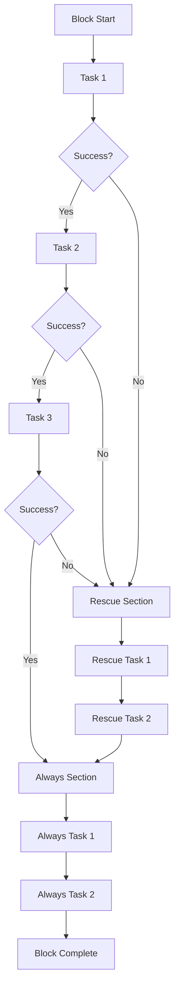
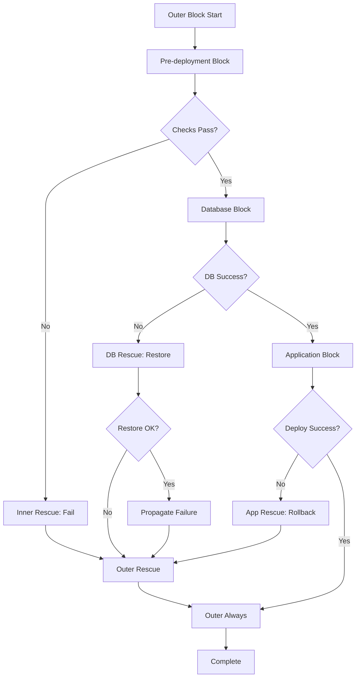

# How to Handle Ansible Block Error Handling

Author: [nawazdhandala](https://www.github.com/nawazdhandala)

Tags: Ansible, Error Handling, Blocks, Rescue, Always, DevOps, Automation

Description: Learn how to use Ansible blocks with rescue and always sections to implement robust error handling in your playbooks.

---

> Ansible blocks provide a powerful mechanism for grouping tasks and implementing error handling with rescue and always sections. Understanding block error handling is essential for building resilient automation that can recover gracefully from failures.

Blocks allow you to organize tasks logically and handle errors in a structured way, similar to try/catch/finally constructs in programming languages.

---

## Block Structure Overview



The block executes tasks in order. If any task fails, execution jumps to the rescue section. The always section executes regardless of success or failure.

---

## Basic Block Syntax

Here is a simple example demonstrating block, rescue, and always:

```yaml
# playbook.yml
# Basic block error handling example
---
- name: Deploy application with error handling
  hosts: appservers
  become: yes

  tasks:
    - name: Application deployment with error handling
      block:
        # Tasks in the block execute sequentially
        # If any task fails, execution jumps to rescue
        - name: Stop application service
          ansible.builtin.service:
            name: myapp
            state: stopped

        - name: Deploy new application code
          ansible.builtin.unarchive:
            src: myapp-release.tar.gz
            dest: /opt/myapp
            remote_src: no

        - name: Run database migrations
          ansible.builtin.command:
            cmd: /opt/myapp/bin/migrate
          register: migration_result

        - name: Start application service
          ansible.builtin.service:
            name: myapp
            state: started

      rescue:
        # Rescue section executes only if block fails
        # Use this to recover from errors
        - name: Log deployment failure
          ansible.builtin.debug:
            msg: "Deployment failed: {{ ansible_failed_result }}"

        - name: Restore previous version
          ansible.builtin.command:
            cmd: /opt/myapp/bin/rollback

        - name: Start application with previous version
          ansible.builtin.service:
            name: myapp
            state: started

        - name: Send failure notification
          ansible.builtin.uri:
            url: https://hooks.slack.com/services/xxx
            method: POST
            body_format: json
            body:
              text: "Deployment to {{ inventory_hostname }} failed and was rolled back"

      always:
        # Always section executes regardless of success or failure
        # Use for cleanup tasks that must always run
        - name: Clean up temporary files
          ansible.builtin.file:
            path: /tmp/myapp-deploy
            state: absent

        - name: Verify application health
          ansible.builtin.uri:
            url: http://localhost:8080/health
            status_code: 200
          register: health_check
          retries: 5
          delay: 10
          until: health_check.status == 200
```

---

## Accessing Error Information

When a block fails, Ansible provides special variables with error details:

```yaml
# playbook.yml
# Accessing error information in rescue block
---
- name: Handle errors with detailed information
  hosts: servers
  become: yes

  tasks:
    - name: Risky operation with error details
      block:
        - name: Execute potentially failing command
          ansible.builtin.command:
            cmd: /usr/local/bin/risky-operation
          register: operation_result

      rescue:
        # ansible_failed_task contains the failed task object
        - name: Show failed task name
          ansible.builtin.debug:
            msg: "Failed task: {{ ansible_failed_task.name }}"

        # ansible_failed_result contains the result of the failed task
        - name: Show error message
          ansible.builtin.debug:
            msg: "Error: {{ ansible_failed_result.msg | default('Unknown error') }}"

        # Show complete failure information
        - name: Display full error details
          ansible.builtin.debug:
            var: ansible_failed_result

        # Log error to file
        - name: Log error to file
          ansible.builtin.lineinfile:
            path: /var/log/ansible-errors.log
            line: "{{ ansible_date_time.iso8601 }} - Task '{{ ansible_failed_task.name }}' failed: {{ ansible_failed_result.msg | default('Unknown') }}"
            create: yes
          delegate_to: localhost
```

---

## Nested Blocks

Blocks can be nested for fine-grained error handling:

```yaml
# playbook.yml
# Nested blocks for layered error handling
---
- name: Complex deployment with nested blocks
  hosts: appservers
  become: yes

  tasks:
    - name: Outer block - Full deployment
      block:
        - name: Pre-deployment checks
          block:
            - name: Check disk space
              ansible.builtin.shell: df -h / | tail -1 | awk '{print $5}' | sed 's/%//'
              register: disk_usage
              failed_when: disk_usage.stdout | int > 90

            - name: Check memory availability
              ansible.builtin.shell: free -m | awk '/^Mem:/{print $7}'
              register: free_memory
              failed_when: free_memory.stdout | int < 512

          rescue:
            - name: Handle pre-check failures
              ansible.builtin.fail:
                msg: "Pre-deployment checks failed. Cannot proceed with deployment."

        - name: Database operations
          block:
            - name: Backup database
              ansible.builtin.command:
                cmd: /usr/local/bin/backup-db
              register: backup_result

            - name: Run migrations
              ansible.builtin.command:
                cmd: /opt/myapp/bin/migrate

          rescue:
            # Inner rescue handles database-specific recovery
            - name: Restore database from backup
              ansible.builtin.command:
                cmd: /usr/local/bin/restore-db {{ backup_result.stdout | default('latest') }}
              when: backup_result is defined

            - name: Propagate failure to outer block
              ansible.builtin.fail:
                msg: "Database operations failed"

        - name: Application deployment
          block:
            - name: Deploy application
              ansible.builtin.unarchive:
                src: app.tar.gz
                dest: /opt/myapp

            - name: Start application
              ansible.builtin.service:
                name: myapp
                state: started

          rescue:
            - name: Rollback application
              ansible.builtin.command:
                cmd: /opt/myapp/bin/rollback

      rescue:
        # Outer rescue handles any unhandled failures
        - name: Send critical failure alert
          ansible.builtin.uri:
            url: https://pagerduty.com/integrate/xxx
            method: POST
            body_format: json
            body:
              service_key: "xxx"
              event_type: "trigger"
              description: "Deployment failed on {{ inventory_hostname }}"

      always:
        - name: Generate deployment report
          ansible.builtin.template:
            src: deployment-report.j2
            dest: /var/log/deployment-report.txt
```



---

## Block with Conditions

Apply conditions to entire blocks:

```yaml
# playbook.yml
# Conditional block execution
---
- name: Conditional deployment
  hosts: all
  become: yes

  vars:
    deployment_type: blue_green
    current_environment: blue

  tasks:
    # Block executes only when condition is met
    - name: Blue-green deployment block
      block:
        - name: Deploy to inactive environment
          ansible.builtin.include_tasks: deploy.yml
          vars:
            target_env: "{{ 'green' if current_environment == 'blue' else 'blue' }}"

        - name: Run health checks on new environment
          ansible.builtin.uri:
            url: "http://{{ target_env }}.example.com/health"
            status_code: 200
          retries: 10
          delay: 5

        - name: Switch traffic to new environment
          ansible.builtin.command:
            cmd: /usr/local/bin/switch-traffic {{ target_env }}

      rescue:
        - name: Keep traffic on current environment
          ansible.builtin.debug:
            msg: "Deployment failed, traffic remains on {{ current_environment }}"

      when: deployment_type == 'blue_green'

    # Alternative block for different deployment type
    - name: Rolling deployment block
      block:
        - name: Deploy with rolling update
          ansible.builtin.include_tasks: rolling-deploy.yml

      rescue:
        - name: Rollback rolling deployment
          ansible.builtin.include_tasks: rolling-rollback.yml

      when: deployment_type == 'rolling'
```

---

## Block with Loops

While you cannot loop a block directly, you can use include_tasks with blocks:

```yaml
# playbook.yml
# Using blocks with loops via include
---
- name: Deploy to multiple environments
  hosts: localhost
  connection: local

  vars:
    environments:
      - name: staging
        hosts: staging_servers
      - name: production
        hosts: production_servers

  tasks:
    - name: Deploy to each environment
      ansible.builtin.include_tasks: deploy-environment.yml
      loop: "{{ environments }}"
      loop_control:
        loop_var: env
```

```yaml
# deploy-environment.yml
# Included tasks with block error handling
---
- name: Deploy to {{ env.name }}
  block:
    - name: Deploy application
      ansible.builtin.include_tasks: deploy-app.yml
      vars:
        target_hosts: "{{ env.hosts }}"

    - name: Run tests
      ansible.builtin.include_tasks: run-tests.yml
      vars:
        test_environment: "{{ env.name }}"

  rescue:
    - name: Rollback {{ env.name }} deployment
      ansible.builtin.include_tasks: rollback.yml
      vars:
        target_hosts: "{{ env.hosts }}"

    - name: Stop deployment pipeline
      ansible.builtin.fail:
        msg: "Deployment to {{ env.name }} failed. Pipeline stopped."
      when: env.name == 'production'

  always:
    - name: Log deployment result for {{ env.name }}
      ansible.builtin.lineinfile:
        path: /var/log/deployments.log
        line: "{{ ansible_date_time.iso8601 }} - {{ env.name }}: {{ 'SUCCESS' if ansible_failed_task is not defined else 'FAILED' }}"
        create: yes
      delegate_to: localhost
```

---

## Common Patterns

### Pattern 1: Service Maintenance Window

```yaml
# playbook.yml
# Safe service update with maintenance window
---
- name: Update service with maintenance window
  hosts: webservers
  become: yes
  serial: 1  # One server at a time

  tasks:
    - name: Service update with safety measures
      block:
        - name: Remove from load balancer
          ansible.builtin.uri:
            url: "http://{{ lb_api }}/remove"
            method: POST
            body_format: json
            body:
              server: "{{ inventory_hostname }}"
          delegate_to: localhost

        - name: Wait for connections to drain
          ansible.builtin.wait_for:
            timeout: 30

        - name: Stop service
          ansible.builtin.service:
            name: myapp
            state: stopped

        - name: Update application
          ansible.builtin.package:
            name: myapp
            state: latest

        - name: Start service
          ansible.builtin.service:
            name: myapp
            state: started

        - name: Wait for service to be ready
          ansible.builtin.wait_for:
            port: 8080
            delay: 5
            timeout: 60

        - name: Add back to load balancer
          ansible.builtin.uri:
            url: "http://{{ lb_api }}/add"
            method: POST
            body_format: json
            body:
              server: "{{ inventory_hostname }}"
          delegate_to: localhost

      rescue:
        - name: Ensure service is running (even if old version)
          ansible.builtin.service:
            name: myapp
            state: started

        - name: Re-add to load balancer
          ansible.builtin.uri:
            url: "http://{{ lb_api }}/add"
            method: POST
            body_format: json
            body:
              server: "{{ inventory_hostname }}"
          delegate_to: localhost

        - name: Alert on failure
          ansible.builtin.debug:
            msg: "Update failed on {{ inventory_hostname }}, server returned to pool"
```

### Pattern 2: Transactional Operations

```yaml
# playbook.yml
# Transactional database operations
---
- name: Database migration with transaction
  hosts: dbservers
  become: yes
  become_user: postgres

  tasks:
    - name: Database migration block
      block:
        - name: Create savepoint
          community.postgresql.postgresql_query:
            db: myapp
            query: "SAVEPOINT pre_migration;"

        - name: Run migration script
          community.postgresql.postgresql_query:
            db: myapp
            query: "{{ lookup('file', 'migrations/001_add_columns.sql') }}"

        - name: Validate data integrity
          community.postgresql.postgresql_query:
            db: myapp
            query: "SELECT COUNT(*) FROM users WHERE email IS NULL;"
          register: validation
          failed_when: validation.query_result[0].count > 0

        - name: Release savepoint
          community.postgresql.postgresql_query:
            db: myapp
            query: "RELEASE SAVEPOINT pre_migration;"

      rescue:
        - name: Rollback to savepoint
          community.postgresql.postgresql_query:
            db: myapp
            query: "ROLLBACK TO SAVEPOINT pre_migration;"

        - name: Log migration failure
          ansible.builtin.debug:
            msg: "Migration failed and was rolled back"

      always:
        - name: Analyze affected tables
          community.postgresql.postgresql_query:
            db: myapp
            query: "ANALYZE users;"
```

### Pattern 3: Resource Cleanup

```yaml
# playbook.yml
# Ensure resource cleanup on failure
---
- name: Create and configure resources
  hosts: cloud_servers

  tasks:
    - name: Infrastructure provisioning
      block:
        - name: Create virtual network
          cloud.provider.network:
            name: myapp-network
            cidr: 10.0.0.0/16
          register: network

        - name: Create subnet
          cloud.provider.subnet:
            name: myapp-subnet
            network_id: "{{ network.id }}"
            cidr: 10.0.1.0/24
          register: subnet

        - name: Create security group
          cloud.provider.security_group:
            name: myapp-sg
            rules:
              - protocol: tcp
                port: 443
                cidr: 0.0.0.0/0
          register: security_group

        - name: Create instance
          cloud.provider.instance:
            name: myapp-server
            network_id: "{{ network.id }}"
            subnet_id: "{{ subnet.id }}"
            security_groups:
              - "{{ security_group.id }}"
          register: instance

      rescue:
        # Clean up any created resources on failure
        - name: Delete instance if created
          cloud.provider.instance:
            name: myapp-server
            state: absent
          when: instance is defined
          ignore_errors: yes

        - name: Delete security group if created
          cloud.provider.security_group:
            name: myapp-sg
            state: absent
          when: security_group is defined
          ignore_errors: yes

        - name: Delete subnet if created
          cloud.provider.subnet:
            name: myapp-subnet
            state: absent
          when: subnet is defined
          ignore_errors: yes

        - name: Delete network if created
          cloud.provider.network:
            name: myapp-network
            state: absent
          when: network is defined
          ignore_errors: yes

        - name: Fail with cleanup complete message
          ansible.builtin.fail:
            msg: "Infrastructure provisioning failed. All resources cleaned up."
```

### Pattern 4: Retry with Different Strategies

```yaml
# playbook.yml
# Try multiple strategies before failing
---
- name: Install package with fallback methods
  hosts: servers
  become: yes

  tasks:
    - name: Install package with fallbacks
      block:
        # Try primary package manager
        - name: Install from default repository
          ansible.builtin.package:
            name: mypackage
            state: present
          register: primary_install

      rescue:
        - name: Try alternative installation methods
          block:
            # Try adding external repository
            - name: Add external repository
              ansible.builtin.apt_repository:
                repo: "ppa:mypackage/stable"
                state: present
              when: ansible_os_family == 'Debian'

            - name: Install from external repository
              ansible.builtin.package:
                name: mypackage
                state: present

          rescue:
            # Try downloading and installing directly
            - name: Download package directly
              ansible.builtin.get_url:
                url: "https://releases.example.com/mypackage.deb"
                dest: /tmp/mypackage.deb

            - name: Install from downloaded file
              ansible.builtin.apt:
                deb: /tmp/mypackage.deb
              when: ansible_os_family == 'Debian'

      always:
        - name: Verify installation
          ansible.builtin.command: which mypackage
          register: verify_install
          changed_when: false
          failed_when: verify_install.rc != 0
```

---

## Error Handling with Handlers

Blocks can trigger handlers, but rescue blocks can also notify handlers:

```yaml
# playbook.yml
# Blocks with handler notifications
---
- name: Update configuration with handler support
  hosts: webservers
  become: yes

  tasks:
    - name: Configuration update block
      block:
        - name: Update primary config
          ansible.builtin.template:
            src: app.conf.j2
            dest: /etc/myapp/app.conf
          notify: Restart application

        - name: Update logging config
          ansible.builtin.template:
            src: logging.conf.j2
            dest: /etc/myapp/logging.conf
          notify: Restart application

      rescue:
        - name: Restore backup configuration
          ansible.builtin.copy:
            src: /etc/myapp/app.conf.bak
            dest: /etc/myapp/app.conf
            remote_src: yes
          # Also notify handler after restore
          notify: Restart application

        - name: Record failure
          ansible.builtin.set_fact:
            config_update_failed: true

      always:
        # Flush handlers to ensure service is in correct state
        - name: Ensure handlers run
          ansible.builtin.meta: flush_handlers

        - name: Verify service is healthy
          ansible.builtin.uri:
            url: http://localhost:8080/health
            status_code: 200

  handlers:
    - name: Restart application
      ansible.builtin.service:
        name: myapp
        state: restarted
```

---

## Block Variables and Scope

Variables set in blocks, rescue, or always have specific scoping rules:

```yaml
# playbook.yml
# Variable scope in blocks
---
- name: Demonstrate block variable scope
  hosts: localhost
  connection: local

  tasks:
    - name: Block with variable scope
      block:
        - name: Set variable in block
          ansible.builtin.set_fact:
            block_var: "set in block"
            deployment_status: "in_progress"

        - name: Simulate failure
          ansible.builtin.fail:
            msg: "Simulated failure"
          when: simulate_failure | default(true)

      rescue:
        # Variables set in block ARE available in rescue
        - name: Access block variable
          ansible.builtin.debug:
            msg: "Block var is: {{ block_var | default('not set') }}"

        - name: Update deployment status
          ansible.builtin.set_fact:
            deployment_status: "failed"
            rescue_executed: true

      always:
        # Variables from both block and rescue are available
        - name: Show final status
          ansible.builtin.debug:
            msg: |
              Block var: {{ block_var | default('not set') }}
              Status: {{ deployment_status | default('unknown') }}
              Rescue ran: {{ rescue_executed | default(false) }}

    # Variables are available after the block
    - name: Post-block access
      ansible.builtin.debug:
        msg: "Final deployment status: {{ deployment_status }}"
```

---

## Best Practices

### 1. Keep Rescue Blocks Simple

```yaml
# Good: Simple, focused rescue actions
rescue:
  - name: Log failure
    ansible.builtin.debug:
      msg: "{{ ansible_failed_task.name }} failed"

  - name: Restore backup
    ansible.builtin.copy:
      src: /backup/config
      dest: /etc/app/config
      remote_src: yes

# Avoid: Complex logic in rescue that might also fail
rescue:
  - name: Complex recovery
    block:
      - name: Nested operations
        # This can lead to confusing failure states
```

### 2. Use Always for Cleanup

```yaml
always:
  # Cleanup that must happen regardless of success/failure
  - name: Remove temporary files
    ansible.builtin.file:
      path: "{{ item }}"
      state: absent
    loop:
      - /tmp/deploy-staging
      - /tmp/migration-scripts
    ignore_errors: yes  # Cleanup should not fail the play

  - name: Release lock
    ansible.builtin.file:
      path: /var/lock/deploy.lock
      state: absent
```

### 3. Provide Clear Error Messages

```yaml
rescue:
  - name: Set clear error context
    ansible.builtin.set_fact:
      error_context:
        failed_task: "{{ ansible_failed_task.name }}"
        error_message: "{{ ansible_failed_result.msg | default('Unknown error') }}"
        host: "{{ inventory_hostname }}"
        timestamp: "{{ ansible_date_time.iso8601 }}"

  - name: Display error summary
    ansible.builtin.debug:
      msg: |
        DEPLOYMENT FAILED
        Task: {{ error_context.failed_task }}
        Error: {{ error_context.error_message }}
        Host: {{ error_context.host }}
        Time: {{ error_context.timestamp }}
```

### 4. Test Rescue Blocks

```yaml
# Test playbook to verify rescue behavior
- name: Test error handling
  hosts: test_servers

  tasks:
    - name: Test block with intentional failure
      block:
        - name: This will fail
          ansible.builtin.fail:
            msg: "Intentional test failure"

      rescue:
        - name: Rescue executed
          ansible.builtin.set_fact:
            rescue_worked: true

      always:
        - name: Verify rescue executed
          ansible.builtin.assert:
            that:
              - rescue_worked is defined
              - rescue_worked == true
            fail_msg: "Rescue block did not execute properly"
```

---

## Conclusion

Ansible blocks with rescue and always sections provide robust error handling capabilities for complex automation workflows. Key takeaways:

- Use blocks to group related tasks and handle errors collectively
- Rescue sections execute only when block tasks fail
- Always sections execute regardless of success or failure
- Access error details through `ansible_failed_task` and `ansible_failed_result`
- Keep rescue blocks simple to avoid cascading failures
- Use always for cleanup tasks that must run
- Test your error handling to ensure it works as expected

By implementing proper block error handling, you can build resilient playbooks that recover gracefully from failures and maintain system stability.

---

*Need visibility into your Ansible automation health? [OneUptime](https://oneuptime.com) provides monitoring and alerting for your infrastructure, ensuring your automated deployments succeed.*

**Related Reading:**
- [How to Handle Ansible Handlers and Notifications](/blog/post/2026-01-24-ansible-handlers-notifications/view)
- [How to Configure Ansible Collections](/blog/post/2026-01-24-ansible-collections-configuration/view)
