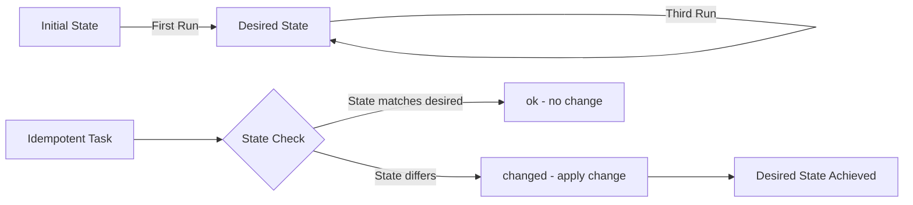
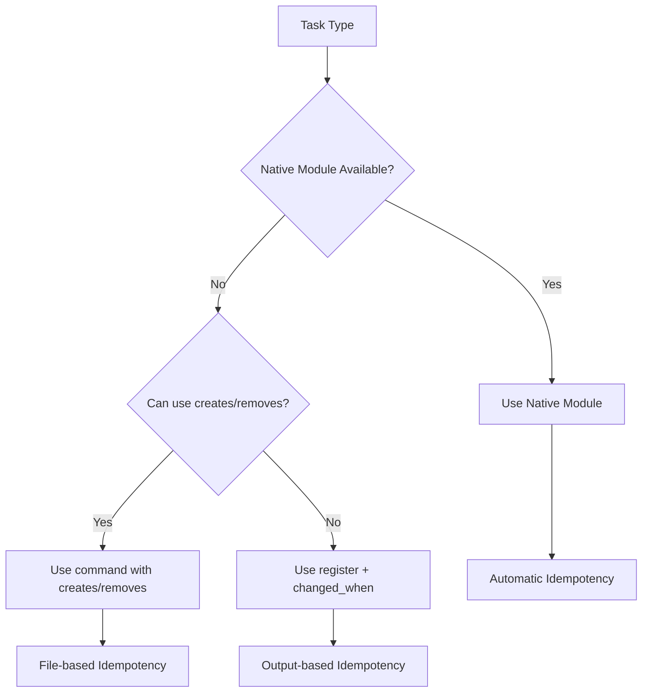
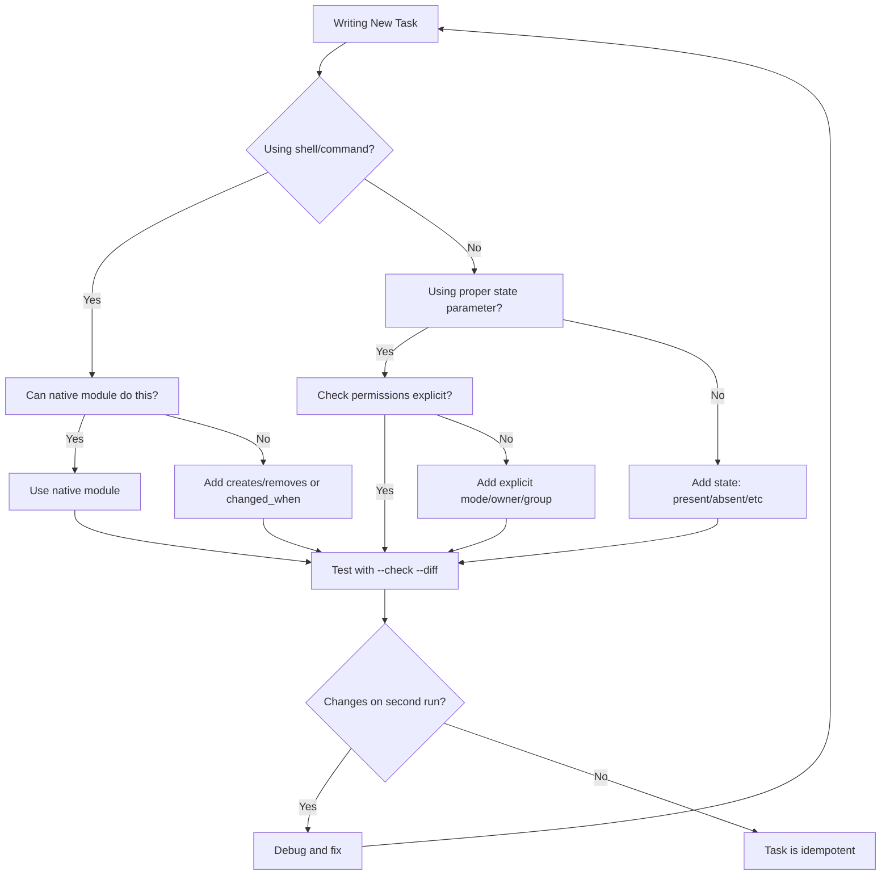

# How to Fix 'Changed Status' Idempotency Issues

Author: [nawazdhandala](https://www.github.com/nawazdhandala)

Tags: Ansible, Idempotency, DevOps, Best Practices, Configuration Management, Automation, Troubleshooting

Description: Learn how to fix Ansible playbooks that report 'changed' status on every run by implementing proper idempotency patterns and best practices.

---

Idempotency is a core principle of Ansible: running a playbook multiple times should produce the same result, with "changed" status only appearing when actual modifications occur. When tasks incorrectly report "changed" on every run, it undermines trust in your automation and can trigger unnecessary handlers. This guide shows you how to identify and fix these issues.

## Understanding Idempotency in Ansible

An idempotent operation produces the same result regardless of how many times it is executed.



## Common Idempotency Problems

### Problem 1: Shell and Command Modules Always Show Changed

The `shell` and `command` modules always report "changed" because Ansible cannot know if the command actually changed anything.

```yaml
# BAD: Always reports changed
- name: Create directory
  command: mkdir -p /opt/myapp

# GOOD: Idempotent - only changes when needed
- name: Create directory
  file:
    path: /opt/myapp
    state: directory
    mode: '0755'
```

```yaml
# BAD: Always reports changed
- name: Add line to config
  shell: echo "export PATH=/opt/bin:$PATH" >> ~/.bashrc

# GOOD: Idempotent - only adds if not present
- name: Add line to config
  lineinfile:
    path: ~/.bashrc
    line: 'export PATH=/opt/bin:$PATH'
    state: present
```

### Solution: Use changed_when and creates/removes

```yaml
# Using changed_when to control status
- name: Run database migration
  command: /opt/app/manage.py migrate
  register: migration_result
  changed_when: "'No migrations to apply' not in migration_result.stdout"

# Using creates to skip if file exists
- name: Download application
  command: wget https://example.com/app.tar.gz -O /tmp/app.tar.gz
  args:
    creates: /tmp/app.tar.gz

# Using removes to skip if file does not exist
- name: Remove old logs
  command: rm -rf /var/log/old_logs
  args:
    removes: /var/log/old_logs
```

### Problem 2: Template Module Reports Changed Due to Whitespace

Templates can report "changed" due to invisible differences like trailing whitespace or line endings.

```yaml
# Template might report changed due to Jinja2 whitespace
- name: Deploy configuration
  template:
    src: app.conf.j2
    dest: /etc/app/app.conf
```

### Solution: Control Jinja2 Whitespace

```jinja2
{# app.conf.j2 - BAD: produces extra whitespace #}

server={{ server }}


{# app.conf.j2 - GOOD: trim whitespace with minus signs #}

server={{ server }}

```

```yaml
# Use lstrip_blocks and trim_blocks in ansible.cfg
# or set in template task
- name: Deploy configuration
  template:
    src: app.conf.j2
    dest: /etc/app/app.conf
    lstrip_blocks: true
    trim_blocks: true
```

### Problem 3: File Permissions Keep Changing

```yaml
# BAD: Might report changed if umask differs
- name: Create script
  copy:
    content: |
      #!/bin/bash
      echo "Hello"
    dest: /usr/local/bin/hello.sh

# GOOD: Explicit permissions prevent unnecessary changes
- name: Create script
  copy:
    content: |
      #!/bin/bash
      echo "Hello"
    dest: /usr/local/bin/hello.sh
    mode: '0755'
    owner: root
    group: root
```

### Problem 4: Package Module Reports Changed Unnecessarily

```yaml
# Can report changed if package already installed but version differs
- name: Install nginx
  apt:
    name: nginx
    state: latest  # BAD: always checks for updates

# GOOD: Use 'present' for idempotent installs
- name: Install nginx
  apt:
    name: nginx
    state: present

# Or be explicit about version
- name: Install nginx specific version
  apt:
    name: nginx=1.18.0-0ubuntu1
    state: present
```

## Patterns for Idempotent Playbooks

### Pattern 1: Check Before Change

```yaml
# Check if change is needed before making it
- name: Check if swap exists
  stat:
    path: /swapfile
  register: swap_file

- name: Create swap file
  command: fallocate -l 2G /swapfile
  when: not swap_file.stat.exists

- name: Set swap permissions
  file:
    path: /swapfile
    mode: '0600'
  when: not swap_file.stat.exists

- name: Make swap
  command: mkswap /swapfile
  when: not swap_file.stat.exists
  register: mkswap_result
  changed_when: mkswap_result.rc == 0

- name: Enable swap
  command: swapon /swapfile
  when: not swap_file.stat.exists
  register: swapon_result
  changed_when: swapon_result.rc == 0
```

### Pattern 2: Register and Compare

```yaml
# Compare current state with desired state
- name: Get current timezone
  command: timedatectl show --property=Timezone --value
  register: current_timezone
  changed_when: false

- name: Set timezone
  command: timedatectl set-timezone America/New_York
  when: current_timezone.stdout != 'America/New_York'
```

### Pattern 3: Use Idempotent Modules



```yaml
# Instead of shell commands, use native modules

# File operations
- name: Ensure directory exists
  file:
    path: /opt/app
    state: directory
    mode: '0755'

# User management
- name: Create application user
  user:
    name: appuser
    shell: /bin/bash
    groups: sudo
    state: present

# Service management
- name: Ensure nginx is running
  service:
    name: nginx
    state: started
    enabled: true

# Cron jobs
- name: Add backup cron job
  cron:
    name: "Daily backup"
    minute: "0"
    hour: "2"
    job: "/opt/scripts/backup.sh"

# Sysctl settings
- name: Set kernel parameter
  sysctl:
    name: net.ipv4.ip_forward
    value: '1'
    state: present
    reload: true
```

### Pattern 4: Conditional Handler Notification

```yaml
# Only notify handler when actual change occurs
- name: Update nginx configuration
  template:
    src: nginx.conf.j2
    dest: /etc/nginx/nginx.conf
  register: nginx_config
  notify: Reload nginx
  # Handler only runs if template actually changed

# In handlers section
handlers:
  - name: Reload nginx
    service:
      name: nginx
      state: reloaded
```

## Advanced Idempotency Techniques

### Technique 1: Idempotent Database Operations

```yaml
# Check if database exists before creating
- name: Check if database exists
  mysql_info:
    login_user: root
    login_password: "{{ mysql_root_password }}"
    filter: databases
  register: mysql_databases

- name: Create database
  mysql_db:
    name: myapp_db
    state: present
    login_user: root
    login_password: "{{ mysql_root_password }}"
  when: "'myapp_db' not in mysql_databases.databases"

# Or use the idempotent mysql_db module directly
- name: Ensure database exists
  mysql_db:
    name: myapp_db
    state: present
    login_user: root
    login_password: "{{ mysql_root_password }}"
  # This is inherently idempotent
```

### Technique 2: Idempotent Git Operations

```yaml
# BAD: Always reports changed
- name: Clone repository
  command: git clone https://github.com/user/repo.git /opt/repo
  args:
    creates: /opt/repo

# GOOD: Fully idempotent
- name: Clone and update repository
  git:
    repo: https://github.com/user/repo.git
    dest: /opt/repo
    version: main
    update: true
  register: git_result

# Only run build if code changed
- name: Build application
  command: make build
  args:
    chdir: /opt/repo
  when: git_result.changed
```

### Technique 3: Idempotent API Calls

```yaml
# Check API state before making changes
- name: Get current DNS records
  uri:
    url: "https://api.cloudflare.com/client/v4/zones/{{ zone_id }}/dns_records"
    method: GET
    headers:
      Authorization: "Bearer {{ api_token }}"
  register: dns_records

- name: Set DNS record fact
  set_fact:
    record_exists: "{{ dns_records.json.result | selectattr('name', 'equalto', 'app.example.com') | list | length > 0 }}"

- name: Create DNS record
  uri:
    url: "https://api.cloudflare.com/client/v4/zones/{{ zone_id }}/dns_records"
    method: POST
    headers:
      Authorization: "Bearer {{ api_token }}"
    body_format: json
    body:
      type: A
      name: app.example.com
      content: "{{ server_ip }}"
  when: not record_exists
  register: create_result
  changed_when: create_result.status == 200
```

### Technique 4: Idempotent Archive Extraction

```yaml
# BAD: Extracts every time
- name: Extract archive
  unarchive:
    src: /tmp/app.tar.gz
    dest: /opt/

# GOOD: Check for marker file
- name: Check if already extracted
  stat:
    path: /opt/app/.extracted
  register: extracted_marker

- name: Extract archive
  unarchive:
    src: /tmp/app.tar.gz
    dest: /opt/
    remote_src: true
  when: not extracted_marker.stat.exists

- name: Create extraction marker
  file:
    path: /opt/app/.extracted
    state: touch
  when: not extracted_marker.stat.exists
```

## Debugging Idempotency Issues

### Check Mode (Dry Run)

```bash
# Run playbook in check mode to see what would change
ansible-playbook site.yml --check

# Check mode with diff to see actual differences
ansible-playbook site.yml --check --diff
```

### Diff Mode

```yaml
# Enable diff mode in ansible.cfg
[defaults]
diff_always = True
```

```bash
# Run with diff to see what changes
ansible-playbook site.yml --diff

# Combine with check mode
ansible-playbook site.yml --check --diff
```

### Verbose Output for Debugging

```bash
# Increase verbosity to see task details
ansible-playbook site.yml -v    # Basic
ansible-playbook site.yml -vv   # More detail
ansible-playbook site.yml -vvv  # Connection debugging
ansible-playbook site.yml -vvvv # Maximum verbosity
```

### Task Debugging

```yaml
# Add debug tasks to understand state
- name: Debug current state
  debug:
    var: ansible_facts

- name: Show registered variable
  debug:
    msg: |
      Return code: {{ result.rc }}
      Stdout: {{ result.stdout }}
      Changed: {{ result.changed }}

# Use assert to verify expected state
- name: Verify idempotency
  assert:
    that:
      - result.changed == false
    fail_msg: "Task should not report changed on second run"
```

## Idempotency Testing with Molecule

```yaml
# molecule/default/converge.yml
---
- name: Converge
  hosts: all
  tasks:
    - name: Include role
      include_role:
        name: my_role
```

```yaml
# molecule/default/verify.yml
---
- name: Verify
  hosts: all
  tasks:
    - name: Run role again to test idempotency
      include_role:
        name: my_role
      register: second_run

    - name: Assert no changes on second run
      assert:
        that:
          - not second_run.changed
        fail_msg: "Role is not idempotent"
```

```yaml
# molecule/default/molecule.yml
---
dependency:
  name: galaxy

driver:
  name: docker

platforms:
  - name: instance
    image: ubuntu:22.04

provisioner:
  name: ansible
  playbooks:
    converge: converge.yml
    verify: verify.yml

verifier:
  name: ansible

scenario:
  test_sequence:
    - dependency
    - create
    - converge
    - idempotence  # Built-in idempotency test
    - verify
    - destroy
```

```bash
# Run Molecule tests including idempotency check
molecule test

# Run only idempotency test
molecule idempotence
```

## Common Scenarios and Fixes

### Scenario 1: Service Configuration Changes

```yaml
# BAD: Service always restarts
- name: Configure service
  template:
    src: service.conf.j2
    dest: /etc/service/service.conf
  notify: Restart service

- name: Ensure service is running
  service:
    name: myservice
    state: restarted  # BAD: forces restart every time

# GOOD: Service only restarts when config changes
- name: Configure service
  template:
    src: service.conf.j2
    dest: /etc/service/service.conf
  notify: Restart service

- name: Ensure service is running
  service:
    name: myservice
    state: started  # GOOD: only starts if not running
    enabled: true

handlers:
  - name: Restart service
    service:
      name: myservice
      state: restarted
```

### Scenario 2: Dynamic Content

```yaml
# BAD: Timestamp makes template always change
- name: Create config with timestamp
  template:
    src: config.j2  # Contains: # Generated: {{ ansible_date_time.iso8601 }}
    dest: /etc/app/config.conf

# GOOD: Use static content or check before update
- name: Check if config exists
  stat:
    path: /etc/app/config.conf
  register: config_file

- name: Create config only if missing
  template:
    src: config.j2
    dest: /etc/app/config.conf
  when: not config_file.stat.exists
```

### Scenario 3: Random or Generated Values

```yaml
# BAD: Random password changes every run
- name: Create user with password
  user:
    name: appuser
    password: "{{ lookup('password', '/dev/null length=16') | password_hash('sha512') }}"

# GOOD: Store password and reuse
- name: Generate password once
  set_fact:
    app_password: "{{ lookup('password', 'credentials/appuser_password length=16') }}"

- name: Create user with stored password
  user:
    name: appuser
    password: "{{ app_password | password_hash('sha512') }}"
```

## Idempotency Checklist



## Summary Table: Module Idempotency

| Module | Idempotent | Notes |
|--------|------------|-------|
| `file` | Yes | State parameter controls behavior |
| `copy` | Yes | Compares checksums |
| `template` | Yes | Compares checksums |
| `lineinfile` | Yes | Checks for existing line |
| `apt/yum` | Yes | Checks package state |
| `service` | Yes | Checks current state |
| `user` | Yes | Checks user attributes |
| `command` | No | Use creates/removes/changed_when |
| `shell` | No | Use creates/removes/changed_when |
| `raw` | No | Use changed_when |

## Conclusion

Achieving true idempotency in Ansible requires attention to detail and understanding of how modules report changes. Key takeaways:

1. **Prefer native modules** over shell/command whenever possible
2. **Use changed_when** to control status for command/shell tasks
3. **Use creates/removes** arguments to skip tasks when appropriate
4. **Be explicit** about file permissions, ownership, and state
5. **Test idempotency** by running playbooks twice and checking for unnecessary changes
6. **Use check mode and diff** to understand what changes will be made

By following these patterns and practices, your playbooks will be reliable, trustworthy, and efficient - only making changes when they are truly needed.
