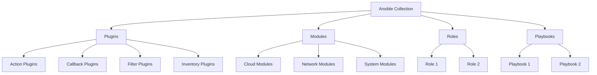
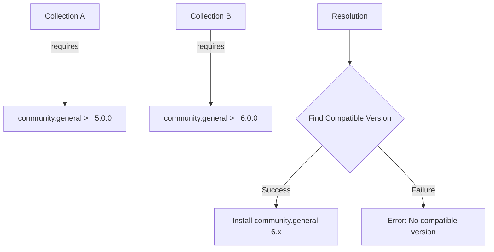

# How to Configure Ansible Collections

Author: [nawazdhandala](https://www.github.com/nawazdhandala)

Tags: Ansible, Collections, Ansible Galaxy, Configuration Management, DevOps, Automation

Description: Learn how to install, configure, and manage Ansible collections for modular automation including Galaxy, private repositories, and offline installation.

---

> Ansible Collections are the modern way to distribute and organize Ansible content including modules, plugins, roles, and playbooks. Understanding how to configure collections properly is essential for building maintainable automation at scale.

Collections provide a way to package and distribute Ansible content as a single unit, making it easier to version, share, and reuse automation code across teams and projects.

---

## Understanding Ansible Collections



---

## Installing Collections

### From Ansible Galaxy

Ansible Galaxy is the official public repository for collections:

```bash
# Install a single collection
ansible-galaxy collection install community.general

# Install specific version
ansible-galaxy collection install community.general:5.8.0

# Install latest compatible version
ansible-galaxy collection install 'community.general:>=5.0.0,<6.0.0'

# Install to custom location
ansible-galaxy collection install community.general -p ./collections

# Force reinstall
ansible-galaxy collection install community.general --force
```

### Using Requirements File

Create a `requirements.yml` file to manage multiple collections:

```yaml
# requirements.yml
# Define collections to install with their versions
---
collections:
  # Basic collection installation from Galaxy
  - name: community.general
    version: ">=5.0.0"

  # Collection with specific version
  - name: community.docker
    version: "3.4.0"

  # Collection from Git repository
  - name: https://github.com/ansible-collections/community.aws.git
    type: git
    version: main

  # Collection from URL (tarball)
  - name: https://example.com/collections/my_collection-1.0.0.tar.gz
    type: url

  # Collection from local path
  - name: /path/to/local/collection
    type: dir
```

Install all collections from requirements file:

```bash
# Install all collections from requirements file
ansible-galaxy collection install -r requirements.yml

# Install to specific path
ansible-galaxy collection install -r requirements.yml -p ./collections

# Force reinstall all
ansible-galaxy collection install -r requirements.yml --force
```

---

## Configuring Collection Paths

### In ansible.cfg

```ini
# ansible.cfg
# Configure where Ansible looks for collections
[defaults]
# Multiple paths separated by colon
# Paths are searched in order from left to right
collections_paths = ./collections:~/.ansible/collections:/usr/share/ansible/collections

# Also configure roles path if using roles from collections
roles_path = ./roles:~/.ansible/roles:/usr/share/ansible/roles
```

### Using Environment Variables

```bash
# Set collection path via environment variable
export ANSIBLE_COLLECTIONS_PATH="./collections:~/.ansible/collections"

# Or set in shell profile for persistence
echo 'export ANSIBLE_COLLECTIONS_PATH="./collections:~/.ansible/collections"' >> ~/.bashrc
```

---

## Project Structure with Collections

Here is a recommended project structure incorporating collections:

```
project/
├── ansible.cfg
├── requirements.yml
├── inventory/
│   ├── production/
│   │   └── hosts.yml
│   └── staging/
│       └── hosts.yml
├── collections/
│   └── ansible_collections/
│       ├── community/
│       │   └── general/
│       └── mycompany/
│           └── myapp/
├── playbooks/
│   ├── deploy.yml
│   └── configure.yml
├── roles/
│   └── custom_role/
└── group_vars/
    └── all.yml
```

```ini
# ansible.cfg for project structure
[defaults]
inventory = inventory/production/hosts.yml
collections_paths = ./collections
roles_path = ./roles

[galaxy]
server_list = galaxy, private_galaxy

[galaxy_server.galaxy]
url = https://galaxy.ansible.com/

[galaxy_server.private_galaxy]
url = https://galaxy.mycompany.com/
token = my_api_token
```

---

## Creating Custom Collections

### Initialize Collection Structure

```bash
# Create a new collection skeleton
ansible-galaxy collection init mycompany.myapp

# This creates the following structure:
# mycompany/myapp/
# ├── README.md
# ├── galaxy.yml
# ├── plugins/
# │   └── README.md
# ├── roles/
# └── docs/
```

### Collection Metadata (galaxy.yml)

```yaml
# galaxy.yml
# Collection metadata required for publishing and installation
---
namespace: mycompany
name: myapp
version: 1.0.0
readme: README.md
authors:
  - Your Name <your.email@example.com>
description: Custom collection for MyApp deployment and management
license_file: LICENSE
tags:
  - deployment
  - configuration
  - myapp
dependencies:
  # Other collections this collection depends on
  community.general: ">=5.0.0"
  ansible.posix: ">=1.4.0"
repository: https://github.com/mycompany/ansible-collection-myapp
documentation: https://mycompany.github.io/ansible-collection-myapp
homepage: https://mycompany.com
issues: https://github.com/mycompany/ansible-collection-myapp/issues
build_ignore:
  - .gitignore
  - .git
  - "*.tar.gz"
  - tests/
```

### Adding Content to Collection

```
mycompany/myapp/
├── galaxy.yml
├── README.md
├── plugins/
│   ├── modules/
│   │   └── myapp_config.py
│   ├── module_utils/
│   │   └── myapp_common.py
│   ├── filter/
│   │   └── myapp_filters.py
│   └── inventory/
│       └── myapp_inventory.py
├── roles/
│   ├── install/
│   │   ├── tasks/
│   │   │   └── main.yml
│   │   ├── handlers/
│   │   │   └── main.yml
│   │   ├── defaults/
│   │   │   └── main.yml
│   │   └── meta/
│   │       └── main.yml
│   └── configure/
│       └── tasks/
│           └── main.yml
├── playbooks/
│   └── full_deployment.yml
└── docs/
    └── usage.md
```

### Example Custom Module

```python
#!/usr/bin/python
# plugins/modules/myapp_config.py
# Custom module for managing MyApp configuration

from ansible.module_utils.basic import AnsibleModule
import json

DOCUMENTATION = r'''
---
module: myapp_config
short_description: Manage MyApp configuration
description:
    - This module manages MyApp configuration files
    - Supports creating, updating, and validating configurations
options:
    path:
        description: Path to the configuration file
        required: true
        type: str
    settings:
        description: Dictionary of settings to apply
        required: true
        type: dict
    validate:
        description: Validate configuration after writing
        required: false
        default: true
        type: bool
author:
    - Your Name (@yourhandle)
'''

EXAMPLES = r'''
- name: Configure MyApp
  mycompany.myapp.myapp_config:
    path: /etc/myapp/config.json
    settings:
      database_host: localhost
      database_port: 5432
      debug: false
    validate: true
'''

def main():
    module = AnsibleModule(
        argument_spec=dict(
            path=dict(type='str', required=True),
            settings=dict(type='dict', required=True),
            validate=dict(type='bool', default=True)
        ),
        supports_check_mode=True
    )

    path = module.params['path']
    settings = module.params['settings']
    validate = module.params['validate']
    changed = False

    try:
        # Read existing config if it exists
        try:
            with open(path, 'r') as f:
                existing = json.load(f)
        except FileNotFoundError:
            existing = {}

        # Check if changes are needed
        if existing != settings:
            changed = True
            if not module.check_mode:
                with open(path, 'w') as f:
                    json.dump(settings, f, indent=2)

        module.exit_json(
            changed=changed,
            path=path,
            settings=settings
        )

    except Exception as e:
        module.fail_json(msg=f"Failed to configure MyApp: {str(e)}")

if __name__ == '__main__':
    main()
```

### Example Role in Collection

```yaml
# roles/install/tasks/main.yml
# Tasks for installing MyApp
---
- name: Install required packages
  ansible.builtin.package:
    name: "{{ myapp_packages }}"
    state: present
  become: yes

- name: Create application user
  ansible.builtin.user:
    name: "{{ myapp_user }}"
    system: yes
    shell: /sbin/nologin
    home: "{{ myapp_home }}"
    create_home: yes
  become: yes

- name: Download application
  ansible.builtin.get_url:
    url: "{{ myapp_download_url }}"
    dest: "{{ myapp_home }}/myapp.tar.gz"
    checksum: "sha256:{{ myapp_checksum }}"
  become: yes
  become_user: "{{ myapp_user }}"

- name: Extract application
  ansible.builtin.unarchive:
    src: "{{ myapp_home }}/myapp.tar.gz"
    dest: "{{ myapp_home }}"
    remote_src: yes
  become: yes
  become_user: "{{ myapp_user }}"
```

```yaml
# roles/install/defaults/main.yml
# Default variables for install role
---
myapp_user: myapp
myapp_home: /opt/myapp
myapp_packages:
  - python3
  - python3-pip
  - libpq-dev
myapp_download_url: "https://releases.example.com/myapp-{{ myapp_version }}.tar.gz"
myapp_version: "1.0.0"
myapp_checksum: "abc123..."
```

---

## Building and Publishing Collections

### Build Collection Tarball

```bash
# Build collection from galaxy.yml directory
cd mycompany/myapp
ansible-galaxy collection build

# This creates mycompany-myapp-1.0.0.tar.gz

# Build with output directory specified
ansible-galaxy collection build --output-path ../dist
```

### Publish to Galaxy

```bash
# Get API token from https://galaxy.ansible.com/me/preferences

# Publish to Ansible Galaxy
ansible-galaxy collection publish mycompany-myapp-1.0.0.tar.gz --token YOUR_API_TOKEN

# Or set token in environment
export ANSIBLE_GALAXY_TOKEN=YOUR_API_TOKEN
ansible-galaxy collection publish mycompany-myapp-1.0.0.tar.gz
```

### Publish to Private Galaxy Server

```bash
# Configure private server in ansible.cfg
# Then publish
ansible-galaxy collection publish mycompany-myapp-1.0.0.tar.gz --server private_galaxy
```

---

## Using Collections in Playbooks

### Fully Qualified Collection Names (FQCN)

```yaml
# playbook.yml
# Using FQCN for all modules ensures clarity and prevents naming conflicts
---
- name: Deploy application
  hosts: appservers
  become: yes

  tasks:
    # Use FQCN for built-in modules
    - name: Install packages
      ansible.builtin.package:
        name:
          - nginx
          - python3
        state: present

    # Use FQCN for community modules
    - name: Manage Docker containers
      community.docker.docker_container:
        name: myapp
        image: myapp:latest
        state: started

    # Use FQCN for custom collection modules
    - name: Configure MyApp
      mycompany.myapp.myapp_config:
        path: /etc/myapp/config.json
        settings:
          environment: production
```

### Using Collections Keyword

```yaml
# playbook.yml
# Specify collections to simplify module names
---
- name: Deploy application
  hosts: appservers
  become: yes

  # Declare collections used in this play
  # Allows using short module names
  collections:
    - community.docker
    - mycompany.myapp
    - ansible.builtin

  tasks:
    # Can use short name due to collections declaration
    - name: Manage Docker containers
      docker_container:
        name: myapp
        image: myapp:latest
        state: started

    # Still recommended to use FQCN for clarity
    - name: Configure MyApp
      mycompany.myapp.myapp_config:
        path: /etc/myapp/config.json
        settings:
          environment: production
```

### Using Roles from Collections

```yaml
# playbook.yml
# Using roles defined in collections
---
- name: Deploy MyApp
  hosts: appservers
  become: yes

  roles:
    # Use FQCN for collection roles
    - role: mycompany.myapp.install
      vars:
        myapp_version: "2.0.0"

    - role: mycompany.myapp.configure
      vars:
        myapp_environment: production
        myapp_debug: false
```

---

## Offline Installation

### Download for Offline Use

```bash
# Download collection without installing
ansible-galaxy collection download community.general -d ./offline_collections

# Download multiple collections from requirements
ansible-galaxy collection download -r requirements.yml -d ./offline_collections
```

### Install from Offline Archives

```yaml
# offline_requirements.yml
# Requirements file for offline installation
---
collections:
  - source: ./offline_collections/community-general-5.8.0.tar.gz
    type: file

  - source: ./offline_collections/community-docker-3.4.0.tar.gz
    type: file
```

```bash
# Install from local archives
ansible-galaxy collection install -r offline_requirements.yml
```

---

## Managing Collection Versions

### Listing Installed Collections

```bash
# List all installed collections
ansible-galaxy collection list

# List collections in specific path
ansible-galaxy collection list -p ./collections

# Show detailed information about a collection
ansible-galaxy collection list community.general
```

### Version Constraints

```yaml
# requirements.yml with version constraints
---
collections:
  # Exact version
  - name: community.general
    version: "5.8.0"

  # Minimum version
  - name: community.docker
    version: ">=3.0.0"

  # Version range
  - name: ansible.posix
    version: ">=1.0.0,<2.0.0"

  # Compatible version (same major)
  - name: amazon.aws
    version: "~=5.0"
```

### Upgrading Collections

```bash
# Upgrade a single collection
ansible-galaxy collection install community.general --force

# Upgrade all collections from requirements file
ansible-galaxy collection install -r requirements.yml --force-with-deps

# Check for available updates (requires ansible-core >= 2.13)
ansible-galaxy collection list --format yaml | grep -A 2 "version"
```

---

## Collection Dependencies

### Declaring Dependencies

```yaml
# galaxy.yml
# Dependencies are automatically installed when this collection is installed
---
namespace: mycompany
name: myapp
version: 1.0.0
dependencies:
  # Format: namespace.name: version_constraint
  community.general: ">=5.0.0,<7.0.0"
  ansible.posix: ">=1.0.0"
  community.crypto: ">=2.0.0"
```

### Resolving Dependency Conflicts



```bash
# Install with dependency resolution
ansible-galaxy collection install mycompany.myapp --force-with-deps

# Debug dependency issues
ansible-galaxy collection install mycompany.myapp -vvv
```

---

## Private Collection Servers

### Configure Private Server

```ini
# ansible.cfg
[galaxy]
# List of servers in order of priority
server_list = private_galaxy, galaxy

[galaxy_server.private_galaxy]
url = https://galaxy.mycompany.com/api/
token = YOUR_PRIVATE_TOKEN
# Optional: Disable SSL verification for internal servers
# validate_certs = false

[galaxy_server.galaxy]
url = https://galaxy.ansible.com/
```

### Using Automation Hub

```ini
# ansible.cfg for Red Hat Automation Hub
[galaxy]
server_list = automation_hub, galaxy

[galaxy_server.automation_hub]
url = https://console.redhat.com/api/automation-hub/
auth_url = https://sso.redhat.com/auth/realms/redhat-external/protocol/openid-connect/token
token = YOUR_OFFLINE_TOKEN

[galaxy_server.galaxy]
url = https://galaxy.ansible.com/
```

---

## Best Practices

### 1. Always Use FQCN

```yaml
# Recommended: Use fully qualified names
- name: Install package
  ansible.builtin.package:
    name: nginx
    state: present

# Avoid: Relying on short names
- name: Install package
  package:
    name: nginx
    state: present
```

### 2. Pin Collection Versions

```yaml
# requirements.yml
# Pin versions for reproducible builds
---
collections:
  - name: community.general
    version: "5.8.0"  # Exact version for production
```

### 3. Include Collections in Source Control

```gitignore
# .gitignore
# Include requirements, exclude installed collections
!/requirements.yml
/collections/ansible_collections/*
```

### 4. Document Collection Usage

```yaml
# playbook.yml
# Document which collections are required at the top
---
# Required collections:
# - community.general >= 5.0.0
# - mycompany.myapp >= 1.0.0
#
# Install with: ansible-galaxy collection install -r requirements.yml

- name: Deploy application
  hosts: appservers
  collections:
    - community.general
    - mycompany.myapp
```

---

## Conclusion

Ansible Collections provide a powerful way to organize, share, and reuse automation content. Key takeaways:

- Collections package modules, plugins, roles, and playbooks as distributable units
- Use `requirements.yml` to manage collection dependencies
- Configure collection paths in `ansible.cfg` for consistent behavior
- Always use Fully Qualified Collection Names (FQCN) for clarity
- Pin collection versions for reproducible automation
- Consider creating custom collections for organization-specific automation

By properly configuring and managing collections, you can build modular, maintainable automation that scales across teams and projects.

---

*Managing complex infrastructure automation? [OneUptime](https://oneuptime.com) provides monitoring and observability for your Ansible-managed infrastructure.*

**Related Reading:**
- [How to Handle Ansible Handlers and Notifications](/blog/post/2026-01-24-ansible-handlers-notifications/view)
- [How to Handle Ansible Block Error Handling](/blog/post/2026-01-24-ansible-block-error-handling/view)
