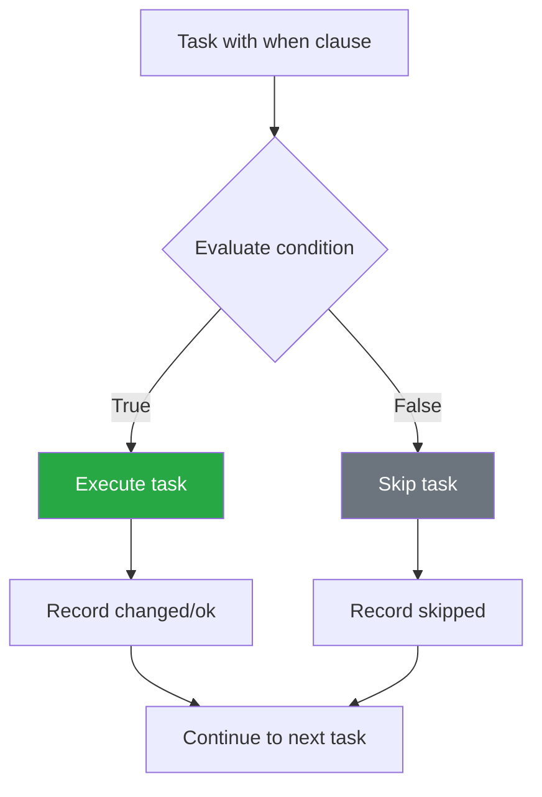
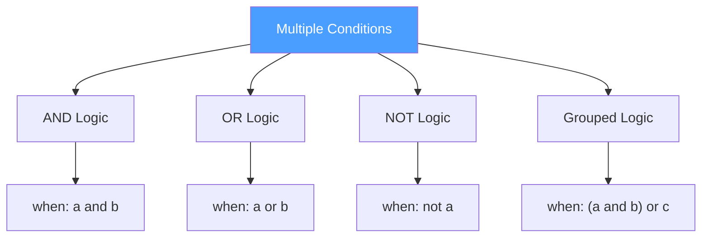

# How to Handle Ansible Conditionals with when

Author: [nawazdhandala](https://www.github.com/nawazdhandala)

Tags: Ansible, DevOps, Conditionals, Automation, Infrastructure as Code, Configuration Management

Description: A comprehensive guide to using when conditionals in Ansible, covering basic comparisons, complex logic, variable testing, and common patterns for conditional task execution.

---

The `when` clause in Ansible controls whether a task executes based on conditions. This guide covers everything from basic comparisons to complex conditional logic with practical examples.

## Understanding when Conditionals



### Basic Syntax

```yaml
- name: Only run on Debian systems
  ansible.builtin.apt:
    name: nginx
    state: present
  when: ansible_os_family == "Debian"
```

Important rules:
- The `when` condition is a raw Jinja2 expression
- Do NOT use `{{ }}` around the condition
- The condition is evaluated for each host

## Basic Comparisons

### Equality and Inequality

```yaml
- name: Run on specific OS family
  ansible.builtin.debug:
    msg: "This is a Debian-based system"
  when: ansible_os_family == "Debian"

- name: Run on non-Windows systems
  ansible.builtin.debug:
    msg: "This is not Windows"
  when: ansible_os_family != "Windows"
```

### Numeric Comparisons

```yaml
- name: Check if enough disk space
  ansible.builtin.debug:
    msg: "Sufficient disk space available"
  when: ansible_devices.sda.size | human_to_bytes > 50 * 1024 * 1024 * 1024

- name: Check memory threshold
  ansible.builtin.debug:
    msg: "Memory is {{ ansible_memtotal_mb }} MB"
  when: ansible_memtotal_mb >= 2048

- name: Run only if less than 10 retries
  ansible.builtin.command: /opt/app/retry_operation.sh
  when: retry_count | int < 10
```

### String Comparisons

```yaml
- name: Check hostname pattern
  ansible.builtin.debug:
    msg: "This is a web server"
  when: inventory_hostname is match("web.*")

- name: Check if string contains substring
  ansible.builtin.debug:
    msg: "Running on Ubuntu"
  when: "'Ubuntu' in ansible_distribution"

- name: Check string starts with
  ansible.builtin.debug:
    msg: "Development server"
  when: inventory_hostname.startswith('dev-')

- name: Case-insensitive comparison
  ansible.builtin.debug:
    msg: "Linux system detected"
  when: ansible_system | lower == "linux"
```

## Testing Variables

### Check if Variable is Defined

```yaml
- name: Use variable only if defined
  ansible.builtin.debug:
    msg: "Custom port is {{ custom_port }}"
  when: custom_port is defined

- name: Skip if variable not defined
  ansible.builtin.template:
    src: config.j2
    dest: /etc/app/config
  when: app_config is defined

- name: Fail if required variable missing
  ansible.builtin.fail:
    msg: "Required variable 'database_password' is not defined"
  when: database_password is not defined
```

### Check for Empty Values

```yaml
- name: Run only if list is not empty
  ansible.builtin.debug:
    msg: "Processing {{ packages | length }} packages"
  when: packages | length > 0

- name: Alternative empty check
  ansible.builtin.debug:
    msg: "List has items"
  when: packages is defined and packages

- name: Check for empty string
  ansible.builtin.debug:
    msg: "Username is set"
  when: username | default('') | length > 0

- name: Check if variable is truthy
  ansible.builtin.debug:
    msg: "Feature is enabled"
  when: feature_enabled | default(false) | bool
```

### Check Variable Type

```yaml
- name: Check if variable is a list
  ansible.builtin.debug:
    msg: "Variable is a list with {{ my_var | length }} items"
  when: my_var is iterable and my_var is not string and my_var is not mapping

- name: Check if variable is a dictionary
  ansible.builtin.debug:
    msg: "Variable is a dictionary"
  when: my_var is mapping

- name: Check if variable is a string
  ansible.builtin.debug:
    msg: "Variable is a string"
  when: my_var is string

- name: Check if variable is a number
  ansible.builtin.debug:
    msg: "Variable is numeric"
  when: my_var is number
```

## Combining Conditions



### AND Conditions

```yaml
# Method 1: Using 'and'
- name: Install on Debian with enough memory
  ansible.builtin.apt:
    name: elasticsearch
    state: present
  when: ansible_os_family == "Debian" and ansible_memtotal_mb >= 4096

# Method 2: List format (all must be true)
- name: Install on Debian with enough memory (list format)
  ansible.builtin.apt:
    name: elasticsearch
    state: present
  when:
    - ansible_os_family == "Debian"
    - ansible_memtotal_mb >= 4096
    - ansible_processor_vcpus >= 2
```

### OR Conditions

```yaml
- name: Install on Debian or Ubuntu
  ansible.builtin.apt:
    name: nginx
    state: present
  when: ansible_distribution == "Debian" or ansible_distribution == "Ubuntu"

# Using 'in' for multiple values
- name: Install on Debian-family systems
  ansible.builtin.apt:
    name: nginx
    state: present
  when: ansible_distribution in ["Debian", "Ubuntu", "Linux Mint"]
```

### NOT Conditions

```yaml
- name: Run on non-production servers
  ansible.builtin.debug:
    msg: "This is not production"
  when: not (environment == "production")

- name: Alternative NOT syntax
  ansible.builtin.debug:
    msg: "Feature is disabled"
  when: feature_enabled is not defined or not feature_enabled
```

### Complex Grouped Conditions

```yaml
- name: Complex condition with grouping
  ansible.builtin.template:
    src: production-config.j2
    dest: /etc/app/config
  when: >
    (environment == "production" and region == "us-east-1") or
    (environment == "staging" and deploy_to_staging | default(false))

# Multi-line for readability
- name: Complex condition (readable format)
  ansible.builtin.service:
    name: nginx
    state: restarted
  when:
    - nginx_config_changed | default(false)
    - >
      (environment == "production" and maintenance_window | default(false)) or
      environment != "production"
```

## Using Register Results

### Check Task Results

```yaml
- name: Check if file exists
  ansible.builtin.stat:
    path: /etc/app/config.yml
  register: config_file

- name: Create config if missing
  ansible.builtin.template:
    src: config.yml.j2
    dest: /etc/app/config.yml
  when: not config_file.stat.exists

- name: Update config if older than template
  ansible.builtin.template:
    src: config.yml.j2
    dest: /etc/app/config.yml
  when: config_file.stat.exists and config_file.stat.mtime < template_mtime
```

### Check Command Output

```yaml
- name: Get current version
  ansible.builtin.command: /opt/app/bin/app --version
  register: version_output
  changed_when: false
  failed_when: false

- name: Upgrade if version is old
  ansible.builtin.include_tasks: upgrade.yml
  when: version_output.rc == 0 and version_output.stdout is version('2.0', '<')

- name: Install if not present
  ansible.builtin.include_tasks: install.yml
  when: version_output.rc != 0
```

### Check Changed Status

```yaml
- name: Update configuration
  ansible.builtin.template:
    src: nginx.conf.j2
    dest: /etc/nginx/nginx.conf
  register: nginx_config

- name: Reload nginx if config changed
  ansible.builtin.service:
    name: nginx
    state: reloaded
  when: nginx_config.changed

- name: Run migrations
  ansible.builtin.command: /opt/app/migrate
  register: migration_result

- name: Notify about migration
  ansible.builtin.debug:
    msg: "Migrations were applied"
  when: migration_result.changed
```

## Conditional Loops

### With loop

```yaml
- name: Install packages only if defined
  ansible.builtin.apt:
    name: "{{ item }}"
    state: present
  loop: "{{ packages }}"
  when: item is defined and item | length > 0

- name: Create users with conditions
  ansible.builtin.user:
    name: "{{ item.name }}"
    groups: "{{ item.groups }}"
    state: present
  loop: "{{ users }}"
  when: item.enabled | default(true)
```

### Conditional Based on Loop Item

```yaml
- name: Configure services
  ansible.builtin.template:
    src: "{{ item.name }}.conf.j2"
    dest: "/etc/{{ item.name }}/{{ item.name }}.conf"
  loop:
    - { name: nginx, enabled: true }
    - { name: redis, enabled: false }
    - { name: postgresql, enabled: true }
  when: item.enabled

- name: Process list items conditionally
  ansible.builtin.debug:
    msg: "Processing {{ item.name }} in {{ item.env }}"
  loop: "{{ services }}"
  when:
    - item.env == target_environment
    - item.status == "active"
```

## Common Patterns

### OS-Specific Tasks

```yaml
- name: Install packages (Debian/Ubuntu)
  ansible.builtin.apt:
    name: "{{ debian_packages }}"
    state: present
  when: ansible_os_family == "Debian"

- name: Install packages (RHEL/CentOS)
  ansible.builtin.yum:
    name: "{{ redhat_packages }}"
    state: present
  when: ansible_os_family == "RedHat"

- name: Install packages (Alpine)
  community.general.apk:
    name: "{{ alpine_packages }}"
    state: present
  when: ansible_os_family == "Alpine"
```

### Version-Based Conditions

```yaml
- name: Use legacy config for old versions
  ansible.builtin.template:
    src: config-legacy.j2
    dest: /etc/app/config
  when: app_version is version('2.0', '<')

- name: Use new config for recent versions
  ansible.builtin.template:
    src: config-v2.j2
    dest: /etc/app/config
  when: app_version is version('2.0', '>=')

# Version comparison operators: <, <=, >, >=, ==, !=
# Also supports: lt, le, gt, ge, eq, ne
```

### Environment-Based Conditions

```yaml
- name: Production-only tasks
  block:
    - name: Enable enhanced monitoring
      ansible.builtin.include_tasks: monitoring.yml

    - name: Configure backups
      ansible.builtin.include_tasks: backups.yml
  when: environment == "production"

- name: Development-only tasks
  ansible.builtin.debug:
    msg: "Debug mode enabled"
  when: environment in ["development", "dev", "local"]
```

### First Run Detection

```yaml
- name: Check if first run
  ansible.builtin.stat:
    path: /var/lib/app/.initialized
  register: init_marker

- name: Run initialization tasks
  block:
    - name: Initialize database
      ansible.builtin.command: /opt/app/init-db.sh

    - name: Create marker file
      ansible.builtin.file:
        path: /var/lib/app/.initialized
        state: touch
  when: not init_marker.stat.exists
```

### Inventory Group Membership

```yaml
- name: Configure as database server
  ansible.builtin.include_tasks: database.yml
  when: "'databases' in group_names"

- name: Configure as web server
  ansible.builtin.include_tasks: webserver.yml
  when: "'webservers' in group_names"

- name: Run on primary database only
  ansible.builtin.command: /opt/db/promote-primary.sh
  when:
    - "'databases' in group_names"
    - inventory_hostname == groups['databases'][0]
```

## Advanced Patterns

### Conditional Block Execution

```yaml
- name: SSL Configuration Block
  block:
    - name: Copy SSL certificate
      ansible.builtin.copy:
        src: "{{ ssl_cert_file }}"
        dest: /etc/ssl/certs/app.crt

    - name: Copy SSL key
      ansible.builtin.copy:
        src: "{{ ssl_key_file }}"
        dest: /etc/ssl/private/app.key
        mode: '0600'

    - name: Configure SSL in nginx
      ansible.builtin.template:
        src: nginx-ssl.conf.j2
        dest: /etc/nginx/conf.d/ssl.conf
  when: ssl_enabled | default(false)
  rescue:
    - name: SSL setup failed
      ansible.builtin.debug:
        msg: "SSL configuration failed, continuing without SSL"
```

### Conditional Includes

```yaml
- name: Include environment-specific vars
  ansible.builtin.include_vars:
    file: "{{ environment }}.yml"
  when: environment is defined

- name: Include platform-specific tasks
  ansible.builtin.include_tasks: "{{ ansible_os_family | lower }}.yml"
  when: ansible_os_family in ['Debian', 'RedHat', 'Alpine']
```

### Assert Conditions

```yaml
- name: Verify prerequisites
  ansible.builtin.assert:
    that:
      - ansible_memtotal_mb >= 2048
      - ansible_processor_vcpus >= 2
      - ansible_distribution in supported_distributions
    fail_msg: "Server does not meet minimum requirements"
    success_msg: "Prerequisites verified"
```

## Debugging Conditionals

### Show Evaluated Condition

```yaml
- name: Debug condition values
  ansible.builtin.debug:
    msg: |
      OS Family: {{ ansible_os_family }}
      Memory: {{ ansible_memtotal_mb }} MB
      Environment: {{ environment | default('not set') }}
      Condition result: {{ ansible_os_family == 'Debian' and ansible_memtotal_mb >= 2048 }}

- name: Show why task would skip
  ansible.builtin.debug:
    var: item
  loop:
    - "OS check: {{ ansible_os_family == 'Debian' }}"
    - "Memory check: {{ ansible_memtotal_mb >= 2048 }}"
    - "Environment check: {{ environment == 'production' }}"
```

### Common Mistakes

```yaml
# WRONG: Using {{ }} in when clause
- name: Bad example
  debug:
    msg: "Hello"
  when: "{{ my_var }}"  # Don't do this!

# CORRECT: No {{ }} needed
- name: Good example
  debug:
    msg: "Hello"
  when: my_var

# WRONG: Comparing with undefined variable
- name: This will fail
  debug:
    msg: "Hello"
  when: undefined_var == "value"

# CORRECT: Check if defined first
- name: This works
  debug:
    msg: "Hello"
  when: undefined_var is defined and undefined_var == "value"

# CORRECT: Using default filter
- name: This also works
  debug:
    msg: "Hello"
  when: (undefined_var | default('')) == "value"
```

---

The `when` clause enables conditional task execution based on facts, variables, and registered results. Remember that conditions are raw Jinja2 expressions without curly braces. Use `is defined` checks for optional variables, combine conditions with `and`/`or` or list format, and leverage registered task results for dynamic workflows. For complex conditions, use blocks to group related tasks under a single condition.
