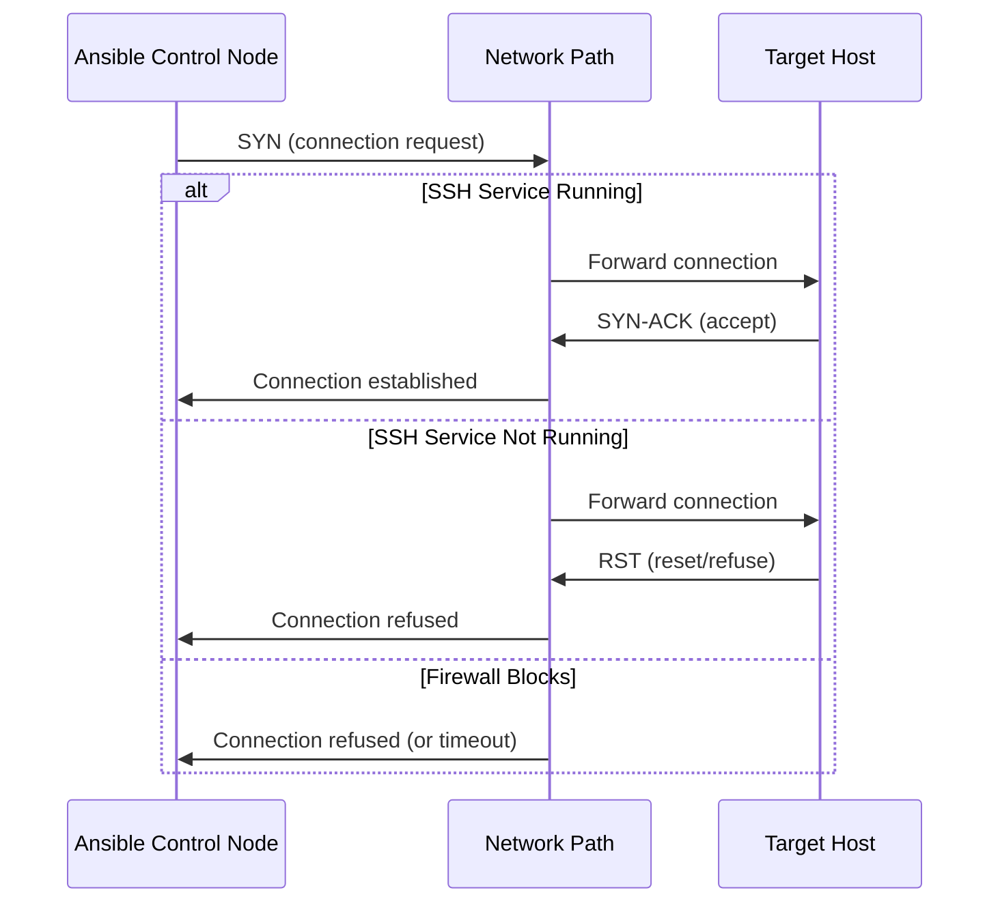
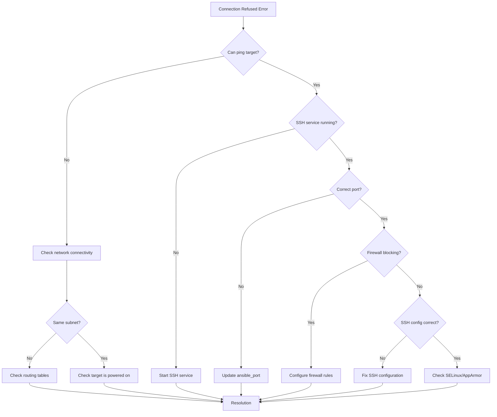
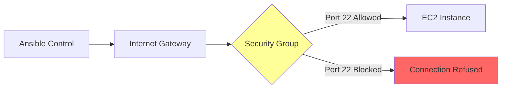

# How to Fix 'Connection Refused' Errors in Ansible

Author: [nawazdhandala](https://www.github.com/nawazdhandala)

Tags: Ansible, Networking, Troubleshooting, SSH, DevOps, Firewall, Configuration Management

Description: Learn how to diagnose and resolve connection refused errors in Ansible including SSH service issues, firewall rules, and network configuration problems.

---

"Connection Refused" is one of the most common errors you will encounter when working with Ansible. This error indicates that your control node cannot establish a connection to the target host. This guide covers all the common causes and their solutions.

## Understanding the Connection Refused Error

When Ansible reports a connection refused error, it means the TCP connection attempt was actively rejected by the target host or a network device.



## Common Error Messages

```bash
# Typical connection refused errors in Ansible

# Error 1: Basic connection refused
fatal: [server1]: UNREACHABLE! => {
    "changed": false,
    "msg": "Failed to connect to the host via ssh: ssh: connect to host 192.168.1.10 port 22: Connection refused",
    "unreachable": true
}

# Error 2: Connection timed out (firewall blocking)
fatal: [server1]: UNREACHABLE! => {
    "changed": false,
    "msg": "Failed to connect to the host via ssh: ssh: connect to host 192.168.1.10 port 22: Connection timed out",
    "unreachable": true
}

# Error 3: No route to host
fatal: [server1]: UNREACHABLE! => {
    "changed": false,
    "msg": "Failed to connect to the host via ssh: ssh: connect to host 192.168.1.10 port 22: No route to host",
    "unreachable": true
}
```

## Diagnostic Flowchart



## Step-by-Step Troubleshooting

### Step 1: Verify Basic Network Connectivity

```bash
# Test if the target host is reachable
ping -c 3 192.168.1.10

# Test if the SSH port is open using netcat
nc -zv 192.168.1.10 22

# Alternative: Use telnet to test the port
telnet 192.168.1.10 22

# Check routing to the target
traceroute 192.168.1.10

# Verify DNS resolution if using hostname
nslookup webserver1.example.com
dig webserver1.example.com
```

### Step 2: Check SSH Service on Target Host

If you have console or out-of-band access to the target host, check the SSH service status.

```bash
# Check if SSH service is running
sudo systemctl status sshd
# or on some systems
sudo systemctl status ssh

# If SSH is not running, start it
sudo systemctl start sshd

# Enable SSH to start on boot
sudo systemctl enable sshd

# Check if SSH is listening on the expected port
sudo ss -tlnp | grep ssh
# Expected output: LISTEN  0  128  *:22  *:*  users:(("sshd",pid=1234,fd=3))

# Alternative: Use netstat
sudo netstat -tlnp | grep sshd
```

### Step 3: Verify SSH Configuration

```bash
# Check SSH server configuration
sudo cat /etc/ssh/sshd_config | grep -E "^(Port|ListenAddress|PermitRootLogin|PasswordAuthentication)"

# Common SSH configuration issues to look for:
# - Port: Ensure it matches what Ansible expects (default 22)
# - ListenAddress: Should be 0.0.0.0 or the correct interface IP
# - PermitRootLogin: May need to be "yes" or "prohibit-password"
```

Example SSH configuration that allows connections:

```bash
# /etc/ssh/sshd_config - essential settings

# Port SSH listens on
Port 22

# Listen on all interfaces (or specify an IP)
ListenAddress 0.0.0.0

# Allow public key authentication
PubkeyAuthentication yes

# Path to authorized keys
AuthorizedKeysFile .ssh/authorized_keys

# Root login policy
PermitRootLogin prohibit-password

# Restart SSH after changes
sudo systemctl restart sshd
```

### Step 4: Check Firewall Rules

#### On Ubuntu/Debian (UFW)

```bash
# Check UFW status
sudo ufw status verbose

# Allow SSH through the firewall
sudo ufw allow 22/tcp

# Or allow SSH by service name
sudo ufw allow ssh

# If using a non-standard port
sudo ufw allow 2222/tcp

# Reload firewall rules
sudo ufw reload

# Verify the rule was added
sudo ufw status numbered
```

#### On RHEL/CentOS (firewalld)

```bash
# Check firewalld status
sudo firewall-cmd --state

# List all allowed services
sudo firewall-cmd --list-all

# Add SSH to allowed services
sudo firewall-cmd --permanent --add-service=ssh

# Or add specific port
sudo firewall-cmd --permanent --add-port=22/tcp

# Reload firewall
sudo firewall-cmd --reload

# Verify
sudo firewall-cmd --list-ports
sudo firewall-cmd --list-services
```

#### On systems using iptables

```bash
# List current iptables rules
sudo iptables -L -n -v

# Allow incoming SSH connections
sudo iptables -A INPUT -p tcp --dport 22 -j ACCEPT

# Save iptables rules (Debian/Ubuntu)
sudo iptables-save > /etc/iptables/rules.v4

# Save iptables rules (RHEL/CentOS)
sudo service iptables save
```

### Step 5: Check for Non-Standard SSH Port

```yaml
# inventory/hosts.yml - specify custom SSH port

all:
  hosts:
    webserver1:
      ansible_host: 192.168.1.10
      ansible_port: 2222  # Non-standard SSH port
      ansible_user: ubuntu

    webserver2:
      ansible_host: 192.168.1.11
      ansible_port: 22
      ansible_user: ubuntu

  vars:
    # Default port for all hosts (can be overridden per host)
    ansible_port: 22
```

```ini
# ansible.cfg - set default remote port

[defaults]
remote_port = 2222
```

### Step 6: Verify Security Groups (Cloud Environments)



#### AWS Security Group Check

```bash
# List security groups for an instance using AWS CLI
aws ec2 describe-instances \
    --instance-ids i-1234567890abcdef0 \
    --query 'Reservations[].Instances[].SecurityGroups[]'

# Check inbound rules for a security group
aws ec2 describe-security-groups \
    --group-ids sg-1234567890abcdef0 \
    --query 'SecurityGroups[].IpPermissions[]'

# Add SSH rule to security group
aws ec2 authorize-security-group-ingress \
    --group-id sg-1234567890abcdef0 \
    --protocol tcp \
    --port 22 \
    --cidr 0.0.0.0/0  # Or restrict to your IP
```

#### Azure Network Security Group Check

```bash
# List NSG rules
az network nsg rule list \
    --resource-group myResourceGroup \
    --nsg-name myNSG \
    --output table

# Add SSH rule
az network nsg rule create \
    --resource-group myResourceGroup \
    --nsg-name myNSG \
    --name AllowSSH \
    --protocol Tcp \
    --direction Inbound \
    --priority 100 \
    --source-address-prefixes '*' \
    --destination-port-ranges 22 \
    --access Allow
```

## Connection Types in Ansible

Ansible supports multiple connection types. Using the wrong one can cause connection issues.

```yaml
# inventory/hosts.yml - different connection types

all:
  children:
    linux_servers:
      hosts:
        server1:
          ansible_host: 192.168.1.10
          ansible_connection: ssh  # Default for Linux
          ansible_user: ubuntu

    windows_servers:
      hosts:
        winserver1:
          ansible_host: 192.168.1.20
          ansible_connection: winrm  # For Windows
          ansible_user: Administrator
          ansible_password: "{{ vault_win_password }}"
          ansible_winrm_server_cert_validation: ignore

    local_tasks:
      hosts:
        localhost:
          ansible_connection: local  # Run on control node
          ansible_python_interpreter: /usr/bin/python3

    network_devices:
      hosts:
        switch1:
          ansible_host: 192.168.1.254
          ansible_connection: network_cli
          ansible_network_os: ios
          ansible_user: admin
```

## Configuring Connection Timeouts

```ini
# ansible.cfg - timeout configuration

[defaults]
# Seconds to wait before timeout for SSH connection
timeout = 30

[ssh_connection]
# Seconds for SSH connect timeout
connect_timeout = 30

# SSH arguments for connection handling
ssh_args = -o ConnectTimeout=30 -o ConnectionAttempts=3
```

```yaml
# Playbook with connection retry logic
---
- name: Connect with Retry
  hosts: all
  gather_facts: false

  vars:
    connection_retries: 5
    retry_delay: 10

  tasks:
    - name: Wait for SSH to be available
      wait_for:
        host: "{{ ansible_host }}"
        port: "{{ ansible_port | default(22) }}"
        delay: 5
        timeout: 300
        state: started
      delegate_to: localhost

    - name: Test connection
      ping:
      register: ping_result
      retries: "{{ connection_retries }}"
      delay: "{{ retry_delay }}"
      until: ping_result is succeeded
```

## Handling Newly Provisioned Servers

When provisioning new servers, SSH might not be immediately available.

```yaml
# playbooks/provision-and-connect.yml
---
- name: Provision and Configure Server
  hosts: localhost
  gather_facts: false

  vars:
    new_server_ip: "192.168.1.100"
    ssh_port: 22

  tasks:
    - name: Wait for server to be reachable
      wait_for:
        host: "{{ new_server_ip }}"
        port: "{{ ssh_port }}"
        delay: 30
        timeout: 600
        state: started
      register: wait_result

    - name: Add new server to inventory
      add_host:
        name: new_server
        ansible_host: "{{ new_server_ip }}"
        ansible_user: ubuntu
        ansible_ssh_common_args: '-o StrictHostKeyChecking=no'
        groups: new_servers

- name: Configure New Server
  hosts: new_servers
  gather_facts: true
  become: true

  tasks:
    - name: Server is accessible
      debug:
        msg: "Successfully connected to {{ ansible_hostname }}"

    - name: Perform initial configuration
      # Your configuration tasks here
      ping:
```

## Debugging Connection Issues

### Enable Verbose Mode

```bash
# Run Ansible with maximum verbosity
ansible all -m ping -vvvv

# The output shows detailed SSH connection steps:
# <server1> SSH: EXEC ssh -vvv -o ControlMaster=auto ...
# <server1> SSH: EXEC sshpass -d12 ssh ...
```

### Test Connection Manually

```bash
# Test SSH with same parameters Ansible would use
ssh -vvv \
    -o StrictHostKeyChecking=no \
    -o UserKnownHostsFile=/dev/null \
    -o ControlMaster=auto \
    -o ControlPersist=60s \
    -i ~/.ssh/ansible_key \
    ubuntu@192.168.1.10

# If this works but Ansible does not, check:
# 1. ansible_user in inventory
# 2. ansible_ssh_private_key_file path
# 3. ansible_host value
```

### Check Ansible's Interpreted Settings

```bash
# See how Ansible interprets your configuration
ansible-config dump --only-changed

# View inventory variables for a specific host
ansible-inventory -i inventory/hosts.yml --host webserver1

# List all hosts Ansible recognizes
ansible-inventory -i inventory/hosts.yml --list
```

## Playbook for Connection Diagnostics

```yaml
# playbooks/diagnose-connection.yml
# Run this from control node to diagnose connection issues

---
- name: Diagnose Connection Issues
  hosts: localhost
  gather_facts: false

  vars:
    target_host: "192.168.1.10"
    target_port: 22
    target_user: "ubuntu"

  tasks:
    - name: Check if host is pingable
      command: "ping -c 3 {{ target_host }}"
      register: ping_result
      ignore_errors: true

    - name: Display ping result
      debug:
        msg: "{{ 'Host is reachable' if ping_result.rc == 0 else 'Host is NOT reachable' }}"

    - name: Check if SSH port is open
      wait_for:
        host: "{{ target_host }}"
        port: "{{ target_port }}"
        timeout: 10
        state: started
      register: port_check
      ignore_errors: true

    - name: Display port check result
      debug:
        msg: "{{ 'SSH port is open' if port_check is succeeded else 'SSH port is CLOSED or BLOCKED' }}"

    - name: Attempt SSH connection
      command: >
        ssh -o BatchMode=yes
            -o ConnectTimeout=10
            -o StrictHostKeyChecking=no
            {{ target_user }}@{{ target_host }}
            'echo Connection successful'
      register: ssh_result
      ignore_errors: true

    - name: Display SSH result
      debug:
        msg: "{{ ssh_result.stdout if ssh_result.rc == 0 else 'SSH connection FAILED: ' + ssh_result.stderr }}"

    - name: Check DNS resolution
      command: "nslookup {{ target_host }}"
      register: dns_result
      ignore_errors: true
      when: target_host | regex_search('[a-zA-Z]')

    - name: Generate diagnostic report
      debug:
        msg: |
          === Connection Diagnostic Report ===
          Target: {{ target_host }}:{{ target_port }}
          User: {{ target_user }}

          Ping Test: {{ 'PASS' if ping_result.rc == 0 else 'FAIL' }}
          Port Test: {{ 'PASS' if port_check is succeeded else 'FAIL' }}
          SSH Test: {{ 'PASS' if ssh_result.rc == 0 else 'FAIL' }}

          Recommendations:
          
          - Check network connectivity and routing
          - Verify the target host is powered on
          - Check for network firewalls between control and target
          
          
          - SSH service may not be running on target
          - Host firewall may be blocking port {{ target_port }}
          - Security group rules may need to be updated
          
          
          - Check SSH key configuration
          - Verify user '{{ target_user }}' exists on target
          - Check /var/log/auth.log on target for details
          
```

## Common Scenarios and Solutions

### Scenario 1: VM Just Created in Cloud

```yaml
# Wait for cloud-init to complete and SSH to be ready
- name: Wait for instance to be ready
  hosts: localhost
  tasks:
    - name: Wait for SSH
      wait_for:
        host: "{{ new_instance_ip }}"
        port: 22
        delay: 60  # Cloud-init typically takes time
        timeout: 600
        state: started
```

### Scenario 2: Server Rebooted

```yaml
# Handle server reboot gracefully
- name: Reboot and Wait
  hosts: webservers
  tasks:
    - name: Reboot the server
      reboot:
        reboot_timeout: 600
        connect_timeout: 5
        pre_reboot_delay: 5
        post_reboot_delay: 30
      become: true
```

### Scenario 3: Bastion/Jump Host Required

```yaml
# inventory/hosts.yml - configure jump host
all:
  hosts:
    private_server:
      ansible_host: 10.0.1.10  # Private IP
      ansible_user: ubuntu
      ansible_ssh_common_args: '-o ProxyJump=bastion_user@bastion.example.com'

    # Alternative using ProxyCommand
    another_private_server:
      ansible_host: 10.0.1.11
      ansible_user: ubuntu
      ansible_ssh_common_args: '-o ProxyCommand="ssh -W %h:%p bastion_user@bastion.example.com"'
```

```ini
# ansible.cfg - global jump host configuration
[ssh_connection]
ssh_args = -o ProxyJump=bastion_user@bastion.example.com
```

## Conclusion

Connection refused errors in Ansible typically stem from a few common causes:

1. **SSH service not running** - Start and enable the SSH daemon
2. **Firewall blocking connections** - Configure UFW, firewalld, or iptables rules
3. **Wrong port configuration** - Ensure ansible_port matches the SSH server port
4. **Network connectivity issues** - Check routing, DNS, and network path
5. **Cloud security groups** - Update inbound rules to allow SSH traffic

Always start troubleshooting with basic connectivity tests (ping, netcat) before investigating SSH-specific issues. Use Ansible's verbose mode (-vvvv) to see exactly what is happening during connection attempts, and check logs on the target host (/var/log/auth.log or /var/log/secure) for additional clues.

By systematically working through these checks, you can quickly identify and resolve connection refused errors in your Ansible automation.
