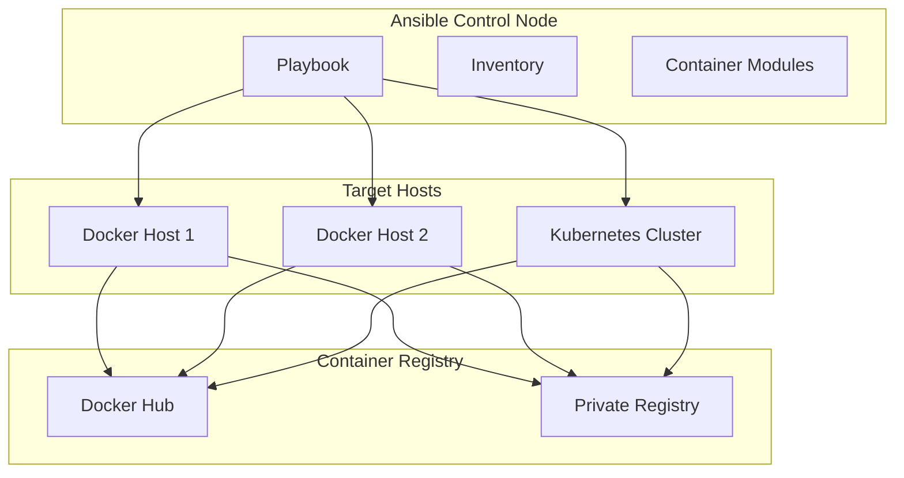
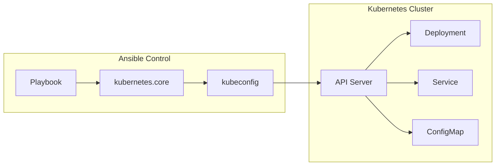
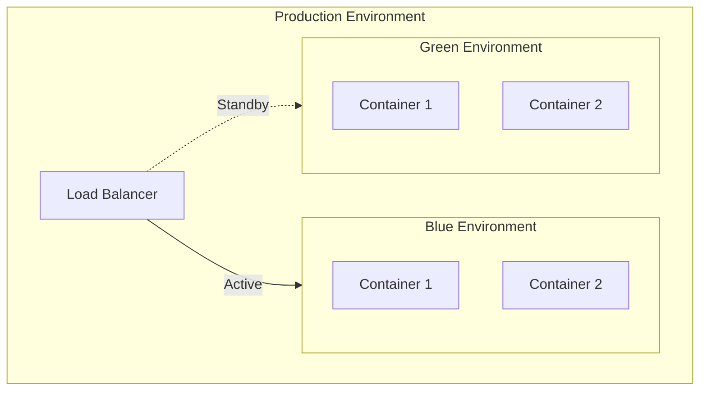

# How to Configure Ansible for Container Deployment

Author: [nawazdhandala](https://www.github.com/nawazdhandala)

Tags: Ansible, Docker, Containers, Kubernetes, DevOps, Automation, Deployment

Description: Learn how to configure Ansible for deploying and managing Docker containers and Kubernetes workloads effectively.

---

Ansible provides powerful modules for container deployment, from simple Docker containers to complex Kubernetes orchestrations. This guide covers configuration best practices and common deployment patterns.

---

## Container Deployment Architecture



---

## Setting Up Ansible for Docker

### Install Required Collections

```bash
# Install the Docker community collection
ansible-galaxy collection install community.docker

# Install the Kubernetes collection
ansible-galaxy collection install kubernetes.core

# Verify installation
ansible-galaxy collection list | grep -E "(docker|kubernetes)"
```

### Configure Requirements File

```yaml
---
# requirements.yml - Collection dependencies
collections:
  - name: community.docker
    version: ">=3.0.0"
  - name: kubernetes.core
    version: ">=2.4.0"
  - name: community.general
    version: ">=6.0.0"
```

---

## Basic Docker Container Deployment

```yaml
---
# deploy-container.yml - Basic container deployment
- name: Deploy Docker containers
  hosts: docker_hosts
  become: yes
  vars:
    docker_network: app_network
    app_image: nginx:latest
    app_name: webserver
    app_port: 8080

  tasks:
    # Ensure Docker is installed and running
    - name: Install Docker dependencies
      ansible.builtin.apt:
        name:
          - docker.io
          - python3-docker
        state: present
        update_cache: yes

    - name: Ensure Docker service is running
      ansible.builtin.service:
        name: docker
        state: started
        enabled: yes

    # Create a Docker network for the application
    - name: Create Docker network
      community.docker.docker_network:
        name: "{{ docker_network }}"
        state: present

    # Pull the container image
    - name: Pull application image
      community.docker.docker_image:
        name: "{{ app_image }}"
        source: pull
        force_source: yes

    # Deploy the container
    - name: Deploy application container
      community.docker.docker_container:
        name: "{{ app_name }}"
        image: "{{ app_image }}"
        state: started
        restart_policy: unless-stopped
        ports:
          - "{{ app_port }}:80"
        networks:
          - name: "{{ docker_network }}"
        env:
          ENVIRONMENT: production
        labels:
          app: "{{ app_name }}"
          managed_by: ansible
```

---

## Docker Compose Deployment

```yaml
---
# deploy-compose.yml - Docker Compose deployment
- name: Deploy application with Docker Compose
  hosts: docker_hosts
  become: yes
  vars:
    project_name: myapp
    compose_dir: /opt/docker-apps/myapp

  tasks:
    # Create application directory
    - name: Create compose directory
      ansible.builtin.file:
        path: "{{ compose_dir }}"
        state: directory
        mode: '0755'

    # Deploy docker-compose.yml
    - name: Deploy Docker Compose file
      ansible.builtin.template:
        src: docker-compose.yml.j2
        dest: "{{ compose_dir }}/docker-compose.yml"
        mode: '0644'
      register: compose_file

    # Deploy environment file
    - name: Deploy environment file
      ansible.builtin.template:
        src: env.j2
        dest: "{{ compose_dir }}/.env"
        mode: '0600'
      register: env_file

    # Pull images before deployment
    - name: Pull Docker images
      community.docker.docker_compose_v2:
        project_src: "{{ compose_dir }}"
        project_name: "{{ project_name }}"
        pull: always
        state: present

    # Deploy with Docker Compose
    - name: Deploy application stack
      community.docker.docker_compose_v2:
        project_src: "{{ compose_dir }}"
        project_name: "{{ project_name }}"
        state: present
        recreate: "{{ 'always' if compose_file.changed or env_file.changed else 'smart' }}"
      register: compose_result

    # Display deployment status
    - name: Show deployment status
      ansible.builtin.debug:
        msg: "Deployed containers: {{ compose_result.containers | map(attribute='Name') | list }}"
```

### Docker Compose Template

```yaml
---
# templates/docker-compose.yml.j2
version: '3.8'

services:
  web:
    image: "{{ app_image | default('nginx:latest') }}"
    container_name: "{{ project_name }}_web"
    restart: unless-stopped
    ports:
      - "{{ web_port | default(80) }}:80"
    environment:
      - APP_ENV={{ app_environment | default('production') }}
    volumes:
      - web_data:/usr/share/nginx/html
    networks:
      - app_network
    healthcheck:
      test: ["CMD", "curl", "-f", "http://localhost/"]
      interval: 30s
      timeout: 10s
      retries: 3

  database:
    image: "{{ db_image | default('postgres:15') }}"
    container_name: "{{ project_name }}_db"
    restart: unless-stopped
    environment:
      POSTGRES_DB: "{{ db_name }}"
      POSTGRES_USER: "{{ db_user }}"
      POSTGRES_PASSWORD: "{{ db_password }}"
    volumes:
      - db_data:/var/lib/postgresql/data
    networks:
      - app_network

volumes:
  web_data:
  db_data:

networks:
  app_network:
    driver: bridge
```

---

## Private Registry Authentication

```yaml
---
# deploy-private-registry.yml - Deploy from private registry
- name: Deploy from private registry
  hosts: docker_hosts
  become: yes
  vars:
    registry_url: registry.example.com
    registry_username: "{{ vault_registry_user }}"
    registry_password: "{{ vault_registry_pass }}"
    app_image: registry.example.com/myapp:latest

  tasks:
    # Login to private registry
    - name: Login to private Docker registry
      community.docker.docker_login:
        registry_url: "{{ registry_url }}"
        username: "{{ registry_username }}"
        password: "{{ registry_password }}"
        reauthorize: yes

    # Pull image from private registry
    - name: Pull application image
      community.docker.docker_image:
        name: "{{ app_image }}"
        source: pull
        force_source: yes

    # Deploy container
    - name: Deploy application container
      community.docker.docker_container:
        name: myapp
        image: "{{ app_image }}"
        state: started
        restart_policy: always
        ports:
          - "8080:8080"

    # Logout from registry after deployment
    - name: Logout from Docker registry
      community.docker.docker_login:
        registry_url: "{{ registry_url }}"
        state: absent
```

---

## Kubernetes Deployment Configuration



### Basic Kubernetes Deployment

```yaml
---
# deploy-k8s.yml - Kubernetes deployment
- name: Deploy to Kubernetes
  hosts: localhost
  connection: local
  vars:
    kubeconfig_path: ~/.kube/config
    k8s_namespace: production
    app_name: myapp
    app_image: myapp:v1.0.0
    app_replicas: 3

  tasks:
    # Create namespace if it does not exist
    - name: Ensure namespace exists
      kubernetes.core.k8s:
        kubeconfig: "{{ kubeconfig_path }}"
        state: present
        definition:
          apiVersion: v1
          kind: Namespace
          metadata:
            name: "{{ k8s_namespace }}"

    # Deploy ConfigMap
    - name: Deploy application ConfigMap
      kubernetes.core.k8s:
        kubeconfig: "{{ kubeconfig_path }}"
        state: present
        definition:
          apiVersion: v1
          kind: ConfigMap
          metadata:
            name: "{{ app_name }}-config"
            namespace: "{{ k8s_namespace }}"
          data:
            APP_ENV: production
            LOG_LEVEL: info

    # Deploy the application
    - name: Deploy application Deployment
      kubernetes.core.k8s:
        kubeconfig: "{{ kubeconfig_path }}"
        state: present
        definition:
          apiVersion: apps/v1
          kind: Deployment
          metadata:
            name: "{{ app_name }}"
            namespace: "{{ k8s_namespace }}"
            labels:
              app: "{{ app_name }}"
          spec:
            replicas: "{{ app_replicas }}"
            selector:
              matchLabels:
                app: "{{ app_name }}"
            template:
              metadata:
                labels:
                  app: "{{ app_name }}"
              spec:
                containers:
                  - name: "{{ app_name }}"
                    image: "{{ app_image }}"
                    ports:
                      - containerPort: 8080
                    envFrom:
                      - configMapRef:
                          name: "{{ app_name }}-config"
                    resources:
                      requests:
                        memory: "128Mi"
                        cpu: "100m"
                      limits:
                        memory: "256Mi"
                        cpu: "500m"
                    livenessProbe:
                      httpGet:
                        path: /health
                        port: 8080
                      initialDelaySeconds: 30
                      periodSeconds: 10
                    readinessProbe:
                      httpGet:
                        path: /ready
                        port: 8080
                      initialDelaySeconds: 5
                      periodSeconds: 5

    # Deploy Service
    - name: Deploy application Service
      kubernetes.core.k8s:
        kubeconfig: "{{ kubeconfig_path }}"
        state: present
        definition:
          apiVersion: v1
          kind: Service
          metadata:
            name: "{{ app_name }}"
            namespace: "{{ k8s_namespace }}"
          spec:
            selector:
              app: "{{ app_name }}"
            ports:
              - port: 80
                targetPort: 8080
            type: ClusterIP
```

---

## Rolling Updates with Ansible

```yaml
---
# rolling-update.yml - Rolling update deployment
- name: Perform rolling update
  hosts: localhost
  connection: local
  vars:
    app_name: myapp
    k8s_namespace: production
    new_image: myapp:v2.0.0

  tasks:
    # Update container image
    - name: Update deployment image
      kubernetes.core.k8s:
        kubeconfig: ~/.kube/config
        state: present
        definition:
          apiVersion: apps/v1
          kind: Deployment
          metadata:
            name: "{{ app_name }}"
            namespace: "{{ k8s_namespace }}"
          spec:
            template:
              spec:
                containers:
                  - name: "{{ app_name }}"
                    image: "{{ new_image }}"

    # Wait for rollout to complete
    - name: Wait for rollout to complete
      kubernetes.core.k8s_info:
        kubeconfig: ~/.kube/config
        api_version: apps/v1
        kind: Deployment
        name: "{{ app_name }}"
        namespace: "{{ k8s_namespace }}"
      register: deployment_info
      until:
        - deployment_info.resources[0].status.updatedReplicas is defined
        - deployment_info.resources[0].status.updatedReplicas == deployment_info.resources[0].spec.replicas
        - deployment_info.resources[0].status.availableReplicas == deployment_info.resources[0].spec.replicas
      retries: 30
      delay: 10

    # Display rollout status
    - name: Show rollout status
      ansible.builtin.debug:
        msg: |
          Deployment: {{ app_name }}
          Replicas: {{ deployment_info.resources[0].status.replicas }}
          Ready: {{ deployment_info.resources[0].status.readyReplicas }}
          Updated: {{ deployment_info.resources[0].status.updatedReplicas }}
```

---

## Container Health Checks

```yaml
---
# health-checks.yml - Container health monitoring
- name: Verify container health
  hosts: docker_hosts
  become: yes
  tasks:
    # Get container info
    - name: Get container information
      community.docker.docker_container_info:
        name: myapp
      register: container_info

    # Check container health status
    - name: Check container health
      ansible.builtin.assert:
        that:
          - container_info.exists
          - container_info.container.State.Running
          - container_info.container.State.Health.Status == 'healthy'
        fail_msg: "Container is not healthy"
        success_msg: "Container is running and healthy"

    # Wait for container to be healthy
    - name: Wait for container health
      community.docker.docker_container_info:
        name: myapp
      register: container_health
      until: container_health.container.State.Health.Status == 'healthy'
      retries: 12
      delay: 10

    # Execute health check inside container
    - name: Run custom health check
      community.docker.docker_container_exec:
        container: myapp
        command: /app/healthcheck.sh
      register: health_result
      failed_when: health_result.rc != 0
```

---

## Blue-Green Deployment Pattern



```yaml
---
# blue-green.yml - Blue-green deployment
- name: Blue-Green Deployment
  hosts: docker_hosts
  become: yes
  vars:
    active_color: blue
    standby_color: green
    app_image: myapp:v2.0.0
    app_port: 8080

  tasks:
    # Deploy to standby environment
    - name: Deploy to standby ({{ standby_color }})
      community.docker.docker_container:
        name: "myapp_{{ standby_color }}"
        image: "{{ app_image }}"
        state: started
        restart_policy: unless-stopped
        ports:
          - "{{ app_port + 1 }}:8080"
        labels:
          deployment: "{{ standby_color }}"

    # Verify standby is healthy
    - name: Wait for standby to be healthy
      ansible.builtin.uri:
        url: "http://localhost:{{ app_port + 1 }}/health"
        status_code: 200
      register: health_check
      until: health_check.status == 200
      retries: 30
      delay: 5

    # Switch traffic to standby
    - name: Update load balancer to point to standby
      ansible.builtin.template:
        src: nginx-upstream.conf.j2
        dest: /etc/nginx/conf.d/upstream.conf
      vars:
        upstream_port: "{{ app_port + 1 }}"
      notify: Reload nginx

    # Stop the old active container
    - name: Stop old active container ({{ active_color }})
      community.docker.docker_container:
        name: "myapp_{{ active_color }}"
        state: stopped

  handlers:
    - name: Reload nginx
      ansible.builtin.service:
        name: nginx
        state: reloaded
```

---

## Multi-Stage Build and Deploy

```yaml
---
# build-deploy.yml - Build and deploy container
- name: Build and deploy container
  hosts: build_servers
  vars:
    app_name: myapp
    build_context: /opt/source/myapp
    registry: registry.example.com
    image_tag: "{{ lookup('pipe', 'git -C ' + build_context + ' rev-parse --short HEAD') }}"

  tasks:
    # Build the container image
    - name: Build container image
      community.docker.docker_image:
        name: "{{ registry }}/{{ app_name }}"
        tag: "{{ image_tag }}"
        source: build
        build:
          path: "{{ build_context }}"
          dockerfile: Dockerfile
          pull: yes
          args:
            BUILD_DATE: "{{ ansible_date_time.iso8601 }}"
            VERSION: "{{ image_tag }}"
        push: no
      register: build_result

    # Tag as latest
    - name: Tag image as latest
      community.docker.docker_image:
        name: "{{ registry }}/{{ app_name }}"
        tag: "{{ image_tag }}"
        repository: "{{ registry }}/{{ app_name }}"
        push: no
        source: local

    # Push to registry
    - name: Push image to registry
      community.docker.docker_image:
        name: "{{ registry }}/{{ app_name }}"
        tag: "{{ item }}"
        push: yes
        source: local
      loop:
        - "{{ image_tag }}"
        - latest

- name: Deploy to production
  hosts: docker_hosts
  become: yes
  vars:
    app_name: myapp
    registry: registry.example.com
    image_tag: "{{ hostvars['build_servers']['image_tag'] }}"

  tasks:
    - name: Deploy updated container
      community.docker.docker_container:
        name: "{{ app_name }}"
        image: "{{ registry }}/{{ app_name }}:{{ image_tag }}"
        state: started
        restart_policy: unless-stopped
        pull: yes
        recreate: yes
```

---

## Configuration Summary

| Task | Module | Key Parameters |
|------|--------|----------------|
| Deploy container | docker_container | name, image, state, ports |
| Manage images | docker_image | name, source, pull |
| Docker Compose | docker_compose_v2 | project_src, state |
| Registry login | docker_login | registry_url, username |
| K8s resources | k8s | state, definition |
| K8s info | k8s_info | kind, name, namespace |

---

## Best Practices

1. **Always use specific image tags in production** - Avoid `latest` tag
2. **Implement health checks** - Both in containers and playbooks
3. **Use secrets management** - Ansible Vault for registry credentials
4. **Implement rollback procedures** - Keep previous versions available
5. **Monitor deployments** - Track container metrics and logs

---

*Deploying containers at scale? [OneUptime](https://oneuptime.com) provides comprehensive monitoring for your containerized applications with automatic discovery, health checks, and instant alerting.*
