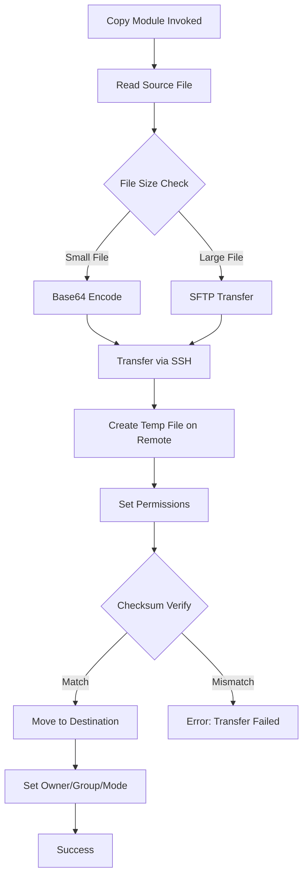

# How to Fix "Copy Module" File Transfer Errors

Author: [nawazdhandala](https://www.github.com/nawazdhandala)

Tags: Ansible, Copy Module, File Transfer, Troubleshooting, DevOps, Configuration Management

Description: Learn how to diagnose and fix common Ansible copy module errors including permission issues, path problems, and large file transfer failures.

---

> The Ansible copy module is one of the most frequently used modules for transferring files to remote hosts. However, it can encounter various errors related to permissions, paths, and transfer limitations. This guide covers the most common copy module errors and their solutions.

Understanding how the copy module works internally helps diagnose issues faster. The module first creates a temporary file on the remote host, then moves it to the destination with the specified permissions.

---

## How the Copy Module Works



---

## Error 1: Permission Denied

### Symptoms

```
fatal: [webserver]: FAILED! => {
    "changed": false,
    "msg": "Destination /etc/myapp not writable"
}
```

Or:

```
fatal: [webserver]: FAILED! => {
    "changed": false,
    "msg": "Could not make backup of /etc/myapp/config.conf to /etc/myapp/config.conf.backup: [Errno 13] Permission denied"
}
```

### Causes and Solutions

#### Cause 1: Missing become privileges

```yaml
# Problem: Task runs as unprivileged user
- name: Copy configuration file
  ansible.builtin.copy:
    src: config.conf
    dest: /etc/myapp/config.conf

# Solution: Add become to elevate privileges
- name: Copy configuration file
  ansible.builtin.copy:
    src: config.conf
    dest: /etc/myapp/config.conf
  become: yes
  become_user: root
```

#### Cause 2: SELinux restrictions

```yaml
# Check SELinux status
- name: Get SELinux status
  ansible.builtin.command: getenforce
  register: selinux_status
  changed_when: false

# Solution 1: Set correct SELinux context
- name: Copy file with SELinux context
  ansible.builtin.copy:
    src: config.conf
    dest: /etc/myapp/config.conf
    # Set the appropriate SELinux context
    setype: etc_t
  become: yes

# Solution 2: Use restorecon after copy
- name: Copy configuration file
  ansible.builtin.copy:
    src: config.conf
    dest: /etc/myapp/config.conf
  become: yes
  register: copy_result

- name: Restore SELinux context
  ansible.builtin.command: restorecon -v /etc/myapp/config.conf
  when: copy_result.changed
  become: yes
```

#### Cause 3: Immutable file attribute

```yaml
# Check for immutable attribute
- name: Check file attributes
  ansible.builtin.command: lsattr /etc/myapp/config.conf
  register: file_attrs
  changed_when: false
  failed_when: false
  become: yes

# Remove immutable attribute if present
- name: Remove immutable attribute
  ansible.builtin.command: chattr -i /etc/myapp/config.conf
  when: "'i' in file_attrs.stdout"
  become: yes

- name: Copy configuration file
  ansible.builtin.copy:
    src: config.conf
    dest: /etc/myapp/config.conf
  become: yes
```

---

## Error 2: Source File Not Found

### Symptoms

```
fatal: [webserver]: FAILED! => {
    "changed": false,
    "msg": "Could not find or access 'files/config.conf'\nSearched in:\n\t/home/user/ansible/files/config.conf"
}
```

### Causes and Solutions

#### Cause 1: Incorrect path specification

```yaml
# Problem: Path does not match file location
- name: Copy config file
  ansible.builtin.copy:
    src: config.conf  # Ansible searches in specific locations
    dest: /etc/myapp/config.conf

# Solution: Understand Ansible file search order
# Ansible searches for files in this order:
# 1. Role's files/ directory (when in a role)
# 2. Playbook's files/ directory
# 3. Role's root directory
# 4. Playbook directory

# Option 1: Place file in files/ directory
# project/
# ├── playbook.yml
# └── files/
#     └── config.conf

# Option 2: Use absolute path
- name: Copy config file with absolute path
  ansible.builtin.copy:
    src: /home/user/configs/config.conf
    dest: /etc/myapp/config.conf

# Option 3: Use path relative to playbook
- name: Copy config file with playbook-relative path
  ansible.builtin.copy:
    src: "{{ playbook_dir }}/files/config.conf"
    dest: /etc/myapp/config.conf
```

#### Cause 2: File exists only on remote host

```yaml
# Problem: Trying to copy a remote file to another location
# The copy module's src parameter refers to the control node by default

# Solution: Use remote_src for remote-to-remote copy
- name: Copy file from one location to another on remote host
  ansible.builtin.copy:
    src: /opt/backup/config.conf
    dest: /etc/myapp/config.conf
    # remote_src tells Ansible the source is on the remote host
    remote_src: yes
  become: yes
```

---

## Error 3: Destination Directory Does Not Exist

### Symptoms

```
fatal: [webserver]: FAILED! => {
    "changed": false,
    "msg": "Destination directory /etc/myapp/conf.d does not exist"
}
```

### Solution

```yaml
# Ensure directory exists before copying
- name: Create destination directory
  ansible.builtin.file:
    path: /etc/myapp/conf.d
    state: directory
    owner: root
    group: root
    mode: '0755'
  become: yes

- name: Copy configuration files
  ansible.builtin.copy:
    src: "{{ item }}"
    dest: /etc/myapp/conf.d/
    owner: root
    group: root
    mode: '0644'
  loop:
    - app.conf
    - logging.conf
    - database.conf
  become: yes
```

---

## Error 4: Large File Transfer Timeout

### Symptoms

```
fatal: [webserver]: FAILED! => {
    "changed": false,
    "msg": "Timeout (12s) waiting for privilege escalation prompt"
}
```

Or the task hangs during transfer of large files.

### Solution

```yaml
# Problem: Default timeout too short for large files
# Solution 1: Increase async timeout for large file transfers
- name: Copy large file with extended timeout
  ansible.builtin.copy:
    src: large_file.tar.gz
    dest: /opt/backups/large_file.tar.gz
  become: yes
  async: 3600  # 1 hour timeout
  poll: 30     # Check every 30 seconds

# Solution 2: Use synchronize module for better performance
# The synchronize module uses rsync which is more efficient for large files
- name: Copy large file using synchronize
  ansible.posix.synchronize:
    src: large_file.tar.gz
    dest: /opt/backups/large_file.tar.gz
    # Compress data during transfer
    compress: yes
  become: yes

# Solution 3: Use get_url for files available via HTTP
- name: Download large file directly to remote host
  ansible.builtin.get_url:
    url: https://releases.example.com/large_file.tar.gz
    dest: /opt/backups/large_file.tar.gz
    # Checksum verification for integrity
    checksum: sha256:abc123...
  become: yes
```

---

## Error 5: Checksum Mismatch

### Symptoms

```
fatal: [webserver]: FAILED! => {
    "changed": false,
    "msg": "checksum mismatch: expected abc123, got def456"
}
```

### Causes and Solutions

#### Cause 1: File corruption during transfer

```yaml
# Solution: Force checksum validation and retry
- name: Copy file with explicit checksum
  ansible.builtin.copy:
    src: important_file.bin
    dest: /opt/data/important_file.bin
    # Force checksum validation
    checksum: "{{ lookup('file', 'checksums/important_file.bin.sha256') }}"
  become: yes
  register: copy_result
  retries: 3
  delay: 5
  until: copy_result is success
```

#### Cause 2: Binary vs text mode issues

```yaml
# Solution: Ensure consistent line endings
- name: Copy text file preserving line endings
  ansible.builtin.copy:
    src: script.sh
    dest: /opt/scripts/script.sh
    mode: '0755'
  become: yes

# For files that might have line ending issues
- name: Convert and copy script
  ansible.builtin.template:
    src: script.sh.j2
    dest: /opt/scripts/script.sh
    mode: '0755'
    # Preserve Unix line endings
    newline_sequence: '\n'
  become: yes
```

---

## Error 6: Insufficient Disk Space

### Symptoms

```
fatal: [webserver]: FAILED! => {
    "changed": false,
    "msg": "[Errno 28] No space left on device"
}
```

### Solution

```yaml
# Check disk space before copying
- name: Get disk space info
  ansible.builtin.shell: df -BM /opt | tail -1 | awk '{print $4}' | sed 's/M//'
  register: disk_space
  changed_when: false

- name: Fail if insufficient disk space
  ansible.builtin.fail:
    msg: "Insufficient disk space. Available: {{ disk_space.stdout }}MB, Required: 500MB"
  when: disk_space.stdout | int < 500

- name: Copy file after space check
  ansible.builtin.copy:
    src: large_application.tar.gz
    dest: /opt/apps/large_application.tar.gz
  become: yes
  when: disk_space.stdout | int >= 500
```

---

## Error 7: Symbolic Link Issues

### Symptoms

```
fatal: [webserver]: FAILED! => {
    "changed": false,
    "msg": "refusing to convert from file to symlink for /etc/myapp/config.conf"
}
```

### Solution

```yaml
# Problem: Destination is a symlink, copy tries to overwrite
# Solution 1: Follow symlinks
- name: Copy file following symlinks
  ansible.builtin.copy:
    src: config.conf
    dest: /etc/myapp/config.conf
    # Follow symlinks at destination
    follow: yes
  become: yes

# Solution 2: Remove symlink first if replacing
- name: Remove existing symlink
  ansible.builtin.file:
    path: /etc/myapp/config.conf
    state: absent
  become: yes
  when: ansible_facts['lnk_source'] is defined

- name: Copy actual file
  ansible.builtin.copy:
    src: config.conf
    dest: /etc/myapp/config.conf
  become: yes

# Solution 3: Copy local symlinks as symlinks
- name: Copy preserving symlinks
  ansible.builtin.copy:
    src: myapp_configs/
    dest: /etc/myapp/
    # Preserve symlinks in source directory
    local_follow: no
  become: yes
```

---

## Error 8: Content vs Src Confusion

### Symptoms

```
fatal: [webserver]: FAILED! => {
    "changed": false,
    "msg": "src and content are mutually exclusive"
}
```

### Solution

```yaml
# Problem: Using both src and content parameters
# Wrong:
- name: Copy file incorrectly
  ansible.builtin.copy:
    src: config.conf
    content: "some content"
    dest: /etc/myapp/config.conf

# Solution: Use either src OR content, not both

# Option 1: Use src for existing files
- name: Copy file from source
  ansible.builtin.copy:
    src: config.conf
    dest: /etc/myapp/config.conf
  become: yes

# Option 2: Use content for inline content
- name: Create file with inline content
  ansible.builtin.copy:
    content: |
      # Application Configuration
      app_name: myapp
      environment: production
      debug: false
    dest: /etc/myapp/config.conf
    owner: root
    group: root
    mode: '0644'
  become: yes

# Option 3: Use template for dynamic content
- name: Generate config from template
  ansible.builtin.template:
    src: config.conf.j2
    dest: /etc/myapp/config.conf
  become: yes
```

---

## Error 9: Directory Copy Issues

### Symptoms

```
fatal: [webserver]: FAILED! => {
    "changed": false,
    "msg": "If using a directory as source, dest must be a directory too"
}
```

### Solution

```yaml
# Copying directories requires dest to end with /
- name: Copy directory correctly
  ansible.builtin.copy:
    src: myapp_configs/
    # Note the trailing slash - indicates directory
    dest: /etc/myapp/
    owner: root
    group: root
    mode: '0644'
    # Preserve directory structure
    directory_mode: '0755'
  become: yes

# For more control, use synchronize module
- name: Synchronize directory
  ansible.posix.synchronize:
    src: myapp_configs/
    dest: /etc/myapp/
    # Delete files in dest that do not exist in src
    delete: yes
    # Preserve permissions
    archive: yes
  become: yes
```

---

## Error 10: Remote Temporary Directory Issues

### Symptoms

```
fatal: [webserver]: FAILED! => {
    "changed": false,
    "msg": "Failed to create temporary directory. In some cases, you may have been able to authenticate and did not have permissions on the target directory."
}
```

### Solution

```yaml
# Solution 1: Specify remote_tmp in ansible.cfg
# ansible.cfg
# [defaults]
# remote_tmp = /tmp/.ansible-${USER}/tmp

# Solution 2: Set in playbook
- name: Configure remote temp and copy file
  hosts: servers
  vars:
    ansible_remote_tmp: /var/tmp/.ansible-{{ ansible_user }}/tmp

  tasks:
    - name: Ensure temp directory exists
      ansible.builtin.file:
        path: "{{ ansible_remote_tmp }}"
        state: directory
        mode: '0700'
      become: yes
      become_user: "{{ ansible_user }}"

    - name: Copy file
      ansible.builtin.copy:
        src: config.conf
        dest: /etc/myapp/config.conf
      become: yes

# Solution 3: Use pipelining to avoid temp files
# ansible.cfg
# [ssh_connection]
# pipelining = True
```

---

## Debugging Copy Module Issues

### Enable Verbose Output

```bash
# Run playbook with increased verbosity
ansible-playbook playbook.yml -vvvv

# Debug specific task
ansible -m copy -a "src=config.conf dest=/etc/myapp/config.conf" webserver -vvvv
```

### Check File Attributes

```yaml
# Debug task to inspect destination
- name: Get destination file info
  ansible.builtin.stat:
    path: /etc/myapp/config.conf
  register: dest_stat
  become: yes

- name: Display file information
  ansible.builtin.debug:
    var: dest_stat.stat

# Output includes:
# - exists: whether file exists
# - isdir: whether it is a directory
# - islnk: whether it is a symlink
# - mode: file permissions
# - uid/gid: owner information
# - size: file size
# - checksum: file checksum
```

### Validate Before Copy

```yaml
# Comprehensive validation before copy
- name: Validate destination directory
  block:
    - name: Check if destination directory exists
      ansible.builtin.stat:
        path: /etc/myapp
      register: dest_dir

    - name: Check disk space
      ansible.builtin.shell: df -k /etc/myapp | tail -1 | awk '{print $4}'
      register: available_space
      changed_when: false

    - name: Get source file size
      ansible.builtin.stat:
        path: "{{ playbook_dir }}/files/config.conf"
      register: src_file
      delegate_to: localhost

    - name: Fail if conditions not met
      ansible.builtin.fail:
        msg: |
          Copy validation failed:
          - Destination directory exists: {{ dest_dir.stat.exists }}
          - Available space (KB): {{ available_space.stdout }}
          - Source file size (bytes): {{ src_file.stat.size }}
      when: >
        not dest_dir.stat.exists or
        (available_space.stdout | int) < (src_file.stat.size | int / 1024 + 1000)

- name: Copy file after validation
  ansible.builtin.copy:
    src: config.conf
    dest: /etc/myapp/config.conf
  become: yes
```

---

## Best Practices for Copy Module

### 1. Always Specify Permissions

```yaml
- name: Copy with explicit permissions
  ansible.builtin.copy:
    src: config.conf
    dest: /etc/myapp/config.conf
    owner: root
    group: myapp
    mode: '0640'  # Use quoted octal to prevent YAML interpretation issues
  become: yes
```

### 2. Use Backup for Critical Files

```yaml
- name: Copy with backup
  ansible.builtin.copy:
    src: config.conf
    dest: /etc/myapp/config.conf
    # Create timestamped backup before overwriting
    backup: yes
  become: yes
  register: copy_result

- name: Show backup location
  ansible.builtin.debug:
    msg: "Backup created at: {{ copy_result.backup_file }}"
  when: copy_result.backup_file is defined
```

### 3. Validate Content After Copy

```yaml
- name: Copy and validate configuration
  block:
    - name: Copy configuration file
      ansible.builtin.copy:
        src: nginx.conf
        dest: /etc/nginx/nginx.conf
        validate: /usr/sbin/nginx -t -c %s
      become: yes

  rescue:
    - name: Restore from backup on validation failure
      ansible.builtin.command: cp /etc/nginx/nginx.conf.bak /etc/nginx/nginx.conf
      become: yes
```

---

## Conclusion

The Ansible copy module is powerful but requires understanding of its behavior and common pitfalls. Key takeaways:

- Always use `become: yes` when copying to system directories
- Understand the difference between `src` and `content` parameters
- Use `remote_src: yes` for remote-to-remote copies
- Consider `synchronize` module for large files or directories
- Always specify permissions explicitly with quoted octal values
- Use `backup: yes` for critical configuration files
- Validate configurations when possible using the `validate` parameter

By understanding these common errors and their solutions, you can write more robust Ansible playbooks that handle file transfers reliably across your infrastructure.

---

*Need visibility into your Ansible automation? [OneUptime](https://oneuptime.com) provides monitoring and alerting for your infrastructure, ensuring your automated deployments succeed.*

**Related Reading:**
- [How to Fix "Template Module" Rendering Errors](/blog/post/2026-01-24-ansible-template-module-errors/view)
- [How to Handle Ansible Block Error Handling](/blog/post/2026-01-24-ansible-block-error-handling/view)
