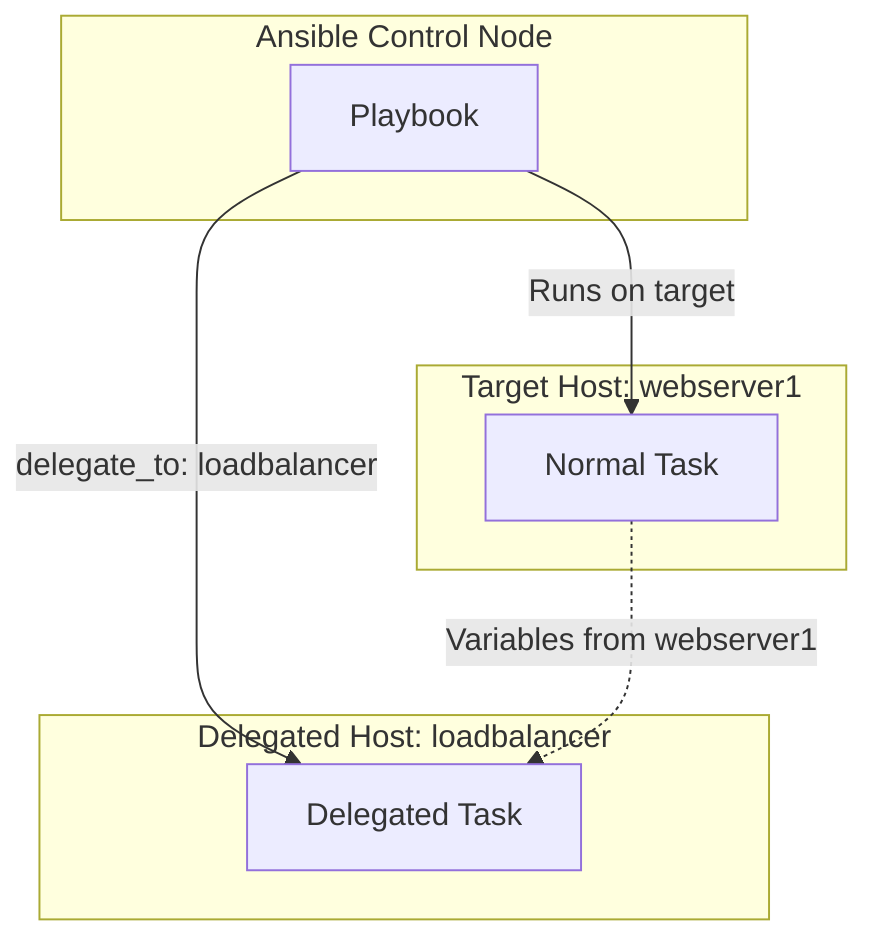
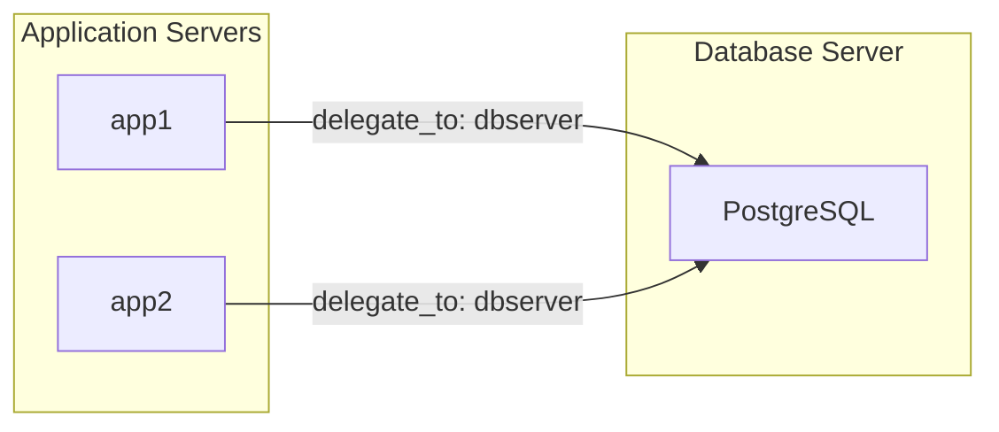
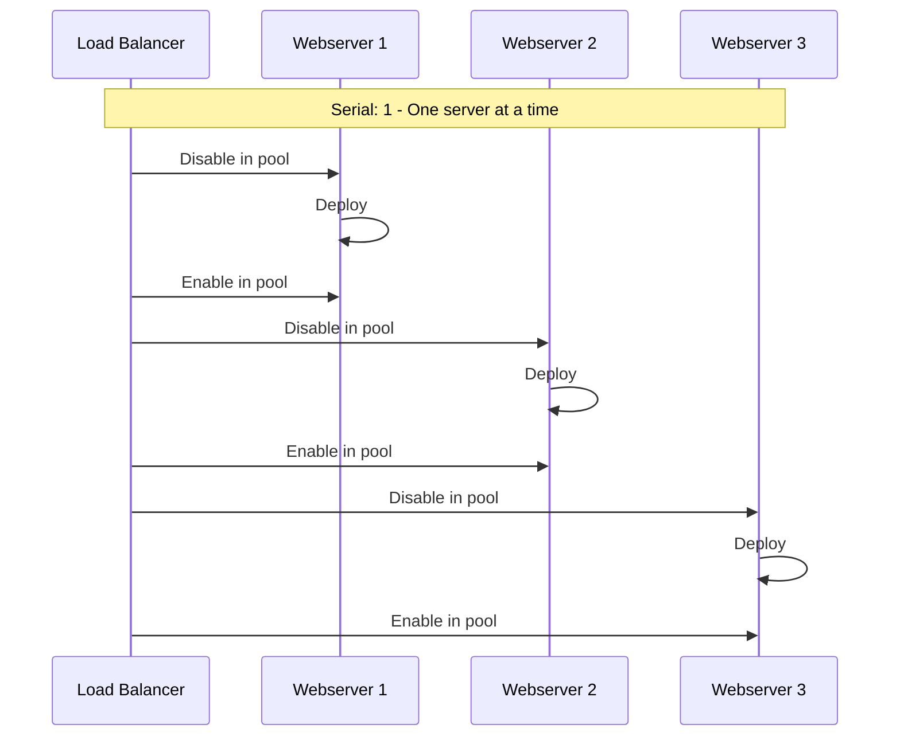

# How to Handle Ansible Delegation with delegate_to

Author: [nawazdhandala](https://www.github.com/nawazdhandala)

Tags: Ansible, Delegation, delegate_to, DevOps, Automation, Orchestration, Best Practices

Description: Learn how to use Ansible delegation with delegate_to to run tasks on different hosts, manage load balancers, and coordinate multi-tier deployments.

---

Ansible's `delegate_to` directive allows you to run tasks on a different host than the one being targeted. This is essential for coordinating actions across multiple systems during deployments, managing load balancers, and orchestrating complex workflows.

---

## Understanding Delegation



---

## Basic Delegation Syntax

```yaml
---
# basic-delegation.yml - Basic delegate_to usage
- name: Demonstrate basic delegation
  hosts: webservers
  tasks:
    # This task runs on each webserver
    - name: Get webserver hostname
      ansible.builtin.command: hostname
      register: web_hostname

    # This task runs on the loadbalancer, but for each webserver
    - name: Remove server from load balancer
      ansible.builtin.command: "remove-backend {{ inventory_hostname }}"
      delegate_to: loadbalancer

    # Variables from webservers are available in delegated tasks
    - name: Log removal on monitoring server
      ansible.builtin.lineinfile:
        path: /var/log/deployments.log
        line: "Removed {{ inventory_hostname }} ({{ web_hostname.stdout }}) from pool"
      delegate_to: monitoring_server
```

---

## Common Use Cases

### Use Case 1: Load Balancer Management

```yaml
---
# loadbalancer-delegation.yml - Manage load balancer during deployment
- name: Rolling deployment with load balancer
  hosts: webservers
  serial: 1
  vars:
    haproxy_socket: /var/run/haproxy/admin.sock
    backend_name: web_backend

  tasks:
    # Disable server in HAProxy before deployment
    - name: Disable server in HAProxy
      ansible.builtin.command: >
        echo "disable server {{ backend_name }}/{{ inventory_hostname }}" |
        socat stdio {{ haproxy_socket }}
      delegate_to: "{{ item }}"
      loop: "{{ groups['loadbalancers'] }}"

    # Wait for connections to drain
    - name: Wait for connections to drain
      ansible.builtin.wait_for:
        timeout: 30

    # Perform deployment tasks on the webserver
    - name: Deploy application
      ansible.builtin.copy:
        src: app/
        dest: /var/www/app/
      notify: Restart application

    # Re-enable server in HAProxy after deployment
    - name: Enable server in HAProxy
      ansible.builtin.command: >
        echo "enable server {{ backend_name }}/{{ inventory_hostname }}" |
        socat stdio {{ haproxy_socket }}
      delegate_to: "{{ item }}"
      loop: "{{ groups['loadbalancers'] }}"

    # Verify server is healthy
    - name: Wait for server to be healthy
      ansible.builtin.uri:
        url: "http://{{ inventory_hostname }}/health"
        status_code: 200
      register: health_check
      until: health_check.status == 200
      retries: 10
      delay: 5

  handlers:
    - name: Restart application
      ansible.builtin.service:
        name: myapp
        state: restarted
```

---

### Use Case 2: Database Operations from Application Servers



```yaml
---
# database-delegation.yml - Database operations delegated from app servers
- name: Database migrations during deployment
  hosts: app_servers
  vars:
    db_host: dbserver
    db_name: myapp
    migration_user: deployer

  tasks:
    # Run database migration from first app server only
    - name: Run database migrations
      ansible.builtin.command: |
        /opt/myapp/bin/migrate --database {{ db_name }}
      delegate_to: "{{ db_host }}"
      run_once: true
      become: yes
      become_user: "{{ migration_user }}"
      register: migration_result

    # Display migration output
    - name: Show migration results
      ansible.builtin.debug:
        var: migration_result.stdout_lines
      run_once: true

    # Create backup before schema changes
    - name: Create database backup
      ansible.builtin.command: |
        pg_dump {{ db_name }} > /backups/{{ db_name }}_{{ ansible_date_time.iso8601_basic }}.sql
      delegate_to: "{{ db_host }}"
      run_once: true
      become: yes
      become_user: postgres
```

---

### Use Case 3: Monitoring Integration

```yaml
---
# monitoring-delegation.yml - Integrate with monitoring during deployment
- name: Deployment with monitoring integration
  hosts: webservers
  vars:
    monitoring_server: prometheus-server
    alertmanager_url: http://alertmanager:9093

  tasks:
    # Silence alerts during deployment
    - name: Create alertmanager silence
      ansible.builtin.uri:
        url: "{{ alertmanager_url }}/api/v2/silences"
        method: POST
        body_format: json
        body:
          matchers:
            - name: instance
              value: "{{ inventory_hostname }}"
              isRegex: false
          startsAt: "{{ ansible_date_time.iso8601 }}"
          endsAt: "{{ '%Y-%m-%dT%H:%M:%S' | strftime(ansible_date_time.epoch | int + 3600) }}"
          createdBy: ansible
          comment: "Deployment in progress"
      delegate_to: localhost
      register: silence_response

    # Store silence ID for later
    - name: Store silence ID
      ansible.builtin.set_fact:
        silence_id: "{{ silence_response.json.silenceID }}"

    # Perform deployment
    - name: Deploy application
      ansible.builtin.copy:
        src: app/
        dest: /var/www/app/

    # Update monitoring configuration
    - name: Update Prometheus targets
      ansible.builtin.template:
        src: prometheus-targets.yml.j2
        dest: /etc/prometheus/targets/{{ inventory_hostname }}.yml
      delegate_to: "{{ monitoring_server }}"
      notify: Reload prometheus

    # Remove silence after successful deployment
    - name: Remove alertmanager silence
      ansible.builtin.uri:
        url: "{{ alertmanager_url }}/api/v2/silence/{{ silence_id }}"
        method: DELETE
      delegate_to: localhost

  handlers:
    - name: Reload prometheus
      ansible.builtin.command: kill -HUP $(pgrep prometheus)
      delegate_to: "{{ monitoring_server }}"
```

---

### Use Case 4: DNS Updates During Deployment

```yaml
---
# dns-delegation.yml - Update DNS during deployment
- name: Update DNS records during deployment
  hosts: webservers
  vars:
    dns_server: dns-master
    dns_zone: example.com
    ttl: 300

  tasks:
    # Update DNS record for the server
    - name: Update A record
      ansible.builtin.nsupdate:
        key_name: ansible-key
        key_secret: "{{ vault_dns_key }}"
        server: "{{ dns_server }}"
        zone: "{{ dns_zone }}"
        record: "{{ inventory_hostname_short }}"
        type: A
        value: "{{ ansible_default_ipv4.address }}"
        ttl: "{{ ttl }}"
      delegate_to: localhost

    # Update reverse DNS
    - name: Update PTR record
      ansible.builtin.command: |
        nsupdate -k /etc/bind/keys/ansible-key.key << EOF
        server {{ dns_server }}
        update delete {{ ansible_default_ipv4.address | regex_replace('^(\d+)\.(\d+)\.(\d+)\.(\d+)$', '\\4.\\3.\\2.\\1') }}.in-addr.arpa PTR
        update add {{ ansible_default_ipv4.address | regex_replace('^(\d+)\.(\d+)\.(\d+)\.(\d+)$', '\\4.\\3.\\2.\\1') }}.in-addr.arpa {{ ttl }} PTR {{ inventory_hostname }}.
        send
        EOF
      delegate_to: "{{ dns_server }}"
```

---

## Delegation with Facts

```yaml
---
# delegation-facts.yml - Using facts with delegation
- name: Delegation with fact management
  hosts: webservers
  tasks:
    # Gather facts from delegated host
    - name: Gather facts from database server
      ansible.builtin.setup:
      delegate_to: dbserver
      delegate_facts: true

    # Now dbserver facts are available
    - name: Display database server memory
      ansible.builtin.debug:
        msg: "DB Server has {{ hostvars['dbserver']['ansible_memtotal_mb'] }} MB RAM"

    # Configure app with database server info
    - name: Configure application database connection
      ansible.builtin.template:
        src: database.yml.j2
        dest: /etc/myapp/database.yml
      vars:
        db_ip: "{{ hostvars['dbserver']['ansible_default_ipv4']['address'] }}"
        db_hostname: "{{ hostvars['dbserver']['ansible_fqdn'] }}"
```

---

## Local Delegation

```yaml
---
# local-delegation.yml - Running tasks on the control node
- name: Local delegation examples
  hosts: webservers
  tasks:
    # API calls are often best run locally
    - name: Send deployment notification to Slack
      ansible.builtin.uri:
        url: https://hooks.slack.com/services/XXX/YYY/ZZZ
        method: POST
        body_format: json
        body:
          text: "Deploying to {{ inventory_hostname }}"
      delegate_to: localhost
      run_once: true

    # Generate files locally and distribute
    - name: Generate SSL certificate locally
      ansible.builtin.command: |
        openssl req -new -x509 -days 365 -nodes \
          -out /tmp/{{ inventory_hostname }}.crt \
          -keyout /tmp/{{ inventory_hostname }}.key \
          -subj "/CN={{ inventory_hostname }}"
      delegate_to: localhost
      args:
        creates: "/tmp/{{ inventory_hostname }}.crt"

    # Copy generated certificate to target
    - name: Copy certificate to server
      ansible.builtin.copy:
        src: "/tmp/{{ inventory_hostname }}.crt"
        dest: /etc/ssl/certs/server.crt

    # Cleanup local files
    - name: Remove local temporary files
      ansible.builtin.file:
        path: "/tmp/{{ inventory_hostname }}.{{ item }}"
        state: absent
      delegate_to: localhost
      loop:
        - crt
        - key
```

---

## Delegation with Serial and Batches



```yaml
---
# serial-delegation.yml - Combining serial with delegation
- name: Rolling update with delegation
  hosts: webservers
  serial: 1
  max_fail_percentage: 0
  vars:
    lb_host: loadbalancer

  pre_tasks:
    # Remove from load balancer before any tasks
    - name: Remove from load balancer
      ansible.builtin.command: "lb-ctl disable {{ inventory_hostname }}"
      delegate_to: "{{ lb_host }}"

    - name: Wait for connections to drain
      ansible.builtin.pause:
        seconds: 30

  tasks:
    - name: Stop application
      ansible.builtin.service:
        name: myapp
        state: stopped

    - name: Deploy new version
      ansible.builtin.unarchive:
        src: "https://releases.example.com/myapp-{{ app_version }}.tar.gz"
        dest: /opt/myapp
        remote_src: yes

    - name: Start application
      ansible.builtin.service:
        name: myapp
        state: started

    - name: Wait for application to be ready
      ansible.builtin.uri:
        url: "http://localhost:8080/health"
        status_code: 200
      register: health
      until: health.status == 200
      retries: 30
      delay: 5

  post_tasks:
    # Add back to load balancer after successful deployment
    - name: Add to load balancer
      ansible.builtin.command: "lb-ctl enable {{ inventory_hostname }}"
      delegate_to: "{{ lb_host }}"

    - name: Verify server is receiving traffic
      ansible.builtin.uri:
        url: "http://{{ lb_host }}/check/{{ inventory_hostname }}"
        status_code: 200
      delegate_to: localhost
      retries: 10
      delay: 3
```

---

## Common Patterns and Best Practices

### Pattern 1: Run Once with Delegation

```yaml
---
# run-once-delegation.yml - Run delegated task only once
- name: Run once delegation pattern
  hosts: webservers
  tasks:
    # Send single notification for entire deployment
    - name: Notify deployment start
      ansible.builtin.uri:
        url: "{{ webhook_url }}"
        method: POST
        body_format: json
        body:
          event: deployment_started
          servers: "{{ ansible_play_hosts }}"
      delegate_to: localhost
      run_once: true

    # Deploy to all servers
    - name: Deploy application
      ansible.builtin.copy:
        src: app/
        dest: /var/www/app/

    # Single notification after all servers done
    - name: Notify deployment complete
      ansible.builtin.uri:
        url: "{{ webhook_url }}"
        method: POST
        body_format: json
        body:
          event: deployment_completed
          servers: "{{ ansible_play_hosts }}"
      delegate_to: localhost
      run_once: true
```

### Pattern 2: Delegate to Group Members

```yaml
---
# delegate-to-group.yml - Delegate to multiple hosts
- name: Delegate to all hosts in a group
  hosts: app_servers
  tasks:
    # Update configuration on all proxies for each app server
    - name: Update proxy configuration
      ansible.builtin.template:
        src: proxy-backend.conf.j2
        dest: "/etc/nginx/conf.d/backends/{{ inventory_hostname }}.conf"
      delegate_to: "{{ item }}"
      loop: "{{ groups['proxies'] }}"
      notify: Reload nginx on proxies

  handlers:
    - name: Reload nginx on proxies
      ansible.builtin.service:
        name: nginx
        state: reloaded
      delegate_to: "{{ item }}"
      loop: "{{ groups['proxies'] }}"
```

### Pattern 3: Conditional Delegation

```yaml
---
# conditional-delegation.yml - Delegate based on conditions
- name: Conditional delegation
  hosts: all
  tasks:
    # Delegate to primary database only
    - name: Run on primary database
      ansible.builtin.command: /opt/scripts/backup.sh
      delegate_to: "{{ groups['databases'] | first }}"
      run_once: true
      when: "'app_servers' in group_names"

    # Delegate to local datacenter load balancer
    - name: Update local load balancer
      ansible.builtin.command: "lb-ctl update {{ inventory_hostname }}"
      delegate_to: "lb-{{ datacenter }}"
      when: datacenter is defined
```

---

## Troubleshooting Delegation

| Issue | Cause | Solution |
|-------|-------|----------|
| SSH connection fails | Wrong credentials for delegated host | Use `ansible_user` and `ansible_ssh_private_key_file` |
| Variables not available | Facts not gathered on delegated host | Use `delegate_facts: true` |
| Task runs multiple times | Missing `run_once` | Add `run_once: true` for single execution |
| Become fails | Different privilege escalation needed | Set `become` directives for delegated task |

```yaml
---
# troubleshoot-delegation.yml - Handle common delegation issues
- name: Troubleshoot delegation
  hosts: webservers
  tasks:
    # Use explicit connection settings for delegation
    - name: Task with explicit delegation settings
      ansible.builtin.command: whoami
      delegate_to: special_server
      vars:
        ansible_user: deploy_user
        ansible_ssh_private_key_file: /path/to/special_key
        ansible_become: yes
        ansible_become_method: sudo
        ansible_become_user: root
```

---

*Orchestrating complex deployments? [OneUptime](https://oneuptime.com) provides real-time monitoring and alerting for your infrastructure, helping you catch issues during deployments before they impact users.*
