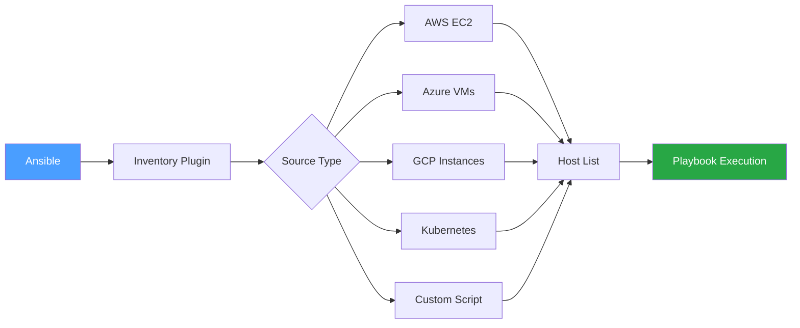
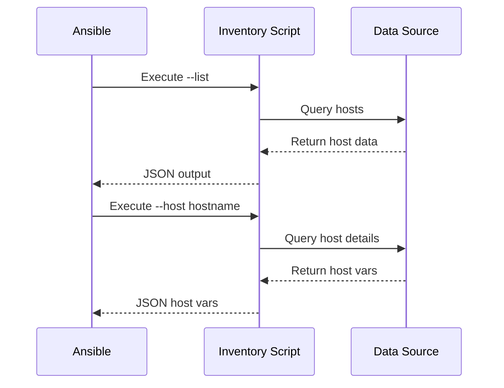
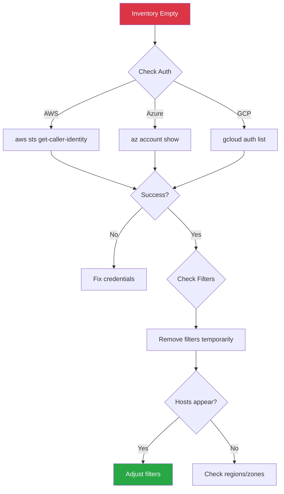

# How to Configure Ansible Dynamic Inventory

Author: [nawazdhandala](https://www.github.com/nawazdhandala)

Tags: Ansible, DevOps, Dynamic Inventory, AWS, Cloud, Automation, Infrastructure as Code

Description: A practical guide to setting up dynamic inventory in Ansible for cloud providers, custom scripts, and hybrid environments with auto-discovery of hosts.

---

Static inventory files become unmanageable as infrastructure scales. Dynamic inventory automatically discovers hosts from cloud providers, CMDBs, or custom sources. This guide shows you how to configure dynamic inventory for various environments.

## Understanding Dynamic Inventory

Dynamic inventory queries external sources to build the host list at runtime instead of reading from a static file.



### Static vs Dynamic Inventory

| Feature | Static Inventory | Dynamic Inventory |
|---------|-----------------|-------------------|
| Host management | Manual updates | Auto-discovery |
| Scaling | Difficult | Automatic |
| Cloud integration | Manual sync | Native support |
| Host metadata | Limited | Rich attributes |
| Maintenance | High | Low |

## AWS EC2 Dynamic Inventory

### Prerequisites

```bash
# Install required collections
ansible-galaxy collection install amazon.aws

# Install boto3
pip install boto3 botocore

# Configure AWS credentials
aws configure
# Or use environment variables
export AWS_ACCESS_KEY_ID='your-access-key'
export AWS_SECRET_ACCESS_KEY='your-secret-key'
export AWS_REGION='us-east-1'
```

### Basic Configuration

Create `inventory/aws_ec2.yml`:

```yaml
# inventory/aws_ec2.yml
---
plugin: amazon.aws.aws_ec2

# AWS regions to query
regions:
  - us-east-1
  - us-west-2

# Filter instances
filters:
  # Only running instances
  instance-state-name: running
  # Only instances with specific tag
  "tag:Environment": production

# Keyed groups - create groups from instance attributes
keyed_groups:
  # Group by instance type (e.g., group: t3_micro)
  - key: instance_type
    prefix: type
    separator: "_"

  # Group by AWS region
  - key: placement.region
    prefix: region

  # Group by tags (e.g., group: env_production)
  - key: tags.Environment
    prefix: env

  # Group by tags (e.g., group: role_webserver)
  - key: tags.Role
    prefix: role

# Compose variables for each host
compose:
  # Use public IP for SSH, fall back to private
  ansible_host: public_ip_address | default(private_ip_address)
  # Set the SSH user based on AMI
  ansible_user: "'ec2-user' if 'amzn' in image_id else 'ubuntu'"

# Host variables from instance attributes
hostnames:
  # Try Name tag first, then instance ID
  - tag:Name
  - instance-id

# Cache settings
cache: true
cache_plugin: jsonfile
cache_timeout: 300
cache_connection: /tmp/aws_inventory_cache
```

### Advanced AWS Configuration

```yaml
# inventory/aws_ec2_advanced.yml
---
plugin: amazon.aws.aws_ec2

regions:
  - us-east-1

# Multiple filters with AND logic
filters:
  instance-state-name: running
  "tag:Environment":
    - production
    - staging
  "tag:Managed": "ansible"

# Exclude specific instances
exclude_filters:
  - "tag:Exclude": "true"

# IAM role assumption (for cross-account)
assume_role_arn: arn:aws:iam::123456789012:role/AnsibleInventoryRole
sts_endpoint: https://sts.us-east-1.amazonaws.com

# Group by multiple attributes
keyed_groups:
  - key: tags.Environment
    prefix: env
  - key: tags.Role
    prefix: role
  - key: placement.availability_zone
    prefix: az
  - key: vpc_id
    prefix: vpc
  - key: security_groups | map(attribute='group_name') | list
    prefix: sg

# Groups based on conditions
groups:
  # All webservers
  webservers: "'webserver' in (tags.Role | default(''))"
  # Large instances
  large_instances: "instance_type.startswith('m5.') or instance_type.startswith('c5.')"
  # In specific VPC
  main_vpc: "vpc_id == 'vpc-12345678'"

# Rich host variables
compose:
  ansible_host: public_ip_address | default(private_ip_address)
  ansible_user: "'ec2-user' if 'amzn' in (image_id | default('')) else 'ubuntu'"
  ansible_port: 22
  ec2_instance_id: instance_id
  ec2_region: placement.region
  ec2_availability_zone: placement.availability_zone
  ec2_vpc_id: vpc_id
  ec2_subnet_id: subnet_id
  ec2_private_ip: private_ip_address
  ec2_public_ip: public_ip_address | default('')
  ec2_instance_type: instance_type
  ec2_tags: tags
```

### Using AWS Inventory

```bash
# List all discovered hosts
ansible-inventory -i inventory/aws_ec2.yml --list

# Show host graph
ansible-inventory -i inventory/aws_ec2.yml --graph

# Test connectivity to all hosts
ansible -i inventory/aws_ec2.yml all -m ping

# Run playbook
ansible-playbook -i inventory/aws_ec2.yml playbook.yml

# Target specific groups
ansible-playbook -i inventory/aws_ec2.yml playbook.yml --limit "env_production:&role_webserver"
```

## Azure Dynamic Inventory

### Prerequisites

```bash
# Install Azure collection
ansible-galaxy collection install azure.azcollection

# Install Azure SDK
pip install azure-identity azure-mgmt-compute azure-mgmt-network azure-mgmt-resource

# Authenticate
az login
# Or use service principal
export AZURE_SUBSCRIPTION_ID='subscription-id'
export AZURE_CLIENT_ID='client-id'
export AZURE_SECRET='client-secret'
export AZURE_TENANT='tenant-id'
```

### Configuration

Create `inventory/azure_rm.yml`:

```yaml
# inventory/azure_rm.yml
---
plugin: azure.azcollection.azure_rm

# Authentication
auth_source: auto  # Uses az login, env vars, or MSI

# Include only specific resource groups
include_vm_resource_groups:
  - production-rg
  - staging-rg

# Exclude resource groups
exclude_vm_resource_groups:
  - test-rg

# Filter by tags
conditional_groups:
  webservers: "'webserver' in tags.Role | default('')"
  databases: "'database' in tags.Role | default('')"

# Keyed groups
keyed_groups:
  - key: location
    prefix: location
  - key: tags.Environment | default('unknown')
    prefix: env
  - key: tags.Role | default('unknown')
    prefix: role
  - key: resource_group
    prefix: rg

# Host variables
compose:
  ansible_host: public_ipv4_addresses[0] | default(private_ipv4_addresses[0])
  ansible_user: "'azureuser'"
  azure_vm_size: virtual_machine_size
  azure_location: location
  azure_resource_group: resource_group

# Use VM name as hostname
hostnames:
  - name

# Caching
cache: true
cache_plugin: jsonfile
cache_timeout: 600
cache_connection: /tmp/azure_inventory_cache
```

## GCP Dynamic Inventory

### Prerequisites

```bash
# Install GCP collection
ansible-galaxy collection install google.cloud

# Install Google SDK
pip install google-auth google-api-python-client

# Authenticate
gcloud auth application-default login
# Or use service account
export GCP_SERVICE_ACCOUNT_FILE=/path/to/service-account.json
export GCP_PROJECT=your-project-id
```

### Configuration

Create `inventory/gcp.yml`:

```yaml
# inventory/gcp.yml
---
plugin: google.cloud.gcp_compute

# Project and zones
projects:
  - my-gcp-project
zones:
  - us-central1-a
  - us-central1-b
  - us-east1-b

# Filter instances
filters:
  - status = RUNNING
  - labels.managed = ansible

# Group by labels and attributes
keyed_groups:
  - key: labels.environment
    prefix: env
  - key: labels.role
    prefix: role
  - key: zone
    prefix: zone
  - key: machine_type().split('/')[-1]
    prefix: type

# Conditional groups
groups:
  webservers: "'webserver' in labels.role | default('')"
  databases: "'database' in labels.role | default('')"

# Host variables
compose:
  ansible_host: networkInterfaces[0].accessConfigs[0].natIP | default(networkInterfaces[0].networkIP)
  ansible_user: "{{ lookup('env', 'USER') }}"
  gcp_zone: zone
  gcp_project: project
  gcp_machine_type: machineType

# Hostnames
hostnames:
  - name

# Cache
cache: true
cache_plugin: jsonfile
cache_timeout: 300
cache_connection: /tmp/gcp_inventory_cache

# Service account
auth_kind: serviceaccount
service_account_file: /path/to/service-account.json
```

## Kubernetes Dynamic Inventory

### Prerequisites

```bash
# Install Kubernetes collection
ansible-galaxy collection install kubernetes.core

# Install Python client
pip install kubernetes
```

### Configuration

Create `inventory/k8s.yml`:

```yaml
# inventory/k8s.yml
---
plugin: kubernetes.core.k8s

# Connection settings
connections:
  - kubeconfig: ~/.kube/config
    context: production-cluster

# Namespaces to query
namespaces:
  - default
  - production
  - staging

# Group pods by labels
keyed_groups:
  - key: labels.app
    prefix: app
  - key: labels.environment
    prefix: env
  - key: namespace
    prefix: ns

# Host variables
compose:
  ansible_host: status.podIP
  ansible_connection: kubectl
  ansible_kubectl_pod: metadata.name
  ansible_kubectl_namespace: metadata.namespace
  ansible_kubectl_container: spec.containers[0].name
```

## Custom Script Inventory

For sources without built-in plugins, create a custom inventory script.

### Inventory Script Flow



### Python Inventory Script

Create `inventory/custom_inventory.py`:

```python
#!/usr/bin/env python3
"""
Custom dynamic inventory script for Ansible.
Returns hosts from a hypothetical CMDB API.
"""

import argparse
import json
import os
import sys

# Your CMDB client or data source
import requests


def get_cmdb_hosts():
    """
    Fetch hosts from CMDB API.
    Replace with your actual data source.
    """
    cmdb_url = os.getenv('CMDB_URL', 'https://cmdb.example.com/api/hosts')
    api_key = os.getenv('CMDB_API_KEY', '')

    try:
        response = requests.get(
            cmdb_url,
            headers={'Authorization': f'Bearer {api_key}'},
            timeout=30
        )
        response.raise_for_status()
        return response.json()
    except requests.RequestException as e:
        print(f"Error fetching from CMDB: {e}", file=sys.stderr)
        return []


def build_inventory():
    """
    Build Ansible inventory structure from CMDB data.
    """
    hosts = get_cmdb_hosts()

    inventory = {
        '_meta': {
            'hostvars': {}
        },
        'all': {
            'hosts': [],
            'children': ['webservers', 'databases', 'ungrouped']
        },
        'webservers': {
            'hosts': []
        },
        'databases': {
            'hosts': []
        },
        'ungrouped': {
            'hosts': []
        }
    }

    for host in hosts:
        hostname = host['hostname']

        # Add to all hosts
        inventory['all']['hosts'].append(hostname)

        # Add to role-based group
        role = host.get('role', 'ungrouped')
        if role in inventory:
            inventory[role]['hosts'].append(hostname)
        else:
            inventory['ungrouped']['hosts'].append(hostname)

        # Set host variables
        inventory['_meta']['hostvars'][hostname] = {
            'ansible_host': host.get('ip_address'),
            'ansible_user': host.get('ssh_user', 'ansible'),
            'ansible_port': host.get('ssh_port', 22),
            'cmdb_id': host.get('id'),
            'environment': host.get('environment'),
            'datacenter': host.get('datacenter'),
            'os_type': host.get('os_type'),
            'os_version': host.get('os_version'),
        }

        # Create environment groups dynamically
        env = host.get('environment', 'unknown')
        env_group = f"env_{env}"
        if env_group not in inventory:
            inventory[env_group] = {'hosts': []}
            inventory['all']['children'].append(env_group)
        inventory[env_group]['hosts'].append(hostname)

    return inventory


def get_host_vars(hostname):
    """
    Get variables for a specific host.
    """
    inventory = build_inventory()
    return inventory['_meta']['hostvars'].get(hostname, {})


def main():
    """
    Main entry point - parse arguments and output JSON.
    """
    parser = argparse.ArgumentParser(
        description='Custom Ansible dynamic inventory script'
    )
    parser.add_argument(
        '--list',
        action='store_true',
        help='List all hosts'
    )
    parser.add_argument(
        '--host',
        type=str,
        help='Get variables for specific host'
    )

    args = parser.parse_args()

    if args.list:
        inventory = build_inventory()
        print(json.dumps(inventory, indent=2))
    elif args.host:
        hostvars = get_host_vars(args.host)
        print(json.dumps(hostvars, indent=2))
    else:
        parser.print_help()
        sys.exit(1)


if __name__ == '__main__':
    main()
```

Make it executable and test:

```bash
# Make executable
chmod +x inventory/custom_inventory.py

# Test list output
./inventory/custom_inventory.py --list

# Test host vars
./inventory/custom_inventory.py --host myserver01

# Use with Ansible
ansible-inventory -i inventory/custom_inventory.py --list
ansible -i inventory/custom_inventory.py all -m ping
```

## Multiple Inventory Sources

Combine static and dynamic inventory sources.

### Directory-Based Inventory

```
inventory/
├── 01-static.yml           # Static hosts
├── 02-aws_ec2.yml          # AWS dynamic
├── 03-azure_rm.yml         # Azure dynamic
├── group_vars/
│   ├── all.yml
│   ├── webservers.yml
│   └── databases.yml
└── host_vars/
    └── special-host.yml
```

Static file `inventory/01-static.yml`:

```yaml
# inventory/01-static.yml
---
all:
  hosts:
    bastion:
      ansible_host: 10.0.0.10
      ansible_user: admin

    legacy-server:
      ansible_host: 192.168.1.100
      ansible_user: root

  children:
    onprem:
      hosts:
        bastion:
        legacy-server:
```

Use the directory as inventory:

```bash
# Use entire directory
ansible-playbook -i inventory/ playbook.yml

# List combined inventory
ansible-inventory -i inventory/ --list

# Show graph
ansible-inventory -i inventory/ --graph
```

### ansible.cfg Configuration

```ini
# ansible.cfg
[defaults]
inventory = ./inventory/

[inventory]
# Enable inventory plugins
enable_plugins = amazon.aws.aws_ec2, azure.azcollection.azure_rm, script, yaml, ini

# Cache settings
cache = true
cache_plugin = jsonfile
cache_timeout = 3600
cache_connection = /tmp/ansible_inventory_cache
```

## Debugging Dynamic Inventory

### Verify Plugin Output

```bash
# List all hosts with full details
ansible-inventory -i inventory/aws_ec2.yml --list --yaml

# Show specific host variables
ansible-inventory -i inventory/aws_ec2.yml --host web01

# Graph view
ansible-inventory -i inventory/aws_ec2.yml --graph

# Export to file
ansible-inventory -i inventory/aws_ec2.yml --list --output inventory_export.json
```

### Debug Environment Issues

```bash
# Check AWS credentials
aws sts get-caller-identity

# Check Azure authentication
az account show

# Check GCP authentication
gcloud auth list

# Verbose inventory
ansible-inventory -i inventory/aws_ec2.yml --list -vvv
```

### Common Issues



---

Dynamic inventory transforms infrastructure management from manual host tracking to automatic discovery. Start with your cloud provider's plugin, configure filters and groups based on tags, and use caching for better performance. For custom sources, create a script that outputs JSON in Ansible's inventory format. Combine multiple sources in an inventory directory for hybrid environments.
