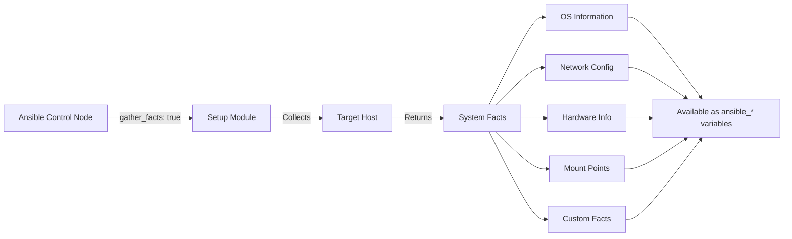
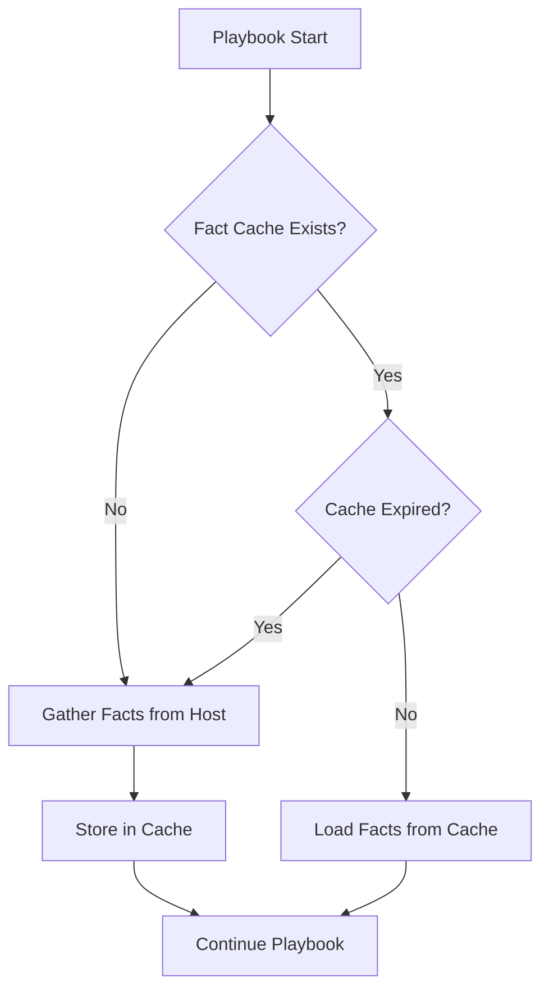
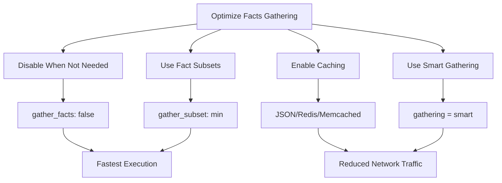

# How to Handle Ansible Facts Gathering

Author: [nawazdhandala](https://www.github.com/nawazdhandala)

Tags: Ansible, Facts, Automation, DevOps, Configuration Management, System Information, Performance

Description: Learn how to efficiently gather, filter, cache, and use Ansible facts for dynamic playbook execution and improved automation performance.

---

Ansible facts are system properties collected from managed hosts during playbook execution. Understanding how to handle facts effectively is crucial for writing dynamic playbooks and optimizing automation performance. This guide covers everything from basic fact gathering to advanced caching strategies.

## What Are Ansible Facts?

Facts are variables automatically discovered by Ansible about the target systems. They include information about the operating system, network configuration, hardware, and more.



## Basic Facts Gathering

### View All Available Facts

```bash
# Gather and display all facts from a host
ansible webserver1 -m setup

# Filter facts by specific patterns
ansible webserver1 -m setup -a "filter=ansible_distribution*"

# Gather facts and save to a file
ansible webserver1 -m setup --tree /tmp/facts
```

### Facts Gathering in Playbooks

```yaml
# playbooks/show-facts.yml
# Demonstrate basic facts gathering

---
- name: Display System Facts
  hosts: all
  # Facts are gathered by default (gather_facts: true)
  gather_facts: true

  tasks:
    - name: Display operating system information
      debug:
        msg: |
          Hostname: {{ ansible_hostname }}
          FQDN: {{ ansible_fqdn }}
          OS Family: {{ ansible_os_family }}
          Distribution: {{ ansible_distribution }}
          Version: {{ ansible_distribution_version }}
          Kernel: {{ ansible_kernel }}

    - name: Display hardware information
      debug:
        msg: |
          Architecture: {{ ansible_architecture }}
          Processor Count: {{ ansible_processor_count }}
          Processor Cores: {{ ansible_processor_cores }}
          Total Memory: {{ ansible_memtotal_mb }} MB
          Free Memory: {{ ansible_memfree_mb }} MB

    - name: Display network information
      debug:
        msg: |
          Default IPv4 Address: {{ ansible_default_ipv4.address | default('N/A') }}
          Default Gateway: {{ ansible_default_ipv4.gateway | default('N/A') }}
          Default Interface: {{ ansible_default_ipv4.interface | default('N/A') }}
          All IPv4 Addresses: {{ ansible_all_ipv4_addresses }}
```

## Controlling Facts Gathering

### Disable Facts Gathering for Speed

```yaml
# playbooks/no-facts.yml
# Disable fact gathering when not needed for faster execution

---
- name: Quick Task Without Facts
  hosts: all
  # Disable automatic fact gathering
  gather_facts: false

  tasks:
    - name: Restart nginx service
      service:
        name: nginx
        state: restarted
      become: true

    # If you need specific facts later, gather them explicitly
    - name: Gather minimal facts when needed
      setup:
        gather_subset:
          - min
      when: need_facts | default(false)
```

### Performance Impact of Facts Gathering

```mermaid
gantt
    title Playbook Execution Time Comparison
    dateFormat X
    axisFormat %s

    section Full Facts
    Gather Facts    :0, 8
    Execute Tasks   :8, 12

    section Minimal Facts
    Gather Facts    :0, 2
    Execute Tasks   :2, 6

    section No Facts
    Execute Tasks   :0, 4
```



## Gathering Specific Fact Subsets

### Available Fact Subsets

```yaml
# playbooks/fact-subsets.yml
# Gather only specific categories of facts

---
- name: Gather Selective Facts
  hosts: all
  gather_facts: false

  tasks:
    # Gather minimal facts (fastest option when you need some facts)
    - name: Gather minimum facts only
      setup:
        gather_subset:
          - min
      # min includes: ansible_hostname, ansible_domain, ansible_fqdn,
      # ansible_distribution, ansible_os_family, ansible_pkg_mgr

    - name: Display minimal facts
      debug:
        msg: "Host {{ ansible_hostname }} runs {{ ansible_distribution }}"

---
- name: Gather Network Facts Only
  hosts: all
  gather_facts: false

  tasks:
    - name: Gather network-related facts
      setup:
        gather_subset:
          - network
      # Includes: interfaces, default IPv4/IPv6, all addresses

    - name: Display network configuration
      debug:
        var: ansible_default_ipv4

---
- name: Gather Hardware Facts Only
  hosts: all
  gather_facts: false

  tasks:
    - name: Gather hardware-related facts
      setup:
        gather_subset:
          - hardware
      # Includes: memory, processors, devices, mounts

    - name: Check available memory
      debug:
        msg: "Total RAM: {{ ansible_memtotal_mb }} MB"
```

### Excluding Fact Subsets

```yaml
# playbooks/exclude-facts.yml
# Gather all facts except specific categories

---
- name: Gather Facts with Exclusions
  hosts: all
  gather_facts: false

  tasks:
    # The exclamation mark excludes subsets
    - name: Gather all facts except hardware and virtual
      setup:
        gather_subset:
          - all
          - "!hardware"
          - "!virtual"
      # This speeds up fact gathering on systems where
      # hardware detection is slow

    - name: Display gathered facts categories
      debug:
        msg: "Distribution: {{ ansible_distribution }}, Network: {{ ansible_default_ipv4.address | default('N/A') }}"
```

### Complete List of Fact Subsets

```yaml
# Reference: All available gather_subset values

# Subset options:
#   all        - Gather all facts (default)
#   min        - Gather minimal facts (fastest)
#   hardware   - CPU, memory, devices, mounts
#   network    - Network interfaces, addresses, routes
#   virtual    - Virtualization technology detection
#   ohai       - Run Ohai and return data (if installed)
#   facter     - Run Facter and return data (if installed)

# Exclusion examples:
#   !hardware  - Exclude hardware facts
#   !network   - Exclude network facts
#   !virtual   - Exclude virtual facts
#   !all       - Start with nothing (use with specific subsets)
```

## Caching Facts for Performance

Fact caching stores collected facts to avoid re-gathering them on subsequent playbook runs.

### Configure JSON File Caching

```ini
# ansible.cfg - JSON file fact caching

[defaults]
# Enable fact caching
gathering = smart

# Use JSON file backend
fact_caching = jsonfile

# Directory to store cached facts
fact_caching_connection = /tmp/ansible_facts_cache

# Cache timeout in seconds (86400 = 24 hours)
fact_caching_timeout = 86400
```



### Configure Redis Caching

```ini
# ansible.cfg - Redis fact caching

[defaults]
gathering = smart
fact_caching = redis
# Redis connection string
fact_caching_connection = localhost:6379:0
fact_caching_timeout = 86400

# Optional: Redis with password
# fact_caching_connection = localhost:6379:0:mypassword
```

```bash
# Install Redis Python library
pip install redis
```

### Configure Memcached Caching

```ini
# ansible.cfg - Memcached fact caching

[defaults]
gathering = smart
fact_caching = memcached
fact_caching_connection = 127.0.0.1:11211
fact_caching_timeout = 86400
```

```bash
# Install Memcached Python library
pip install python-memcached
```

### Smart Gathering Modes

```ini
# ansible.cfg - Gathering modes

[defaults]
# Options: implicit, explicit, smart

# implicit (default) - Always gather facts unless gather_facts: false
gathering = implicit

# explicit - Never gather facts unless gather_facts: true
gathering = explicit

# smart - Gather facts only if not in cache or cache expired
gathering = smart
```

## Creating Custom Facts

Custom facts allow you to define your own variables on target hosts that Ansible will automatically discover.

### Static Custom Facts

```bash
# Create the facts directory on target hosts
sudo mkdir -p /etc/ansible/facts.d

# Create a custom fact file (must end in .fact)
sudo tee /etc/ansible/facts.d/application.fact << 'EOF'
[general]
app_name=mywebapp
app_version=2.5.1
environment=production

[database]
db_host=db.example.com
db_port=5432
db_name=webapp_prod
EOF

# Set proper permissions
sudo chmod 644 /etc/ansible/facts.d/application.fact
```

### Access Custom Facts in Playbooks

```yaml
# playbooks/use-custom-facts.yml
# Access custom facts from /etc/ansible/facts.d/

---
- name: Use Custom Local Facts
  hosts: all
  gather_facts: true

  tasks:
    - name: Display custom application facts
      debug:
        msg: |
          Application: {{ ansible_local.application.general.app_name }}
          Version: {{ ansible_local.application.general.app_version }}
          Environment: {{ ansible_local.application.general.environment }}
          Database Host: {{ ansible_local.application.database.db_host }}
      when: ansible_local.application is defined

    - name: Conditional task based on custom fact
      debug:
        msg: "Running production-specific configuration"
      when:
        - ansible_local.application is defined
        - ansible_local.application.general.environment == 'production'
```

### Dynamic Custom Facts with Scripts

```bash
# Create an executable script for dynamic facts
# /etc/ansible/facts.d/dynamic_facts.fact

#!/bin/bash
# This script must output valid JSON

# Get current system load
LOAD=$(cat /proc/loadavg | awk '{print $1}')

# Get disk usage percentage for root
DISK_USAGE=$(df / | tail -1 | awk '{print $5}' | tr -d '%')

# Get number of running processes
PROC_COUNT=$(ps aux | wc -l)

# Get service statuses
NGINX_STATUS=$(systemctl is-active nginx 2>/dev/null || echo "inactive")
MYSQL_STATUS=$(systemctl is-active mysql 2>/dev/null || echo "inactive")

# Output as JSON
cat << EOF
{
    "system_load": "$LOAD",
    "disk_usage_percent": $DISK_USAGE,
    "process_count": $PROC_COUNT,
    "services": {
        "nginx": "$NGINX_STATUS",
        "mysql": "$MYSQL_STATUS"
    }
}
EOF
```

```bash
# Make the script executable
sudo chmod +x /etc/ansible/facts.d/dynamic_facts.fact
```

```yaml
# playbooks/use-dynamic-facts.yml
# Use dynamic custom facts

---
- name: Use Dynamic Custom Facts
  hosts: all
  gather_facts: true

  tasks:
    - name: Display dynamic system facts
      debug:
        msg: |
          System Load: {{ ansible_local.dynamic_facts.system_load }}
          Disk Usage: {{ ansible_local.dynamic_facts.disk_usage_percent }}%
          Process Count: {{ ansible_local.dynamic_facts.process_count }}

    - name: Alert if disk usage is high
      debug:
        msg: "WARNING: Disk usage is above 80%!"
      when: ansible_local.dynamic_facts.disk_usage_percent | int > 80

    - name: Check service status
      debug:
        msg: "Nginx is {{ ansible_local.dynamic_facts.services.nginx }}"
```

## Deploy Custom Facts with Ansible

```yaml
# playbooks/deploy-custom-facts.yml
# Deploy custom facts to all managed hosts

---
- name: Deploy Custom Facts Infrastructure
  hosts: all
  become: true

  vars:
    app_name: "{{ lookup('env', 'APP_NAME') | default('myapp', true) }}"
    app_version: "1.0.0"
    environment: "{{ env | default('development') }}"

  tasks:
    - name: Create facts directory
      file:
        path: /etc/ansible/facts.d
        state: directory
        mode: '0755'

    - name: Deploy static application facts
      copy:
        content: |
          [application]
          name={{ app_name }}
          version={{ app_version }}
          environment={{ environment }}
          deployed_at={{ ansible_date_time.iso8601 }}
          deployed_by=ansible

          [server]
          hostname={{ ansible_hostname }}
          ip_address={{ ansible_default_ipv4.address | default('unknown') }}
        dest: /etc/ansible/facts.d/application.fact
        mode: '0644'

    - name: Deploy dynamic monitoring facts script
      copy:
        content: |
          #!/bin/bash
          # Dynamic facts for system monitoring

          LOAD=$(cat /proc/loadavg | awk '{print $1}')
          MEMORY_USED=$(free | awk '/Mem:/ {printf "%.1f", $3/$2 * 100}')
          DISK_USED=$(df / | tail -1 | awk '{print $5}' | tr -d '%')

          cat << ENDJSON
          {
              "load_average": "$LOAD",
              "memory_used_percent": $MEMORY_USED,
              "disk_used_percent": $DISK_USED,
              "timestamp": "$(date -u +%Y-%m-%dT%H:%M:%SZ)"
          }
          ENDJSON
        dest: /etc/ansible/facts.d/monitoring.fact
        mode: '0755'

    - name: Refresh facts to include new custom facts
      setup:
        filter: ansible_local

    - name: Verify custom facts are available
      debug:
        msg: |
          Application: {{ ansible_local.application.application.name | default('not set') }}
          Load Average: {{ ansible_local.monitoring.load_average | default('not set') }}
```

## Using Facts in Conditional Tasks

```yaml
# playbooks/conditional-facts.yml
# Use facts for conditional task execution

---
- name: Conditional Tasks Based on Facts
  hosts: all
  gather_facts: true

  tasks:
    # OS-specific package installation
    - name: Install packages on Debian-based systems
      apt:
        name:
          - nginx
          - curl
        state: present
        update_cache: true
      when: ansible_os_family == "Debian"
      become: true

    - name: Install packages on RedHat-based systems
      yum:
        name:
          - nginx
          - curl
        state: present
      when: ansible_os_family == "RedHat"
      become: true

    # Memory-based configuration
    - name: Configure swap for low-memory systems
      block:
        - name: Create swap file
          command: fallocate -l 2G /swapfile
          args:
            creates: /swapfile

        - name: Set swap file permissions
          file:
            path: /swapfile
            mode: '0600'

        - name: Make swap
          command: mkswap /swapfile
          when: not ansible_swaptotal_mb

        - name: Enable swap
          command: swapon /swapfile
          when: not ansible_swaptotal_mb
      when: ansible_memtotal_mb < 2048
      become: true

    # Architecture-specific tasks
    - name: Download 64-bit binary
      get_url:
        url: "https://example.com/app-amd64"
        dest: /usr/local/bin/app
      when: ansible_architecture == "x86_64"
      become: true

    - name: Download ARM binary
      get_url:
        url: "https://example.com/app-arm64"
        dest: /usr/local/bin/app
      when: ansible_architecture == "aarch64"
      become: true

    # Version-based configuration
    - name: Apply Ubuntu 22.04 specific configuration
      template:
        src: ubuntu-22-config.j2
        dest: /etc/app/config.conf
      when:
        - ansible_distribution == "Ubuntu"
        - ansible_distribution_version is version('22.04', '>=')
      become: true
```

## Registering and Using Dynamic Facts

```yaml
# playbooks/register-facts.yml
# Create dynamic facts using register and set_fact

---
- name: Create Dynamic Facts
  hosts: all
  gather_facts: true

  tasks:
    # Register command output as a variable
    - name: Get current Git commit
      command: git rev-parse HEAD
      args:
        chdir: /opt/myapp
      register: git_commit_result
      changed_when: false
      ignore_errors: true

    # Convert registered variable to a fact
    - name: Set Git commit as fact
      set_fact:
        app_git_commit: "{{ git_commit_result.stdout | default('unknown') }}"

    # Register service status
    - name: Check if nginx is running
      command: systemctl is-active nginx
      register: nginx_status
      changed_when: false
      ignore_errors: true

    - name: Set service status facts
      set_fact:
        nginx_running: "{{ nginx_status.rc == 0 }}"

    # Combine facts into a structured variable
    - name: Create application status fact
      set_fact:
        application_status:
          git_commit: "{{ app_git_commit }}"
          nginx_running: "{{ nginx_running }}"
          hostname: "{{ ansible_hostname }}"
          ip_address: "{{ ansible_default_ipv4.address | default('unknown') }}"
          memory_mb: "{{ ansible_memtotal_mb }}"
          os: "{{ ansible_distribution }} {{ ansible_distribution_version }}"
        cacheable: true  # Store in fact cache if enabled

    - name: Display application status
      debug:
        var: application_status

    # Use the combined fact
    - name: Generate status report
      copy:
        content: |
          Application Status Report
          ========================
          Server: {{ application_status.hostname }}
          IP: {{ application_status.ip_address }}
          OS: {{ application_status.os }}
          Memory: {{ application_status.memory_mb }} MB
          Git Commit: {{ application_status.git_commit }}
          Nginx Running: {{ application_status.nginx_running }}
          Generated: {{ ansible_date_time.iso8601 }}
        dest: /tmp/status_report.txt
```

## Facts Delegation and Hostvars

```yaml
# playbooks/cross-host-facts.yml
# Access facts from other hosts using hostvars

---
- name: Cross-Host Facts Access
  hosts: all
  gather_facts: true

  tasks:
    - name: Display facts from all hosts
      debug:
        msg: "Host {{ item }} has IP {{ hostvars[item]['ansible_default_ipv4']['address'] | default('unknown') }}"
      loop: "{{ groups['all'] }}"

    - name: Generate hosts file entries
      lineinfile:
        path: /etc/hosts
        line: "{{ hostvars[item]['ansible_default_ipv4']['address'] }} {{ item }}"
        state: present
      loop: "{{ groups['all'] }}"
      when: hostvars[item]['ansible_default_ipv4'] is defined
      become: true

---
- name: Database Configuration with Web Server Facts
  hosts: dbservers
  gather_facts: true

  tasks:
    - name: Allow connections from web servers
      lineinfile:
        path: /etc/mysql/mysql.conf.d/mysqld.cnf
        line: "bind-address = {{ hostvars[groups['webservers'][0]]['ansible_default_ipv4']['address'] }}"
        regexp: '^bind-address'
      when: groups['webservers'] | length > 0
      become: true
```

## Performance Optimization Tips



### Benchmarking Fact Gathering

```yaml
# playbooks/benchmark-facts.yml
# Compare different fact gathering approaches

---
- name: Benchmark Full Facts
  hosts: all
  gather_facts: true

  tasks:
    - name: Record full facts time
      debug:
        msg: "Full facts gathered"

---
- name: Benchmark Minimal Facts
  hosts: all
  gather_facts: false

  tasks:
    - name: Gather minimal facts
      setup:
        gather_subset: min

    - name: Record minimal facts time
      debug:
        msg: "Minimal facts gathered"

---
- name: Benchmark No Facts
  hosts: all
  gather_facts: false

  tasks:
    - name: Simple task without facts
      debug:
        msg: "No facts needed"
```

```bash
# Run benchmarks with timing
time ansible-playbook benchmark-facts.yml --tags full
time ansible-playbook benchmark-facts.yml --tags minimal
time ansible-playbook benchmark-facts.yml --tags none
```

## Conclusion

Effective facts management is essential for building efficient Ansible automation. Key takeaways include:

1. **Understand your needs** - Only gather facts when you need them
2. **Use subsets wisely** - Gather only the categories of facts you require
3. **Enable caching** - For large infrastructures, fact caching significantly improves performance
4. **Create custom facts** - Extend Ansible's capabilities with your own static and dynamic facts
5. **Use smart gathering** - Let Ansible decide when to refresh facts based on cache state

By implementing these practices, you can reduce playbook execution time, minimize network traffic, and create more maintainable automation code.
