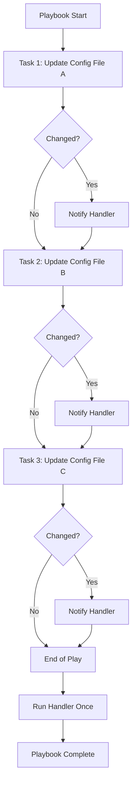
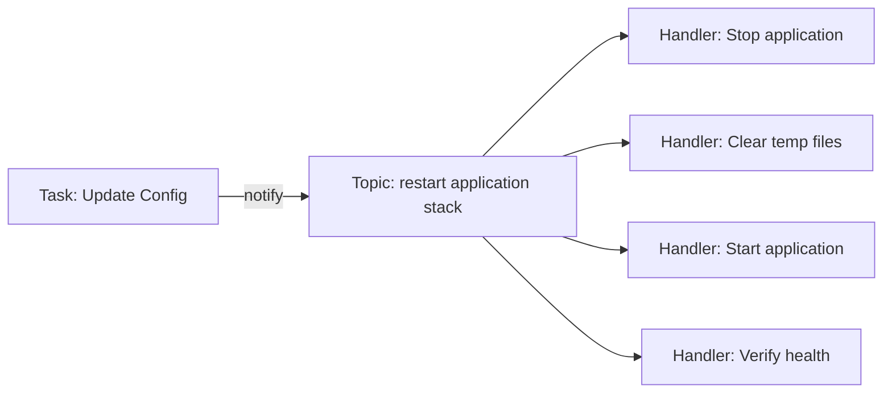

# How to Handle Ansible Handlers and Notifications

Author: [nawazdhandala](https://www.github.com/nawazdhandala)

Tags: Ansible, Automation, Configuration Management, DevOps, Infrastructure as Code, Handlers

Description: Learn how to use Ansible handlers and notifications to trigger actions only when changes occur, optimizing your playbook execution and service restarts.

---

> Ansible handlers provide a powerful mechanism for triggering actions only when changes occur. Understanding handlers and notifications is essential for writing efficient playbooks that avoid unnecessary service restarts and system disruptions.

Handlers are special tasks that run only when notified by other tasks. This pattern is particularly useful for operations like restarting services after configuration changes, where you want the restart to happen once at the end of all changes rather than after each individual modification.

---

## Understanding Handlers vs Regular Tasks

The key difference between handlers and regular tasks is when they execute:



Regular tasks execute sequentially during the play. Handlers execute once at the end of the play, even if notified multiple times.

---

## Basic Handler Syntax

Here is a simple example showing how handlers work with the notify directive:

```yaml
# playbook.yml
# Basic handler example demonstrating the notify mechanism
---
- name: Configure web server
  hosts: webservers
  become: yes

  tasks:
    # This task updates the nginx configuration
    # The notify directive triggers the handler only if the task makes changes
    - name: Update nginx configuration
      ansible.builtin.template:
        src: nginx.conf.j2
        dest: /etc/nginx/nginx.conf
        owner: root
        group: root
        mode: '0644'
      notify: Restart nginx

    # This task updates the virtual host configuration
    # It notifies the same handler as the previous task
    - name: Update virtual host configuration
      ansible.builtin.template:
        src: vhost.conf.j2
        dest: /etc/nginx/sites-available/mysite.conf
        owner: root
        group: root
        mode: '0644'
      notify: Restart nginx

  handlers:
    # This handler runs only once at the end of the play
    # It executes even if both tasks above triggered notifications
    - name: Restart nginx
      ansible.builtin.service:
        name: nginx
        state: restarted
```

In this example, even if both configuration tasks make changes, the nginx service restarts only once at the end of the play.

---

## Handler Execution Order

Handlers run in the order they are defined in the handlers section, not the order they are notified:

```yaml
# playbook.yml
# Demonstrating handler execution order
---
- name: Configure application stack
  hosts: appservers
  become: yes

  tasks:
    - name: Update application config
      ansible.builtin.template:
        src: app.conf.j2
        dest: /etc/myapp/app.conf
      # Notify handlers in a specific order using a list
      notify:
        - Reload application
        - Clear cache

    - name: Update database config
      ansible.builtin.template:
        src: db.conf.j2
        dest: /etc/myapp/db.conf
      notify:
        - Reload application

  handlers:
    # Handlers execute in the order defined here, not notification order
    # Clear cache runs first because it is defined first
    - name: Clear cache
      ansible.builtin.command: /usr/local/bin/clear-cache.sh

    # Reload application runs second
    - name: Reload application
      ansible.builtin.service:
        name: myapp
        state: reloaded
```

---

## Notifying Multiple Handlers

A single task can notify multiple handlers using a list:

```yaml
# playbook.yml
# Notifying multiple handlers from a single task
---
- name: Update web application
  hosts: webservers
  become: yes

  tasks:
    - name: Deploy new application code
      ansible.builtin.git:
        repo: https://github.com/example/myapp.git
        dest: /var/www/myapp
        version: main
      # Notify multiple handlers when code is deployed
      # Each handler in the list will run once at the end of the play
      notify:
        - Run database migrations
        - Clear application cache
        - Restart application server
        - Reload nginx

  handlers:
    - name: Run database migrations
      ansible.builtin.command:
        cmd: python manage.py migrate
        chdir: /var/www/myapp

    - name: Clear application cache
      ansible.builtin.command:
        cmd: python manage.py clear_cache
        chdir: /var/www/myapp

    - name: Restart application server
      ansible.builtin.service:
        name: gunicorn
        state: restarted

    - name: Reload nginx
      ansible.builtin.service:
        name: nginx
        state: reloaded
```

---

## Using Listen for Handler Groups

The `listen` directive allows multiple handlers to respond to a single notification topic:

```yaml
# playbook.yml
# Using listen to group handlers under a common topic
---
- name: Configure and deploy application
  hosts: appservers
  become: yes

  tasks:
    - name: Update application configuration
      ansible.builtin.template:
        src: app.conf.j2
        dest: /etc/myapp/app.conf
      # Notify a topic instead of individual handlers
      # All handlers listening to this topic will execute
      notify: restart application stack

  handlers:
    # Multiple handlers can listen to the same topic
    # They will all execute when the topic is notified

    - name: Stop application gracefully
      ansible.builtin.command: /usr/local/bin/stop-app.sh
      listen: restart application stack

    - name: Clear temporary files
      ansible.builtin.file:
        path: /var/tmp/myapp
        state: absent
      listen: restart application stack

    - name: Start application
      ansible.builtin.service:
        name: myapp
        state: started
      listen: restart application stack

    - name: Verify application health
      ansible.builtin.uri:
        url: http://localhost:8080/health
        status_code: 200
      listen: restart application stack
```



---

## Forcing Handler Execution

Sometimes you need handlers to run immediately rather than at the end of the play. Use `meta: flush_handlers`:

```yaml
# playbook.yml
# Forcing handlers to run at a specific point
---
- name: Configure and verify service
  hosts: servers
  become: yes

  tasks:
    - name: Update primary configuration
      ansible.builtin.template:
        src: primary.conf.j2
        dest: /etc/myservice/primary.conf
      notify: Restart service

    - name: Update secondary configuration
      ansible.builtin.template:
        src: secondary.conf.j2
        dest: /etc/myservice/secondary.conf
      notify: Restart service

    # Force all pending handlers to run now
    # This ensures the service is restarted before verification
    - name: Flush handlers to restart service now
      ansible.builtin.meta: flush_handlers

    # This task runs after the service has been restarted
    # Without flush_handlers, this would run before the restart
    - name: Verify service is running
      ansible.builtin.uri:
        url: http://localhost:8080/status
        status_code: 200
        timeout: 30
      register: health_check
      retries: 5
      delay: 10
      until: health_check.status == 200

    - name: Continue with additional configuration
      ansible.builtin.template:
        src: additional.conf.j2
        dest: /etc/myservice/additional.conf
      notify: Restart service

  handlers:
    - name: Restart service
      ansible.builtin.service:
        name: myservice
        state: restarted
```

---

## Handlers with Changed When

Control when handlers are notified using `changed_when`:

```yaml
# playbook.yml
# Using changed_when to control handler notifications
---
- name: Manage application deployment
  hosts: appservers
  become: yes

  tasks:
    # Check current version without making changes
    - name: Get current application version
      ansible.builtin.command: cat /var/www/myapp/VERSION
      register: current_version
      # This command never reports as changed
      changed_when: false

    # Deploy only if version differs
    - name: Deploy new application version
      ansible.builtin.unarchive:
        src: "https://releases.example.com/myapp-{{ new_version }}.tar.gz"
        dest: /var/www/myapp
        remote_src: yes
      # Only report changed and notify handler if version actually changed
      changed_when: current_version.stdout != new_version
      notify: Restart application
      when: current_version.stdout != new_version

    # Run a script and determine change based on output
    - name: Update system packages
      ansible.builtin.shell: |
        apt-get update && apt-get upgrade -y
      register: upgrade_result
      # Notify handler only if packages were actually upgraded
      changed_when: "'0 upgraded' not in upgrade_result.stdout"
      notify: Reboot if required

  handlers:
    - name: Restart application
      ansible.builtin.service:
        name: myapp
        state: restarted

    - name: Reboot if required
      ansible.builtin.reboot:
        reboot_timeout: 300
      when: ansible_facts['os_family'] == 'Debian'
```

---

## Handlers in Roles

When using roles, handlers are typically defined in `handlers/main.yml`:

```
# Role directory structure
myapp_role/
├── tasks/
│   └── main.yml
├── handlers/
│   └── main.yml
├── templates/
│   └── config.conf.j2
└── defaults/
    └── main.yml
```

```yaml
# roles/myapp_role/tasks/main.yml
# Tasks that may trigger handlers
---
- name: Install application packages
  ansible.builtin.package:
    name: "{{ myapp_packages }}"
    state: present
  notify: Enable myapp service

- name: Configure application
  ansible.builtin.template:
    src: config.conf.j2
    dest: /etc/myapp/config.conf
    owner: root
    group: myapp
    mode: '0640'
  notify: Restart myapp

- name: Configure logging
  ansible.builtin.template:
    src: logging.conf.j2
    dest: /etc/myapp/logging.conf
    owner: root
    group: myapp
    mode: '0640'
  notify: Reload myapp
```

```yaml
# roles/myapp_role/handlers/main.yml
# Handler definitions for the role
---
- name: Enable myapp service
  ansible.builtin.service:
    name: myapp
    enabled: yes

- name: Restart myapp
  ansible.builtin.service:
    name: myapp
    state: restarted

- name: Reload myapp
  ansible.builtin.service:
    name: myapp
    state: reloaded
```

---

## Handling Handler Failures

By default, handler failures stop playbook execution. Use `ignore_errors` or blocks for error handling:

```yaml
# playbook.yml
# Handling potential handler failures gracefully
---
- name: Update services with error handling
  hosts: servers
  become: yes

  tasks:
    - name: Update service configuration
      ansible.builtin.template:
        src: service.conf.j2
        dest: /etc/myservice/config.conf
      notify: Restart service with fallback

  handlers:
    # Primary restart handler with error handling
    - name: Restart service with fallback
      block:
        - name: Attempt graceful restart
          ansible.builtin.service:
            name: myservice
            state: restarted
          register: restart_result

      rescue:
        # If graceful restart fails, try force restart
        - name: Force restart service
          ansible.builtin.command: systemctl reset-failed myservice && systemctl restart myservice
          register: force_restart

        - name: Log restart failure
          ansible.builtin.debug:
            msg: "Service required force restart: {{ force_restart }}"

      always:
        # Always verify service is running
        - name: Verify service status
          ansible.builtin.service:
            name: myservice
            state: started
          register: service_status
```

---

## Conditional Handler Execution

Use `when` conditions in handlers for conditional execution:

```yaml
# playbook.yml
# Conditional handler execution based on facts and variables
---
- name: Configure multi-platform services
  hosts: all
  become: yes

  tasks:
    - name: Update configuration file
      ansible.builtin.template:
        src: "{{ ansible_os_family | lower }}.conf.j2"
        dest: /etc/myservice/config.conf
      notify:
        - Restart service on Debian
        - Restart service on RedHat
        - Restart service on Windows

  handlers:
    # Handler runs only on Debian-based systems
    - name: Restart service on Debian
      ansible.builtin.service:
        name: myservice
        state: restarted
      when: ansible_os_family == 'Debian'

    # Handler runs only on RedHat-based systems
    - name: Restart service on RedHat
      ansible.builtin.service:
        name: myservice
        state: restarted
      when: ansible_os_family == 'RedHat'

    # Handler runs only on Windows systems
    - name: Restart service on Windows
      ansible.windows.win_service:
        name: myservice
        state: restarted
      when: ansible_os_family == 'Windows'
```

---

## Handler Best Practices

### 1. Use Descriptive Handler Names

```yaml
# Good: Clear and descriptive
handlers:
  - name: Restart nginx after config change
    ansible.builtin.service:
      name: nginx
      state: restarted

# Avoid: Generic names
handlers:
  - name: restart
    ansible.builtin.service:
      name: nginx
      state: restarted
```

### 2. Prefer Reload Over Restart When Possible

```yaml
handlers:
  # Use reload for configuration changes when supported
  # Reload is less disruptive than restart
  - name: Reload nginx configuration
    ansible.builtin.service:
      name: nginx
      state: reloaded

  # Reserve restart for changes that require it
  - name: Restart nginx for module changes
    ansible.builtin.service:
      name: nginx
      state: restarted
```

### 3. Chain Handlers for Complex Operations

```yaml
handlers:
  # First handler stops the service
  - name: Stop application
    ansible.builtin.service:
      name: myapp
      state: stopped
    notify: Clear application cache

  # Second handler clears cache after stop
  - name: Clear application cache
    ansible.builtin.file:
      path: /var/cache/myapp
      state: absent
    notify: Start application

  # Third handler starts the service
  - name: Start application
    ansible.builtin.service:
      name: myapp
      state: started
```

---

## Common Handler Patterns

### Pattern 1: Service Management

```yaml
handlers:
  # Standard service restart with status check
  - name: Restart and verify service
    block:
      - name: Restart service
        ansible.builtin.service:
          name: "{{ service_name }}"
          state: restarted

      - name: Wait for service to be ready
        ansible.builtin.wait_for:
          port: "{{ service_port }}"
          delay: 5
          timeout: 60
```

### Pattern 2: Configuration Validation Before Restart

```yaml
handlers:
  - name: Validate and restart nginx
    block:
      # Validate configuration before attempting restart
      - name: Test nginx configuration
        ansible.builtin.command: nginx -t
        changed_when: false

      # Only restart if configuration is valid
      - name: Restart nginx
        ansible.builtin.service:
          name: nginx
          state: restarted
```

### Pattern 3: Rolling Restart with Serial

```yaml
# playbook.yml
# Rolling restart pattern for high availability
---
- name: Update web servers with rolling restart
  hosts: webservers
  become: yes
  # Process one server at a time
  serial: 1

  tasks:
    - name: Update configuration
      ansible.builtin.template:
        src: config.conf.j2
        dest: /etc/myapp/config.conf
      notify: Rolling restart

  handlers:
    - name: Rolling restart
      block:
        - name: Remove from load balancer
          ansible.builtin.uri:
            url: "http://{{ lb_api }}/remove/{{ inventory_hostname }}"
            method: POST

        - name: Restart application
          ansible.builtin.service:
            name: myapp
            state: restarted

        - name: Wait for application health
          ansible.builtin.uri:
            url: http://localhost:8080/health
            status_code: 200
          retries: 10
          delay: 5

        - name: Add back to load balancer
          ansible.builtin.uri:
            url: "http://{{ lb_api }}/add/{{ inventory_hostname }}"
            method: POST
```

---

## Troubleshooting Handlers

### Handler Not Running

If a handler is not executing, check these common issues:

```yaml
# Problem: Typo in handler name
- name: Update config
  ansible.builtin.template:
    src: config.j2
    dest: /etc/app/config
  notify: Restart app  # Typo: should be "Restart application"

handlers:
  - name: Restart application
    ansible.builtin.service:
      name: app
      state: restarted

# Solution: Use ansible-lint to catch notify/handler mismatches
# Run: ansible-lint playbook.yml
```

### Handler Running Multiple Times

```yaml
# Problem: Handler defined in multiple places
# When importing roles that define the same handler

# Solution: Use listen to consolidate
handlers:
  - name: Restart application from role a
    ansible.builtin.service:
      name: app
      state: restarted
    listen: restart app

  - name: Restart application from role b
    ansible.builtin.service:
      name: app
      state: restarted
    listen: restart app
```

---

## Conclusion

Ansible handlers and notifications provide an elegant way to manage actions that should only occur when changes are made. Key takeaways:

- Handlers run once at the end of the play, regardless of how many times they are notified
- Use `listen` to group multiple handlers under a common notification topic
- Use `meta: flush_handlers` when you need handlers to run at a specific point
- Prefer `reload` over `restart` when the service supports it
- Always validate configuration before restarting services
- Use blocks in handlers for complex operations with error handling

Mastering handlers will help you write more efficient playbooks that minimize service disruptions while ensuring configuration changes are properly applied.

---

*Looking for comprehensive infrastructure monitoring? [OneUptime](https://oneuptime.com) provides real-time monitoring, alerting, and incident management for your Ansible-managed infrastructure.*

**Related Reading:**
- [How to Configure Ansible Collections](/blog/post/2026-01-24-ansible-collections-configuration/view)
- [How to Handle Ansible Block Error Handling](/blog/post/2026-01-24-ansible-block-error-handling/view)
