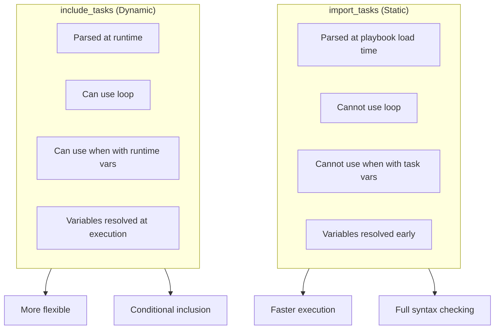
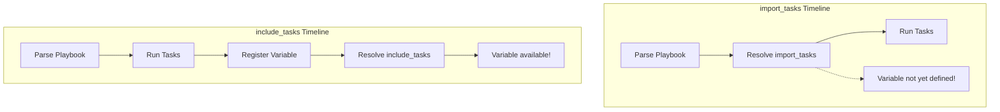
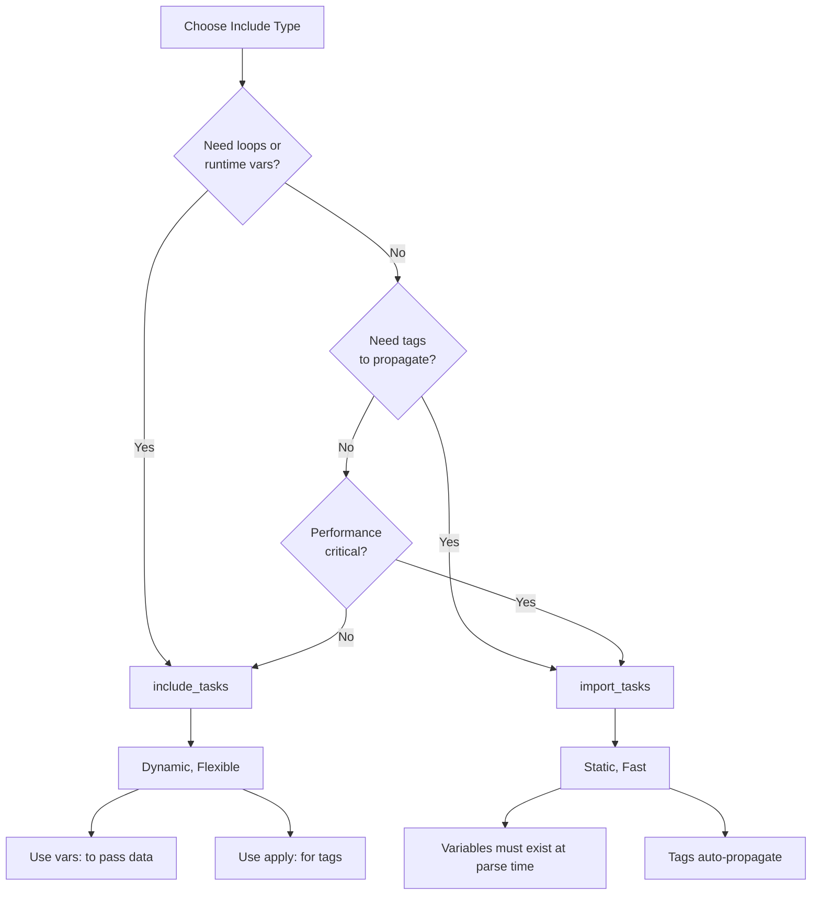

# How to Fix "Include Tasks" Import Errors

Author: [nawazdhandala](https://www.github.com/nawazdhandala)

Tags: Ansible, Debugging, Include Tasks, Import Tasks, Automation, DevOps, Troubleshooting

Description: Learn how to diagnose and fix common Ansible include_tasks and import_tasks errors, including path issues, variable scope problems, and dynamic inclusion failures.

---

Ansible provides `include_tasks` and `import_tasks` for modular playbook organization. When these fail, error messages can be cryptic. This guide covers the most common errors and their solutions.

## Include vs Import: Key Differences

Understanding the difference prevents most errors.



```yaml
# import_tasks - static, processed at parse time
- import_tasks: setup.yml
  # Tags apply to all tasks in setup.yml
  tags: setup

# include_tasks - dynamic, processed at runtime
- include_tasks: setup.yml
  # Can use runtime variables
  when: do_setup | bool
```

## Error 1: File Not Found

**The Problem:**

```yaml
- name: Include common tasks
  ansible.builtin.include_tasks: common.yml
```

Error message:
```
ERROR! Could not find or access 'common.yml'
```

**The Fix:**

Ansible looks for included files relative to the current file's location or the roles path.

```yaml
---
# Option 1: Use absolute path from playbook directory
- name: Include from playbook directory
  ansible.builtin.include_tasks: "{{ playbook_dir }}/tasks/common.yml"

# Option 2: Use role-relative path
- name: Include from role's tasks directory
  ansible.builtin.include_tasks: "{{ role_path }}/tasks/common.yml"

# Option 3: Use relative path correctly
# If playbook is at /playbooks/main.yml
# And tasks file is at /playbooks/tasks/common.yml
- name: Include with correct relative path
  ansible.builtin.include_tasks: tasks/common.yml

# Option 4: For files in the same directory
- name: Include sibling file
  ansible.builtin.include_tasks: "{{ ansible_parent_role_paths | first }}/tasks/common.yml"
  when: ansible_parent_role_paths is defined
```

### Directory Structure Reference

```
project/
  playbooks/
    main.yml              # include_tasks: tasks/setup.yml
    tasks/
      setup.yml
  roles/
    myrole/
      tasks/
        main.yml          # include_tasks: install.yml (same dir)
        install.yml
        configure.yml
      files/
      templates/
```

## Error 2: Variable Undefined in Included File

**The Problem:**

```yaml
# main.yml
- name: Set application name
  ansible.builtin.set_fact:
    app_name: myapp

- name: Include install tasks
  ansible.builtin.include_tasks: install.yml
```

```yaml
# install.yml
- name: Install package
  ansible.builtin.package:
    name: "{{ app_name }}"  # ERROR: undefined
```

Error message:
```
The task includes an option with an undefined variable. The error was: 'app_name' is undefined
```

**The Fix:**

Pass variables explicitly when including tasks:

```yaml
---
# Option 1: Pass variables with vars
- name: Include install tasks
  ansible.builtin.include_tasks: install.yml
  vars:
    app_name: myapp
    app_version: "1.0.0"

# Option 2: Use set_fact before include (for dynamic values)
- name: Calculate app name
  ansible.builtin.set_fact:
    app_name: "myapp-{{ environment }}"

- name: Include install tasks
  ansible.builtin.include_tasks: install.yml

# Option 3: For import_tasks, use vars file
- name: Load variables
  ansible.builtin.include_vars: app_vars.yml

- name: Import install tasks
  ansible.builtin.import_tasks: install.yml
```

## Error 3: Loop with import_tasks

**The Problem:**

```yaml
- name: Import tasks for each service
  ansible.builtin.import_tasks: "{{ item }}.yml"
  loop:
    - nginx
    - postgresql
    - redis
```

Error message:
```
ERROR! You cannot use 'loop' with 'import_tasks'
```

**The Fix:**

Use `include_tasks` for loops, not `import_tasks`:

```yaml
---
# Correct: Use include_tasks with loop
- name: Include tasks for each service
  ansible.builtin.include_tasks: "{{ item }}.yml"
  loop:
    - nginx
    - postgresql
    - redis

# Or with loop_control for better output
- name: Include service tasks
  ansible.builtin.include_tasks: "{{ service }}.yml"
  loop:
    - nginx
    - postgresql
    - redis
  loop_control:
    loop_var: service
    label: "{{ service }}"
```

## Error 4: Conditional Import with Runtime Variables

**The Problem:**

```yaml
- name: Get OS version
  ansible.builtin.command: cat /etc/os-release
  register: os_info

- name: Import OS-specific tasks
  ansible.builtin.import_tasks: "{{ os_type }}.yml"
  when: os_info.stdout is search('Ubuntu')
  vars:
    os_type: ubuntu
```

Error message:
```
ERROR! 'os_info' is undefined
```

**The Fix:**

Import_tasks is processed before tasks run, so registered variables are not available. Use include_tasks instead:

```yaml
---
# Correct: Use include_tasks for runtime conditionals
- name: Get OS information
  ansible.builtin.setup:
    filter: ansible_distribution*

- name: Include OS-specific tasks
  ansible.builtin.include_tasks: "{{ ansible_distribution | lower }}.yml"
  when: ansible_distribution in ['Ubuntu', 'Debian', 'CentOS', 'Rocky']
```



## Error 5: Tags Not Applied to Included Tasks

**The Problem:**

```yaml
- name: Include setup tasks
  ansible.builtin.include_tasks: setup.yml
  tags: setup

# Running with --tags setup does not run setup.yml tasks
```

**The Fix:**

With `include_tasks`, tags on the include statement only determine if the include runs, not the tasks inside. Use `apply` or `import_tasks`:

```yaml
---
# Option 1: Use apply to inherit tags
- name: Include setup tasks
  ansible.builtin.include_tasks:
    file: setup.yml
    apply:
      tags:
        - setup
        - configuration
  tags:
    - setup
    - configuration

# Option 2: Use import_tasks for tag inheritance
- name: Import setup tasks
  ansible.builtin.import_tasks: setup.yml
  tags: setup  # Tags automatically apply to all imported tasks

# Option 3: Tag tasks inside the included file
# setup.yml
- name: Setup task 1
  ansible.builtin.command: echo "setup"
  tags: setup

- name: Setup task 2
  ansible.builtin.command: echo "setup"
  tags: setup
```

## Error 6: Handler Include Fails

**The Problem:**

```yaml
# handlers/main.yml
- name: Include common handlers
  ansible.builtin.include_tasks: common_handlers.yml
```

Error message:
```
ERROR! no action detected in task
```

**The Fix:**

Use `import_tasks` for handlers, or include a handlers file:

```yaml
---
# Option 1: Use import_tasks in handlers
# handlers/main.yml
- import_tasks: common_handlers.yml

# Option 2: Use include_tasks with listen
# handlers/main.yml
- name: Include restart handlers
  ansible.builtin.include_tasks: restart_handlers.yml
  listen: "restart all services"

# Then notify the listener
# tasks/main.yml
- name: Update config
  ansible.builtin.template:
    src: config.j2
    dest: /etc/app/config
  notify: "restart all services"
```

## Error 7: Nested Include Depth Issues

**The Problem:**

```yaml
# main.yml includes setup.yml
# setup.yml includes packages.yml
# packages.yml includes repos.yml
# repos.yml references {{ item }} from main.yml loop
```

Error message:
```
'item' is undefined
```

**The Fix:**

Use `loop_control` to preserve loop variables across includes:

```yaml
---
# main.yml
- name: Setup each environment
  ansible.builtin.include_tasks: setup.yml
  loop:
    - dev
    - staging
    - prod
  loop_control:
    loop_var: env_name  # Unique name prevents collision

# setup.yml
- name: Include packages for environment
  ansible.builtin.include_tasks: packages.yml
  vars:
    environment: "{{ env_name }}"

# packages.yml
- name: Install packages
  ansible.builtin.package:
    name: "{{ item }}"
    state: present
  loop: "{{ packages[environment] }}"
  # 'item' here is different from outer 'env_name'
```

## Error 8: File Path with Special Characters

**The Problem:**

```yaml
- name: Include tasks for host
  ansible.builtin.include_tasks: "hosts/{{ inventory_hostname }}.yml"
```

Error message:
```
ERROR! Could not find or access 'hosts/web-server-01.example.com.yml'
```

**The Fix:**

Sanitize the filename or use a lookup:

```yaml
---
# Option 1: Sanitize the filename
- name: Include host-specific tasks
  ansible.builtin.include_tasks: "hosts/{{ inventory_hostname | regex_replace('\\.', '_') }}.yml"

# Option 2: Use a mapping variable
- name: Set host task file
  ansible.builtin.set_fact:
    host_tasks_file: "{{ host_task_mapping[inventory_hostname] | default('default.yml') }}"

- name: Include host tasks
  ansible.builtin.include_tasks: "hosts/{{ host_tasks_file }}"

# Option 3: Check if file exists first
- name: Check for host-specific tasks
  ansible.builtin.stat:
    path: "{{ playbook_dir }}/hosts/{{ inventory_hostname }}.yml"
  register: host_tasks
  delegate_to: localhost

- name: Include host tasks if exists
  ansible.builtin.include_tasks: "hosts/{{ inventory_hostname }}.yml"
  when: host_tasks.stat.exists
```

## Error 9: Circular Include

**The Problem:**

```yaml
# a.yml
- include_tasks: b.yml

# b.yml
- include_tasks: a.yml
```

Error message:
```
ERROR! recursive loop detected in included file
```

**The Fix:**

Restructure tasks to avoid circular dependencies:

```yaml
---
# shared.yml - common tasks
- name: Shared task
  ansible.builtin.debug:
    msg: "Common logic"

# a.yml
- name: Include shared tasks
  ansible.builtin.include_tasks: shared.yml

- name: A-specific tasks
  ansible.builtin.debug:
    msg: "Task A logic"

# b.yml
- name: Include shared tasks
  ansible.builtin.include_tasks: shared.yml

- name: B-specific tasks
  ansible.builtin.debug:
    msg: "Task B logic"
```

## Error 10: Include with Blocks

**The Problem:**

```yaml
- name: Error handling block
  block:
    - include_tasks: risky_tasks.yml
  rescue:
    - include_tasks: recovery.yml
```

Error message may vary, but includes often behave unexpectedly in blocks.

**The Fix:**

Use import_tasks in blocks for predictable behavior:

```yaml
---
# Option 1: Import in blocks
- name: Error handling block
  block:
    - ansible.builtin.import_tasks: risky_tasks.yml
  rescue:
    - ansible.builtin.import_tasks: recovery.yml

# Option 2: Wrap includes in a named task
- name: Error handling block
  block:
    - name: Run risky tasks
      ansible.builtin.include_tasks: risky_tasks.yml
  rescue:
    - name: Run recovery
      ansible.builtin.include_tasks: recovery.yml
  always:
    - name: Cleanup
      ansible.builtin.include_tasks: cleanup.yml
```

## Debugging Include Errors

### Enable Verbose Output

```bash
# Run with verbosity to see include resolution
ansible-playbook playbook.yml -vvv

# Check syntax without running
ansible-playbook playbook.yml --syntax-check

# List tasks that would run
ansible-playbook playbook.yml --list-tasks
```

### Check Include Paths

```yaml
---
- name: Debug include paths
  ansible.builtin.debug:
    msg:
      - "playbook_dir: {{ playbook_dir }}"
      - "role_path: {{ role_path | default('N/A') }}"
      - "ansible_search_path: {{ lookup('config', 'DEFAULT_ROLES_PATH') }}"

- name: Check if file exists
  ansible.builtin.stat:
    path: "{{ playbook_dir }}/tasks/target.yml"
  register: file_check
  delegate_to: localhost

- name: Show file status
  ansible.builtin.debug:
    var: file_check.stat.exists
```

## Best Practices Summary



```yaml
---
# Best practice example
- name: Production playbook with proper includes
  hosts: all
  vars_files:
    - vars/common.yml

  pre_tasks:
    # Use import for static setup
    - name: Import prerequisite checks
      ansible.builtin.import_tasks: tasks/prerequisites.yml
      tags: prerequisites

  tasks:
    # Use include for dynamic, conditional tasks
    - name: Include OS-specific tasks
      ansible.builtin.include_tasks:
        file: "tasks/{{ ansible_os_family | lower }}.yml"
        apply:
          tags:
            - os-config
      tags:
        - os-config
      vars:
        os_config_strict: true

    # Use include for loops
    - name: Include per-service tasks
      ansible.builtin.include_tasks: "tasks/services/{{ service }}.yml"
      loop: "{{ services }}"
      loop_control:
        loop_var: service
        label: "{{ service }}"
      vars:
        service_user: "{{ service }}-user"

  handlers:
    # Use import for handlers (processed at parse time)
    - name: Import common handlers
      ansible.builtin.import_tasks: handlers/common.yml
```

---

The key to avoiding include/import errors is understanding when each is evaluated. Use `import_tasks` for static, known-at-parse-time includes with tag propagation. Use `include_tasks` for dynamic, runtime-conditional includes with loops. When in doubt, start with `include_tasks` since it is more forgiving of runtime conditions.
