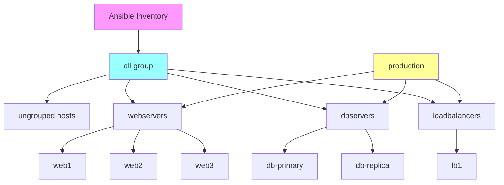
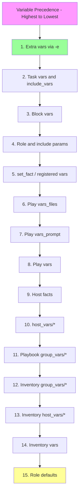

# How to Configure Ansible Inventory Groups

Author: [nawazdhandala](https://www.github.com/nawazdhandala)

Tags: Ansible, Inventory, DevOps, Configuration Management, Automation, Infrastructure, Best Practices

Description: Learn how to organize and configure Ansible inventory groups for efficient infrastructure management including nested groups, variables, and dynamic inventories.

---

Ansible inventory groups are the foundation of organized infrastructure automation. By properly structuring your hosts into logical groups, you can target specific servers, apply group-specific variables, and create scalable automation workflows. This guide covers everything from basic grouping to advanced inventory patterns.

## Understanding Ansible Inventory Structure

The inventory defines which hosts Ansible manages and how they are organized.



## Basic Inventory Configuration

### INI Format Inventory

```ini
# inventory/hosts.ini
# Basic inventory using INI format

# Ungrouped hosts (part of 'all' but no specific group)
192.168.1.5
standalone.example.com

# Web server group
[webservers]
web1.example.com
web2.example.com
192.168.1.10
192.168.1.11

# Database server group
[dbservers]
db-primary.example.com ansible_host=192.168.1.20
db-replica.example.com ansible_host=192.168.1.21

# Cache server group
[cacheservers]
redis1.example.com
redis2.example.com

# Load balancer group
[loadbalancers]
lb1.example.com
lb2.example.com
```

### YAML Format Inventory

```yaml
# inventory/hosts.yml
# Basic inventory using YAML format

all:
  hosts:
    # Ungrouped hosts
    standalone.example.com:
    192.168.1.5:

  children:
    webservers:
      hosts:
        web1.example.com:
        web2.example.com:
        192.168.1.10:
        192.168.1.11:

    dbservers:
      hosts:
        db-primary.example.com:
          ansible_host: 192.168.1.20
        db-replica.example.com:
          ansible_host: 192.168.1.21

    cacheservers:
      hosts:
        redis1.example.com:
        redis2.example.com:

    loadbalancers:
      hosts:
        lb1.example.com:
        lb2.example.com:
```

## Nested Groups (Children Groups)

Create hierarchical group structures for better organization.

### INI Format Nested Groups

```ini
# inventory/production.ini
# Nested groups using INI format

[webservers]
web1.prod.example.com
web2.prod.example.com
web3.prod.example.com

[appservers]
app1.prod.example.com
app2.prod.example.com

[dbservers]
db-primary.prod.example.com
db-replica1.prod.example.com
db-replica2.prod.example.com

[cacheservers]
redis1.prod.example.com
redis2.prod.example.com

# Group of groups - frontend tier
[frontend:children]
webservers
loadbalancers

# Group of groups - backend tier
[backend:children]
appservers
dbservers
cacheservers

# Group of groups - all production servers
[production:children]
frontend
backend

# Variables for all production servers
[production:vars]
environment=production
monitoring_enabled=true
```

### YAML Format Nested Groups

```yaml
# inventory/production.yml
# Nested groups using YAML format

all:
  children:
    # First level groups
    webservers:
      hosts:
        web1.prod.example.com:
        web2.prod.example.com:
        web3.prod.example.com:

    appservers:
      hosts:
        app1.prod.example.com:
        app2.prod.example.com:

    dbservers:
      hosts:
        db-primary.prod.example.com:
          mysql_role: primary
        db-replica1.prod.example.com:
          mysql_role: replica
        db-replica2.prod.example.com:
          mysql_role: replica

    cacheservers:
      hosts:
        redis1.prod.example.com:
        redis2.prod.example.com:

    loadbalancers:
      hosts:
        lb1.prod.example.com:
        lb2.prod.example.com:

    # Nested groups - tier-based
    frontend:
      children:
        webservers:
        loadbalancers:

    backend:
      children:
        appservers:
        dbservers:
        cacheservers:

    # Top-level environment group
    production:
      children:
        frontend:
        backend:
      vars:
        environment: production
        monitoring_enabled: true
```

## Group Variables

### Inline Group Variables

```ini
# inventory/hosts.ini
# Group variables in INI format

[webservers]
web1.example.com
web2.example.com

[webservers:vars]
http_port=80
nginx_worker_processes=4
document_root=/var/www/html

[dbservers]
db1.example.com
db2.example.com

[dbservers:vars]
mysql_port=3306
mysql_max_connections=200
backup_enabled=true
```

```yaml
# inventory/hosts.yml
# Group variables in YAML format

all:
  children:
    webservers:
      hosts:
        web1.example.com:
        web2.example.com:
      vars:
        http_port: 80
        nginx_worker_processes: 4
        document_root: /var/www/html

    dbservers:
      hosts:
        db1.example.com:
        db2.example.com:
      vars:
        mysql_port: 3306
        mysql_max_connections: 200
        backup_enabled: true
```

### Separate Group Variables Files

```
# Recommended directory structure
inventory/
|-- hosts.yml
|-- group_vars/
|   |-- all.yml           # Variables for all hosts
|   |-- webservers.yml    # Variables for webservers group
|   |-- dbservers.yml     # Variables for dbservers group
|   |-- production.yml    # Variables for production group
|   `-- production/
|       |-- vars.yml      # Non-sensitive production vars
|       `-- vault.yml     # Encrypted sensitive vars
`-- host_vars/
    |-- web1.example.com.yml
    `-- db-primary.example.com.yml
```

```yaml
# inventory/group_vars/all.yml
# Variables applied to ALL hosts

---
# SSH settings
ansible_user: ubuntu
ansible_python_interpreter: /usr/bin/python3

# Common packages
common_packages:
  - vim
  - htop
  - curl
  - wget

# NTP servers
ntp_servers:
  - 0.pool.ntp.org
  - 1.pool.ntp.org

# Timezone
timezone: UTC
```

```yaml
# inventory/group_vars/webservers.yml
# Variables for webservers group

---
# Nginx configuration
nginx_worker_processes: auto
nginx_worker_connections: 1024
nginx_keepalive_timeout: 65

# HTTP settings
http_port: 80
https_port: 443
document_root: /var/www/html

# SSL settings
ssl_protocols: "TLSv1.2 TLSv1.3"
ssl_ciphers: "ECDHE-ECDSA-AES128-GCM-SHA256:ECDHE-RSA-AES128-GCM-SHA256"

# Logging
access_log_path: /var/log/nginx/access.log
error_log_path: /var/log/nginx/error.log
```

```yaml
# inventory/group_vars/dbservers.yml
# Variables for dbservers group

---
# MySQL configuration
mysql_port: 3306
mysql_bind_address: 0.0.0.0
mysql_max_connections: 200
mysql_innodb_buffer_pool_size: 1G

# Backup configuration
backup_enabled: true
backup_schedule: "0 2 * * *"
backup_retention_days: 7
backup_directory: /var/backups/mysql
```

```yaml
# inventory/group_vars/production/vars.yml
# Production-specific variables (non-sensitive)

---
environment: production
log_level: warn
debug_mode: false
monitoring_enabled: true
alerting_enabled: true
```

```yaml
# inventory/group_vars/production/vault.yml
# Encrypted with ansible-vault
# Create with: ansible-vault create inventory/group_vars/production/vault.yml

---
vault_mysql_root_password: "super_secret_password"
vault_api_key: "production_api_key_12345"
vault_ssl_certificate_passphrase: "cert_passphrase"
```

## Host Variables

```yaml
# inventory/host_vars/web1.example.com.yml
# Variables specific to a single host

---
# Override group defaults for this host
nginx_worker_processes: 8
nginx_worker_connections: 2048

# Host-specific settings
server_role: primary_web
virtual_hosts:
  - domain: app.example.com
    root: /var/www/app
    ssl: true
  - domain: api.example.com
    root: /var/www/api
    ssl: true

# Custom monitoring
custom_metrics:
  - name: active_connections
    command: "ss -s | grep estab"
```

```yaml
# inventory/host_vars/db-primary.example.com.yml
# Variables for primary database server

---
mysql_role: primary
mysql_server_id: 1
mysql_log_bin: true
mysql_binlog_format: ROW

# Replication settings
replication_enabled: true
replica_hosts:
  - db-replica1.example.com
  - db-replica2.example.com
```

## Variable Precedence

Ansible variables have a specific order of precedence.



## Inventory Patterns and Targeting

### Common Patterns

```bash
# Target all hosts
ansible all -m ping

# Target a specific group
ansible webservers -m ping

# Target multiple groups (OR)
ansible webservers:dbservers -m ping

# Target intersection of groups (AND)
ansible 'webservers:&production' -m ping

# Exclude a group
ansible 'all:!dbservers' -m ping

# Complex pattern: production webservers except web3
ansible 'webservers:&production:!web3.example.com' -m ping

# Target by regex
ansible '~web.*\.prod\.example\.com' -m ping

# Target by range (INI format allows ranges)
ansible 'web[1:3].example.com' -m ping

# Target first/last hosts in a group
ansible 'webservers[0]' -m ping    # First host
ansible 'webservers[-1]' -m ping   # Last host
ansible 'webservers[0:2]' -m ping  # First three hosts
```

### Using Patterns in Playbooks

```yaml
# playbooks/targeted-deployment.yml
---
# Deploy to production web servers only
- name: Deploy to Production Web Servers
  hosts: webservers:&production
  become: true
  tasks:
    - name: Deploy application
      debug:
        msg: "Deploying to {{ inventory_hostname }}"

---
# Update all servers except databases
- name: System Update (Non-Database)
  hosts: all:!dbservers
  become: true
  tasks:
    - name: Update packages
      apt:
        update_cache: true
        upgrade: safe

---
# Configure only primary database
- name: Configure Primary Database
  hosts: dbservers
  become: true
  tasks:
    - name: Configure replication
      template:
        src: mysql-primary.cnf.j2
        dest: /etc/mysql/conf.d/replication.cnf
      when: mysql_role == 'primary'
```

## Multiple Environment Inventories

### Directory Structure

```
inventories/
|-- production/
|   |-- hosts.yml
|   |-- group_vars/
|   |   |-- all.yml
|   |   |-- webservers.yml
|   |   `-- dbservers.yml
|   `-- host_vars/
|       `-- web1.prod.example.com.yml
|
|-- staging/
|   |-- hosts.yml
|   |-- group_vars/
|   |   |-- all.yml
|   |   |-- webservers.yml
|   |   `-- dbservers.yml
|   `-- host_vars/
|
`-- development/
    |-- hosts.yml
    |-- group_vars/
    |   `-- all.yml
    `-- host_vars/
```

### Production Inventory

```yaml
# inventories/production/hosts.yml
---
all:
  children:
    webservers:
      hosts:
        web1.prod.example.com:
        web2.prod.example.com:
        web3.prod.example.com:

    dbservers:
      hosts:
        db-primary.prod.example.com:
        db-replica.prod.example.com:

    cacheservers:
      hosts:
        redis1.prod.example.com:
        redis2.prod.example.com:
```

```yaml
# inventories/production/group_vars/all.yml
---
environment: production
domain_suffix: prod.example.com
monitoring_enabled: true
log_level: warn
```

### Staging Inventory

```yaml
# inventories/staging/hosts.yml
---
all:
  children:
    webservers:
      hosts:
        web1.staging.example.com:

    dbservers:
      hosts:
        db1.staging.example.com:

    cacheservers:
      hosts:
        redis1.staging.example.com:
```

```yaml
# inventories/staging/group_vars/all.yml
---
environment: staging
domain_suffix: staging.example.com
monitoring_enabled: true
log_level: debug
```

### Using Environment Inventories

```bash
# Run against production
ansible-playbook -i inventories/production/hosts.yml site.yml

# Run against staging
ansible-playbook -i inventories/staging/hosts.yml site.yml

# Run against development
ansible-playbook -i inventories/development/hosts.yml site.yml
```

## Dynamic Inventory

Dynamic inventories generate host lists from external sources like cloud providers.

### AWS EC2 Dynamic Inventory

```yaml
# inventory/aws_ec2.yml
# AWS EC2 dynamic inventory plugin

plugin: amazon.aws.aws_ec2

# AWS region(s) to query
regions:
  - us-east-1
  - us-west-2

# Filter instances
filters:
  # Only running instances
  instance-state-name: running
  # With specific tag
  "tag:Environment":
    - production
    - staging

# Keyed groups based on tags
keyed_groups:
  # Group by Environment tag
  - key: tags.Environment
    prefix: env
    separator: "_"

  # Group by instance type
  - key: instance_type
    prefix: instance_type

  # Group by availability zone
  - key: placement.availability_zone
    prefix: az

# Compose variables
compose:
  # Use Name tag as hostname
  ansible_host: public_ip_address
  # Set connection user based on AMI
  ansible_user: >-
    
    ubuntu
    
    ec2-user
    
    admin
    

# Group by tags
groups:
  # Create webservers group from Role tag
  webservers: "'webserver' in tags.Role"
  dbservers: "'database' in tags.Role"

# Hostnames preference
hostnames:
  - tag:Name
  - dns-name
  - private-dns-name
```

```bash
# Install AWS collection
ansible-galaxy collection install amazon.aws

# Configure AWS credentials
export AWS_ACCESS_KEY_ID='your_access_key'
export AWS_SECRET_ACCESS_KEY='your_secret_key'

# Test dynamic inventory
ansible-inventory -i inventory/aws_ec2.yml --graph
ansible-inventory -i inventory/aws_ec2.yml --list
```

### Custom Dynamic Inventory Script

```python
#!/usr/bin/env python3
# inventory/custom_inventory.py
# Custom dynamic inventory script

import json
import argparse

def get_inventory():
    """Generate inventory from your data source."""
    # This could fetch from a database, API, or any other source
    inventory = {
        "_meta": {
            "hostvars": {
                "web1.example.com": {
                    "ansible_host": "192.168.1.10",
                    "http_port": 80
                },
                "web2.example.com": {
                    "ansible_host": "192.168.1.11",
                    "http_port": 8080
                },
                "db1.example.com": {
                    "ansible_host": "192.168.1.20",
                    "mysql_port": 3306
                }
            }
        },
        "all": {
            "children": ["webservers", "dbservers"]
        },
        "webservers": {
            "hosts": ["web1.example.com", "web2.example.com"],
            "vars": {
                "nginx_worker_processes": 4
            }
        },
        "dbservers": {
            "hosts": ["db1.example.com"],
            "vars": {
                "mysql_max_connections": 200
            }
        }
    }
    return inventory

def get_host(hostname):
    """Return variables for a specific host."""
    inventory = get_inventory()
    return inventory["_meta"]["hostvars"].get(hostname, {})

def main():
    parser = argparse.ArgumentParser()
    parser.add_argument('--list', action='store_true',
                        help='List all hosts')
    parser.add_argument('--host', type=str,
                        help='Get variables for specific host')
    args = parser.parse_args()

    if args.list:
        print(json.dumps(get_inventory(), indent=2))
    elif args.host:
        print(json.dumps(get_host(args.host), indent=2))
    else:
        parser.print_help()

if __name__ == '__main__':
    main()
```

```bash
# Make the script executable
chmod +x inventory/custom_inventory.py

# Test the dynamic inventory
./inventory/custom_inventory.py --list
./inventory/custom_inventory.py --host web1.example.com

# Use with Ansible
ansible -i inventory/custom_inventory.py all -m ping
```

## Inventory Verification and Debugging

```bash
# List all hosts in inventory
ansible-inventory -i inventory/hosts.yml --list

# Display inventory as a graph
ansible-inventory -i inventory/hosts.yml --graph

# Show graph for specific group
ansible-inventory -i inventory/hosts.yml --graph webservers

# Display host variables
ansible-inventory -i inventory/hosts.yml --host web1.example.com

# Verify inventory syntax
ansible-inventory -i inventory/hosts.yml --list --yaml

# Export inventory to YAML
ansible-inventory -i inventory/hosts.yml --list --yaml > exported_inventory.yml
```

## Best Practices

### 1. Consistent Naming Convention

```yaml
# Use clear, consistent naming
all:
  children:
    # Environment-based groups
    production:
    staging:
    development:

    # Role-based groups
    webservers:
    appservers:
    dbservers:
    cacheservers:
    loadbalancers:

    # Location-based groups
    datacenter_east:
    datacenter_west:
    cloud_aws:
    cloud_gcp:
```

### 2. Use Group Inheritance Wisely

```yaml
# Leverage group inheritance for DRY configuration
all:
  vars:
    ansible_user: ubuntu

  children:
    linux_servers:
      vars:
        ansible_python_interpreter: /usr/bin/python3
      children:
        webservers:
        dbservers:

    windows_servers:
      vars:
        ansible_connection: winrm
      children:
        windows_web:
        windows_app:
```

### 3. Separate Sensitive Data

```yaml
# group_vars/production/vars.yml - non-sensitive
environment: production
log_level: warn

# group_vars/production/vault.yml - encrypted
vault_db_password: "encrypted_password"
vault_api_key: "encrypted_key"
```

### 4. Document Your Inventory

```yaml
# inventory/hosts.yml
# Production Infrastructure Inventory
# Last updated: 2026-01-24
# Contact: ops@example.com
#
# Groups:
#   - webservers: Nginx web servers behind load balancer
#   - appservers: Python application servers
#   - dbservers: MySQL database cluster
#   - cacheservers: Redis cache cluster

all:
  children:
    webservers:
      # Nginx servers serving static content and proxying to appservers
      hosts:
        web1.example.com:  # Primary web server
        web2.example.com:  # Secondary web server
```

## Conclusion

Effective inventory management is crucial for scalable Ansible automation. Key takeaways include:

1. **Choose the right format** - YAML is more readable; INI is simpler for basic setups
2. **Use nested groups** - Create logical hierarchies (environment, tier, location)
3. **Separate variables** - Use group_vars and host_vars directories
4. **Leverage patterns** - Target specific hosts efficiently with patterns
5. **Consider dynamic inventory** - Use plugins for cloud environments
6. **Document everything** - Future you will thank present you

By organizing your inventory thoughtfully, you create a solid foundation for maintainable and scalable infrastructure automation.
