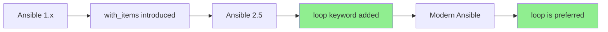
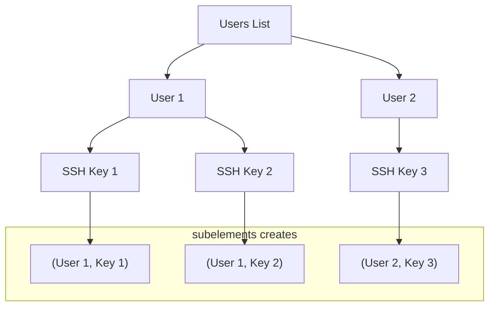
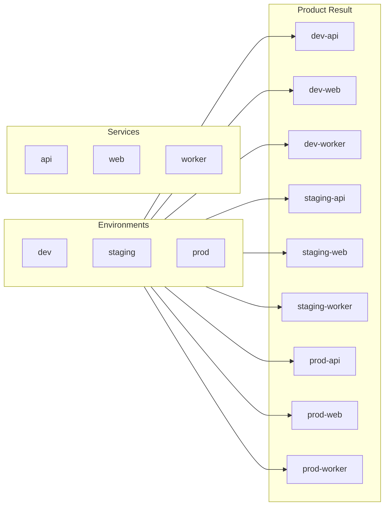
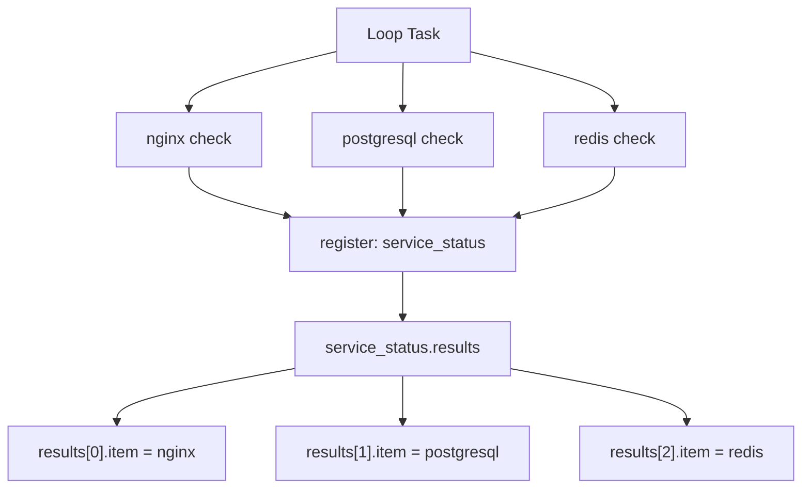

# How to Handle Ansible Loops with loop and with_items

Author: [nawazdhandala](https://www.github.com/nawazdhandala)

Tags: Ansible, Loops, Automation, DevOps, Configuration Management, Best Practices

Description: Master Ansible loops using the modern loop keyword and legacy with_items syntax with practical examples for common automation tasks.

---

Loops are fundamental to writing efficient Ansible playbooks. Instead of repeating tasks for each item, you can iterate over lists, dictionaries, and even nested data structures. This guide covers both the modern `loop` keyword and the legacy `with_*` syntax, helping you write cleaner and more maintainable automation.

## Loop Evolution in Ansible



The `loop` keyword was introduced in Ansible 2.5 as a cleaner replacement for `with_*` constructs. While both work, `loop` combined with filters is now the recommended approach.

## Basic Loop Syntax

### Using loop (Modern)

```yaml
# Simple list iteration
- name: Install packages
  apt:
    name: "{{ item }}"
    state: present
  loop:
    - nginx
    - postgresql
    - redis

# Using a variable
- name: Install packages from variable
  apt:
    name: "{{ item }}"
    state: present
  loop: "{{ packages_to_install }}"
```

### Using with_items (Legacy)

```yaml
# Legacy syntax - still works but not recommended for new playbooks
- name: Install packages
  apt:
    name: "{{ item }}"
    state: present
  with_items:
    - nginx
    - postgresql
    - redis
```

### Modern Package Module Approach

```yaml
# Most efficient: package modules accept lists directly
- name: Install multiple packages at once
  apt:
    name:
      - nginx
      - postgresql
      - redis
    state: present
```

## Looping Over Dictionaries

### Using loop with dict2items Filter

```yaml
# Define dictionary
vars:
  users:
    alice:
      uid: 1001
      groups: ['developers', 'docker']
    bob:
      uid: 1002
      groups: ['developers']
    charlie:
      uid: 1003
      groups: ['ops', 'docker']

# Loop over dictionary
- name: Create users
  user:
    name: "{{ item.key }}"
    uid: "{{ item.value.uid }}"
    groups: "{{ item.value.groups }}"
    state: present
  loop: "{{ users | dict2items }}"
```

### Using with_dict (Legacy)

```yaml
# Legacy approach
- name: Create users
  user:
    name: "{{ item.key }}"
    uid: "{{ item.value.uid }}"
    groups: "{{ item.value.groups }}"
    state: present
  with_dict: "{{ users }}"
```

## Looping Over Lists of Dictionaries

```yaml
# Define list of dictionaries
vars:
  services:
    - name: nginx
      port: 80
      enabled: true
    - name: api
      port: 8080
      enabled: true
    - name: metrics
      port: 9090
      enabled: false

# Loop and access properties
- name: Configure services
  template:
    src: service.conf.j2
    dest: "/etc/services/{{ item.name }}.conf"
  loop: "{{ services }}"
  when: item.enabled

- name: Open firewall ports for enabled services
  firewalld:
    port: "{{ item.port }}/tcp"
    permanent: yes
    state: enabled
  loop: "{{ services }}"
  when: item.enabled
```

## Nested Loops

### Using loop with subelements Filter



```yaml
# Define users with SSH keys
vars:
  admin_users:
    - name: alice
      ssh_keys:
        - "ssh-ed25519 AAAA... alice@laptop"
        - "ssh-ed25519 BBBB... alice@desktop"
    - name: bob
      ssh_keys:
        - "ssh-ed25519 CCCC... bob@workstation"

# Loop with subelements to add all keys
- name: Add SSH keys for users
  authorized_key:
    user: "{{ item.0.name }}"
    key: "{{ item.1 }}"
    state: present
  loop: "{{ admin_users | subelements('ssh_keys') }}"
  # item.0 is the user dict, item.1 is each ssh_key
```

### Using with_subelements (Legacy)

```yaml
# Legacy syntax
- name: Add SSH keys for users
  authorized_key:
    user: "{{ item.0.name }}"
    key: "{{ item.1 }}"
    state: present
  with_subelements:
    - "{{ admin_users }}"
    - ssh_keys
```

## Product of Lists (Cartesian Product)

```yaml
# Create every combination of two lists
vars:
  environments:
    - dev
    - staging
    - prod
  services:
    - api
    - web
    - worker

# Using loop with product filter
- name: Create service directories for each environment
  file:
    path: "/opt/{{ item.0 }}/{{ item.1 }}"
    state: directory
  loop: "{{ environments | product(services) | list }}"
  # Creates: dev/api, dev/web, dev/worker, staging/api, ...
```



## Loop Control

### Limiting Output with label

```yaml
# By default, Ansible prints the entire item
# Use label to show only what is useful
- name: Create users with complex data
  user:
    name: "{{ item.name }}"
    uid: "{{ item.uid }}"
    comment: "{{ item.full_name }}"
  loop: "{{ users }}"
  loop_control:
    label: "{{ item.name }}"  # Only show username in output
```

### Accessing Loop Index

```yaml
# index0 starts at 0, index starts at 1
- name: Create numbered configuration files
  template:
    src: worker.conf.j2
    dest: "/etc/workers/worker-{{ item }}.conf"
  loop: "{{ range(1, 6) | list }}"  # Creates worker-1.conf through worker-5.conf

# Using loop_control for index
- name: Install packages with index
  debug:
    msg: "Installing package {{ loop_index }}/{{ packages | length }}: {{ item }}"
  loop: "{{ packages }}"
  loop_control:
    index_var: loop_index
```

### Pausing Between Iterations

```yaml
# Wait between API calls to avoid rate limiting
- name: Create resources via API
  uri:
    url: "https://api.example.com/resources"
    method: POST
    body:
      name: "{{ item }}"
    body_format: json
  loop: "{{ resources_to_create }}"
  loop_control:
    pause: 2  # Wait 2 seconds between iterations
```

### Extended Loop Variables

```yaml
- name: Process items with extended info
  debug:
    msg: |
      Item: {{ item }}
      Index: {{ ansible_loop.index }}
      First: {{ ansible_loop.first }}
      Last: {{ ansible_loop.last }}
      Length: {{ ansible_loop.length }}
  loop:
    - apple
    - banana
    - cherry
  loop_control:
    extended: yes
```

## Filtering Loop Items

### Using selectattr and rejectattr

```yaml
vars:
  servers:
    - name: web1
      role: web
      active: true
    - name: web2
      role: web
      active: false
    - name: db1
      role: database
      active: true

# Only process active servers
- name: Configure active servers
  debug:
    msg: "Configuring {{ item.name }}"
  loop: "{{ servers | selectattr('active', 'equalto', true) | list }}"

# Only web servers
- name: Configure web servers
  debug:
    msg: "Configuring web server {{ item.name }}"
  loop: "{{ servers | selectattr('role', 'equalto', 'web') | list }}"

# Combine filters
- name: Configure active web servers
  debug:
    msg: "Configuring {{ item.name }}"
  loop: "{{ servers | selectattr('active') | selectattr('role', 'equalto', 'web') | list }}"
```

### Using when with Loops

```yaml
# Filter during iteration
- name: Start only enabled services
  systemd:
    name: "{{ item.name }}"
    state: started
    enabled: yes
  loop: "{{ services }}"
  when: item.enabled | default(true)
```

## Registering Loop Results

```yaml
# Register results from a loop
- name: Check service status
  command: systemctl is-active {{ item }}
  loop:
    - nginx
    - postgresql
    - redis
  register: service_status
  ignore_errors: yes

# Results are in service_status.results
- name: Display failed services
  debug:
    msg: "Service {{ item.item }} is not running"
  loop: "{{ service_status.results }}"
  when: item.rc != 0
```



## Converting Legacy with_* to loop

### Quick Reference Table

| Legacy Syntax | Modern Equivalent |
|--------------|-------------------|
| `with_items` | `loop` |
| `with_list` | `loop` |
| `with_dict` | `loop: "{{ dict \| dict2items }}"` |
| `with_subelements` | `loop: "{{ list \| subelements('key') }}"` |
| `with_nested` | `loop: "{{ list1 \| product(list2) \| list }}"` |
| `with_sequence` | `loop: "{{ range(start, end, step) \| list }}"` |
| `with_fileglob` | `loop: "{{ query('fileglob', 'pattern') }}"` |
| `with_lines` | `loop: "{{ lookup('lines', 'command') }}"` |
| `with_indexed_items` | `loop` with `loop_control.index_var` |

### Conversion Examples

```yaml
# with_sequence to loop
# Legacy:
- name: Create numbered dirs
  file:
    path: "/data/volume{{ item }}"
    state: directory
  with_sequence: start=1 end=5

# Modern:
- name: Create numbered dirs
  file:
    path: "/data/volume{{ item }}"
    state: directory
  loop: "{{ range(1, 6) | list }}"

# with_fileglob to loop
# Legacy:
- name: Copy config files
  copy:
    src: "{{ item }}"
    dest: /etc/app/
  with_fileglob:
    - "configs/*.conf"

# Modern:
- name: Copy config files
  copy:
    src: "{{ item }}"
    dest: /etc/app/
  loop: "{{ query('fileglob', 'configs/*.conf') }}"
```

## Practical Examples

### Example 1: Create Multiple Users with Groups

```yaml
---
- name: User management playbook
  hosts: all
  become: yes

  vars:
    users:
      - name: alice
        groups: ['developers', 'docker']
        shell: /bin/bash
      - name: bob
        groups: ['developers']
        shell: /bin/zsh
      - name: charlie
        groups: ['ops', 'docker', 'wheel']
        shell: /bin/bash

  tasks:
    - name: Ensure groups exist
      group:
        name: "{{ item }}"
        state: present
      loop: "{{ users | map(attribute='groups') | flatten | unique }}"

    - name: Create users
      user:
        name: "{{ item.name }}"
        groups: "{{ item.groups }}"
        shell: "{{ item.shell }}"
        state: present
      loop: "{{ users }}"
      loop_control:
        label: "{{ item.name }}"
```

### Example 2: Deploy Configuration for Multiple Environments

```yaml
---
- name: Multi-environment deployment
  hosts: localhost
  gather_facts: no

  vars:
    environments:
      dev:
        replicas: 1
        debug: true
        domain: dev.example.com
      staging:
        replicas: 2
        debug: true
        domain: staging.example.com
      prod:
        replicas: 5
        debug: false
        domain: www.example.com

  tasks:
    - name: Generate configuration for each environment
      template:
        src: app-config.j2
        dest: "configs/{{ item.key }}/config.yml"
      loop: "{{ environments | dict2items }}"
      loop_control:
        label: "{{ item.key }}"
      vars:
        env_name: "{{ item.key }}"
        env_config: "{{ item.value }}"
```

### Example 3: Conditional Package Installation

```yaml
---
- name: Install packages based on OS
  hosts: all
  become: yes

  vars:
    packages:
      common:
        - vim
        - git
        - curl
      debian:
        - apt-transport-https
        - ca-certificates
      redhat:
        - epel-release
        - yum-utils

  tasks:
    - name: Install common packages
      package:
        name: "{{ item }}"
        state: present
      loop: "{{ packages.common }}"

    - name: Install OS-specific packages
      package:
        name: "{{ item }}"
        state: present
      loop: "{{ packages[ansible_os_family | lower] | default([]) }}"
```

### Example 4: Until Loop (Retry Logic)

```yaml
# Retry until condition is met
- name: Wait for service to be healthy
  uri:
    url: "http://localhost:8080/health"
    status_code: 200
  register: health_check
  until: health_check.status == 200
  retries: 30
  delay: 10  # Wait 10 seconds between retries
```

---

Loops in Ansible help you write DRY (Do not Repeat Yourself) playbooks. Use the modern `loop` keyword for new playbooks, combined with Jinja2 filters like `dict2items`, `subelements`, and `product` to handle complex data structures. Remember to use `loop_control` to customize output and access loop variables. For simple lists of packages or files, check if the module accepts a list directly since that is often more efficient than looping.
