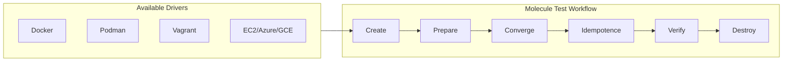
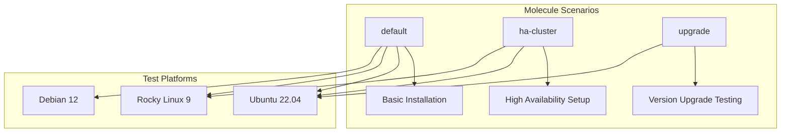
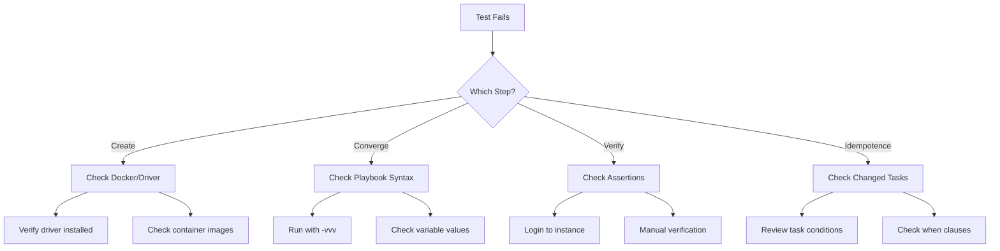

# How to Configure Ansible Molecule for Testing

Author: [nawazdhandala](https://www.github.com/nawazdhandala)

Tags: Ansible, Molecule, Testing, DevOps, Infrastructure as Code, CI/CD, Automation

Description: A comprehensive guide to setting up and configuring Ansible Molecule for automated role testing, including Docker, Podman, and cloud driver configurations.

---

Testing Ansible roles before deployment is essential for maintaining reliable infrastructure. Molecule is the de facto testing framework for Ansible, providing a consistent workflow to lint, converge, verify, and destroy test instances.

## What is Molecule?

Molecule helps you develop and test Ansible roles in isolation. It uses drivers to create test instances, runs your playbook against them, and verifies the expected state.



## Installing Molecule

Install Molecule with your preferred driver support.

```bash
# Install Molecule with Docker driver (most common)
pip install molecule[docker]

# Install with Podman driver (rootless containers)
pip install molecule[podman]

# Install with multiple drivers
pip install molecule[docker,podman,vagrant]

# Install Ansible lint for code quality checks
pip install ansible-lint
```

Verify the installation:

```bash
# Check Molecule version
molecule --version

# Expected output shows installed version and drivers
# molecule 6.0.3 using python 3.11
#     ansible:2.16.3
#     default:6.0.3 from molecule
#     docker:2.1.0 from molecule_docker
```

## Initializing a Role with Molecule

Create a new role with Molecule scaffolding.

```bash
# Create a new role with Molecule scenario
molecule init role my_role --driver-name docker

# Or add Molecule to an existing role
cd existing_role
molecule init scenario --driver-name docker
```

This creates the following structure:

```
my_role/
  molecule/
    default/
      converge.yml       # Playbook to test the role
      molecule.yml       # Scenario configuration
      verify.yml         # Verification tests
  tasks/
    main.yml
  handlers/
    main.yml
  defaults/
    main.yml
  meta/
    main.yml
```

## Configuring molecule.yml

The `molecule.yml` file defines your test scenario. Here is a comprehensive configuration.

```yaml
---
# molecule/default/molecule.yml

# Define the test driver - Docker is most common
driver:
  name: docker

# Configure test instances
platforms:
  # Test on Ubuntu 22.04
  - name: ubuntu-22
    image: ubuntu:22.04
    # Run systemd in container for service testing
    command: /lib/systemd/systemd
    pre_build_image: true
    # Enable privileged mode for systemd
    privileged: true
    # Mount cgroups for systemd
    volumes:
      - /sys/fs/cgroup:/sys/fs/cgroup:rw
    cgroupns_mode: host
    # Override default tmpfs settings
    tmpfs:
      - /run
      - /tmp

  # Test on Rocky Linux 9 (RHEL compatible)
  - name: rocky-9
    image: rockylinux:9
    command: /usr/sbin/init
    pre_build_image: true
    privileged: true
    volumes:
      - /sys/fs/cgroup:/sys/fs/cgroup:rw
    cgroupns_mode: host

  # Test on Debian 12
  - name: debian-12
    image: debian:12
    command: /lib/systemd/systemd
    pre_build_image: true
    privileged: true
    volumes:
      - /sys/fs/cgroup:/sys/fs/cgroup:rw
    cgroupns_mode: host

# Provisioner configuration (Ansible settings)
provisioner:
  name: ansible
  # Pass extra variables to playbooks
  inventory:
    host_vars:
      ubuntu-22:
        ansible_python_interpreter: /usr/bin/python3
      rocky-9:
        ansible_python_interpreter: /usr/bin/python3
      debian-12:
        ansible_python_interpreter: /usr/bin/python3
  # Ansible configuration options
  config_options:
    defaults:
      callbacks_enabled: profile_tasks
      gathering: smart
      fact_caching: jsonfile
      fact_caching_connection: /tmp/facts_cache
    ssh_connection:
      pipelining: true
  # Environment variables for Ansible
  env:
    ANSIBLE_VERBOSITY: "1"
    ANSIBLE_DIFF_ALWAYS: "true"

# Verifier configuration
verifier:
  name: ansible
  # Or use testinfra for Python-based tests
  # name: testinfra

# Linting configuration
lint: |
  set -e
  yamllint .
  ansible-lint

# Scenario configuration
scenario:
  name: default
  # Define the test sequence
  test_sequence:
    - dependency
    - lint
    - cleanup
    - destroy
    - syntax
    - create
    - prepare
    - converge
    - idempotence
    - verify
    - cleanup
    - destroy
```

## Writing the Converge Playbook

The converge playbook applies your role to test instances.

```yaml
---
# molecule/default/converge.yml

- name: Converge
  hosts: all
  become: true
  # Gather facts for conditional tasks
  gather_facts: true

  # Define test variables
  vars:
    # Application configuration for testing
    app_port: 8080
    app_user: appuser
    app_config:
      debug: true
      log_level: info

  # Pre-tasks to prepare the environment
  pre_tasks:
    - name: Update apt cache on Debian systems
      ansible.builtin.apt:
        update_cache: true
        cache_valid_time: 3600
      when: ansible_os_family == "Debian"

    - name: Install Python for Ansible modules
      ansible.builtin.raw: |
        test -e /usr/bin/python3 || (apt-get update && apt-get install -y python3)
      changed_when: false
      when: ansible_os_family == "Debian"

  roles:
    # Apply the role being tested
    - role: my_role
      vars:
        my_role_port: "{{ app_port }}"
        my_role_user: "{{ app_user }}"
```

## Writing Verification Tests

Create tests to verify your role works correctly.

### Ansible Verifier (Default)

```yaml
---
# molecule/default/verify.yml

- name: Verify
  hosts: all
  become: true
  gather_facts: true

  tasks:
    # Verify the application user exists
    - name: Check application user exists
      ansible.builtin.getent:
        database: passwd
        key: appuser
      register: user_check

    - name: Assert user was created
      ansible.builtin.assert:
        that:
          - user_check is success
        fail_msg: "Application user was not created"
        success_msg: "Application user exists"

    # Verify the service is running
    - name: Check service is running
      ansible.builtin.service_facts:

    - name: Assert service is active
      ansible.builtin.assert:
        that:
          - "'my_app.service' in ansible_facts.services"
          - "ansible_facts.services['my_app.service'].state == 'running'"
        fail_msg: "Service is not running"
        success_msg: "Service is running correctly"

    # Verify port is listening
    - name: Check application port is open
      ansible.builtin.wait_for:
        port: 8080
        timeout: 30
        state: started

    # Verify configuration file exists with correct content
    - name: Read configuration file
      ansible.builtin.slurp:
        src: /etc/my_app/config.yml
      register: config_content

    - name: Verify configuration content
      ansible.builtin.assert:
        that:
          - "'debug: true' in (config_content.content | b64decode)"
          - "'log_level: info' in (config_content.content | b64decode)"
        fail_msg: "Configuration file has incorrect content"

    # Verify file permissions
    - name: Check config file permissions
      ansible.builtin.stat:
        path: /etc/my_app/config.yml
      register: config_stat

    - name: Assert correct permissions
      ansible.builtin.assert:
        that:
          - config_stat.stat.mode == '0640'
          - config_stat.stat.pw_name == 'root'
          - config_stat.stat.gr_name == 'appuser'
```

### Testinfra Verifier (Python-based)

For more complex testing, use Testinfra.

```python
# molecule/default/tests/test_default.py

import pytest

def test_user_exists(host):
    """Verify the application user was created."""
    user = host.user("appuser")
    assert user.exists
    assert user.shell == "/bin/bash"
    assert "appuser" in user.groups

def test_service_running(host):
    """Verify the service is running and enabled."""
    service = host.service("my_app")
    assert service.is_running
    assert service.is_enabled

def test_port_listening(host):
    """Verify the application port is listening."""
    socket = host.socket("tcp://0.0.0.0:8080")
    assert socket.is_listening

def test_config_file(host):
    """Verify configuration file exists with correct permissions."""
    config = host.file("/etc/my_app/config.yml")
    assert config.exists
    assert config.user == "root"
    assert config.group == "appuser"
    assert config.mode == 0o640
    assert config.contains("debug: true")

def test_log_directory(host):
    """Verify log directory exists with correct ownership."""
    log_dir = host.file("/var/log/my_app")
    assert log_dir.exists
    assert log_dir.is_directory
    assert log_dir.user == "appuser"

@pytest.mark.parametrize("package", [
    "python3",
    "curl",
    "jq",
])
def test_packages_installed(host, package):
    """Verify required packages are installed."""
    pkg = host.package(package)
    assert pkg.is_installed
```

Update molecule.yml to use Testinfra:

```yaml
# In molecule.yml
verifier:
  name: testinfra
  options:
    v: true
```

## Creating Multiple Scenarios

Different scenarios test different configurations.



### High Availability Scenario

```bash
# Create a new scenario
molecule init scenario ha-cluster --driver-name docker
```

```yaml
---
# molecule/ha-cluster/molecule.yml

driver:
  name: docker

platforms:
  # Primary node
  - name: primary
    image: ubuntu:22.04
    command: /lib/systemd/systemd
    pre_build_image: true
    privileged: true
    volumes:
      - /sys/fs/cgroup:/sys/fs/cgroup:rw
    cgroupns_mode: host
    networks:
      - name: molecule-ha
    groups:
      - primary

  # Secondary nodes
  - name: secondary-1
    image: ubuntu:22.04
    command: /lib/systemd/systemd
    pre_build_image: true
    privileged: true
    volumes:
      - /sys/fs/cgroup:/sys/fs/cgroup:rw
    cgroupns_mode: host
    networks:
      - name: molecule-ha
    groups:
      - secondary

  - name: secondary-2
    image: ubuntu:22.04
    command: /lib/systemd/systemd
    pre_build_image: true
    privileged: true
    volumes:
      - /sys/fs/cgroup:/sys/fs/cgroup:rw
    cgroupns_mode: host
    networks:
      - name: molecule-ha
    groups:
      - secondary

provisioner:
  name: ansible
  inventory:
    group_vars:
      all:
        cluster_mode: true
        cluster_nodes:
          - primary
          - secondary-1
          - secondary-2
      primary:
        node_role: primary
      secondary:
        node_role: secondary
```

### Converge for HA Scenario

```yaml
---
# molecule/ha-cluster/converge.yml

- name: Converge Primary
  hosts: primary
  become: true
  roles:
    - role: my_role
      vars:
        is_primary: true
        cluster_peers: "{{ groups['secondary'] }}"

- name: Converge Secondary Nodes
  hosts: secondary
  become: true
  roles:
    - role: my_role
      vars:
        is_primary: false
        primary_host: "{{ groups['primary'][0] }}"
```

## Using Prepare Playbook

The prepare playbook runs before converge to set up prerequisites.

```yaml
---
# molecule/default/prepare.yml

- name: Prepare
  hosts: all
  become: true
  gather_facts: true

  tasks:
    # Install prerequisites not managed by the role
    - name: Install system prerequisites
      ansible.builtin.package:
        name:
          - curl
          - ca-certificates
          - gnupg
        state: present

    # Add external repository if needed
    - name: Add Docker GPG key
      ansible.builtin.apt_key:
        url: https://download.docker.com/linux/ubuntu/gpg
        state: present
      when: ansible_os_family == "Debian"

    # Create required directories
    - name: Create required directories
      ansible.builtin.file:
        path: "{{ item }}"
        state: directory
        mode: '0755'
      loop:
        - /opt/app
        - /var/lib/app

    # Pre-seed configuration
    - name: Create initial secrets
      ansible.builtin.copy:
        content: "test-secret-value"
        dest: /etc/app-secret
        mode: '0600'
```

## CI/CD Integration

### GitHub Actions

```yaml
# .github/workflows/molecule.yml

name: Molecule Test

on:
  push:
    branches: [main]
  pull_request:
    branches: [main]

jobs:
  molecule:
    runs-on: ubuntu-latest
    strategy:
      fail-fast: false
      matrix:
        scenario:
          - default
          - ha-cluster
        distro:
          - ubuntu2204
          - rockylinux9
          - debian12

    steps:
      - name: Checkout repository
        uses: actions/checkout@v4

      - name: Set up Python
        uses: actions/setup-python@v5
        with:
          python-version: '3.11'

      - name: Install dependencies
        run: |
          python -m pip install --upgrade pip
          pip install molecule[docker] ansible-lint yamllint

      - name: Run Molecule tests
        run: |
          molecule test --scenario-name ${{ matrix.scenario }}
        env:
          MOLECULE_DISTRO: ${{ matrix.distro }}
          PY_COLORS: '1'
          ANSIBLE_FORCE_COLOR: '1'
```

### GitLab CI

```yaml
# .gitlab-ci.yml

stages:
  - lint
  - test

variables:
  PY_COLORS: '1'
  ANSIBLE_FORCE_COLOR: '1'

lint:
  stage: lint
  image: python:3.11
  before_script:
    - pip install ansible-lint yamllint
  script:
    - yamllint .
    - ansible-lint

molecule:
  stage: test
  image: docker:24-dind
  services:
    - docker:24-dind
  variables:
    DOCKER_HOST: tcp://docker:2376
    DOCKER_TLS_CERTDIR: "/certs"
    DOCKER_CERT_PATH: "/certs/client"
    DOCKER_TLS_VERIFY: "1"
  before_script:
    - apk add --no-cache python3 py3-pip gcc musl-dev python3-dev libffi-dev
    - pip install molecule[docker] ansible-lint --break-system-packages
  script:
    - molecule test
  parallel:
    matrix:
      - SCENARIO: [default, ha-cluster]
```

## Running Molecule Commands

```bash
# Run full test sequence
molecule test

# Run specific scenario
molecule test --scenario-name ha-cluster

# Run individual steps
molecule create    # Create test instances
molecule converge  # Run the playbook
molecule verify    # Run verification tests
molecule destroy   # Clean up instances

# Login to test instance for debugging
molecule login --host ubuntu-22

# Run converge multiple times (idempotence check)
molecule converge
molecule idempotence

# Skip destroy for debugging
molecule test --destroy=never

# List current instances
molecule list
```

## Debugging Failed Tests



### Enable Verbose Output

```bash
# Run with maximum verbosity
ANSIBLE_VERBOSITY=3 molecule converge

# Keep instances after failure
molecule test --destroy=never

# Login and debug manually
molecule login --host ubuntu-22
```

### Common Issues and Solutions

```yaml
# Issue: Container fails to start with systemd
# Solution: Use proper systemd configuration
platforms:
  - name: instance
    image: ubuntu:22.04
    command: /lib/systemd/systemd
    privileged: true
    volumes:
      - /sys/fs/cgroup:/sys/fs/cgroup:rw
    cgroupns_mode: host

# Issue: Python interpreter not found
# Solution: Specify interpreter in inventory
provisioner:
  inventory:
    host_vars:
      instance:
        ansible_python_interpreter: /usr/bin/python3

# Issue: Slow test execution
# Solution: Enable pipelining and fact caching
provisioner:
  config_options:
    defaults:
      fact_caching: jsonfile
      fact_caching_connection: /tmp/facts
    ssh_connection:
      pipelining: true
```

## Best Practices

1. **Test on multiple distributions** - Ensure your role works across different OS families
2. **Use idempotence checks** - Verify tasks do not change state on re-run
3. **Keep tests fast** - Use pre-built images and minimize prepare tasks
4. **Test edge cases** - Create scenarios for upgrades, HA, and failure modes
5. **Integrate with CI/CD** - Run tests automatically on every change
6. **Use meaningful assertions** - Test actual functionality, not just file existence
7. **Document scenarios** - Explain what each scenario tests

---

Molecule transforms Ansible role development from "it works on my machine" to reproducible, tested infrastructure code. Start with the default scenario, add verification tests, and expand to cover your edge cases. Your future self will thank you when that 3 AM deployment goes smoothly.
