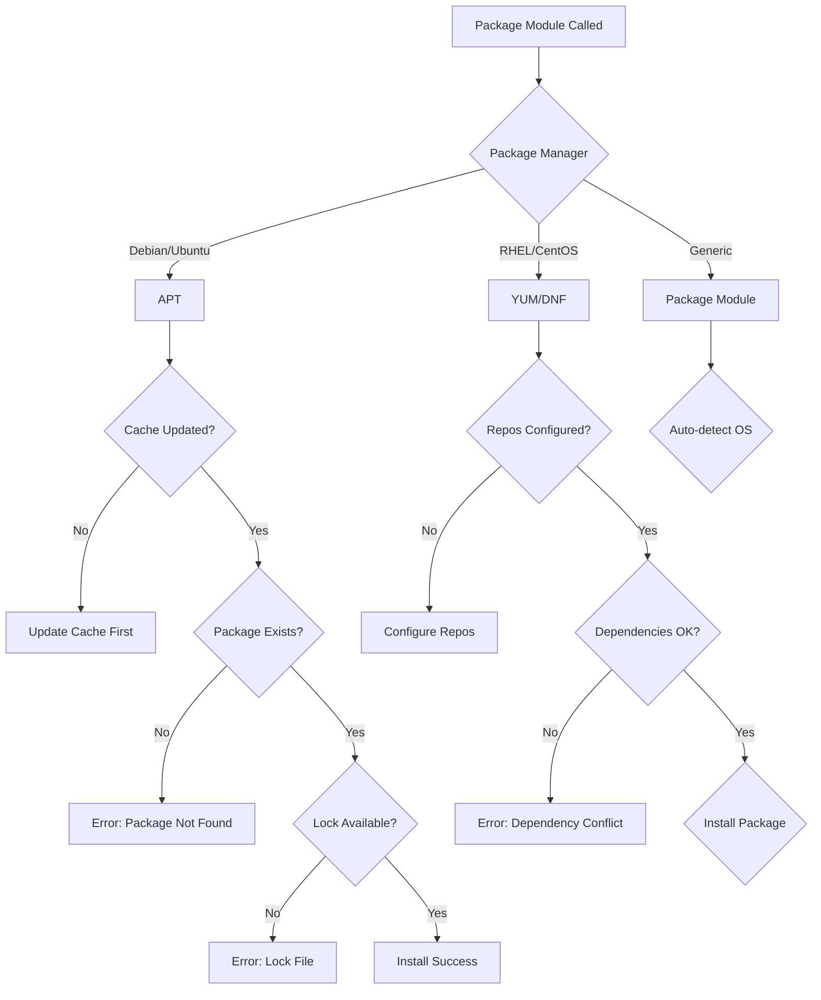
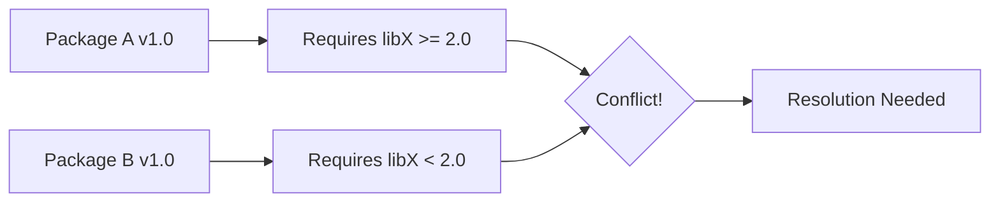

# How to Fix "Package Module" Installation Errors

Author: [nawazdhandala](https://www.github.com/nawazdhandala)

Tags: Ansible, Package Management, APT, YUM, DNF, DevOps, Troubleshooting, Linux

Description: Learn how to diagnose and fix common Ansible package module errors including dependency conflicts, repository issues, and lock file problems.

---

The Ansible package modules (apt, yum, dnf, package) are fundamental for system configuration, but they can fail for various reasons. This guide covers common errors and their solutions.

---

## Common Package Module Errors

```
FAILED! => {"changed": false, "msg": "No package matching 'nonexistent' is available"}

FAILED! => {"changed": false, "msg": "Failed to lock apt for exclusive operation"}

FAILED! => {"changed": false, "msg": "Depsolve Error occurred"}
```

---

## Package Installation Flow



---

## Solution 1: Package Not Found Errors

The most common error - the package cannot be found in configured repositories.

```yaml
---
# fix-package-not-found.yml - Handle package not found errors
- name: Fix package not found errors
  hosts: all
  become: yes
  tasks:
    # Update package cache first (Debian/Ubuntu)
    - name: Update apt cache
      ansible.builtin.apt:
        update_cache: yes
        cache_valid_time: 3600
      when: ansible_os_family == "Debian"

    # Update package cache (RHEL/CentOS)
    - name: Update yum cache
      ansible.builtin.yum:
        update_cache: yes
      when: ansible_os_family == "RedHat"

    # Check if package exists before installing
    - name: Check if package is available (Debian)
      ansible.builtin.shell: apt-cache show nginx 2>/dev/null
      register: package_check
      changed_when: false
      failed_when: false
      when: ansible_os_family == "Debian"

    # Install with proper error handling
    - name: Install package with fallback
      block:
        - name: Install nginx
          ansible.builtin.package:
            name: nginx
            state: present
      rescue:
        # Try alternative package name
        - name: Try alternative package name
          ansible.builtin.package:
            name: nginx-full
            state: present
          when: ansible_os_family == "Debian"
```

---

## Solution 2: Fix APT Lock File Errors

APT lock errors occur when another process is using the package manager.

```yaml
---
# fix-apt-lock.yml - Handle APT lock file issues
- name: Fix APT lock file errors
  hosts: debian_hosts
  become: yes
  tasks:
    # Wait for any running apt processes
    - name: Wait for apt lock to be released
      ansible.builtin.shell: |
        while fuser /var/lib/dpkg/lock-frontend >/dev/null 2>&1; do
          sleep 5
        done
      changed_when: false
      timeout: 300

    # Alternative: Wait for automatic updates to complete
    - name: Wait for unattended-upgrades to finish
      ansible.builtin.shell: |
        while pgrep -x unattended-upgr > /dev/null; do
          sleep 10
        done
      changed_when: false
      timeout: 600

    # Fix interrupted package installations
    - name: Configure any pending packages
      ansible.builtin.command: dpkg --configure -a
      register: dpkg_configure
      changed_when: dpkg_configure.rc == 0

    # Fix broken dependencies
    - name: Fix broken dependencies
      ansible.builtin.apt:
        state: fixed

    # Now install the package
    - name: Install package after lock cleared
      ansible.builtin.apt:
        name: nginx
        state: present
        update_cache: yes
      retries: 3
      delay: 30
      register: install_result
      until: install_result is succeeded
```

---

## Solution 3: Handle Dependency Conflicts

Dependency conflicts require careful resolution.



```yaml
---
# fix-dependencies.yml - Resolve dependency conflicts
- name: Resolve dependency conflicts
  hosts: all
  become: yes
  tasks:
    # Check for broken dependencies
    - name: Check for broken packages (Debian)
      ansible.builtin.command: apt-get check
      register: apt_check
      changed_when: false
      failed_when: false
      when: ansible_os_family == "Debian"

    # Fix broken dependencies on Debian
    - name: Fix broken dependencies (Debian)
      ansible.builtin.apt:
        state: fixed
      when:
        - ansible_os_family == "Debian"
        - apt_check.rc != 0

    # Remove conflicting packages first
    - name: Remove conflicting package
      ansible.builtin.package:
        name: conflicting-package
        state: absent
      ignore_errors: yes

    # Install with dependency resolution
    - name: Install package with dependencies (Debian)
      ansible.builtin.apt:
        name: nginx
        state: present
        install_recommends: yes
      when: ansible_os_family == "Debian"

    # Use dnf for better dependency resolution on RHEL 8+
    - name: Install package with dnf
      ansible.builtin.dnf:
        name: nginx
        state: present
        allowerasing: yes
      when:
        - ansible_os_family == "RedHat"
        - ansible_distribution_major_version | int >= 8
```

---

## Solution 4: Repository Configuration Errors

Missing or misconfigured repositories cause package installation failures.

```yaml
---
# fix-repositories.yml - Configure repositories properly
- name: Configure package repositories
  hosts: all
  become: yes
  tasks:
    # Add missing repository (Debian/Ubuntu)
    - name: Add nginx official repository (Debian)
      block:
        # Add repository signing key
        - name: Add nginx GPG key
          ansible.builtin.apt_key:
            url: https://nginx.org/keys/nginx_signing.key
            state: present

        # Add repository
        - name: Add nginx repository
          ansible.builtin.apt_repository:
            repo: "deb http://nginx.org/packages/{{ ansible_distribution | lower }}/ {{ ansible_distribution_release }} nginx"
            state: present
            filename: nginx

        # Update cache after adding repo
        - name: Update apt cache
          ansible.builtin.apt:
            update_cache: yes
      when: ansible_os_family == "Debian"

    # Add repository (RHEL/CentOS)
    - name: Add EPEL repository (RedHat)
      ansible.builtin.yum:
        name: epel-release
        state: present
      when: ansible_os_family == "RedHat"

    # Add custom yum repository
    - name: Add custom repository (RedHat)
      ansible.builtin.yum_repository:
        name: nginx
        description: Nginx Official Repository
        baseurl: http://nginx.org/packages/rhel/$releasever/$basearch/
        gpgcheck: yes
        gpgkey: https://nginx.org/keys/nginx_signing.key
        enabled: yes
      when: ansible_os_family == "RedHat"

    # Now install the package
    - name: Install nginx
      ansible.builtin.package:
        name: nginx
        state: present
```

---

## Solution 5: Handle Version Pinning Errors

Specific version installation can fail if the version is not available.

```yaml
---
# version-pinning.yml - Handle version-specific installations
- name: Install specific package version
  hosts: all
  become: yes
  vars:
    nginx_version: "1.24.0"

  tasks:
    # List available versions (Debian)
    - name: Get available nginx versions (Debian)
      ansible.builtin.shell: apt-cache madison nginx | awk '{print $3}'
      register: available_versions
      changed_when: false
      when: ansible_os_family == "Debian"

    # Check if requested version is available
    - name: Check if version is available
      ansible.builtin.set_fact:
        version_available: "{{ nginx_version in available_versions.stdout }}"
      when: ansible_os_family == "Debian"

    # Install specific version (Debian)
    - name: Install specific nginx version (Debian)
      ansible.builtin.apt:
        name: "nginx={{ nginx_version }}*"
        state: present
        allow_downgrade: yes
      when:
        - ansible_os_family == "Debian"
        - version_available | default(false)

    # Install latest if specific version not available
    - name: Install latest nginx version (fallback)
      ansible.builtin.apt:
        name: nginx
        state: present
      when:
        - ansible_os_family == "Debian"
        - not (version_available | default(false))

    # Install specific version (RedHat)
    - name: Install specific nginx version (RedHat)
      ansible.builtin.yum:
        name: "nginx-{{ nginx_version }}"
        state: present
        allow_downgrade: yes
      when: ansible_os_family == "RedHat"
      ignore_errors: yes
```

---

## Solution 6: Proxy and Network Errors

Network issues prevent package downloads.

```yaml
---
# fix-network-issues.yml - Handle proxy and network errors
- name: Configure proxy for package manager
  hosts: all
  become: yes
  vars:
    http_proxy: "http://proxy.example.com:8080"
    https_proxy: "http://proxy.example.com:8080"

  tasks:
    # Configure APT proxy (Debian)
    - name: Configure APT proxy
      ansible.builtin.copy:
        content: |
          Acquire::http::Proxy "{{ http_proxy }}";
          Acquire::https::Proxy "{{ https_proxy }}";
        dest: /etc/apt/apt.conf.d/proxy.conf
        mode: '0644'
      when:
        - ansible_os_family == "Debian"
        - http_proxy is defined

    # Configure YUM proxy (RedHat)
    - name: Configure YUM proxy
      ansible.builtin.lineinfile:
        path: /etc/yum.conf
        regexp: '^proxy='
        line: "proxy={{ http_proxy }}"
        state: present
      when:
        - ansible_os_family == "RedHat"
        - http_proxy is defined

    # Install with retry for network issues
    - name: Install package with network retry
      ansible.builtin.package:
        name: nginx
        state: present
      register: install_result
      retries: 5
      delay: 10
      until: install_result is succeeded

    # Handle timeout errors
    - name: Install with extended timeout (Debian)
      ansible.builtin.apt:
        name: nginx
        state: present
      environment:
        DEBIAN_FRONTEND: noninteractive
      async: 600
      poll: 30
      when: ansible_os_family == "Debian"
```

---

## Solution 7: GPG Key Errors

GPG signature verification failures block package installation.

```yaml
---
# fix-gpg-errors.yml - Handle GPG key issues
- name: Fix GPG key errors
  hosts: all
  become: yes
  tasks:
    # Fix expired GPG keys (Debian)
    - name: Update expired GPG keys (Debian)
      ansible.builtin.shell: |
        apt-key adv --keyserver keyserver.ubuntu.com --recv-keys {{ item }}
      loop:
        - "ABF5BD827BD9BF62"  # Example key ID
      when: ansible_os_family == "Debian"
      ignore_errors: yes

    # Import GPG key from URL
    - name: Import repository GPG key
      ansible.builtin.rpm_key:
        key: https://nginx.org/keys/nginx_signing.key
        state: present
      when: ansible_os_family == "RedHat"

    # Disable GPG check temporarily (not recommended for production)
    - name: Install without GPG check (emergency only)
      ansible.builtin.yum:
        name: nginx
        state: present
        disable_gpg_check: yes
      when:
        - ansible_os_family == "RedHat"
        - gpg_emergency | default(false)

    # Use modern apt_key replacement (Debian 12+)
    - name: Add GPG key using modern method
      ansible.builtin.get_url:
        url: https://nginx.org/keys/nginx_signing.key
        dest: /usr/share/keyrings/nginx-archive-keyring.gpg
        mode: '0644'
      when:
        - ansible_os_family == "Debian"
        - ansible_distribution_major_version | int >= 12
```

---

## Solution 8: Cross-Platform Package Management

Handle package name differences across distributions.

```yaml
---
# cross-platform-packages.yml - Cross-platform package management
- name: Cross-platform package installation
  hosts: all
  become: yes
  vars:
    # Map package names across distributions
    package_map:
      httpd:
        Debian: apache2
        RedHat: httpd
        Suse: apache2
      nginx:
        Debian: nginx
        RedHat: nginx
        Suse: nginx
      python:
        Debian: python3
        RedHat: python3
        Suse: python3

  tasks:
    # Set correct package name for OS
    - name: Set package name for distribution
      ansible.builtin.set_fact:
        target_packages: >-
          {{
            packages | map('extract', package_map) |
            map(attribute=ansible_os_family) | list
          }}
      vars:
        packages:
          - httpd
          - python

    # Install packages using correct names
    - name: Install packages
      ansible.builtin.package:
        name: "{{ item }}"
        state: present
      loop: "{{ target_packages }}"

    # Alternative: Use conditional includes
    - name: Include OS-specific package list
      ansible.builtin.include_vars:
        file: "packages_{{ ansible_os_family | lower }}.yml"

    - name: Install OS-specific packages
      ansible.builtin.package:
        name: "{{ os_packages }}"
        state: present
```

---

## Debugging Package Errors

```yaml
---
# debug-packages.yml - Debug package installation issues
- name: Debug package installation
  hosts: all
  become: yes
  tasks:
    # Gather package facts
    - name: Gather package facts
      ansible.builtin.package_facts:
        manager: auto

    # Check if package is installed
    - name: Check if nginx is installed
      ansible.builtin.debug:
        msg: "nginx is {{ 'installed' if 'nginx' in ansible_facts.packages else 'not installed' }}"

    # Get detailed package info (Debian)
    - name: Get package info (Debian)
      ansible.builtin.command: apt-cache policy nginx
      register: apt_policy
      changed_when: false
      when: ansible_os_family == "Debian"

    - name: Display package policy
      ansible.builtin.debug:
        var: apt_policy.stdout_lines
      when: apt_policy is defined

    # Check repository configuration
    - name: List configured repositories (Debian)
      ansible.builtin.command: apt-cache policy
      register: repo_list
      changed_when: false
      when: ansible_os_family == "Debian"

    # Check for package manager errors
    - name: Check dpkg status
      ansible.builtin.command: dpkg --audit
      register: dpkg_audit
      changed_when: false
      failed_when: false
      when: ansible_os_family == "Debian"

    - name: Display dpkg audit results
      ansible.builtin.debug:
        var: dpkg_audit.stdout_lines
      when: dpkg_audit.stdout | default('') | length > 0
```

---

## Error Reference Table

| Error | Module | Cause | Solution |
|-------|--------|-------|----------|
| Package not found | apt/yum | Cache outdated | Update cache first |
| Lock file error | apt | Another process running | Wait or kill process |
| Dependency error | all | Conflicting packages | Fix dependencies |
| GPG error | all | Invalid/expired key | Import correct key |
| Network timeout | all | Proxy/firewall | Configure proxy |
| Version not found | all | Version unavailable | Check available versions |

---

## Best Practices

```yaml
---
# best-practices.yml - Package management best practices
- name: Package management best practices
  hosts: all
  become: yes
  tasks:
    # Always update cache with validity check
    - name: Update package cache
      ansible.builtin.apt:
        update_cache: yes
        cache_valid_time: 3600
      when: ansible_os_family == "Debian"

    # Use the generic package module when possible
    - name: Install common packages
      ansible.builtin.package:
        name:
          - vim
          - curl
          - git
        state: present

    # Use retries for network reliability
    - name: Install with retry
      ansible.builtin.package:
        name: nginx
        state: present
      retries: 3
      delay: 10
      register: result
      until: result is succeeded

    # Clean up after installations
    - name: Clean package cache
      ansible.builtin.apt:
        autoclean: yes
        autoremove: yes
      when: ansible_os_family == "Debian"
```

---

*Managing packages across your infrastructure? [OneUptime](https://oneuptime.com) helps you monitor package installations, track configuration changes, and ensure your systems stay consistent and secure.*
