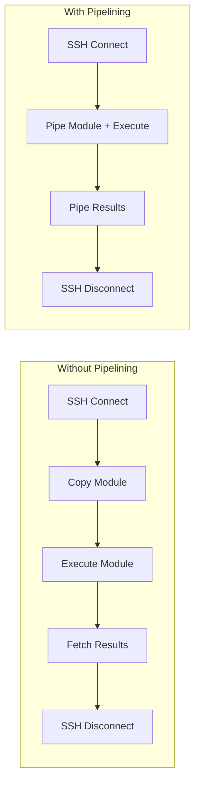
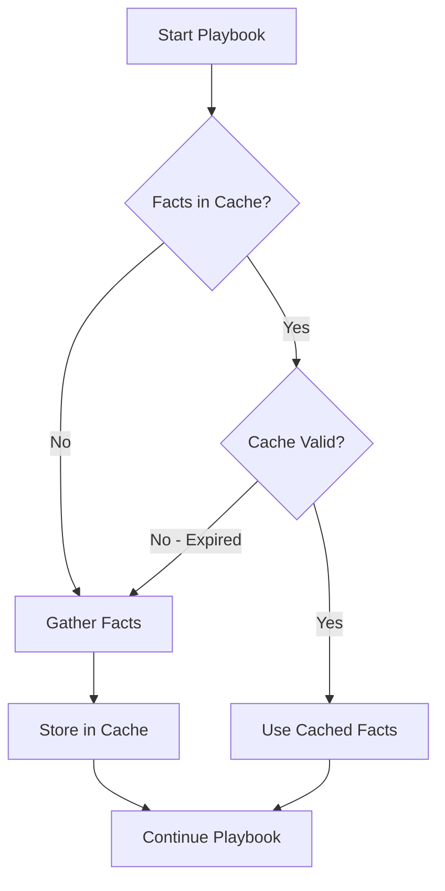
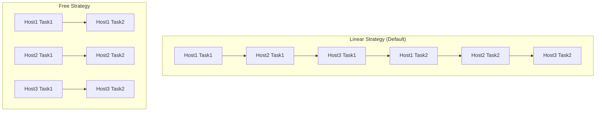

# How to Optimize Ansible Playbook Performance

Author: [nawazdhandala](https://www.github.com/nawazdhandala)

Tags: Ansible, Performance, Optimization, DevOps, Automation, Infrastructure as Code, SSH

Description: Learn techniques to dramatically speed up Ansible playbook execution, from SSH optimizations to fact caching and parallel execution strategies.

---

Slow Ansible playbooks are frustrating and expensive. A playbook that takes 30 minutes to run discourages iteration and testing. This guide covers proven techniques to make your playbooks run faster.

## Measuring Performance

Before optimizing, measure your baseline.

```bash
# Enable task timing
ANSIBLE_CALLBACKS_ENABLED=profile_tasks ansible-playbook site.yml

# Or in ansible.cfg
# [defaults]
# callbacks_enabled = profile_tasks
```

Example output:
```
PLAY RECAP ********************************************************************
Tuesday 24 January 2026  10:30:00 +0000 (0:00:01.234)    0:05:23.456 **********
===============================================================================
Install packages ------------------------------------------- 120.45s
Copy configuration files ------------------------------------ 45.23s
Gather facts ------------------------------------------------ 30.12s
Template nginx config --------------------------------------- 15.67s
```

## SSH Connection Optimization

SSH connection overhead is often the biggest performance bottleneck.



### Enable SSH Pipelining

Pipelining reduces SSH operations by piping module execution instead of copying files.

```ini
# ansible.cfg
[ssh_connection]
# Enable pipelining - major performance improvement
pipelining = True

# Use faster SSH options
ssh_args = -C -o ControlMaster=auto -o ControlPersist=60s

# Increase parallel connections
# Default is 5, increase for large inventories
[defaults]
forks = 50
```

**Note:** Pipelining requires `requiretty` to be disabled in sudoers on target hosts.

```yaml
# Disable requiretty on targets
- name: Disable requiretty for pipelining
  ansible.builtin.lineinfile:
    path: /etc/sudoers
    regexp: '^Defaults.*requiretty'
    line: 'Defaults    !requiretty'
    validate: 'visudo -cf %s'
```

### SSH Connection Multiplexing

Reuse SSH connections across tasks.

```ini
# ansible.cfg
[ssh_connection]
ssh_args = -C -o ControlMaster=auto -o ControlPersist=600s -o ServerAliveInterval=60
control_path = %(directory)s/%%h-%%r
```

## Fact Gathering Optimization

Fact gathering runs on every play and can be slow.

### Disable Unnecessary Facts

```yaml
---
# Disable fact gathering entirely if not needed
- name: Quick task playbook
  hosts: all
  gather_facts: false

  tasks:
    - name: Ping hosts
      ansible.builtin.ping:
```

### Gather Only Needed Facts

```yaml
---
# Gather specific facts only
- name: Selective fact gathering
  hosts: all
  gather_facts: false

  tasks:
    - name: Gather only network facts
      ansible.builtin.setup:
        gather_subset:
          - network
          - hardware

    # Or exclude slow fact modules
    - name: Gather facts without slow modules
      ansible.builtin.setup:
        gather_subset:
          - "!facter"
          - "!ohai"
```

### Enable Fact Caching

Cache facts to avoid re-gathering on subsequent runs.

```ini
# ansible.cfg
[defaults]
# JSON file caching (simple, no dependencies)
fact_caching = jsonfile
fact_caching_connection = /tmp/ansible_facts_cache
fact_caching_timeout = 86400  # 24 hours

# Or use Redis for distributed caching
# fact_caching = redis
# fact_caching_connection = localhost:6379:0

# Or use memcached
# fact_caching = memcached
# fact_caching_connection = localhost:11211
```



## Parallel Execution

### Increase Forks

Process more hosts simultaneously.

```ini
# ansible.cfg
[defaults]
# Default is 5, increase for faster parallel execution
forks = 50
```

Or per-playbook:

```bash
ansible-playbook site.yml --forks 50
```

### Strategy Plugins

```yaml
---
# Free strategy - tasks run as fast as hosts complete
- name: Fast parallel execution
  hosts: all
  strategy: free

  tasks:
    - name: Task 1
      ansible.builtin.command: fast_command

    - name: Task 2
      ansible.builtin.command: another_fast_command
```



### Mitogen Strategy (Experimental)

Mitogen provides massive speedups by optimizing Python module execution.

```bash
# Install mitogen
pip install mitogen

# Configure ansible.cfg
# [defaults]
# strategy_plugins = /path/to/mitogen/ansible_mitogen/plugins/strategy
# strategy = mitogen_linear
```

## Task Optimization

### Use Native Modules Instead of Shell/Command

Native modules are faster and more reliable.

```yaml
---
# Slow: Using shell
- name: Install package (slow)
  ansible.builtin.shell: apt-get install -y nginx
  become: true

# Fast: Using native module
- name: Install package (fast)
  ansible.builtin.apt:
    name: nginx
    state: present
  become: true
```

### Combine Related Tasks

```yaml
---
# Slow: Multiple package tasks
- name: Install nginx
  ansible.builtin.apt:
    name: nginx
- name: Install redis
  ansible.builtin.apt:
    name: redis
- name: Install postgresql
  ansible.builtin.apt:
    name: postgresql

# Fast: Single package task with list
- name: Install all packages
  ansible.builtin.apt:
    name:
      - nginx
      - redis
      - postgresql
    state: present
```

### Use async for Long-Running Tasks

```yaml
---
# Run long tasks in parallel
- name: Start long running tasks
  ansible.builtin.command: "/opt/backup.sh {{ item }}"
  async: 3600
  poll: 0
  register: backup_jobs
  loop:
    - database
    - files
    - logs

# Do other work while waiting
- name: Continue with other tasks
  ansible.builtin.template:
    src: config.j2
    dest: /etc/app/config

# Wait for all backups to complete
- name: Wait for backups
  ansible.builtin.async_status:
    jid: "{{ item.ansible_job_id }}"
  register: job_result
  until: job_result.finished
  retries: 120
  delay: 30
  loop: "{{ backup_jobs.results }}"
```

### Delegate Expensive Tasks

```yaml
---
# Run artifact download once on controller, then distribute
- name: Download artifact on controller
  ansible.builtin.get_url:
    url: "https://releases.example.com/app-{{ version }}.tar.gz"
    dest: /tmp/app.tar.gz
  delegate_to: localhost
  run_once: true

- name: Copy artifact to all hosts
  ansible.builtin.copy:
    src: /tmp/app.tar.gz
    dest: /opt/app.tar.gz
```

## Loop Optimization

### Avoid Unnecessary Loops

```yaml
---
# Slow: Loop over file operations
- name: Create directories (slow)
  ansible.builtin.file:
    path: "{{ item }}"
    state: directory
  loop:
    - /opt/app
    - /opt/app/config
    - /opt/app/logs

# Fast: Use with_items or combine
- name: Create directories (fast)
  ansible.builtin.file:
    path: "{{ item }}"
    state: directory
  loop:
    - /opt/app
    - /opt/app/config
    - /opt/app/logs
  # Actually both are similar, but use file module features when possible
```

### Use Batch Operations

```yaml
---
# Slow: Individual user creation
- name: Create users (slow)
  ansible.builtin.user:
    name: "{{ item.name }}"
    groups: "{{ item.groups }}"
  loop: "{{ users }}"

# Faster: Use jinja template for bulk operations
- name: Create users file
  ansible.builtin.template:
    src: users.sh.j2
    dest: /tmp/create_users.sh
    mode: '0755'

- name: Run bulk user creation
  ansible.builtin.command: /tmp/create_users.sh
```

## Template Optimization

### Pre-compile Jinja Templates

```yaml
---
# Slow: Complex template rendered on each host
- name: Render complex template
  ansible.builtin.template:
    src: complex_config.j2
    dest: /etc/app/config

# Faster: Render once, copy to all
- name: Render template on controller
  ansible.builtin.template:
    src: complex_config.j2
    dest: /tmp/rendered_config
  delegate_to: localhost
  run_once: true
  vars:
    use_host_specific: false

- name: Copy rendered template
  ansible.builtin.copy:
    src: /tmp/rendered_config
    dest: /etc/app/config
```

## Inventory Optimization

### Use Dynamic Inventory Caching

```ini
# ansible.cfg
[inventory]
cache = True
cache_plugin = jsonfile
cache_connection = /tmp/ansible_inventory_cache
cache_timeout = 3600
```

### Limit Inventory Scope

```bash
# Only run on specific hosts
ansible-playbook site.yml --limit webservers

# Or use patterns
ansible-playbook site.yml --limit 'webservers:&production'
```

## Configuration Summary

Here is an optimized `ansible.cfg`:

```ini
# ansible.cfg - Performance Optimized

[defaults]
# Increase parallelism
forks = 50

# Callback plugins for profiling
callbacks_enabled = profile_tasks, timer

# Fact caching
fact_caching = jsonfile
fact_caching_connection = /tmp/ansible_facts
fact_caching_timeout = 86400

# Reduce output noise
stdout_callback = yaml
display_skipped_hosts = False

# Faster gathering
gathering = smart
gather_subset = !hardware,!facter,!ohai

# Retry files in tmp
retry_files_save_path = /tmp/ansible-retry

[ssh_connection]
# SSH optimizations
pipelining = True
ssh_args = -C -o ControlMaster=auto -o ControlPersist=600s -o ServerAliveInterval=60
control_path = %(directory)s/%%h-%%r

[inventory]
# Inventory caching
cache = True
cache_plugin = jsonfile
cache_connection = /tmp/ansible_inventory
cache_timeout = 3600
```

## Profiling and Monitoring

### Built-in Profiling

```bash
# Profile task execution times
ANSIBLE_CALLBACKS_ENABLED=profile_tasks ansible-playbook site.yml

# Profile role execution
ANSIBLE_CALLBACKS_ENABLED=profile_roles ansible-playbook site.yml

# Show timer
ANSIBLE_CALLBACKS_ENABLED=timer ansible-playbook site.yml
```

### ARA (Ansible Run Analysis)

```bash
# Install ARA
pip install ara[server]

# Configure Ansible to use ARA
export ANSIBLE_CALLBACK_PLUGINS=$(python -m ara.setup.callback_plugins)

# Run playbook
ansible-playbook site.yml

# View results
ara-manage runserver
```

## Performance Comparison


## Checklist for Performance Optimization

```yaml
# Quick wins (implement first):
- Enable SSH pipelining
- Enable fact caching
- Increase forks to 25-50
- Disable gather_facts when not needed
- Use native modules instead of shell/command

# Medium effort:
- Combine package installations into single tasks
- Use async for long-running tasks
- Implement proper gather_subset
- Cache inventory for cloud providers

# Advanced:
- Consider Mitogen strategy plugin
- Use free strategy for independent tasks
- Pre-compile complex templates
- Implement custom fact modules for slow facts
```

## Complete Optimized Playbook Example

```yaml
---
# Optimized production playbook
- name: Deploy Application
  hosts: webservers
  # Skip fact gathering if not needed, or use caching
  gather_facts: true
  # Use smart gathering with caching
  gather_subset:
    - "!hardware"
    - "!facter"

  vars:
    packages:
      - nginx
      - python3
      - python3-pip
      - redis-tools

  pre_tasks:
    # Download artifacts once on controller
    - name: Download application artifact
      ansible.builtin.get_url:
        url: "https://releases.example.com/app-{{ version }}.tar.gz"
        dest: /tmp/app.tar.gz
        checksum: "sha256:{{ artifact_checksum }}"
      delegate_to: localhost
      run_once: true
      tags: download

  tasks:
    # Batch package installation
    - name: Install required packages
      ansible.builtin.apt:
        name: "{{ packages }}"
        state: present
        update_cache: true
        cache_valid_time: 3600
      become: true

    # Parallel copy to all hosts
    - name: Copy application artifact
      ansible.builtin.copy:
        src: /tmp/app.tar.gz
        dest: /opt/app.tar.gz
        mode: '0644'

    # Fast extraction
    - name: Extract application
      ansible.builtin.unarchive:
        src: /opt/app.tar.gz
        dest: /opt/app/
        remote_src: true

    # Template with validation
    - name: Configure application
      ansible.builtin.template:
        src: config.yml.j2
        dest: /opt/app/config.yml
        mode: '0640'
        validate: 'python3 -c "import yaml; yaml.safe_load(open(\"%s\"))"'
      notify: Restart application

  handlers:
    - name: Restart application
      ansible.builtin.service:
        name: myapp
        state: restarted
```

---

Ansible performance optimization is about reducing unnecessary work: fewer SSH connections, cached facts, parallel execution, and efficient task design. Start with the quick wins like pipelining and fact caching, then profile to find remaining bottlenecks. A 10x speedup is achievable for most playbooks.
