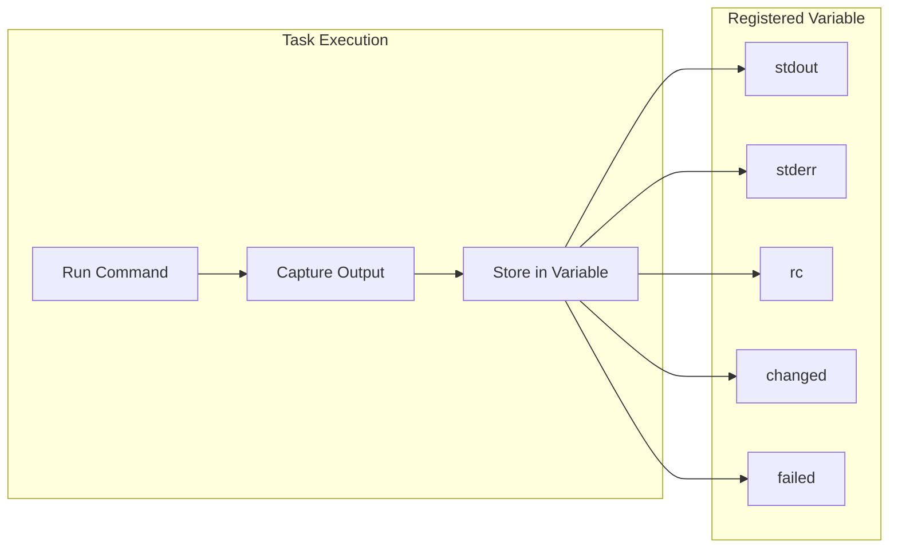
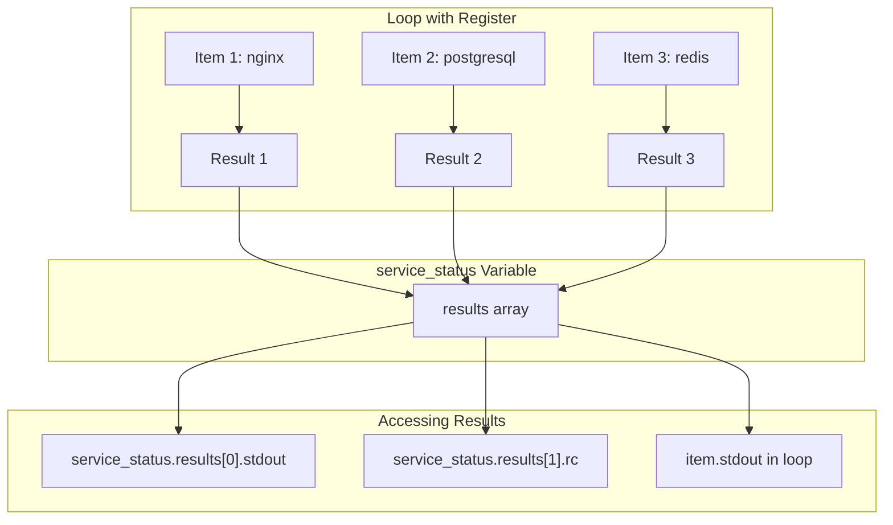
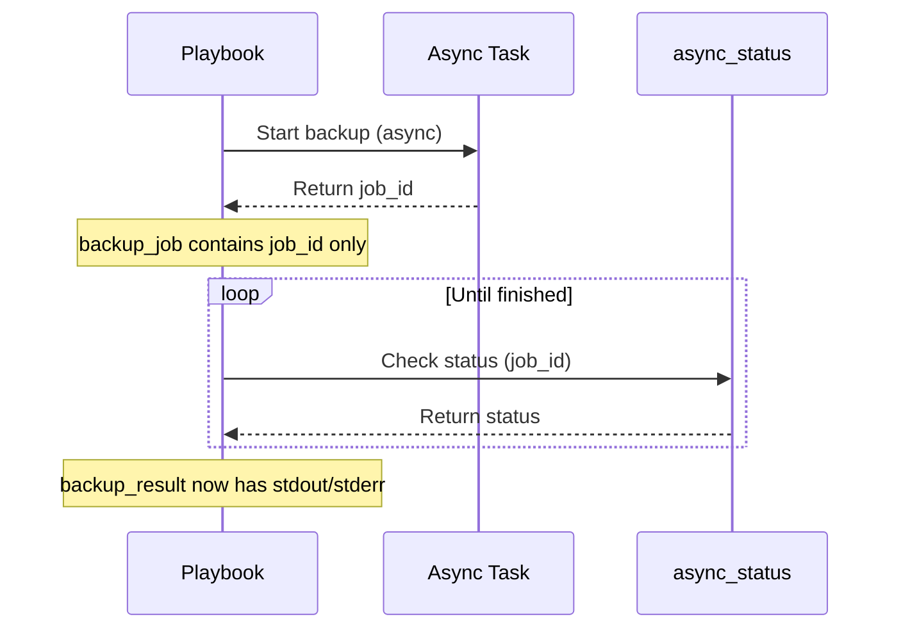
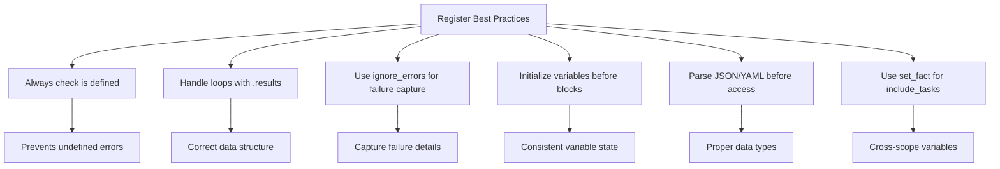

# How to Fix 'Register Variable' Capture Errors

Author: [nawazdhandala](https://www.github.com/nawazdhandala)

Tags: Ansible, Debugging, Variables, Automation, DevOps, Troubleshooting, Register

Description: Learn how to diagnose and fix common Ansible register variable capture errors, including undefined variables, loop handling, and scope issues.

---

The `register` keyword in Ansible captures task output for later use. When it fails, your playbooks break in frustrating ways. This guide covers the most common register variable errors and how to fix them.

## Understanding Register Variables

When you register a task's output, Ansible creates a variable containing the task results.



Basic register usage:

```yaml
---
# Basic register example
- name: Get current date
  ansible.builtin.command: date
  register: date_output

- name: Display the date
  ansible.builtin.debug:
    msg: "Current date is {{ date_output.stdout }}"
```

## Error 1: Undefined Variable in Conditional

**The Problem:**

```yaml
- name: Check service status
  ansible.builtin.command: systemctl is-active nginx
  register: nginx_status
  ignore_errors: true
  when: check_nginx | default(true)

# This fails when check_nginx is false
- name: Restart if not running
  ansible.builtin.service:
    name: nginx
    state: restarted
  when: nginx_status.rc != 0
```

Error message:
```
The task includes an option with an undefined variable.
The error was: 'dict object' has no attribute 'rc'
```

**The Fix:**

Use `is defined` or default values:

```yaml
---
# Fix 1: Check if variable is defined
- name: Check service status
  ansible.builtin.command: systemctl is-active nginx
  register: nginx_status
  ignore_errors: true
  when: check_nginx | default(true)

- name: Restart if not running
  ansible.builtin.service:
    name: nginx
    state: restarted
  # Only run if nginx_status exists AND rc is not 0
  when:
    - nginx_status is defined
    - nginx_status.rc is defined
    - nginx_status.rc != 0

# Fix 2: Use default filter
- name: Restart if not running (alternative)
  ansible.builtin.service:
    name: nginx
    state: restarted
  when: (nginx_status.rc | default(0)) != 0
```

## Error 2: Register in Loops Returns Unexpected Structure

**The Problem:**

```yaml
- name: Check multiple services
  ansible.builtin.command: "systemctl is-active {{ item }}"
  loop:
    - nginx
    - postgresql
    - redis
  register: service_status
  ignore_errors: true

# This does not work as expected
- name: Show status
  ansible.builtin.debug:
    msg: "{{ service_status.stdout }}"
```

Error message:
```
'dict object' has no attribute 'stdout'
```

**The Fix:**

When using register with loops, results are stored in a `results` array:

```yaml
---
# Correct way to access loop results
- name: Check multiple services
  ansible.builtin.command: "systemctl is-active {{ item }}"
  loop:
    - nginx
    - postgresql
    - redis
  register: service_status
  ignore_errors: true

# Access individual results
- name: Show all results
  ansible.builtin.debug:
    msg: "{{ item.item }}: {{ item.stdout }}"
  loop: "{{ service_status.results }}"

# Filter for failed services
- name: Show failed services
  ansible.builtin.debug:
    msg: "Service {{ item.item }} is not running"
  loop: "{{ service_status.results }}"
  when: item.rc != 0

# Create a list of failed services
- name: Set fact for failed services
  ansible.builtin.set_fact:
    failed_services: "{{ service_status.results | selectattr('rc', 'ne', 0) | map(attribute='item') | list }}"

- name: Display failed services
  ansible.builtin.debug:
    msg: "Failed services: {{ failed_services }}"
```



## Error 3: Skipped Tasks Have Different Structure

**The Problem:**

```yaml
- name: Get package version on Debian
  ansible.builtin.command: dpkg -l nginx
  register: pkg_version
  when: ansible_os_family == "Debian"

# Fails on non-Debian systems
- name: Show version
  ansible.builtin.debug:
    msg: "Version: {{ pkg_version.stdout_lines[1] }}"
```

Error message:
```
'dict object' has no attribute 'stdout_lines'
```

**The Fix:**

Skipped tasks have a `skipped` attribute but no output attributes:

```yaml
---
# Check if task was skipped
- name: Get package version on Debian
  ansible.builtin.command: dpkg -l nginx
  register: pkg_version
  when: ansible_os_family == "Debian"

- name: Show version (safe)
  ansible.builtin.debug:
    msg: "Version: {{ pkg_version.stdout_lines[1] }}"
  # Only run if the task was not skipped
  when:
    - pkg_version is not skipped
    - pkg_version.stdout_lines is defined

# Alternative: Use default for missing attributes
- name: Show version with default
  ansible.builtin.debug:
    msg: "Version: {{ pkg_version.stdout_lines[1] | default('N/A') }}"
  when: pkg_version.stdout_lines is defined and pkg_version.stdout_lines | length > 1
```

## Error 4: Variable Scope Issues in Blocks

**The Problem:**

```yaml
- name: Database operations
  block:
    - name: Check database status
      ansible.builtin.command: pg_isready
      register: db_status

  rescue:
    - name: Log failure
      ansible.builtin.debug:
        msg: "Database check failed"

# Variable may not be defined if block failed early
- name: Report status
  ansible.builtin.debug:
    msg: "DB Status: {{ db_status.rc }}"
```

**The Fix:**

```yaml
---
# Initialize variable before block
- name: Initialize status variable
  ansible.builtin.set_fact:
    db_status:
      rc: -1
      stdout: "Not checked"

- name: Database operations
  block:
    - name: Check database status
      ansible.builtin.command: pg_isready
      register: db_status

  rescue:
    - name: Set failure status
      ansible.builtin.set_fact:
        db_status:
          rc: 1
          stdout: "Database check failed"
          failed: true

# Now db_status is always defined
- name: Report status
  ansible.builtin.debug:
    msg: "DB Status: {{ db_status.rc }} - {{ db_status.stdout }}"
```

## Error 5: Async Tasks and Register

**The Problem:**

```yaml
- name: Long running task
  ansible.builtin.command: /opt/backup.sh
  async: 3600
  poll: 0
  register: backup_job

# This does not contain the actual output
- name: Show output
  ansible.builtin.debug:
    msg: "{{ backup_job.stdout }}"
```

Error message:
```
'dict object' has no attribute 'stdout'
```

**The Fix:**

Async tasks return job info, not task output. Use `async_status` to get results:

```yaml
---
# Start async task
- name: Long running task
  ansible.builtin.command: /opt/backup.sh
  async: 3600
  poll: 0
  register: backup_job

# Wait for completion and get results
- name: Wait for backup to complete
  ansible.builtin.async_status:
    jid: "{{ backup_job.ansible_job_id }}"
  register: backup_result
  until: backup_result.finished
  retries: 120
  delay: 30

# Now backup_result has the actual output
- name: Show backup output
  ansible.builtin.debug:
    msg: "Backup completed: {{ backup_result.stdout }}"
```



## Error 6: Failed Tasks and Register

**The Problem:**

```yaml
- name: Run command that might fail
  ansible.builtin.command: /opt/check.sh
  register: check_result

# Playbook stops before reaching this
- name: Handle the result
  ansible.builtin.debug:
    msg: "Result: {{ check_result.rc }}"
```

**The Fix:**

Use `ignore_errors` or `failed_when` to capture failed task output:

```yaml
---
# Option 1: Ignore errors and check later
- name: Run command that might fail
  ansible.builtin.command: /opt/check.sh
  register: check_result
  ignore_errors: true

- name: Handle success
  ansible.builtin.debug:
    msg: "Check passed: {{ check_result.stdout }}"
  when: check_result.rc == 0

- name: Handle failure
  ansible.builtin.debug:
    msg: "Check failed: {{ check_result.stderr }}"
  when: check_result.rc != 0

# Option 2: Custom failure condition
- name: Run command with custom failure check
  ansible.builtin.command: /opt/check.sh
  register: check_result
  # Only fail if return code is greater than 1
  # rc=1 might mean "check found issues" vs rc=2 "check crashed"
  failed_when: check_result.rc > 1

- name: Process results
  ansible.builtin.debug:
    msg: "Issues found: {{ check_result.stdout_lines | length }}"
  when: check_result.rc == 1
```

## Error 7: Register with include_tasks

**The Problem:**

```yaml
# main.yml
- name: Include tasks and capture output
  ansible.builtin.include_tasks: subtasks.yml
  register: included_result

# included_result does not contain task outputs from subtasks.yml
```

**The Fix:**

Register with `include_tasks` captures inclusion metadata, not task results. Use `set_fact` to pass data back:

```yaml
---
# subtasks.yml
- name: Run the actual command
  ansible.builtin.command: whoami
  register: _whoami_result

- name: Export result to parent scope
  ansible.builtin.set_fact:
    whoami_result: "{{ _whoami_result }}"

# main.yml
- name: Include tasks
  ansible.builtin.include_tasks: subtasks.yml

# Now whoami_result is available
- name: Show result
  ansible.builtin.debug:
    msg: "User is {{ whoami_result.stdout }}"
```

## Error 8: Complex Data Type Handling

**The Problem:**

```yaml
- name: Get JSON output
  ansible.builtin.command: cat /etc/app/config.json
  register: config_output

# This is a string, not a dict
- name: Access config value
  ansible.builtin.debug:
    msg: "{{ config_output.stdout.database.host }}"
```

Error message:
```
'str object' has no attribute 'database'
```

**The Fix:**

Parse JSON output before accessing nested values:

```yaml
---
# Parse JSON from command output
- name: Get JSON output
  ansible.builtin.command: cat /etc/app/config.json
  register: config_output

- name: Parse JSON and set fact
  ansible.builtin.set_fact:
    config: "{{ config_output.stdout | from_json }}"

- name: Access parsed config
  ansible.builtin.debug:
    msg: "Database host: {{ config.database.host }}"

# Or inline parsing
- name: Access inline
  ansible.builtin.debug:
    msg: "Database host: {{ (config_output.stdout | from_json).database.host }}"

# For YAML output
- name: Get YAML output
  ansible.builtin.command: cat /etc/app/config.yaml
  register: yaml_output

- name: Parse YAML
  ansible.builtin.set_fact:
    yaml_config: "{{ yaml_output.stdout | from_yaml }}"
```

## Debugging Register Variables

### Inspect Variable Structure

```yaml
---
# Show complete variable structure
- name: Run command
  ansible.builtin.command: ls -la /tmp
  register: ls_result

- name: Show full variable
  ansible.builtin.debug:
    var: ls_result

- name: Show variable type
  ansible.builtin.debug:
    msg: "Type: {{ ls_result | type_debug }}"

# Show available attributes
- name: Show keys
  ansible.builtin.debug:
    msg: "Available keys: {{ ls_result.keys() | list }}"
```

### Common Variable Attributes

```yaml
# Command/shell module attributes
register_var.stdout          # Standard output as string
register_var.stdout_lines    # Standard output as list
register_var.stderr          # Standard error as string
register_var.stderr_lines    # Standard error as list
register_var.rc              # Return code
register_var.cmd             # Command that was run
register_var.start           # Start time
register_var.end             # End time
register_var.delta           # Execution duration

# Common attributes for all tasks
register_var.changed         # Whether task made changes
register_var.failed          # Whether task failed
register_var.skipped         # Whether task was skipped
register_var.msg             # Status message

# Loop attributes
register_var.results         # List of results from loop
register_var.results[0].item # The item from loop iteration
```

## Best Practices Summary



```yaml
---
# Complete example with best practices
- name: Safe register pattern
  hosts: all
  vars:
    services_to_check:
      - nginx
      - postgresql

  tasks:
    # Initialize variables
    - name: Initialize results
      ansible.builtin.set_fact:
        service_results: []

    # Check services with loop
    - name: Check services
      ansible.builtin.command: "systemctl is-active {{ item }}"
      loop: "{{ services_to_check }}"
      register: service_check
      ignore_errors: true

    # Process results safely
    - name: Process service results
      ansible.builtin.set_fact:
        service_results: >-
          {{
            service_check.results | default([]) |
            map('combine', {'name': item.item}) |
            list
          }}
      when: service_check.results is defined

    # Report with safe access
    - name: Report service status
      ansible.builtin.debug:
        msg: "{{ item.name }}: {{ 'running' if item.rc == 0 else 'stopped' }}"
      loop: "{{ service_results }}"
      when:
        - service_results | length > 0
        - item.rc is defined
```

---

Register variables are powerful but require careful handling. Always check for definition, handle loops correctly, and use appropriate failure handling. These patterns will save you hours of debugging cryptic error messages.
