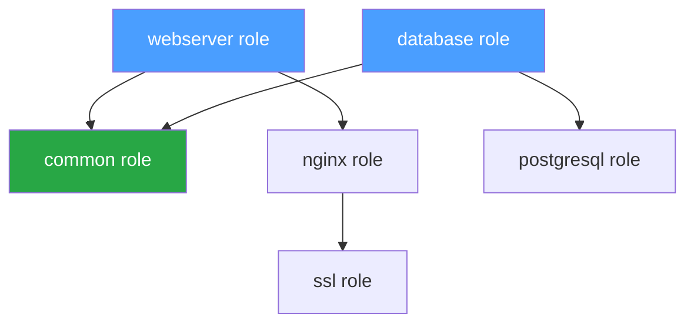
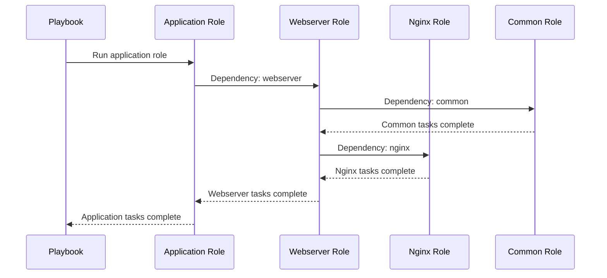
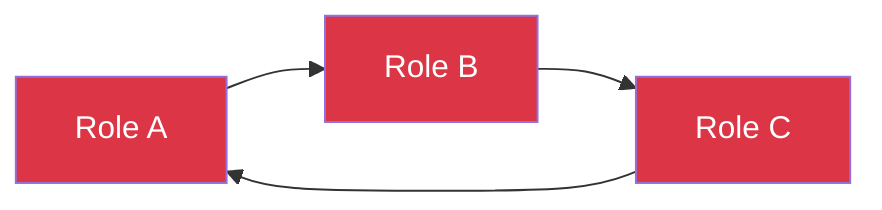

# How to Handle Ansible Roles Dependencies

Author: [nawazdhandala](https://www.github.com/nawazdhandala)

Tags: Ansible, DevOps, Configuration Management, Automation, Infrastructure as Code, Roles

Description: A practical guide to managing role dependencies in Ansible, including meta/main.yml configuration, Galaxy requirements, and best practices for complex role hierarchies.

---

Managing dependencies between Ansible roles is essential for building reusable, modular automation. This guide covers how to define, organize, and troubleshoot role dependencies effectively.

## Understanding Role Dependencies

Role dependencies allow you to automatically include other roles when a role is executed. This creates a hierarchy where roles can build upon each other.



### How Dependencies Work

When you run a role with dependencies:

1. Ansible reads the role's `meta/main.yml` file
2. Dependencies are executed first, in order
3. The main role executes after all dependencies complete
4. By default, dependencies only run once per play

## Defining Role Dependencies

### Basic Dependency Configuration

Create or edit `meta/main.yml` in your role:

```yaml
# roles/webserver/meta/main.yml
---
# Role metadata
galaxy_info:
  author: your_name
  description: Web server role with nginx
  license: MIT
  min_ansible_version: "2.10"
  platforms:
    - name: Ubuntu
      versions:
        - focal
        - jammy
    - name: Debian
      versions:
        - bullseye

# Role dependencies - executed before this role
dependencies:
  # Simple dependency - just the role name
  - common

  # Dependency with variables
  - role: nginx
    vars:
      nginx_worker_processes: 4
      nginx_worker_connections: 1024

  # Dependency with conditional
  - role: ssl
    when: enable_ssl | default(true)
```

### Dependency with Role Parameters

Pass variables to dependent roles:

```yaml
# roles/application/meta/main.yml
---
dependencies:
  # Configure the database role with specific settings
  - role: database
    vars:
      db_name: "{{ app_database_name }}"
      db_user: "{{ app_database_user }}"
      db_password: "{{ app_database_password }}"

  # Configure the webserver with app-specific settings
  - role: webserver
    vars:
      document_root: "/var/www/{{ app_name }}"
      server_name: "{{ app_domain }}"
```

### Conditional Dependencies

Only include dependencies when conditions are met:

```yaml
# roles/monitoring/meta/main.yml
---
dependencies:
  # Always include common
  - common

  # Only include prometheus exporter on Linux
  - role: node_exporter
    when: ansible_os_family != "Windows"

  # Include Windows exporter on Windows
  - role: windows_exporter
    when: ansible_os_family == "Windows"

  # Only include alerting if configured
  - role: alertmanager
    when: monitoring_alerts_enabled | default(false)
```

## Managing External Dependencies with Galaxy

### Requirements File

Define external role dependencies in `requirements.yml`:

```yaml
# requirements.yml
---
roles:
  # From Ansible Galaxy
  - name: geerlingguy.docker
    version: "6.1.0"

  - name: geerlingguy.nginx
    version: "3.1.0"

  # From GitHub
  - name: my_custom_role
    src: https://github.com/username/ansible-role-custom
    version: v1.2.0

  # From a private Git repository
  - name: internal_role
    src: git@github.com:company/ansible-role-internal.git
    version: main
    scm: git

collections:
  # Collection dependencies
  - name: community.general
    version: ">=5.0.0"

  - name: ansible.posix
    version: ">=1.4.0"
```

### Installing Dependencies

```bash
# Install role dependencies
ansible-galaxy install -r requirements.yml

# Install to a specific path
ansible-galaxy install -r requirements.yml -p ./roles

# Force reinstall
ansible-galaxy install -r requirements.yml --force

# Install with verbose output
ansible-galaxy install -r requirements.yml -vvv
```

### Project Structure with Dependencies

```
project/
├── ansible.cfg
├── requirements.yml
├── playbooks/
│   └── site.yml
├── roles/
│   ├── requirements.yml      # Role-specific requirements
│   ├── common/
│   │   ├── tasks/
│   │   ├── handlers/
│   │   ├── defaults/
│   │   └── meta/
│   │       └── main.yml
│   ├── webserver/
│   │   ├── tasks/
│   │   ├── handlers/
│   │   ├── templates/
│   │   ├── defaults/
│   │   └── meta/
│   │       └── main.yml
│   └── application/
│       ├── tasks/
│       ├── templates/
│       ├── defaults/
│       └── meta/
│           └── main.yml
└── inventory/
    └── hosts.yml
```

## Dependency Execution Order



### Controlling Execution with allow_duplicates

By default, dependencies run only once. Override this behavior:

```yaml
# roles/logging/meta/main.yml
---
# Allow this role to run multiple times
allow_duplicates: true

dependencies:
  - common
```

Use case for `allow_duplicates`:

```yaml
# roles/app1/meta/main.yml
dependencies:
  - role: logging
    vars:
      log_path: /var/log/app1

# roles/app2/meta/main.yml
dependencies:
  - role: logging
    vars:
      log_path: /var/log/app2
```

## Advanced Dependency Patterns

### Layered Dependencies

Create a dependency hierarchy for complex applications:

```yaml
# roles/lamp_stack/meta/main.yml
---
dependencies:
  - role: common
    vars:
      common_packages:
        - curl
        - wget
        - unzip

  - role: apache
    vars:
      apache_mods_enabled:
        - rewrite
        - ssl

  - role: mysql
    vars:
      mysql_root_password: "{{ vault_mysql_root_password }}"

  - role: php
    vars:
      php_version: "8.1"
      php_modules:
        - mysql
        - gd
        - mbstring
```

### Dynamic Dependencies Based on Variables

```yaml
# roles/container_runtime/meta/main.yml
---
dependencies:
  # Base dependencies
  - common

  # Dynamic dependency based on container runtime choice
  - role: docker
    when: container_runtime == "docker"

  - role: containerd
    when: container_runtime == "containerd"

  - role: podman
    when: container_runtime == "podman"
```

### Using include_role for Runtime Dependencies

For more control, use `include_role` in tasks instead of meta dependencies:

```yaml
# roles/application/tasks/main.yml
---
# Dynamic role inclusion based on conditions
- name: Include database role
  ansible.builtin.include_role:
    name: "{{ database_type }}"
  vars:
    db_name: "{{ app_db_name }}"
  when: setup_database | default(true)

- name: Include cache role
  ansible.builtin.include_role:
    name: redis
  when: enable_caching | default(false)

- name: Include monitoring based on environment
  ansible.builtin.include_role:
    name: "{{ item }}"
  loop: "{{ monitoring_roles }}"
  when: monitoring_enabled | default(true)
```

## Troubleshooting Dependency Issues

### Common Problems and Solutions

#### Problem 1: Circular Dependencies



**Error message:**
```
ERROR! A recursion loop was detected
```

**Solution:** Refactor to remove circular references:

```yaml
# Instead of circular dependencies, create a base role
# roles/base/meta/main.yml
dependencies: []

# roles/role_a/meta/main.yml
dependencies:
  - base

# roles/role_b/meta/main.yml
dependencies:
  - base

# roles/role_c/meta/main.yml
dependencies:
  - base
```

#### Problem 2: Missing Role Dependencies

**Error message:**
```
ERROR! the role 'missing_role' was not found
```

**Solution:** Check role paths and install missing roles:

```bash
# Verify role exists
ls -la roles/

# Check ansible.cfg for roles_path
grep roles_path ansible.cfg

# Install from Galaxy
ansible-galaxy install missing_role

# Install from requirements
ansible-galaxy install -r requirements.yml
```

#### Problem 3: Version Conflicts

**Solution:** Pin specific versions in requirements.yml:

```yaml
# requirements.yml
---
roles:
  - name: geerlingguy.docker
    version: "6.1.0"  # Pin specific version

  - name: geerlingguy.pip
    version: ">=2.0.0,<3.0.0"  # Version range
```

### Debugging Dependencies

```bash
# List role dependencies
ansible-galaxy role list

# Verbose output shows dependency resolution
ansible-playbook playbook.yml -vvv

# Check role info
ansible-galaxy role info geerlingguy.docker

# Verify role structure
ansible-galaxy role init --init-path=./test test_role
```

### Dependency Resolution Debugging

Add debug output to understand execution order:

```yaml
# roles/common/tasks/main.yml
---
- name: Debug - Common role starting
  ansible.builtin.debug:
    msg: "Common role executing on {{ inventory_hostname }}"

# Continue with actual tasks...
```

## Best Practices

### 1. Keep Dependencies Minimal

```yaml
# Good - minimal, focused dependencies
dependencies:
  - common

# Avoid - too many dependencies create tight coupling
dependencies:
  - common
  - logging
  - monitoring
  - security
  - networking
  - firewall
```

### 2. Use Semantic Versioning

```yaml
# requirements.yml
roles:
  - name: my_role
    version: "2.1.0"  # Major.Minor.Patch
```

### 3. Document Dependencies

```yaml
# roles/webserver/meta/main.yml
---
# Dependencies:
# - common: Base packages and configuration
# - nginx: Web server installation (configures worker processes)
# - ssl: TLS certificate management (optional, controlled by enable_ssl)

dependencies:
  - common
  - role: nginx
    vars:
      nginx_worker_processes: auto
  - role: ssl
    when: enable_ssl | default(true)
```

### 4. Test Dependencies Independently

```yaml
# tests/test_dependencies.yml
---
- name: Test role dependencies
  hosts: localhost
  gather_facts: true

  tasks:
    - name: Include role with dependencies
      ansible.builtin.include_role:
        name: webserver
      vars:
        enable_ssl: false

    - name: Verify nginx is installed
      ansible.builtin.command: nginx -v
      register: nginx_version
      changed_when: false

    - name: Assert nginx is working
      ansible.builtin.assert:
        that:
          - nginx_version.rc == 0
        fail_msg: "Nginx dependency not properly installed"
```

### 5. Use Collections for Complex Dependencies

```yaml
# galaxy.yml for a collection
namespace: mycompany
name: infrastructure
version: 1.0.0

dependencies:
  community.general: ">=5.0.0"
  ansible.posix: ">=1.4.0"
```

---

Role dependencies in Ansible enable modular, reusable automation. Define them in `meta/main.yml`, manage external dependencies with Galaxy requirements files, and follow best practices to avoid circular references and version conflicts. Start simple, document your dependencies, and test thoroughly.
