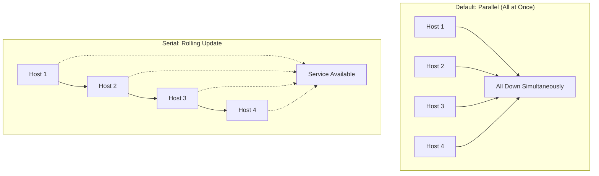
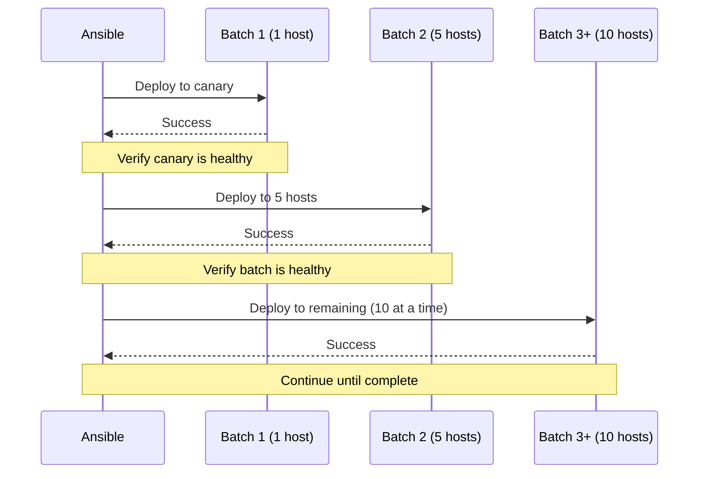
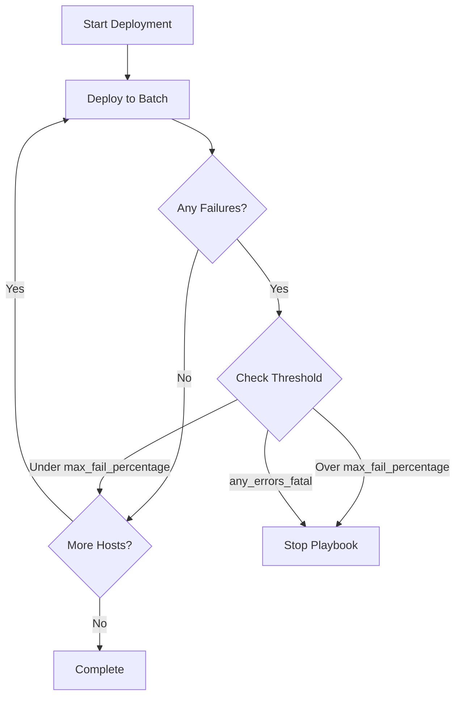
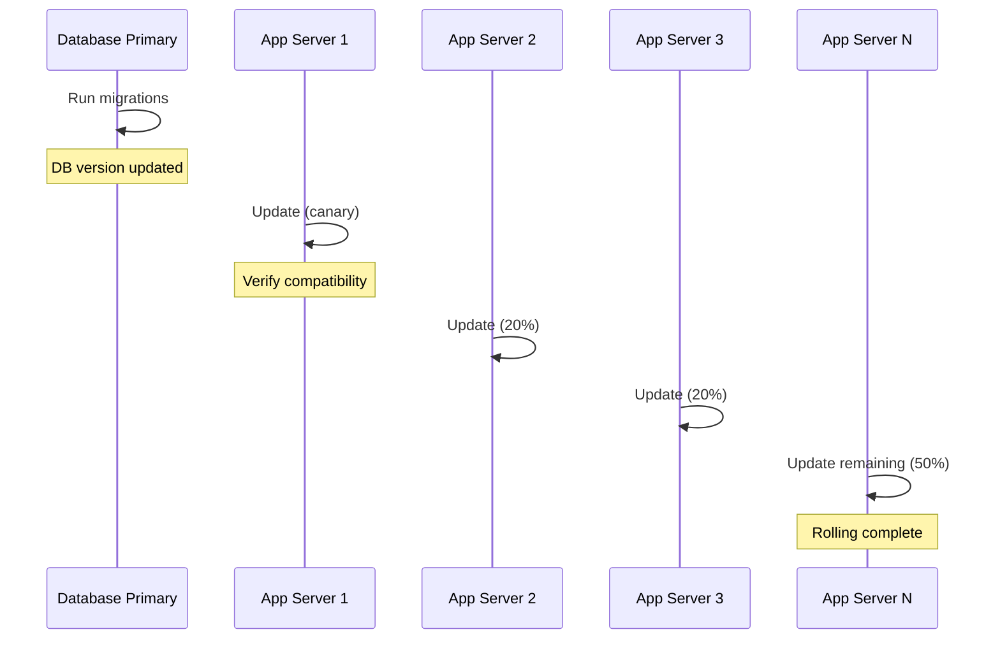
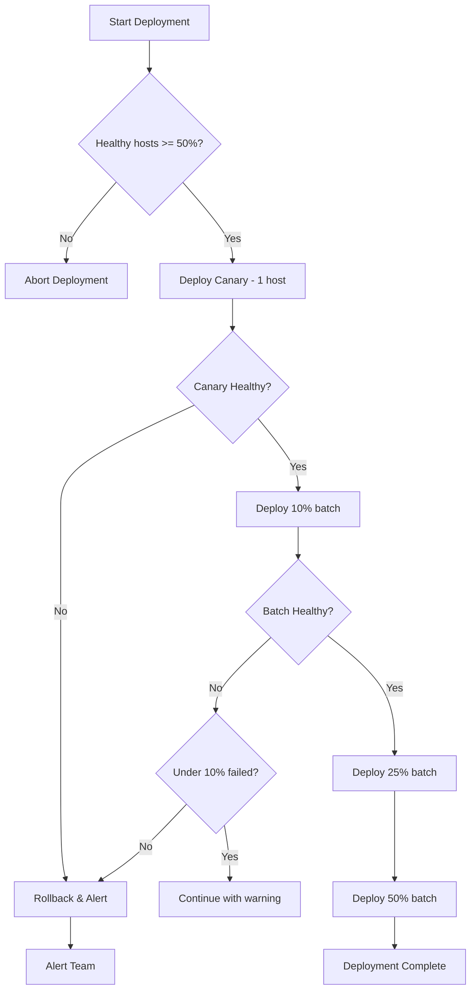

# How to Handle Ansible Serial Execution

Author: [nawazdhandala](https://www.github.com/nawazdhandala)

Tags: Ansible, Serial, Rolling Updates, Deployment, DevOps, High Availability, Automation

Description: Learn how to use Ansible serial execution for rolling updates, batch processing, and controlled deployments across your infrastructure.

---

By default, Ansible runs tasks on all hosts in parallel. While this is fast, it can cause service outages during deployments. Serial execution lets you update hosts in batches, maintaining service availability throughout the process.

## Understanding Serial Execution

Serial controls how many hosts Ansible updates simultaneously.



## Basic Serial Usage

### Fixed Number of Hosts

```yaml
---
# Update 2 hosts at a time
- name: Rolling application update
  hosts: webservers
  serial: 2

  tasks:
    - name: Stop application
      ansible.builtin.service:
        name: myapp
        state: stopped

    - name: Update application
      ansible.builtin.copy:
        src: /releases/myapp-latest/
        dest: /opt/myapp/
        owner: appuser
        group: appuser

    - name: Start application
      ansible.builtin.service:
        name: myapp
        state: started

    - name: Wait for application to be healthy
      ansible.builtin.uri:
        url: "http://localhost:8080/health"
        status_code: 200
      register: health_check
      until: health_check.status == 200
      retries: 30
      delay: 5
```

### Percentage of Hosts

```yaml
---
# Update 25% of hosts at a time
- name: Rolling update by percentage
  hosts: webservers
  serial: "25%"

  tasks:
    - name: Deploy application
      ansible.builtin.include_role:
        name: deploy_app
```

### Progressive Batches

Start small, then increase batch size as confidence grows.

```yaml
---
# Canary deployment pattern
- name: Progressive rolling update
  hosts: webservers
  # First batch: 1 host (canary)
  # Second batch: 5 hosts
  # Remaining batches: 10 hosts each
  serial:
    - 1
    - 5
    - 10

  tasks:
    - name: Deploy application
      ansible.builtin.include_role:
        name: deploy_app

    - name: Run smoke tests
      ansible.builtin.include_role:
        name: smoke_tests
```



### Mixed Percentage and Fixed Numbers

```yaml
---
# Combine percentages and numbers
- name: Mixed batch deployment
  hosts: webservers
  serial:
    - 1          # First: 1 host (canary)
    - "10%"      # Second: 10% of remaining
    - "25%"      # Third+: 25% of remaining

  tasks:
    - name: Deploy application
      ansible.builtin.include_role:
        name: deploy_app
```

## Controlling Failure Behavior

### max_fail_percentage

Stop the playbook if too many hosts fail.

```yaml
---
- name: Deployment with failure threshold
  hosts: webservers
  serial: 5
  # Stop if more than 20% of hosts fail
  max_fail_percentage: 20

  tasks:
    - name: Deploy application
      ansible.builtin.include_role:
        name: deploy_app
```

### any_errors_fatal

Stop immediately if any host fails.

```yaml
---
- name: Critical deployment
  hosts: database_servers
  serial: 1
  # Stop on first failure
  any_errors_fatal: true

  tasks:
    - name: Update database schema
      ansible.builtin.command: /opt/db/migrate.sh
```



## Load Balancer Integration

Remove hosts from the load balancer before updating.

```yaml
---
- name: Zero-downtime deployment
  hosts: webservers
  serial: 2
  max_fail_percentage: 25

  tasks:
    # Remove from load balancer
    - name: Disable in HAProxy
      community.general.haproxy:
        state: disabled
        host: "{{ inventory_hostname }}"
        socket: /var/lib/haproxy/stats
        backend: webservers
        wait: true
        drain: true
      delegate_to: "{{ item }}"
      loop: "{{ groups['loadbalancers'] }}"

    # Wait for connections to drain
    - name: Wait for connections to drain
      ansible.builtin.wait_for:
        timeout: 30

    # Stop and update application
    - name: Stop application
      ansible.builtin.service:
        name: myapp
        state: stopped

    - name: Deploy new version
      ansible.builtin.unarchive:
        src: "/releases/myapp-{{ app_version }}.tar.gz"
        dest: /opt/myapp/
        remote_src: true

    - name: Start application
      ansible.builtin.service:
        name: myapp
        state: started

    # Health check before re-enabling
    - name: Wait for application health
      ansible.builtin.uri:
        url: "http://localhost:8080/health"
        status_code: 200
      register: health
      until: health.status == 200
      retries: 60
      delay: 5

    # Re-enable in load balancer
    - name: Enable in HAProxy
      community.general.haproxy:
        state: enabled
        host: "{{ inventory_hostname }}"
        socket: /var/lib/haproxy/stats
        backend: webservers
      delegate_to: "{{ item }}"
      loop: "{{ groups['loadbalancers'] }}"
```

## Kubernetes-Style Rolling Updates

Implement Kubernetes-like rolling update semantics.

```yaml
---
- name: Kubernetes-style rolling update
  hosts: app_servers
  serial: 1
  max_fail_percentage: 0

  vars:
    min_ready_seconds: 30
    max_unavailable: 1
    max_surge: 1

  tasks:
    - name: Check current ready pods
      ansible.builtin.set_fact:
        ready_hosts: "{{ groups['app_servers'] | length }}"
        updating_host: "{{ inventory_hostname }}"

    # Verify minimum availability before proceeding
    - name: Verify minimum availability
      ansible.builtin.assert:
        that:
          - (ready_hosts | int - 1) >= (groups['app_servers'] | length - max_unavailable)
        fail_msg: "Cannot update - would violate max_unavailable constraint"

    - name: Stop old version
      ansible.builtin.service:
        name: myapp
        state: stopped

    - name: Deploy new version
      ansible.builtin.include_role:
        name: deploy_app

    - name: Start new version
      ansible.builtin.service:
        name: myapp
        state: started

    # Wait minimum ready time
    - name: Wait for minimum ready seconds
      ansible.builtin.wait_for:
        timeout: "{{ min_ready_seconds }}"

    - name: Verify application is healthy
      ansible.builtin.uri:
        url: "http://localhost:8080/health"
        status_code: 200
      register: health
      until: health.status == 200
      retries: 30
      delay: 5
```

## Database Migration Pattern

Coordinate database migrations with rolling application updates.

```yaml
---
# Step 1: Run database migrations (once)
- name: Database migration
  hosts: database_primary
  tasks:
    - name: Run pending migrations
      ansible.builtin.command: /opt/app/migrate.sh
      register: migration
      changed_when: "'Migrations applied' in migration.stdout"

    - name: Record migration version
      ansible.builtin.set_fact:
        db_version: "{{ migration.stdout | regex_search('version: (\\d+)', '\\1') | first }}"

---
# Step 2: Rolling update application servers
- name: Application update
  hosts: app_servers
  serial:
    - 1
    - "20%"
    - "50%"
  max_fail_percentage: 10

  tasks:
    - name: Deploy application version matching DB
      ansible.builtin.include_role:
        name: deploy_app
      vars:
        app_db_version: "{{ hostvars[groups['database_primary'][0]]['db_version'] }}"
```



## Throttling with throttle Directive

For task-level control within serial batches.

```yaml
---
- name: Deployment with task throttling
  hosts: webservers
  serial: 10

  tasks:
    # Run on all 10 hosts in batch simultaneously
    - name: Stop application
      ansible.builtin.service:
        name: myapp
        state: stopped

    # Throttle artifact download to avoid network saturation
    - name: Download artifact
      ansible.builtin.get_url:
        url: "https://artifacts.example.com/myapp-{{ version }}.tar.gz"
        dest: /tmp/myapp.tar.gz
      # Only 2 hosts download simultaneously
      throttle: 2

    # Extract on all hosts
    - name: Extract artifact
      ansible.builtin.unarchive:
        src: /tmp/myapp.tar.gz
        dest: /opt/myapp/
        remote_src: true

    - name: Start application
      ansible.builtin.service:
        name: myapp
        state: started
```

## Run Once Per Batch

Execute a task once per serial batch.

```yaml
---
- name: Batch notification deployment
  hosts: webservers
  serial: 5

  tasks:
    - name: Notify monitoring - batch starting
      ansible.builtin.uri:
        url: "https://monitoring.example.com/api/maintenance"
        method: POST
        body_format: json
        body:
          action: start
          hosts: "{{ ansible_play_batch }}"
      # Run once per batch, not per host
      run_once: true
      delegate_to: localhost

    - name: Deploy application
      ansible.builtin.include_role:
        name: deploy_app

    - name: Notify monitoring - batch complete
      ansible.builtin.uri:
        url: "https://monitoring.example.com/api/maintenance"
        method: POST
        body_format: json
        body:
          action: complete
          hosts: "{{ ansible_play_batch }}"
      run_once: true
      delegate_to: localhost
```

## Advanced: Dynamic Serial Value

Calculate serial value based on inventory size.

```yaml
---
- name: Dynamic serial deployment
  hosts: webservers
  # Calculate 25% but minimum 1 and maximum 10
  serial: "{{ [[(groups['webservers'] | length * 0.25) | int, 1] | max, 10] | min }}"

  tasks:
    - name: Deploy application
      ansible.builtin.include_role:
        name: deploy_app
```

## Order Control with order Directive

Control the order hosts are processed.

```yaml
---
- name: Ordered deployment
  hosts: webservers
  serial: 2
  # Options: inventory, reverse_inventory, sorted, reverse_sorted, shuffle
  order: sorted

  tasks:
    - name: Deploy application
      ansible.builtin.include_role:
        name: deploy_app
```

```yaml
---
# Shuffle for even distribution of load
- name: Randomized deployment
  hosts: webservers
  serial: 3
  order: shuffle

  tasks:
    - name: Deploy
      ansible.builtin.include_role:
        name: deploy_app
```

## Complete Rolling Update Example

```yaml
---
# Complete production-ready rolling update playbook
- name: Production Rolling Update
  hosts: app_servers
  serial:
    - 1       # Canary
    - "10%"   # Small batch
    - "25%"   # Medium batch
    - "50%"   # Large batch
  max_fail_percentage: 10
  any_errors_fatal: false
  order: shuffle

  vars:
    app_version: "{{ lookup('env', 'APP_VERSION') }}"
    health_check_url: "http://localhost:8080/health"
    lb_drain_timeout: 60
    health_check_retries: 30
    health_check_delay: 10

  pre_tasks:
    # Verify we have enough healthy hosts
    - name: Count current healthy hosts
      ansible.builtin.uri:
        url: "{{ health_check_url }}"
        status_code: 200
      register: pre_health
      ignore_errors: true
      delegate_to: "{{ item }}"
      loop: "{{ groups['app_servers'] }}"
      run_once: true

    - name: Set healthy host count
      ansible.builtin.set_fact:
        healthy_count: "{{ pre_health.results | selectattr('status', 'defined') | selectattr('status', 'eq', 200) | list | length }}"
      run_once: true

    - name: Verify minimum healthy hosts
      ansible.builtin.assert:
        that:
          - healthy_count | int >= (groups['app_servers'] | length * 0.5) | int
        fail_msg: "Insufficient healthy hosts ({{ healthy_count }}/{{ groups['app_servers'] | length }}). Aborting deployment."
      run_once: true

  tasks:
    # Disable in load balancer
    - name: Remove from load balancer
      ansible.builtin.include_tasks: tasks/lb_disable.yml

    # Wait for connections to drain
    - name: Wait for connection drain
      ansible.builtin.wait_for:
        timeout: "{{ lb_drain_timeout }}"

    # Stop application
    - name: Stop application service
      ansible.builtin.service:
        name: myapp
        state: stopped

    # Backup current version
    - name: Backup current deployment
      ansible.builtin.archive:
        path: /opt/myapp
        dest: "/opt/backups/myapp-{{ ansible_date_time.iso8601_basic_short }}.tar.gz"
      ignore_errors: true

    # Deploy new version
    - name: Deploy new application version
      ansible.builtin.unarchive:
        src: "https://releases.example.com/myapp-{{ app_version }}.tar.gz"
        dest: /opt/myapp/
        remote_src: true
        owner: appuser
        group: appuser

    # Update configuration
    - name: Update application configuration
      ansible.builtin.template:
        src: config.yml.j2
        dest: /opt/myapp/config.yml
        owner: appuser
        group: appuser
        mode: '0640'
      notify: Reload application

    # Start application
    - name: Start application service
      ansible.builtin.service:
        name: myapp
        state: started
        enabled: true

    # Wait for health check
    - name: Wait for application to be healthy
      ansible.builtin.uri:
        url: "{{ health_check_url }}"
        status_code: 200
      register: health
      until: health.status == 200
      retries: "{{ health_check_retries }}"
      delay: "{{ health_check_delay }}"

    # Re-enable in load balancer
    - name: Add back to load balancer
      ansible.builtin.include_tasks: tasks/lb_enable.yml

    # Verify traffic is flowing
    - name: Verify receiving traffic
      ansible.builtin.uri:
        url: "http://localhost:8080/metrics"
      register: metrics
      until: "'requests_total' in metrics.content"
      retries: 10
      delay: 5

  handlers:
    - name: Reload application
      ansible.builtin.service:
        name: myapp
        state: reloaded

  post_tasks:
    - name: Send deployment notification
      ansible.builtin.uri:
        url: "https://slack.example.com/webhook"
        method: POST
        body_format: json
        body:
          text: "Deployed {{ app_version }} to {{ inventory_hostname }}"
      delegate_to: localhost
      run_once: true
```



## Best Practices

1. **Start with canary** - Deploy to one host first to catch issues early
2. **Use progressive batches** - Increase batch size as confidence grows
3. **Set failure thresholds** - Use `max_fail_percentage` to prevent cascade failures
4. **Integrate with load balancers** - Remove hosts before updating, re-add after verification
5. **Implement health checks** - Verify application is healthy before proceeding
6. **Use throttle for heavy tasks** - Prevent network or resource saturation
7. **Shuffle order** - Distribute updates across racks/availability zones
8. **Monitor during deployment** - Watch metrics for anomalies

---

Serial execution transforms risky big-bang deployments into controlled, observable rolling updates. Start with conservative settings, monitor closely, and adjust based on your application's tolerance for partial deployments.
