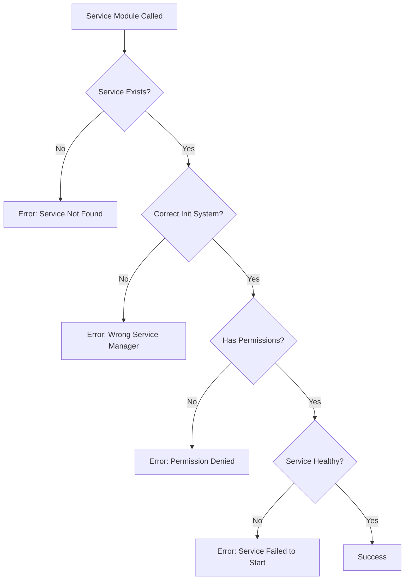
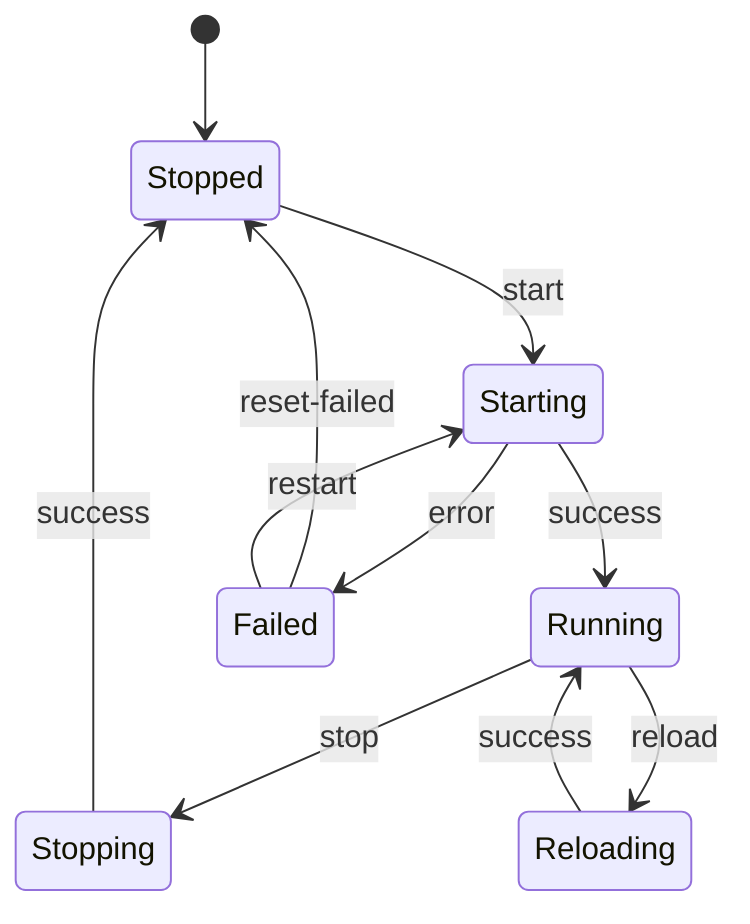

# How to Fix 'Service Module' Start/Stop Errors

Author: [nawazdhandala](https://www.github.com/nawazdhandala)

Tags: Ansible, Service Module, Systemd, DevOps, Automation, Troubleshooting, Linux

Description: Learn how to diagnose and fix common Ansible service module errors when starting, stopping, or managing system services.

---

The Ansible service module is essential for managing system services, but errors during start/stop operations can be frustrating. This guide covers the most common issues and their solutions.

---

## Common Error Messages

```
FAILED! => {"changed": false, "msg": "Could not find the requested service nginx: host"}

FAILED! => {"changed": false, "msg": "Unable to start service nginx: Job for nginx.service failed"}

FAILED! => {"changed": false, "msg": "Service is in unknown state"}
```

---

## Understanding Service Module Flow



---

## Solution 1: Service Not Found

The service module cannot find the service on the target host.

```yaml
---
# playbook.yml - Check if service exists before managing
- name: Manage nginx service safely
  hosts: webservers
  become: yes
  tasks:
    # First, check if the service file exists
    - name: Check if nginx service exists
      ansible.builtin.stat:
        path: /etc/systemd/system/nginx.service
      register: nginx_service_file

    # Alternative: Check in multiple locations
    - name: Check for service in common locations
      ansible.builtin.stat:
        path: "{{ item }}"
      loop:
        - /etc/systemd/system/nginx.service
        - /lib/systemd/system/nginx.service
        - /etc/init.d/nginx
      register: service_locations

    # Only manage service if it exists
    - name: Start nginx service
      ansible.builtin.service:
        name: nginx
        state: started
        enabled: yes
      when: nginx_service_file.stat.exists or
            service_locations.results | selectattr('stat.exists', 'true') | list | length > 0
```

---

## Solution 2: Specify the Correct Service Manager

Different systems use different init systems. Explicitly specify the service manager.

```yaml
---
# playbook.yml - Handle different init systems
- name: Manage services across init systems
  hosts: all
  become: yes
  tasks:
    # Use systemd module for systemd-based systems
    - name: Start service with systemd
      ansible.builtin.systemd:
        name: nginx
        state: started
        enabled: yes
        daemon_reload: yes
      when: ansible_service_mgr == "systemd"

    # Use service module for SysV init
    - name: Start service with SysV init
      ansible.builtin.service:
        name: nginx
        state: started
        enabled: yes
      when: ansible_service_mgr == "sysvinit"

    # Use sysvinit module explicitly for older systems
    - name: Start service on older systems
      ansible.builtin.sysvinit:
        name: nginx
        state: started
        enabled: yes
      when: ansible_service_mgr not in ["systemd", "sysvinit"]
```

---

## Solution 3: Handle Service Dependencies

Services may fail to start due to missing dependencies.

```yaml
---
# playbook.yml - Start service with dependencies
- name: Start nginx with proper dependencies
  hosts: webservers
  become: yes
  tasks:
    # Ensure required packages are installed
    - name: Install nginx and dependencies
      ansible.builtin.apt:
        name:
          - nginx
          - openssl
          - libpcre3
        state: present
        update_cache: yes

    # Check configuration before starting
    - name: Validate nginx configuration
      ansible.builtin.command: nginx -t
      register: nginx_config_test
      changed_when: false
      failed_when: nginx_config_test.rc != 0

    # Reload systemd if service file changed
    - name: Reload systemd daemon
      ansible.builtin.systemd:
        daemon_reload: yes

    # Now start the service
    - name: Start nginx service
      ansible.builtin.service:
        name: nginx
        state: started
        enabled: yes
      register: service_result

    # Debug output if service fails
    - name: Show service status on failure
      ansible.builtin.command: systemctl status nginx
      when: service_result is failed
      ignore_errors: yes
```

---

## Solution 4: Debug Service Failures

Get detailed information about why a service failed.

```yaml
---
# playbook.yml - Debug service failures
- name: Debug and fix service issues
  hosts: webservers
  become: yes
  tasks:
    - name: Attempt to start service
      ansible.builtin.service:
        name: nginx
        state: started
      register: service_start
      ignore_errors: yes

    # Block for debugging failed service
    - name: Debug service failure
      when: service_start is failed
      block:
        # Get detailed service status
        - name: Get service status
          ansible.builtin.command: systemctl status nginx --no-pager -l
          register: service_status
          ignore_errors: yes

        # Get recent journal entries
        - name: Get journal logs
          ansible.builtin.command: journalctl -u nginx --no-pager -n 50
          register: journal_logs
          ignore_errors: yes

        # Display debug information
        - name: Display service status
          ansible.builtin.debug:
            msg: "{{ service_status.stdout_lines | default(['No status available']) }}"

        - name: Display journal logs
          ansible.builtin.debug:
            msg: "{{ journal_logs.stdout_lines | default(['No logs available']) }}"

        # Fail with meaningful message
        - name: Fail with debug info
          ansible.builtin.fail:
            msg: |
              Service nginx failed to start.
              Status: {{ service_status.stdout | default('Unknown') }}
              Check the debug output above for details.
```

---

## Solution 5: Handle Port Conflicts

Services often fail when another process is using the required port.

```yaml
---
# playbook.yml - Handle port conflicts
- name: Start service after clearing port conflicts
  hosts: webservers
  become: yes
  tasks:
    # Check if port 80 is in use
    - name: Check if port 80 is available
      ansible.builtin.wait_for:
        port: 80
        state: stopped
        timeout: 5
      register: port_check
      ignore_errors: yes

    # Find process using the port
    - name: Find process using port 80
      ansible.builtin.shell: |
        # Find the PID using port 80
        lsof -i :80 -t 2>/dev/null || ss -tlnp | grep ':80 ' | awk '{print $NF}' | grep -oP 'pid=\K\d+'
      register: port_process
      when: port_check is failed
      ignore_errors: yes
      changed_when: false

    # Display conflicting process
    - name: Show conflicting process
      ansible.builtin.debug:
        msg: "Port 80 is in use by PID: {{ port_process.stdout }}"
      when: port_process.stdout | default('') | length > 0

    # Stop conflicting service (example: apache)
    - name: Stop apache if running
      ansible.builtin.service:
        name: apache2
        state: stopped
      ignore_errors: yes
      when: port_check is failed

    # Now start nginx
    - name: Start nginx service
      ansible.builtin.service:
        name: nginx
        state: started
        enabled: yes
```

---

## Solution 6: Service State Transitions

Handle proper state transitions for services.



```yaml
---
# playbook.yml - Proper service state management
- name: Manage service state transitions
  hosts: webservers
  become: yes
  tasks:
    # Reset failed state before starting
    - name: Reset failed state for service
      ansible.builtin.command: systemctl reset-failed nginx
      ignore_errors: yes
      changed_when: false

    # Stop service cleanly before restart
    - name: Ensure service is stopped
      ansible.builtin.service:
        name: nginx
        state: stopped
      ignore_errors: yes

    # Wait for service to fully stop
    - name: Wait for service to stop
      ansible.builtin.wait_for:
        port: 80
        state: stopped
        timeout: 30

    # Start service fresh
    - name: Start service
      ansible.builtin.service:
        name: nginx
        state: started
        enabled: yes

    # Verify service is running
    - name: Verify service is listening
      ansible.builtin.wait_for:
        port: 80
        state: started
        timeout: 30
```

---

## Solution 7: Handle Masked Services

Services that are masked cannot be started.

```yaml
---
# playbook.yml - Handle masked services
- name: Unmask and start service
  hosts: all
  become: yes
  tasks:
    # Check if service is masked
    - name: Check if service is masked
      ansible.builtin.command: systemctl is-enabled nginx
      register: service_enabled
      ignore_errors: yes
      changed_when: false

    # Unmask service if masked
    - name: Unmask service
      ansible.builtin.command: systemctl unmask nginx
      when: "'masked' in service_enabled.stdout"

    # Reload systemd after unmasking
    - name: Reload systemd daemon
      ansible.builtin.systemd:
        daemon_reload: yes
      when: "'masked' in service_enabled.stdout"

    # Now start the service
    - name: Start nginx service
      ansible.builtin.service:
        name: nginx
        state: started
        enabled: yes
```

---

## Solution 8: Cross-Platform Service Management

Handle services across different operating systems.

```yaml
---
# playbook.yml - Cross-platform service management
- name: Manage services across platforms
  hosts: all
  become: yes
  vars:
    # Map service names by OS
    service_name_map:
      Debian: nginx
      RedHat: nginx
      Ubuntu: nginx
      CentOS: nginx
      FreeBSD: nginx
      Darwin: nginx  # macOS

  tasks:
    # Get the correct service name
    - name: Set service name for OS
      ansible.builtin.set_fact:
        target_service: "{{ service_name_map[ansible_os_family] | default('nginx') }}"

    # Handle different init systems
    - name: Start service on systemd systems
      ansible.builtin.systemd:
        name: "{{ target_service }}"
        state: started
        enabled: yes
      when: ansible_service_mgr == "systemd"

    - name: Start service on non-systemd systems
      ansible.builtin.service:
        name: "{{ target_service }}"
        state: started
        enabled: yes
      when: ansible_service_mgr != "systemd"
```

---

## Common Error Solutions Reference

| Error | Cause | Solution |
|-------|-------|----------|
| Service not found | Package not installed | Install the package first |
| Unable to start | Configuration error | Validate config before start |
| Permission denied | Missing become/sudo | Add `become: yes` |
| Service masked | Service is disabled | Unmask the service |
| Port in use | Another service running | Stop conflicting service |
| Unknown state | Service manager mismatch | Specify correct module |

---

## Best Practices

```yaml
---
# playbook.yml - Service management best practices
- name: Service management best practices
  hosts: webservers
  become: yes
  handlers:
    # Use handlers for service restarts
    - name: Restart nginx
      ansible.builtin.service:
        name: nginx
        state: restarted

  tasks:
    # Always install package first
    - name: Ensure package is installed
      ansible.builtin.package:
        name: nginx
        state: present
      notify: Restart nginx

    # Validate configuration before notifying restart
    - name: Deploy nginx configuration
      ansible.builtin.template:
        src: nginx.conf.j2
        dest: /etc/nginx/nginx.conf
        validate: nginx -t -c %s
      notify: Restart nginx

    # Ensure service is enabled and started
    - name: Ensure nginx is started
      ansible.builtin.service:
        name: nginx
        state: started
        enabled: yes
```

---

## Quick Diagnostic Commands

```bash
# Check service status
ansible webservers -m command -a "systemctl status nginx" -b

# List all services
ansible webservers -m command -a "systemctl list-units --type=service" -b

# Check service manager
ansible webservers -m setup -a "filter=ansible_service_mgr"

# View service logs
ansible webservers -m command -a "journalctl -u nginx -n 20" -b
```

---

*Managing services across your infrastructure? [OneUptime](https://oneuptime.com) provides comprehensive monitoring for your services, with instant alerts when services fail or become unresponsive.*
