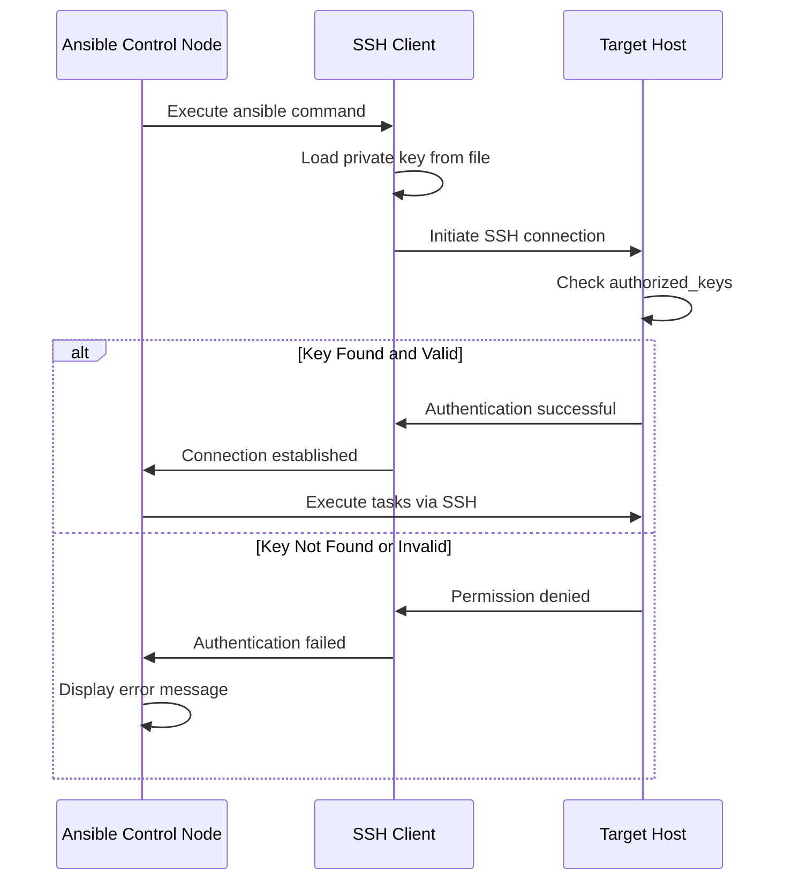
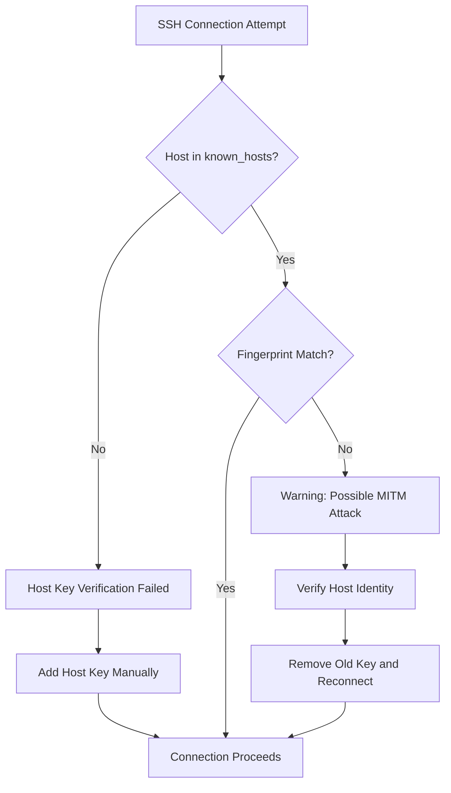

# How to Fix "SSH Key" Authentication Errors in Ansible

Author: [nawazdhandala](https://www.github.com/nawazdhandala)

Tags: Ansible, SSH, Authentication, DevOps, Troubleshooting, Configuration Management, Automation

Description: Learn how to diagnose and fix common SSH key authentication errors in Ansible including permission issues, key format problems, and connection failures.

---

SSH key authentication is the backbone of Ansible's agentless architecture. When SSH keys fail to authenticate properly, your entire automation workflow stops. This guide will help you diagnose and resolve the most common SSH key authentication errors in Ansible.

## Understanding Ansible SSH Authentication Flow

Before diving into troubleshooting, let's understand how Ansible authenticates via SSH.



## Common SSH Key Errors and Solutions

### Error 1: Permission Denied (publickey)

This is the most common SSH authentication error you will encounter.

```bash
# Error message you might see
fatal: [webserver1]: UNREACHABLE! => {
    "changed": false,
    "msg": "Failed to connect to the host via ssh: Permission denied (publickey).",
    "unreachable": true
}
```

**Cause**: The SSH key is not recognized by the target host or the key permissions are incorrect.

**Solution 1: Verify the public key is in authorized_keys**

```bash
# Check if the public key exists on the target host
# First, display your public key on the control node
cat ~/.ssh/id_rsa.pub

# SSH to the target manually with verbose output to see what is happening
ssh -vvv user@target_host

# On the target host, check the authorized_keys file
cat ~/.ssh/authorized_keys

# If your key is missing, add it to the target host
ssh-copy-id -i ~/.ssh/id_rsa.pub user@target_host
```

**Solution 2: Fix key file permissions**

```bash
# SSH is strict about permissions. Set correct permissions on the control node
# The private key must be readable only by the owner
chmod 700 ~/.ssh
chmod 600 ~/.ssh/id_rsa
chmod 644 ~/.ssh/id_rsa.pub
chmod 600 ~/.ssh/config

# On the target host, fix .ssh directory permissions
chmod 700 ~/.ssh
chmod 600 ~/.ssh/authorized_keys
```

**Solution 3: Specify the correct key in Ansible**

```yaml
# In your ansible.cfg file
[defaults]
private_key_file = ~/.ssh/ansible_key

# Or in your inventory file (hosts.yml)
all:
  hosts:
    webserver1:
      ansible_host: 192.168.1.10
      ansible_user: ubuntu
      ansible_ssh_private_key_file: ~/.ssh/ansible_key
```

### Error 2: Bad Permissions on Key File

```bash
# Error message
@@@@@@@@@@@@@@@@@@@@@@@@@@@@@@@@@@@@@@@@@@@@@@@@@@@@@@@@@@@
@         WARNING: UNPROTECTED PRIVATE KEY FILE!          @
@@@@@@@@@@@@@@@@@@@@@@@@@@@@@@@@@@@@@@@@@@@@@@@@@@@@@@@@@@@
Permissions 0644 for '/home/user/.ssh/id_rsa' are too open.
```

**Solution**: Fix the private key permissions immediately.

```bash
# Set restrictive permissions on the private key
chmod 600 ~/.ssh/id_rsa

# Verify the permissions are correct
ls -la ~/.ssh/
# Expected output for private key: -rw-------
```

### Error 3: Could Not Load Host Key

```bash
# Error message
fatal: [server1]: UNREACHABLE! => {
    "msg": "Failed to connect to the host via ssh:
           Unable to negotiate with 192.168.1.10 port 22:
           no matching host key type found. Their offer: ssh-rsa"
}
```

**Cause**: OpenSSH 8.8+ disabled ssh-rsa by default for security reasons.

**Solution 1: Update SSH client configuration**

```bash
# Add to ~/.ssh/config on the control node
Host *
    # Enable legacy host key algorithms for older servers
    HostKeyAlgorithms +ssh-rsa
    PubkeyAcceptedKeyTypes +ssh-rsa
```

**Solution 2: Configure in Ansible**

```ini
# In ansible.cfg
[ssh_connection]
ssh_args = -o HostKeyAlgorithms=+ssh-rsa -o PubkeyAcceptedKeyTypes=+ssh-rsa
```

**Solution 3: Generate a new key with modern algorithm (recommended)**

```bash
# Generate a new Ed25519 key (more secure and widely supported)
ssh-keygen -t ed25519 -C "ansible@control-node" -f ~/.ssh/ansible_ed25519

# Copy the new key to all target hosts
ssh-copy-id -i ~/.ssh/ansible_ed25519.pub user@target_host

# Update Ansible to use the new key
# In ansible.cfg
[defaults]
private_key_file = ~/.ssh/ansible_ed25519
```

### Error 4: Host Key Verification Failed

```bash
# Error message
fatal: [server1]: UNREACHABLE! => {
    "msg": "Failed to connect to the host via ssh:
           Host key verification failed."
}
```

**Cause**: The target host's SSH fingerprint is not in your known_hosts file or has changed.



**Solution 1: Add the host key manually**

```bash
# Scan and add the host key to known_hosts
ssh-keyscan -H target_host >> ~/.ssh/known_hosts

# Or connect once manually and accept the key
ssh user@target_host
# Type 'yes' when prompted to add the host key
```

**Solution 2: Disable host key checking (use with caution)**

```ini
# In ansible.cfg - only for trusted networks
[defaults]
host_key_checking = False

# Or set as environment variable
export ANSIBLE_HOST_KEY_CHECKING=False
```

**Solution 3: Use ssh_args for specific scenarios**

```ini
# In ansible.cfg
[ssh_connection]
ssh_args = -o StrictHostKeyChecking=accept-new -o UserKnownHostsFile=/dev/null
```

### Error 5: Key Format Not Supported

```bash
# Error message
Load key "/home/user/.ssh/id_rsa": invalid format
```

**Cause**: The key file is in an unsupported format or corrupted.

**Solution 1: Convert PuTTY key to OpenSSH format**

```bash
# Install puttygen if needed
sudo apt install putty-tools

# Convert .ppk to OpenSSH format
puttygen private_key.ppk -O private-openssh -o ~/.ssh/id_rsa_converted

# Set correct permissions
chmod 600 ~/.ssh/id_rsa_converted
```

**Solution 2: Convert old format to new OpenSSH format**

```bash
# Convert to new OpenSSH format (useful for keys created before OpenSSH 7.8)
ssh-keygen -p -f ~/.ssh/id_rsa -m pem -N ""

# Or create a new key entirely
ssh-keygen -t ed25519 -f ~/.ssh/new_ansible_key
```

## Debugging SSH Connection Issues

### Enable Verbose SSH Output in Ansible

```bash
# Run Ansible with increased verbosity
ansible all -m ping -vvvv

# The -vvvv flag shows detailed SSH connection information
# Look for lines starting with "SSH:" in the output
```

### Test SSH Connection Manually

```bash
# Test basic connectivity with verbose output
ssh -vvv -i ~/.ssh/ansible_key user@target_host

# Test with specific options matching Ansible
ssh -o IdentitiesOnly=yes \
    -o IdentityFile=~/.ssh/ansible_key \
    -o User=ubuntu \
    -o ConnectTimeout=10 \
    user@target_host 'echo "Connection successful"'
```

### Check SSH Agent Issues

```bash
# List keys loaded in ssh-agent
ssh-add -l

# If you see "The agent has no identities" add your key
ssh-add ~/.ssh/ansible_key

# If ssh-agent is not running, start it
eval "$(ssh-agent -s)"
ssh-add ~/.ssh/ansible_key

# Verify the key is loaded
ssh-add -l
```

## Best Practices for SSH Key Management in Ansible

### 1. Use Dedicated Ansible Keys

```bash
# Generate a dedicated key for Ansible automation
ssh-keygen -t ed25519 -C "ansible-automation" -f ~/.ssh/ansible_automation_key

# Use a passphrase for additional security in production
# Store the passphrase in a secure vault
```

### 2. Configure SSH Properly in ansible.cfg

```ini
# ansible.cfg - comprehensive SSH configuration
[defaults]
# Path to the private key
private_key_file = ~/.ssh/ansible_automation_key

# Default remote user
remote_user = ansible

# Disable host key checking for dynamic environments
host_key_checking = False

[ssh_connection]
# Enable SSH pipelining for better performance
pipelining = True

# Control path for SSH multiplexing
control_path = %(directory)s/%%h-%%r

# SSH arguments for stability
ssh_args = -o ControlMaster=auto -o ControlPersist=60s -o ServerAliveInterval=30

# Connection timeout
timeout = 30
```

### 3. Use ansible-vault for Key Passphrases

```yaml
# group_vars/all/vault.yml (encrypted with ansible-vault)
ansible_ssh_private_key_passphrase: "your-secure-passphrase"
```

```bash
# Run playbook with vault password
ansible-playbook site.yml --ask-vault-pass
```

## SSH Key Authentication Troubleshooting Flowchart


## Common Inventory Configurations for SSH Keys

```yaml
# inventory/hosts.yml - various SSH key configurations

all:
  vars:
    # Global SSH settings
    ansible_ssh_common_args: '-o StrictHostKeyChecking=no'

  children:
    webservers:
      hosts:
        web1:
          ansible_host: 192.168.1.10
          ansible_user: ubuntu
          ansible_ssh_private_key_file: ~/.ssh/web_servers_key
        web2:
          ansible_host: 192.168.1.11
          ansible_user: ubuntu
          ansible_ssh_private_key_file: ~/.ssh/web_servers_key

    legacy_servers:
      hosts:
        legacy1:
          ansible_host: 192.168.1.50
          ansible_user: root
          ansible_ssh_private_key_file: ~/.ssh/legacy_rsa_key
          # Enable ssh-rsa for older servers
          ansible_ssh_common_args: '-o HostKeyAlgorithms=+ssh-rsa -o PubkeyAcceptedKeyTypes=+ssh-rsa'

    cloud_servers:
      hosts:
        aws1:
          ansible_host: ec2-xx-xx-xx-xx.compute.amazonaws.com
          ansible_user: ec2-user
          ansible_ssh_private_key_file: ~/.ssh/aws_key.pem
        gcp1:
          ansible_host: 35.xxx.xxx.xxx
          ansible_user: gcp_user
          ansible_ssh_private_key_file: ~/.ssh/gcp_key
```

## Automated SSH Key Distribution Playbook

```yaml
# playbooks/distribute-ssh-keys.yml
# Distribute SSH keys to new servers using initial password auth

---
- name: Distribute SSH Keys to Target Hosts
  hosts: new_servers
  gather_facts: false
  vars:
    ansible_ssh_pass: "{{ initial_password }}"
    new_public_key: "{{ lookup('file', '~/.ssh/ansible_automation_key.pub') }}"

  tasks:
    - name: Ensure .ssh directory exists
      file:
        path: "/home/{{ ansible_user }}/.ssh"
        state: directory
        mode: '0700'
        owner: "{{ ansible_user }}"
        group: "{{ ansible_user }}"

    - name: Add public key to authorized_keys
      authorized_key:
        user: "{{ ansible_user }}"
        state: present
        key: "{{ new_public_key }}"
        exclusive: false

    - name: Test key-based authentication
      local_action:
        module: command
        cmd: >
          ssh -o PasswordAuthentication=no
          -i ~/.ssh/ansible_automation_key
          {{ ansible_user }}@{{ ansible_host }}
          'echo Key auth successful'
      register: key_test
      changed_when: false

    - name: Display authentication test result
      debug:
        msg: "Key-based authentication is working for {{ inventory_hostname }}"
      when: key_test.rc == 0
```

## Conclusion

SSH key authentication errors in Ansible can be frustrating, but they follow predictable patterns. The most common issues are:

1. **Permission problems** - Private keys must have 600 permissions
2. **Missing public keys** - Ensure keys are properly distributed to target hosts
3. **Key format issues** - Use modern Ed25519 keys when possible
4. **Host key verification** - Manage known_hosts appropriately for your environment

Always test SSH connectivity manually before troubleshooting Ansible-specific issues. This isolates whether the problem is with SSH configuration or Ansible configuration. Use verbose mode (`-vvvv`) to get detailed connection information when diagnosing complex issues.

By following the solutions and best practices outlined in this guide, you can maintain reliable SSH key authentication across your Ansible-managed infrastructure.
